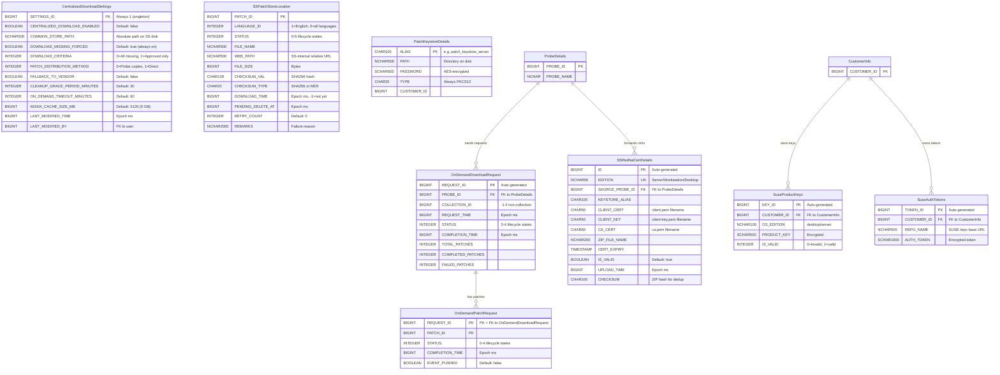
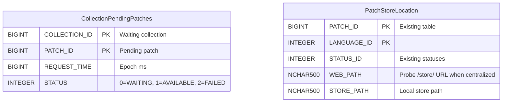

# Centralized Patch Download — Low-Level Design

> **Version:** 3.0 | **Date:** 2026-04-16
> **Product:** ManageEngine Endpoint Central
> **Scope:** REST APIs, DB Schema (ER Diagrams), Meta File Structures
> **Parent Design:** [`system-design.md`](system-design.md) · [`high-level-design.md`](high-level-design.md) · [`implementation-tasks.md`](implementation-tasks.md)
> **PoC Evidence:** [`poc-proven-report.md`](poc-proven-report.md) · [`poc5-proof.md`](poc5-proof.md)

---

## Table of Contents

1. [REST APIs](#1-rest-apis)
   - 1.1 [URL Convention & Auth](#11-url-convention--auth)
   - 1.2 [Settings APIs](#12-settings-apis)
   - 1.3 [Probe → SS APIs (via PushToSummaryProcessor)](#13-probe--ss-apis-via-pushtosummaryprocessor)
   - 1.4 [Patch Store APIs (SS Admin)](#14-patch-store-apis-ss-admin)
   - 1.5 [Dependency Package APIs (SS Admin)](#15-dependency-package-apis-ss-admin)
   - 1.6 [Monitoring & Admin APIs](#16-monitoring--admin-apis)
   - 1.7 [Nginx Auth Servlets](#17-nginx-auth-servlets)
   - 1.8 [SS → Probe Events](#18-ss--probe-events)
2. [DB Schema](#2-db-schema)
   - 2.1 [ER Diagram — SS Tables](#21-er-diagram--ss-tables)
   - 2.2 [ER Diagram — Probe Tables](#22-er-diagram--probe-tables)
   - 2.3 [Table Definitions](#23-table-definitions)
   - 2.4 [Status Enumerations](#24-status-enumerations)
   - 2.5 [Table Summary — New vs Reused](#25-table-summary--new-vs-reused)
3. [Meta File Structures](#3-meta-file-structures)
   - 3.1 [Common Store Directory Layout](#31-common-store-directory-layout)
   - 3.2 [Meta Files Location (client-data)](#32-meta-files-location-client-data)
   - 3.3 [XML Schemas & Samples](#33-xml-schemas--samples)
   - 3.4 [File Naming Conventions](#34-file-naming-conventions)
   - 3.5 [What Lives Where — Summary](#35-what-lives-where--summary)

---

## 1. REST APIs

### 1.1 URL Convention & Auth

**Base path:** All centralized download APIs use `/dcapi/centralizedDownload`. Registered in `SSJerseyControllerSupplier.dcAPISummaryJerseyControllers()` and `security-onpremise-server-ss.xml`.

**Auth patterns:**

| Caller | Auth Mechanism | Headers |
|--------|---------------|---------|
| **SS Admin (browser)** | Session cookie + CSRF | Standard DC session auth |
| **Probe → SS** | API key headers | `SUMMARY_API_KEY`, `PROBE_ID`, `HS_KEY`, `PROBE_NAME`, `SUMMARY_SERVER_REQUEST`, `USER_DOMAIN` |
| **DS/Agent → Probe Nginx** | `auth_request` subrequest | Agent.key / basic auth validated by Probe servlet |
| **Probe → SS Nginx** | `auth_request` subrequest | `SUMMARY_API_KEY`, `PROBE_ID`, `HS_KEY` validated by SS servlet |

**Probe → SS Auth Header Details:**

| Header | Source | Purpose |
|--------|--------|---------|
| `SUMMARY_API_KEY` | `SUMMARYSERVERAPIKEYDETAILS` (Base64-decoded) | Primary auth token |
| `PROBE_ID` | `SUMMARYSERVERAPIKEYDETAILS` | Identifies calling Probe |
| `PROBE_NAME` | `ProbeDetailsUtil.getProbeName()` | Logging |
| `HS_KEY` | `ProbeAuthUtil.getProbeHandShakekey()` | Rotating session key |
| `SUMMARY_SERVER_REQUEST` | `"true"` | Distinguishes inter-server from browser |
| `USER_DOMAIN` | `encrypt(userName + "::" + domainName, summaryApiKey)` | Encrypted user context |

---

### 1.2 Settings APIs

#### GET `/dcapi/centralizedDownload`

Returns current centralized download settings from SS.

**Auth:** SS Admin session

**Response `200 OK`:**

```json
{
    "centralizedDownloadEnabled": false,
    "commonStorePath": "F:\\PatchStore",
    "downloadMissingForced": true,
    "downloadCriteria": 0,
    "patchDistributionMethod": 0,
    "fallbackToVendor": false,
    "cleanupGracePeriodMinutes": 30,
    "onDemandTimeoutMinutes": 60,
    "nginxCacheSizeMB": 5120,
    "lastModifiedTime": 1713168000000,
    "lastModifiedBy": 2
}
```

| Field | Type | Values |
|-------|------|--------|
| `downloadCriteria` | int | `0` = All missing patches, `1` = All approved missing patches |
| `patchDistributionMethod` | int | `0` = Probe copies from network storage, `1` = Machines access directly (UI-only) |

---

#### PUT `/dcapi/centralizedDownload`

Updates settings. When enabling, persists `CENTRALIZED_DOWNLOAD_ENABLED = TRUE` and pushes `CENTRALIZED_DL_SETTINGS_CHANGED` event to all Probes.

**Auth:** SS Admin session

**Request:**

```json
{
    "centralizedDownloadEnabled": true,
    "commonStorePath": "F:\\PatchStore",
    "downloadCriteria": 0,
    "patchDistributionMethod": 0,
    "fallbackToVendor": true,
    "cleanupGracePeriodMinutes": 30,
    "onDemandTimeoutMinutes": 60,
    "nginxCacheSizeMB": 5120
}
```

**Response `200 OK`:**

```json
{
    "status": "success",
    "message": "Settings updated successfully",
    "eventPushed": true
}
```

**Response `400 Bad Request`:** (validation failure)

```json
{
    "status": "error",
    "errorCode": "STORE_PATH_INVALID",
    "message": "Common store path is not writable or does not have sufficient space"
}
```

**Side effects:**
- Persists settings to `CentralizedDownloadSettings` table
- Pushes `CENTRALIZED_DL_SETTINGS_CHANGED` event to all Probes via `SummaryEventDataHandler`
- Probes update cached DB params via `SyMUtil.updateSyMParameter()`

---

#### POST `/dcapi/centralizedDownload/validateStore`

Dry-run validation of a proposed store path — checks writable + sufficient disk space on SS. Does not persist.

**Auth:** SS Admin session

**Request:**

```json
{
    "commonStorePath": "F:\\PatchStore"
}
```

**Response `200 OK`:**

```json
{
    "valid": true,
    "totalSpaceGB": 500,
    "freeSpaceGB": 320,
    "writable": true
}
```

**Response `200 OK`:** (validation failed — not an HTTP error)

```json
{
    "valid": false,
    "reason": "INSUFFICIENT_SPACE",
    "message": "Free space 2 GB is below minimum required 10 GB"
}
```

> **Prerequisite:** Common store access from all Probes is validated separately — admin must ensure all Probes have file-level access before enabling. No runtime Probe validation from this endpoint.

---

### 1.3 Probe → SS APIs (via PushToSummaryProcessor)

> These endpoints are called by Probes via `PushToSummaryProcessor` (push-to-summary queue, DB-backed, async). Auth: Probe API key headers.

#### POST `/dcapi/centralizedDownload/onDemandRequest`

Probe requests priority download of missing patches for a deployment. SS dedup-checks, queues for priority download, tracks per-patch completion.

**Auth:** Probe API key headers

**Request:**

```json
{
    "patchIds": [101, 102, 103],
    "collectionId": 12345,
    "probeId": 1001,
    "requestTime": 1740000000000
}
```

**Response `200 OK`:**

```json
{
    "requestId": 5678,
    "accepted": [101, 103],
    "alreadyAvailable": [102],
    "estimatedTimeMinutes": 5
}
```

| Response Field | Description |
|----------------|-------------|
| `requestId` | Auto-generated ID in `OnDemandDownloadRequest` table |
| `accepted` | Patch IDs queued for priority download (not yet in common store) |
| `alreadyAvailable` | Patch IDs already `STATUS=AVAILABLE` in `SSPatchStoreLocation` |
| `estimatedTimeMinutes` | Rough ETA based on queue depth and avg download time |

**SS processing:**
1. Check `SSPatchStoreLocation` → split `accepted` vs `alreadyAvailable`
2. Build `DownloadOptions` with `collectionId` → `calculatePriority()` returns `true` → queued ahead of bulk
3. Insert into `OnDemandDownloadRequest` + `OnDemandPatchRequest` (per-patch dedup)
4. After each patch download completes or fails:
   - Update `SSPatchStoreLocation` (`STATUS = AVAILABLE` or `FAILED`)
   - On failure: write `.patch-status/{patchId}_{langId}.failed` marker
   - Push `PATCH_STORE_UPDATED` or `ON_DEMAND_DOWNLOAD_FAILED` event to Probe

---

#### POST `/dcapi/centralizedDownload/dependencyPackages`

Probe forwards dependency package metadata (RPM/DEB info) to SS. SS dedup-inserts into `PACKAGEINFO` and triggers `SSDependencyDownloadTask`.

**Auth:** Probe API key headers

**Request:**

```json
{
    "probeId": 1001,
    "packages": [
        {
            "packageId": 1,
            "productId": 300180,
            "packageName": "iputils-ping_20190709-3ubuntu1_amd64.deb",
            "checksum": "ce08339e42c42bd624113b5cbf33110797e0241bdb3e3b65c5fb7bb058bf7be0",
            "checksumType": "sha256",
            "downloadUrl": "http://archive.ubuntu.com/ubuntu/pool/main/i/iputils/iputils-ping_20190709-3ubuntu1_amd64.deb",
            "osFlavor": "ubuntu"
        }
    ]
}
```

**Response `200 OK`:**

```json
{
    "status": "success",
    "inserted": 1,
    "duplicatesSkipped": 0
}
```

**Side effects:** SS dedup-inserts into `PACKAGEINFO`, triggers `SSDependencyDownloadTask` to download packages into `{commonStore}/linux/{flavor}-dependencies/`.

---

#### POST `/dcapi/centralizedDownload/redhatCert`

Probe forwards a RedHat mTLS certificate ZIP (client.pem, client-key.pem, ca.pem) + metadata to SS for Red Hat CDN authentication.

**Auth:** Probe API key headers
**Content-Type:** `multipart/form-data` (via `MultiPartUtilImpl`)

**Request (multipart):**

| Part | Type | Description |
|------|------|-------------|
| `certFile` | Binary (ZIP) | Archive containing `client.pem`, `client-key.pem`, `ca.pem` |
| `edition` | Text | `Server` / `Workstation` / `Desktop` |
| `probeId` | Text | Source Probe ID |
| `certExpiry` | Text | ISO-8601 certificate expiry date |

**Response `200 OK`:**

```json
{
    "status": "success",
    "edition": "Server",
    "keystoreAlias": "patch_keystore_server",
    "message": "RedHat certificate stored successfully"
}
```

**SS processing:**
1. Extract ZIP to SS disk
2. Import certs into PKCS12 keystore via `PatchKeystoreService.saveKeystore()`
3. UPSERT `SSRedhatCertDetails` by `EDITION` (unique constraint)
4. Store keystore password in `PatchKeystoreDetails`

---

#### POST `/dcapi/centralizedDownload/suseKeys`

Probe forwards SUSE registration codes (product keys) to SS. SS stores in `SuseProductKeys` and runs `SuseAuthtokenTask` to fetch auth tokens from `scc.suse.com`.

**Auth:** Probe API key headers

**Request:**

```json
{
    "probeId": 1001,
    "customerId": 5001,
    "keys": [
        {
            "productKey": "XXXX-XXXX-XXXX-XXXX",
            "osEdition": "server",
            "customerId": 5001
        },
        {
            "productKey": "YYYY-YYYY-YYYY-YYYY",
            "osEdition": "desktop",
            "customerId": 5001
        }
    ]
}
```

**Response `200 OK`:**

```json
{
    "status": "success",
    "inserted": 1,
    "updated": 1,
    "deleted": 0
}
```

**Dedup logic:** UPSERT by `(PRODUCT_KEY, CUSTOMER_ID)`. Probe sends full key list — SS removes keys not in the list for that customer.

**Side effects:** After storing keys, SS runs `SuseAuthtokenTask` to fetch auth tokens from `scc.suse.com` → stores in `SuseAuthTokens`. Tokens consumed by `SuseSettingsUtil.appendSUSEToken()` at download time.

---

#### POST `/dcapi/centralizedDownload/upload`

Accepts multipart upload (binary + metadata); stores in common store, updates `SSPatchStoreLocation`, validates checksum, broadcasts `PATCH_UPLOAD_STATUS` event. Also used by Probe's `ProbeUploadForwarder` to forward admin uploads.

**Auth:** Probe API key headers
**Content-Type:** `multipart/form-data`

**Request (multipart):**

| Part | Type | Description |
|------|------|-------------|
| `file` | Binary | Patch binary file |
| `patchId` | Text | Patch identifier |
| `languageId` | Text | Language variant (`1` = English, `0` = all languages) |
| `fileName` | Text | Target file name in common store |
| `checksum` | Text | Expected SHA256 checksum |
| `probeId` | Text | Source Probe ID |

**Response `200 OK`:**

```json
{
    "status": "success",
    "patchId": 400010,
    "storedAs": "400010-custom-patch.exe",
    "checksumValid": true
}
```

**Response `400 Bad Request`:**

```json
{
    "status": "error",
    "errorCode": "CHECKSUM_MISMATCH",
    "message": "Uploaded file checksum does not match expected value"
}
```

**Side effects:**
- Stores binary in `{commonStore}/{fileName}`
- Updates `SSPatchStoreLocation` with `STATUS=AVAILABLE`
- Broadcasts `PATCH_UPLOAD_STATUS` event to all Probes

---

### 1.4 Patch Store APIs (SS Admin)

#### POST `/dcapi/centralizedDownload/patches/redownload`

Re-triggers `SSPatchDownloadService` for selected patch IDs.

**Auth:** SS Admin session

**Request:**

```json
{
    "patchIds": [101, 205, 310]
}
```

**Response `200 OK`:**

```json
{
    "status": "success",
    "requeued": 3,
    "message": "3 patches queued for re-download"
}
```

**Side effects:**
- Resets `SSPatchStoreLocation.STATUS` to `QUEUED` for each patch
- Deletes any existing `.patch-status/{patchId}_{langId}.failed` markers
- Queues patches in `ss-patch-download-data` for download

---

#### DELETE `/dcapi/centralizedDownload/patches`

Initiates soft-delete for selected patch IDs. Physical deletion handled by `DeferredCleanupTask` after grace period.

**Auth:** SS Admin session

**Request:**

```json
{
    "patchIds": [101, 205]
}
```

**Response `200 OK`:**

```json
{
    "status": "success",
    "markedForDeletion": 2,
    "gracePeriodMinutes": 30,
    "message": "2 patches marked for deletion. Physical removal after 30 minutes."
}
```

**Side effects:**
- Sets `SSPatchStoreLocation.STATUS = PENDING_DELETE` (4)
- Sets `SSPatchStoreLocation.PENDING_DELETE_AT` to current epoch ms
- `DeferredCleanupTask` physically deletes after `CLEANUP_GRACE_PERIOD_MINUTES`
- After physical deletion: updates `deleted-patches.xml`, broadcasts `PATCH_STORE_UPDATED` event

---

### 1.5 Dependency Package APIs (SS Admin)

#### POST `/dcapi/centralizedDownload/dependency/redownload`

Re-triggers `SSDependencyDownloadTask` for selected package IDs.

**Auth:** SS Admin session

**Request:**

```json
{
    "packageIds": [1, 2, 3]
}
```

**Response `200 OK`:**

```json
{
    "status": "success",
    "requeued": 3
}
```

---

#### DELETE `/dcapi/centralizedDownload/dependency`

Deletes selected dependency packages from the common store.

**Auth:** SS Admin session

**Request:**

```json
{
    "packageIds": [1, 2]
}
```

**Response `200 OK`:**

```json
{
    "status": "success",
    "deleted": 2
}
```

---

### 1.6 Monitoring & Admin APIs

#### GET `/dcapi/centralizedDownload/stats`

Returns common store statistics.

**Auth:** SS Admin session

**Response `200 OK`:**

```json
{
    "totalPatches": 1250,
    "byStatus": {
        "QUEUED": 15,
        "DOWNLOADING": 3,
        "AVAILABLE": 1200,
        "FAILED": 12,
        "PENDING_DELETE": 8,
        "DELETED": 12
    },
    "totalFileSizeBytes": 53687091200,
    "totalFileSizeFormatted": "50.0 GB",
    "diskUsage": {
        "totalSpaceGB": 500,
        "freeSpaceGB": 320,
        "usedByStoreGB": 50
    }
}
```

---

#### GET `/dcapi/centralizedDownload/probeStatus`

Returns per-Probe sync and connectivity status.

**Auth:** SS Admin session

**Response `200 OK`:**

```json
{
    "probes": [
        {
            "probeId": 1001,
            "probeName": "Probe-US-East",
            "lastEventDeliveryTime": 1713168000000,
            "pendingEventCount": 0,
            "online": true,
            "commonStoreAccessible": true
        },
        {
            "probeId": 1002,
            "probeName": "Probe-EU-West",
            "lastEventDeliveryTime": 1713167000000,
            "pendingEventCount": 3,
            "online": true,
            "commonStoreAccessible": true
        }
    ]
}
```

---

#### GET `/dcapi/centralizedDownload/status/{collectionId}`

Returns deployment status including pending patches, their SS download status, and available admin actions.

**Auth:** SS Admin session

**Response `200 OK`:** (when `WAITING_FOR_SS_DOWNLOAD`)

```json
{
    "collectionId": 12345,
    "status": "WAITING_FOR_SS_DOWNLOAD",
    "statusCode": 502,
    "waitingSince": "2026-03-20T10:24:00Z",
    "timeoutAt": "2026-03-20T10:54:00Z",
    "patchesRequired": 3,
    "patchesAvailableOnSS": 1,
    "patchesPendingDownload": 2,
    "pendingPatches": [
        {
            "patchId": 102,
            "fileName": "KB5034441.msu",
            "sizeMB": 1627,
            "ssDownloadStatus": "DOWNLOADING",
            "retryCount": 0
        },
        {
            "patchId": 103,
            "fileName": "KB5034442.msu",
            "sizeMB": 50,
            "ssDownloadStatus": "QUEUED",
            "retryCount": 0
        }
    ],
    "actions": ["RETRY_ON_DEMAND", "FALLBACK_TO_VENDOR", "CANCEL_DEPLOYMENT"]
}
```

**Response `200 OK`:** (when `PARTIALLY_DEPLOYED`)

```json
{
    "collectionId": 12346,
    "status": "PARTIALLY_DEPLOYED",
    "statusCode": 503,
    "deployedPatches": 5,
    "remainingPatches": 2,
    "pendingPatches": [
        {
            "patchId": 205,
            "fileName": "update-205.rpm",
            "sizeMB": 85,
            "ssDownloadStatus": "AVAILABLE",
            "retryCount": 0
        }
    ],
    "actions": ["RETRY_ON_DEMAND", "FALLBACK_TO_VENDOR"]
}
```

---

#### POST `/dcapi/centralizedDownload/fallbackToVendor/{collectionId}`

Forces a stuck collection (status 502/503) to bypass SS and fall back to direct vendor download.

**Auth:** SS Admin session

**Response `200 OK`:**

```json
{
    "status": "success",
    "collectionId": 12345,
    "message": "Collection switched to vendor download fallback"
}
```

**Response `400 Bad Request`:**

```json
{
    "status": "error",
    "errorCode": "INVALID_STATE",
    "message": "Collection 12345 is not in WAITING_FOR_SS_DOWNLOAD or PARTIALLY_DEPLOYED state"
}
```

---

### 1.7 Nginx Auth Servlets

> These are **not** REST APIs — they are mapped as servlets for Nginx `auth_request` subrequests. They return only HTTP status codes (no response body).

#### Probe-side: `GET /common-store-auth`

Nginx `auth_request` handler on Probe's `/store/` location. Validates DS/Agent credentials.

| Aspect | Detail |
|--------|--------|
| **Location** | Probe |
| **Triggered by** | Nginx `auth_request` subrequest when DS/Agent requests `/store/{file}` |
| **Validates** | Agent.key / basic auth credentials from the original request |
| **Returns** | `200` (allow download) or `401` (deny) |
| **Implementation** | Servlet registered in Probe's `web.xml`, not a Jersey resource |

#### SS-side: `GET /common-store-auth`

Nginx `auth_request` handler on SS `/common-store/` location. Validates Probe credentials for fallback requests.

| Aspect | Detail |
|--------|--------|
| **Location** | SS |
| **Triggered by** | Nginx `auth_request` subrequest when Probe requests `/common-store/{file}` |
| **Validates** | `SUMMARY_API_KEY`, `PROBE_ID`, `HS_KEY` headers against `SUMMARYSERVERAPIKEYDETAILS` |
| **Returns** | `200` (allow) or `401` (deny) |
| **Implementation** | `SSStoreAuthValidator` servlet |

---

### 1.8 SS → Probe Events

Push events sent from SS to Probes via `SummaryEventDataHandler`. These use the existing SS→Probe event infrastructure (`SUMMARYEVENTDATA` → per-probe queues → HTTPS POST to Probe).

```
SS: SummaryEventDataHandler.storeEventData(eventCode, isAllProbes, reqJSON)
  → SUMMARYEVENTDATA table (encrypted JSON)
  → Per-probe queues: push-to-probe-{N}
  → PushToProbeProcessor → HTTPS POST to Probe
  → Probe: SummaryEventDataValidator → PatchStoreEventDataProcessor
```

#### Event: `PATCH_STORE_UPDATED`

| Aspect | Detail |
|--------|--------|
| **Direction** | SS → Specific Probe(s) (on-demand) or SS → All Probes (bulk/cleanup) |
| **Trigger** | On-demand download completes for a patch / Bulk batch completes / Deferred cleanup deletes files |
| **Purpose** | Probes check for waiting/partial collections that can now resume |

**Targeted payload (on-demand):**

```json
{
    "eventCode": "PATCH_STORE_UPDATED",
    "type": "ON_DEMAND_COMPLETE",
    "patchIds": [101],
    "collectionId": 12345,
    "probeId": 1001,
    "timestamp": 1740000300000
}
```

**Broadcast payload (bulk download):**

```json
{
    "eventCode": "PATCH_STORE_UPDATED",
    "type": "BULK_DOWNLOAD_COMPLETE",
    "patchIds": [201, 202, 203, 204, 205],
    "timestamp": 1740014400000
}
```

**Broadcast payload (cleanup deletion):**

```json
{
    "eventCode": "PATCH_STORE_UPDATED",
    "type": "PATCHES_DELETED",
    "patchIds": [50, 51],
    "timestamp": 1740014500000
}
```

---

#### Event: `ON_DEMAND_DOWNLOAD_FAILED`

| Aspect | Detail |
|--------|--------|
| **Direction** | SS → Specific Probe(s) |
| **Trigger** | On-demand download fails after 3 retries |
| **Purpose** | Probe falls back to vendor (if enabled) or marks collection as `DOWNLOAD_FAILED` |

**Payload:**

```json
{
    "eventCode": "ON_DEMAND_DOWNLOAD_FAILED",
    "patchIds": [101],
    "collectionId": 12345,
    "probeId": 1001,
    "failureReason": "Checksum mismatch after 3 retries",
    "timestamp": 1740000600000
}
```

---

#### Event: `CENTRALIZED_DL_SETTINGS_CHANGED`

| Aspect | Detail |
|--------|--------|
| **Direction** | SS → All Probes |
| **Trigger** | Admin enables/disables or changes settings |
| **Purpose** | Probes update cached DB params via `SyMUtil.updateSyMParameter()` |

**Payload:**

```json
{
    "eventCode": "CENTRALIZED_DL_SETTINGS_CHANGED",
    "settings": {
        "centralizedDownloadEnabled": true,
        "commonStorePath": "F:\\PatchStore",
        "fallbackToVendor": true,
        "onDemandTimeoutMinutes": 60,
        "nginxCacheSizeMB": 5120,
        "downloadCriteria": 0
    },
    "timestamp": 1740000000000
}
```

---

#### Event: `PATCH_UPLOAD_STATUS`

| Aspect | Detail |
|--------|--------|
| **Direction** | SS → All Probes |
| **Trigger** | Patch uploaded to SS (directly or forwarded from Probe) |
| **Purpose** | Probes update local metadata for patch availability |

**Payload:**

```json
{
    "eventCode": "PATCH_UPLOAD_STATUS",
    "patchId": 400010,
    "languageId": 1,
    "fileName": "400010-custom-patch.exe",
    "status": "AVAILABLE",
    "timestamp": 1740001000000
}
```

---

## 2. DB Schema

### 2.1 ER Diagram — SS Tables



### 2.2 ER Diagram — Probe Tables



---

### 2.3 Table Definitions

#### 2.3.1 CentralizedDownloadSettings (SS — New, Singleton)

> Singleton row (`SETTINGS_ID = 1`). Stores the entire centralized download configuration. Seeded with defaults on first startup.

| Column | Type | Default | Nullable | Description |
|--------|------|---------|----------|-------------|
| **`SETTINGS_ID`** | BIGINT (PK, auto) | — | NO | Always 1 for singleton |
| `CENTRALIZED_DOWNLOAD_ENABLED` | BOOLEAN | `false` | NO | Master toggle |
| `COMMON_STORE_PATH` | NCHAR(500) | — | YES | Absolute path on SS disk (e.g., `F:\PatchStore`) |
| `DOWNLOAD_MISSING_FORCED` | BOOLEAN | `true` | NO | Always-on when centralized enabled |
| `DOWNLOAD_CRITERIA` | INTEGER | `0` | NO | `0` = All missing, `1` = Approved missing only |
| `PATCH_DISTRIBUTION_METHOD` | INTEGER | `0` | NO | `0` = Probe copies, `1` = Direct access (UI-only) |
| `FALLBACK_TO_VENDOR` | BOOLEAN | `false` | NO | Probe falls back on on-demand timeout |
| `CLEANUP_GRACE_PERIOD_MINUTES` | INTEGER | `30` | NO | Grace period before physical delete |
| `ON_DEMAND_TIMEOUT_MINUTES` | INTEGER | `60` | NO | Probe wait time before timeout/fallback |
| `NGINX_CACHE_SIZE_MB` | BIGINT | `5120` | NO | Probe-side Nginx `proxy_cache` max size (default 5 GB) |
| `LAST_MODIFIED_TIME` | BIGINT | `-1` | NO | Epoch ms of last settings change |
| `LAST_MODIFIED_BY` | BIGINT | — | YES | User ID of admin |

> **Notes:**
> - Cleanup settings (superseded, older than N months) stored in existing SS cleanup settings tables.
> - Notification settings use existing SS notification framework.
> - Download prioritization: On-demand auto-prioritized via `PriorityBlockingQueue` in `DefaultDCQueue`.

---

#### 2.3.2 SSPatchStoreLocation (SS — New)

> One row per patch in the SS common store. Tracks download lifecycle with soft-delete support.

| Column | Type | Default | Nullable | Description |
|--------|------|---------|----------|-------------|
| **`PATCH_ID`** | BIGINT (PK) | — | NO | Patch identifier |
| `LANGUAGE_ID` | INTEGER | `1` | NO | `1`=English, `0`=all languages (common URL patches) |
| `STATUS` | INTEGER | `0` | NO | See [Status Enumerations](#24-status-enumerations) |
| `FILE_NAME` | NCHAR(500) | — | YES | Physical file name |
| `WEB_PATH` | NCHAR(500) | — | YES | SS-internal relative URL (e.g., `/common-store/file.exe`) |
| `FILE_SIZE` | BIGINT | `0` | NO | Size in bytes |
| `CHECKSUM_VAL` | CHAR(128) | — | YES | SHA256 hash of binary |
| `CHECKSUM_TYPE` | CHAR(20) | `SHA256` | YES | `SHA256`, `MD5` fallback for >4 GB |
| `DOWNLOAD_TIME` | BIGINT | `-1` | NO | Epoch ms when downloaded (`-1` = not yet) |
| `PENDING_DELETE_AT` | BIGINT | — | YES | Epoch ms when marked `PENDING_DELETE` |
| `RETRY_COUNT` | INTEGER | `0` | NO | Download retry attempts |
| `REMARKS` | NCHAR(2000) | — | YES | Failure reason or status notes |

---

#### 2.3.3 OnDemandDownloadRequest (SS — New)

> One row per on-demand request from a Probe. Tracks overall request lifecycle.

| Column | Type | Default | Nullable | Description |
|--------|------|---------|----------|-------------|
| **`REQUEST_ID`** | BIGINT (PK, auto) | — | NO | Auto-generated unique ID |
| `PROBE_ID` | BIGINT (FK) | — | NO | → `ProbeDetails.PROBE_ID` |
| `COLLECTION_ID` | BIGINT | `-1` | NO | Collection that triggered it (`-1` if non-collection) |
| `REQUEST_TIME` | BIGINT | — | NO | Epoch ms when received by SS |
| `STATUS` | INTEGER | `0` | NO | See [Status Enumerations](#24-status-enumerations) |
| `COMPLETION_TIME` | BIGINT | — | YES | Epoch ms when all patches resolved |
| `TOTAL_PATCHES` | INTEGER | `0` | NO | Total patches requested |
| `COMPLETED_PATCHES` | INTEGER | `0` | NO | Successfully downloaded count |
| `FAILED_PATCHES` | INTEGER | `0` | NO | Failed download count |

**FK:** `PROBE_ID` → `ProbeDetails.PROBE_ID` (ON DELETE CASCADE)

---

#### 2.3.4 OnDemandPatchRequest (SS — New)

> Bridge table — one row per (request, patch). Enables per-patch dedup and completion tracking across multiple Probe requests.

| Column | Type | Default | Nullable | Description |
|--------|------|---------|----------|-------------|
| **`REQUEST_ID`** | BIGINT (PK, FK) | — | NO | → `OnDemandDownloadRequest.REQUEST_ID` |
| **`PATCH_ID`** | BIGINT (PK) | — | NO | Patch being tracked |
| `STATUS` | INTEGER | `0` | NO | See [Status Enumerations](#24-status-enumerations) |
| `COMPLETION_TIME` | BIGINT | — | YES | Epoch ms when this patch completed |
| `EVENT_PUSHED` | BOOLEAN | `false` | NO | Whether `PATCH_STORE_UPDATED` event was sent |

**FK:** `REQUEST_ID` → `OnDemandDownloadRequest.REQUEST_ID` (ON DELETE CASCADE)

---

#### 2.3.5 SSRedhatCertDetails (SS — New)

> One row per RedHat edition. Stores certs forwarded from Probes for mTLS downloads from `cdn.redhat.com`.
>
> **Why not reuse Probe's `RedhatCertDetails`?** Probe table has `RESOURCE_ID` → `RESOURCE` JOIN for deriving `CUSTOMER_ID`. This JOIN fails on SS since `RESOURCE` table doesn't exist. A clean SS-specific table avoids all this baggage.

| Column | Type | Default | Nullable | Description |
|--------|------|---------|----------|-------------|
| **`ID`** | BIGINT (PK, auto) | — | NO | Auto-generated |
| `EDITION` | NCHAR(50) (UNIQUE) | — | NO | `Server` / `Workstation` / `Desktop` |
| `SOURCE_PROBE_ID` | BIGINT (FK) | — | NO | → `ProbeDetails.PROBE_ID` |
| `KEYSTORE_ALIAS` | CHAR(100) | — | NO | Alias in PKCS12 keystore on SS disk |
| `CLIENT_CERT` | CHAR(50) | — | NO | Client certificate file name |
| `CLIENT_KEY` | CHAR(50) | — | NO | Client key file name |
| `CA_CERT` | CHAR(50) | — | NO | CA certificate file name |
| `ZIP_FILE_NAME` | NCHAR(200) | — | NO | Certificate ZIP on disk |
| `CERT_EXPIRY` | TIMESTAMP | — | YES | Certificate expiry date |
| `IS_VALID` | BOOLEAN | `true` | NO | Set to `false` on expiry |
| `UPLOAD_TIME` | BIGINT | — | NO | Epoch ms when received from Probe |
| `CHECKSUM` | CHAR(100) | — | YES | Hash of the ZIP for dedup |

**FK:** `SOURCE_PROBE_ID` → `ProbeDetails.PROBE_ID` (ON DELETE CASCADE)

---

#### 2.3.6 SuseProductKeys (SS — Reused from Probe)

> Same schema as Probe-side `SuseProductKeys`. Added to `data-dictionary-ss.xml`. Zero code changes — `SuseAuthtokenTask`, `SuseCoreUtil`, `SuseDaoUtil` all query by table constant.

| Column | Type | Default | Nullable | Description |
|--------|------|---------|----------|-------------|
| **`KEY_ID`** | BIGINT (PK, auto) | — | NO | Auto-generated |
| `CUSTOMER_ID` | BIGINT (FK) | — | NO | → `CustomerInfo.CUSTOMER_ID` |
| `OS_EDITION` | NCHAR(100) | — | NO | `desktop` / `server` |
| `PRODUCT_KEY` | SCHAR(500) | — | NO | SUSE registration code (encrypted via SCHAR) |
| `IS_VALID` | INTEGER | `0` | NO | `0`=invalid, `1`=valid |

**FK:** `CUSTOMER_ID` → `CustomerInfo.CUSTOMER_ID` (ON DELETE CASCADE)
**Source schema:** `data-dictionary.xml` → `<table name="SuseProductKeys">`

---

#### 2.3.7 SuseAuthTokens (SS — Reused from Probe)

> Same schema as Probe-side. Populated by `SuseAuthtokenTask` running on SS. Consumed by `SuseSettingsUtil.appendSUSEToken()`.

| Column | Type | Default | Nullable | Description |
|--------|------|---------|----------|-------------|
| **`TOKEN_ID`** | BIGINT (PK, auto) | — | NO | Auto-generated |
| `CUSTOMER_ID` | BIGINT (FK) | — | NO | → `CustomerInfo.CUSTOMER_ID` |
| `REPO_NAME` | NCHAR(500) | — | NO | SUSE repo base URL (without query params) |
| `AUTH_TOKEN` | SCHAR(1000) | — | NO | Auth token query string (encrypted via SCHAR) |

**FK:** `CUSTOMER_ID` → `CustomerInfo.CUSTOMER_ID` (ON DELETE CASCADE)
**Source schema:** `data-dictionary.xml` → `<table name="SuseAuthTokens">`

---

#### 2.3.8 PatchKeystoreDetails (SS — Reused from Probe)

> Same schema as Probe-side. Stores encrypted password for the PKCS12 keystore file. Used by `PatchKeystoreService` for mTLS downloads.
>
> **Architecture:** `SSRedhatCertDetails` tracks cert metadata. `PatchKeystoreDetails` stores the keystore password. Actual certs live in a `.p12` file on disk.

| Column | Type | Default | Nullable | Description |
|--------|------|---------|----------|-------------|
| **`ALIAS`** | CHAR(100) (PK) | — | NO | e.g., `patch_keystore_{customerId}` |
| `PATH` | NCHAR(500) | — | NO | Keystore directory on disk |
| `PASSWORD` | SCHAR(500) | — | NO | AES-encrypted keystore password |
| `TYPE` | CHAR(20) | — | NO | Always `PKCS12` |
| `CUSTOMER_ID` | BIGINT | — | NO | Customer ID |

**Source schema:** `data-dictionary.xml` → `<table name="PatchKeystoreDetails">`

---

#### 2.3.9 CollectionPendingPatches (Probe — New)

> One row per (collection, patch) not yet available in SS common store. Used for partial deploy (status 503) and waiting-for-SS (status 502) resume logic.

| Column | Type | Default | Nullable | Description |
|--------|------|---------|----------|-------------|
| **`COLLECTION_ID`** | BIGINT (PK) | — | NO | Collection waiting for patches |
| **`PATCH_ID`** | BIGINT (PK) | — | NO | Patch not yet in SS common store |
| `REQUEST_TIME` | BIGINT | — | YES | Epoch ms when on-demand request was sent |
| `STATUS` | INTEGER | `0` | NO | `0`=WAITING, `1`=AVAILABLE, `2`=FAILED |

---

#### 2.3.10 PatchStoreLocation (Probe — Existing, No Schema Changes)

> When centralized download is enabled, Probe populates `WEB_PATH` with the Probe's own `/store/` URL (e.g., `/store/{fileName}`) at deployment time. DS/Agents download from this Probe endpoint. The existing `WEB_PATH` column already distinguishes where the patch is fetched from — no separate column required.

---

### 2.4 Status Enumerations

#### SSPatchStoreLocation.STATUS

| Value | Name | Description |
|-------|------|-------------|
| `0` | `QUEUED` | Queued for download |
| `1` | `DOWNLOADING` | Download in progress |
| `2` | `AVAILABLE` | Downloaded and verified — ready for serving |
| `3` | `FAILED` | Download failed after retries |
| `4` | `PENDING_DELETE` | Marked for deletion — grace period active |
| `5` | `DELETED` | Physically deleted from common store |

#### OnDemandDownloadRequest.STATUS

| Value | Name | Description |
|-------|------|-------------|
| `0` | `RECEIVED` | Request received from Probe |
| `1` | `IN_PROGRESS` | At least one patch is downloading |
| `2` | `COMPLETED` | All patches downloaded successfully |
| `3` | `PARTIALLY_COMPLETED` | Some succeeded, some failed |
| `4` | `FAILED` | All patches failed |

#### OnDemandPatchRequest.STATUS

| Value | Name | Description |
|-------|------|-------------|
| `0` | `QUEUED` | Waiting in download queue |
| `1` | `DOWNLOADING` | Download in progress |
| `2` | `DOWNLOADED` | Successfully downloaded |
| `3` | `FAILED` | Download failed |
| `4` | `ALREADY_AVAILABLE` | Was already in common store when requested |

#### CollectionPendingPatches.STATUS

| Value | Name | Description |
|-------|------|-------------|
| `0` | `WAITING` | Waiting for SS to download |
| `1` | `AVAILABLE` | Patch now available in common store |
| `2` | `FAILED` | SS download failed |

#### New Collection Statuses (Probe)

| Status Code | Name | Description |
|-------------|------|-------------|
| `502` | `WAITING_FOR_SS_DOWNLOAD` | All patches pending — waiting for SS |
| `503` | `PARTIALLY_DEPLOYED` | Some patches deployed, remaining pending SS download |

---

### 2.5 Table Summary — New vs Reused

| Table | Location | Type | DDL File |
|-------|----------|------|----------|
| `CentralizedDownloadSettings` | SS | **New** | `data-dictionary-ss.xml` |
| `SSPatchStoreLocation` | SS | **New** | `data-dictionary-ss.xml` |
| `OnDemandDownloadRequest` | SS | **New** | `data-dictionary-ss.xml` |
| `OnDemandPatchRequest` | SS | **New** | `data-dictionary-ss.xml` |
| `SSRedhatCertDetails` | SS | **New** | `data-dictionary-ss.xml` |
| `SuseProductKeys` | SS | **Reused from Probe** | Add same `<table>` to `data-dictionary-ss.xml` |
| `SuseAuthTokens` | SS | **Reused from Probe** | Add same `<table>` to `data-dictionary-ss.xml` |
| `PatchKeystoreDetails` | SS | **Reused from Probe** | Add same `<table>` to `data-dictionary-ss.xml` |
| `CollectionPendingPatches` | Probe | **New** | `data-dictionary-onpremise.xml` |
| `PatchStoreLocation` | Probe | **Existing (no changes)** | — |

---

## 3. Meta File Structures

### 3.1 Common Store Directory Layout

The common store holds **patch binaries**, **Linux dependency meta XMLs**, **deleted-patches meta XMLs**, and **per-patch failure markers**. Windows/Mac `patch-products.zip` and `Product-{id}.xml` are **NOT** in the common store — each Probe generates its own.

```
{ss_common_storedir}/                              (e.g., F:\PatchStore)
|
|-- .ss-store-sentinel                              Sentinel file for Probe access validation
|-- .probe-{probeId}-ack                            Probe-specific access confirmation markers
|
|-- KB5001234.msu                                   Regular Windows patch binary
|-- KB5002345.msu
|-- 400009-mpam-fe-defender-x64.exe                 Common URL patch (Defender definitions)
|-- 320015-googlechromestandalone64-134.0.msi       Common URL patch (Chrome)
|-- 310042-AcroRdrDCUpd2500120432.msp               Common URL patch (Adobe Reader)
|-- dotnet-runtime-8.0.12-win-x64.exe               Common URL patch (.NET Runtime)
|
|-- office/
|   |-- {patchId}/                                  Office Click-to-Run patches
|       |-- setup.exe
|       |-- data/
|
|-- linux/
|   |-- redhat-dependencies/                        Red Hat RPM binaries
|   |   |-- kernel-5.14.0-427.22.1.el9_4.x86_64.rpm
|   |   |-- openssl-3.0.7-27.el9.x86_64.rpm
|   |
|   |-- ubuntu-dependencies/                        Ubuntu DEB binaries
|   |   |-- iputils-ping_20190709-3ubuntu1_amd64.deb
|   |   |-- ubuntu-pro-client_37.1ubuntu0~20.04_amd64.deb
|   |
|   |-- suse-dependencies/                          SUSE RPM binaries
|   |   |-- kernel-default-6.4.0-150600.23.25.1.x86_64.rpm
|   |
|   |-- debian-dependencies/                        Debian DEB binaries
|   |   |-- openssl_3.0.14-1~deb12u2_amd64.deb
|   |
|   |-- redhat/dependency/                          Linux dep meta XMLs
|   |   |-- product-dep-101.xml
|   |   |-- product-dep-102.xml
|   |   |-- ProdDepMetaInfo.xml
|   |
|   |-- ubuntu/dependency/
|   |   |-- product-dep-201.xml
|   |   |-- product-dep-202.xml
|   |   |-- ProdDepMetaInfo.xml
|   |
|   |-- suse/dependency/
|   |   |-- ...
|   |
|   |-- debian/dependency/
|       |-- ...
|
|-- deleted-patches/                                Delete meta XMLs
|   |-- windows/
|   |   |-- deleted-patches.xml
|   |-- mac/
|   |   |-- deleted-patches.xml
|   |-- linux/
|       |-- deleted-patches.xml
|       |-- deleted-dep-packages.xml
|
|-- .patch-status/                                  Per-patch failure markers
    |-- 102_1.failed                                patchId 102, langId 1
    |-- 205_3.failed                                patchId 205, langId 3
```

### 3.2 Meta Files Location (client-data)

Per-Probe meta files live under `{ServerDir}/webapps/DesktopCentral/client-data/patch-resources/`. Each Probe generates its own from local DB — SS does NOT distribute its copies to Probes.

```
{ServerDir}/webapps/DesktopCentral/client-data/patch-resources/
|
|-- patch-products.zip                              Windows/Mac patch metadata archive
|                                                   Contains Product-{id}.xml files
|
|-- windows/
|   |-- download/
|       |-- Product-205.xml                         Chrome (common URL patch)
|       |-- Product-1373.xml                        Defender definitions (common URL)
|       |-- Product-2100.xml                        Adobe Reader (common URL)
|
|-- mac/
|   |-- download/
|       |-- Product-{id}.xml
|
|-- linux/
    |-- ubuntu/
    |   |-- dependency/
    |       |-- product-dep-300180.xml              Ubuntu dependency package metadata
    |       |-- proddepmetainfo.xml                 Index of dependency XMLs
    |-- redhat/
    |   |-- dependency/
    |       |-- product-dep-1501.xml
    |       |-- proddepmetainfo.xml
    |-- suse/
        |-- dependency/
            |-- product-dep-2001.xml
            |-- proddepmetainfo.xml
```

---

### 3.3 XML Schemas & Samples

#### 3.3.1 Product-{id}.xml (Windows/Mac Patch — Common URL Example)

> Inside `patch-products.zip`. Each Probe generates its own. The key change with centralized download is `ChecksumValues.download_url` pointing to the Probe's `/store/` endpoint and `PatchStoreLocation.source_type="1"`.

```xml
<!-- Product-1373.xml — Windows Defender Definitions (common URL patch) -->
<Product-1373>
  <!-- Vendor patch location (reference — not used by DS/Agent for download) -->
  <PMPatchLocation languageid="0" patchid="400009"
    patchname="mpam-fe-defender-x64.exe"
    path="https://definitionupdates.microsoft.com/packages/content/mpam-fe.exe?packageType=Signatures&amp;packageVersion=1.445.613.0&amp;arch=amd64&amp;engineVersion=1.1.26010.1"
    pmlocationid="3217336" size="211437992"/>

  <!-- SS download status and store path -->
  <PatchStoreLocation download_time="1773896890671" languageid="0"
    patch_size="215005600" patchid="400009"
    remarks="desktopcentral.server.patchmgmt.patch_download_success"
    status="AVAILABLE" status_id="221"
    storepath="..\webapps\DesktopCentral\store\400009-mpam-fe-defender-x64.exe"
    webpath="/store/400009-mpam-fe-defender-x64.exe"
    source_type="1"/>
    <!--
      source_type="1" = SS_DIRECT (centralized download)
      webpath = Probe /store/ URL (not vendor)
    -->

  <!-- Checksum + DS/Agent download URL -->
  <ChecksumValues checksum_id="95000000001" checksum_type="SHA256"
    checksum_val="5b4d7aaf07a016acb81e5282ee453a35aaee0583c1b2d994e7ec30eed3cc2d9d"
    download_url="https://probe-host:9383/store/400009-mpam-fe-defender-x64.exe"
    download_url_checksum="a9e2b1d538e955d5538740432add64aaee26bf79ab03cac46005e8c05b2c1d11"/>
    <!--
      download_url = EXTERNAL_DOWNLOAD_URL
      DS/Agent downloads from HERE (Probe /store/ -> self-proxy -> common store)
      THIS IS THE KEY CHANGE in centralized download
    -->
</Product-1373>
```

**Field-level diff (centralized vs legacy):**

| Element | Attribute | Legacy Value | Centralized Value |
|---------|-----------|-------------|-------------------|
| `PMPatchLocation` | `path` | Vendor URL | Vendor URL (unchanged — reference only) |
| `PatchStoreLocation` | `source_type` | `"0"` or absent | `"1"` (SS_DIRECT) |
| `PatchStoreLocation` | `webpath` | `/store/{file}` (local) | `/store/{patchid}-{file}` (Probe Nginx) |
| `ChecksumValues` | `download_url` | Vendor URL or local store | `https://{probe-host}:{probe-port}/store/{patchid}-{file}` |

---

#### 3.3.2 product-dep-{productId}.xml (Linux Dependency Packages)

> Generated by SS `SSLinuxProductXMLGenerationTask` after downloading Linux packages. Stored in `{commonStore}/linux/{flavor}/dependency/`. Probes read via file-level access.

```xml
<?xml version="1.0" encoding="utf-8"?>
<product-dep-300180>
    <PackageInfo
      checksum="ce08339e42c42bd624113b5cbf33110797e0241bdb3e3b65c5fb7bb058bf7be0"
      checksum_type="sha256"
      package_id="1"
      package_name="iputils-ping_20190709-3ubuntu1_amd64.deb"
      product_id="300180"/>

    <PackageInfo
      checksum="d5d3e6003afe440eae7ae042e5e8dad19a978c2de2c74984ecbb1172813d8556"
      checksum_type="sha256"
      package_id="2"
      package_name="iputils-tracepath_20190709-3ubuntu1_amd64.deb"
      product_id="300180"/>

    <PackageInfo
      checksum="77ca4cc1f9deb80f47994b1ab168b8b86d1eb61ea6e8f7dd2cf58299caf3e7aa"
      checksum_type="sha256"
      package_id="3"
      package_name="libcryptsetup12_2.2.2-3ubuntu2.5_amd64.deb"
      product_id="300180"/>
</product-dep-300180>
```

**Schema:**

| Attribute | Type | Description |
|-----------|------|-------------|
| `checksum` | String | SHA256 hash — DS/Agent validates after download |
| `checksum_type` | String | Always `sha256` |
| `package_id` | Integer | Unique package identifier within this product |
| `package_name` | String | Full package filename (with extension) |
| `product_id` | Integer | Parent product identifier |

---

#### 3.3.3 ProdDepMetaInfo.xml (Dependency Index)

> Index file listing all `product-dep-{id}.xml` files and their last-modified timestamps. Probes and agents use this to discover which dependency XMLs to sync.

```xml
<?xml version="1.0" encoding="utf-8"?>
<ProdDepMetaInfo>
    <ProdDepMetaInfo
      filename="product-dep-300180.xml"
      filepath="client-data\patch-resources\linux\ubuntu\dependency"
      modified_time="1767178224"
      product_id="300180"/>

    <ProdDepMetaInfo
      filename="product-dep-300181.xml"
      filepath="client-data\patch-resources\linux\ubuntu\dependency"
      modified_time="1767178230"
      product_id="300181"/>
</ProdDepMetaInfo>
```

**Schema:**

| Attribute | Type | Description |
|-----------|------|-------------|
| `filename` | String | Name of dependency metadata file |
| `filepath` | String | Relative path under `{ServerDir}/webapps/DesktopCentral/` |
| `modified_time` | Long | Last modification (epoch seconds) |
| `product_id` | Integer | Product this dependency list belongs to |

---

#### 3.3.4 deleted-patches.xml (Deleted Patches Metadata)

> Generated by SS `DeferredCleanupTask` after physical deletion. Stored in `{commonStore}/deleted-patches/{platform}/`. Probes read to remove stale `PATCHSTORELOCATION` entries.

```xml
<?xml version="1.0" encoding="utf-8"?>
<DELETEDFROMSTORE>
    <DeletedPatch patchid="102" languageid="1" deletion_time="1773896890671"/>
    <DeletedPatch patchid="205" languageid="3" deletion_time="1773897000000"/>
</DELETEDFROMSTORE>
```

**Schema:**

| Attribute | Type | Description |
|-----------|------|-------------|
| `patchid` | Long | Deleted patch identifier |
| `languageid` | Integer | Language variant |
| `deletion_time` | Long | Epoch ms when physically deleted |

---

#### 3.3.5 deleted-dep-packages.xml (Deleted Dependency Packages)

> Same structure as `deleted-patches.xml` but for Linux dependency packages.

```xml
<?xml version="1.0" encoding="utf-8"?>
<DELETEDDEPENDENCIESFROMSTORE>
    <DeletedPackage package_id="15" product_id="300180"
      package_name="old-package_1.0_amd64.deb" deletion_time="1773897100000"/>
</DELETEDDEPENDENCIESFROMSTORE>
```

---

#### 3.3.6 Per-Patch Failure Markers (.failed files)

> **Not XML.** Plain text files written by SS when a patch download fails. One file per failed patch. Probes check via `File.exists()` — two calls per pending patch per polling tick.

**Location:** `{commonStore}/.patch-status/{patchId}_{languageId}.failed`

**Content:** Plain text failure reason.

```
Checksum mismatch after 3 retries
```

**Three-outcome check per patch (Probe-side):**

| Check | Condition | Meaning |
|-------|-----------|---------|
| 1 | `File.exists(commonStorePath + fileName)` = true | **SUCCESS** — patch available |
| 2 | `File.exists(commonStorePath + ".patch-status/" + patchId + "_" + langId + ".failed")` = true | **FAILED** — read failure reason |
| 3 | Neither exists | **STILL DOWNLOADING** — continue polling |

**Lifecycle:**

| Phase | Actor | Action |
|-------|-------|--------|
| Create | SS (on download failure) | Write `{patchId}_{langId}.failed` with failure reason |
| Read | Probe polling scheduler (every 5 min) | `File.exists()` per pending patch |
| Read | Probe missing-patch scheduler (every 30 min) | Skip patches SS has already failed |
| Delete | SS (on re-queue for download) | Delete marker before retrying |
| Delete | SS (on successful download) | Delete stale marker from previous attempt |
| Cleanup | SS `DeferredCleanupTask` | Delete markers older than `2 x ON_DEMAND_TIMEOUT_MINUTES` |

---

### 3.4 File Naming Conventions

| File Type | Pattern | Example | Location |
|-----------|---------|---------|----------|
| Regular patch | `{fileName}` | `KB5001234.msu` | `{commonStore}/` |
| Common URL patch | `{patchId}-{fileName}` | `400009-mpam-fe-defender-x64.exe` | `{commonStore}/` |
| Office Click-to-Run | `{patchId}/` (directory) | `320050/` | `{commonStore}/office/` |
| Linux RPM | `{packageName}.rpm` | `kernel-5.14.0-427.el9.x86_64.rpm` | `{commonStore}/linux/{flavor}-dependencies/` |
| Linux DEB | `{packageName}.deb` | `iputils-ping_3ubuntu1_amd64.deb` | `{commonStore}/linux/{flavor}-dependencies/` |
| Product XML | `Product-{productId}.xml` | `Product-1373.xml` | Inside `patch-products.zip` |
| Dependency meta | `product-dep-{productId}.xml` | `product-dep-300180.xml` | `{commonStore}/linux/{flavor}/dependency/` |
| Dependency index | `ProdDepMetaInfo.xml` | `ProdDepMetaInfo.xml` | `{commonStore}/linux/{flavor}/dependency/` |
| Deleted patches meta | `deleted-patches.xml` | `deleted-patches.xml` | `{commonStore}/deleted-patches/{platform}/` |
| Deleted deps meta | `deleted-dep-packages.xml` | `deleted-dep-packages.xml` | `{commonStore}/deleted-patches/linux/` |
| Sentinel file | `.ss-store-sentinel` | `.ss-store-sentinel` | `{commonStore}/` |
| Probe ack file | `.probe-{probeId}-ack` | `.probe-1001-ack` | `{commonStore}/` |
| Failure marker | `{patchId}_{languageId}.failed` | `102_1.failed` | `{commonStore}/.patch-status/` |
| Deleted patches archive | `deleted-patches.zip` | `deleted-patches.zip` | `client-data/patch-resources/` |

---

### 3.5 What Lives Where — Summary

#### In the Common Store (shared directory, all Probes have file-level access)

| Content | Format | Written By | Read By |
|---------|--------|-----------|---------|
| Patch binaries (all types) | Binary | SS `SSPatchDownloadService` | Probe Nginx (serves to DS/Agents) |
| Linux dependency meta XMLs | XML | SS `SSLinuxProductXMLGenerationTask` | Probe (at deployment time) |
| Deleted-patches meta XMLs | XML | SS `DeferredCleanupTask` | Probe (missing-patch scheduler) |
| Per-patch failure markers | Plain text | SS (on download failure) | Probe (polling scheduler) |
| Sentinel + ack files | Empty | SS / Probe | SS (access validation) |

#### NOT in the Common Store (per-Probe, generated locally)

| Content | Format | Why Not Shared |
|---------|--------|----------------|
| `patch-products.zip` | ZIP of XML | Each Probe generates its own from local DB — different `PATCHSTORELOCATION` per Probe |
| `Product-{id}.xml` | XML | Contains Probe-specific `EXTERNAL_DOWNLOAD_URL` |
| `globalmetadata.xml` | XML | Per-Probe sync timestamps and resource list |
| SS's own `patch-products.zip` | ZIP of XML | SS internal use only — not shared with Probes |

#### Format Decision: XML (Not JSON)

All meta files use **XML** — driven by three hard constraints:

1. **Agent consumption** — DS/Agents already parse XML patch metadata. No JSON parser for patch data on agents.
2. **`DCMetaDataUtil.generateXML()` infrastructure** — entire meta generation pipeline is XML-native.
3. **`globalmetadata.xml` registration** — delivery mechanism expects XML archives.
