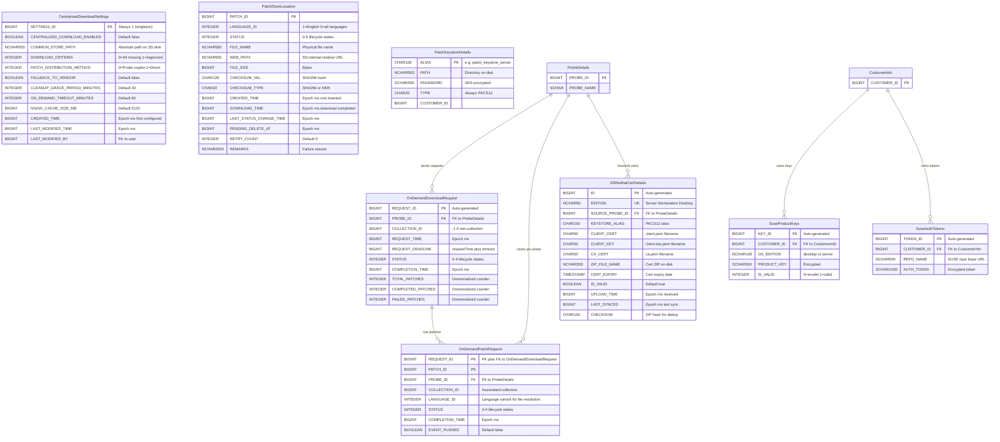
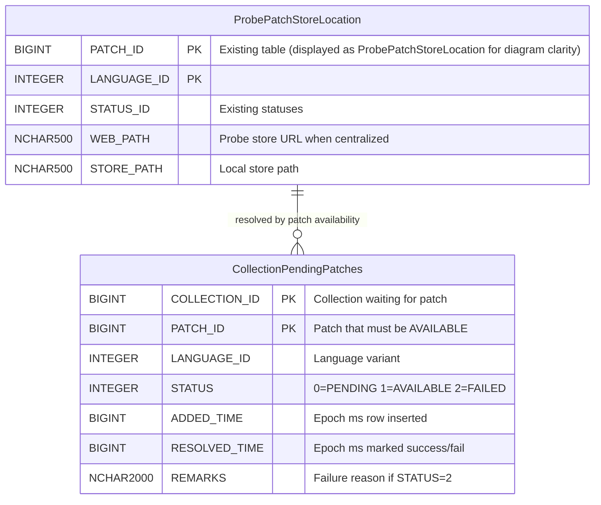

# Centralized Patch Download — Low-Level Design

> **Version:** 3.1 | **Date:** 2026-04-16
> **Product:** ManageEngine Endpoint Central
> **Scope:** REST APIs, DB Schema (ER Diagrams), Meta File Structures
> **Parent Design:** [`system-design.md`](system-design.md) · [`high-level-design.md`](high-level-design.md) · [`implementation-tasks.md`](implementation-tasks.md)
> **PoC Evidence:** [`poc-proven-report.md`](poc-proven-report.md) · [`poc5-proof.md`](poc5-proof.md)

---

## Table of Contents

1. [REST APIs](#1-rest-apis)
   - 1.1 [URL Convention & Auth](#11-url-convention--auth)
   - 1.2 [Settings APIs](#12-settings-apis)
   - 1.3 [Probe → SS APIs (via PushToSummaryProcessor)](#13-probe--ss-apis-via-pushtosummaryprocessor)
   - 1.4 [Patch Store APIs (SS Admin)](#14-patch-store-apis-ss-admin)
   - 1.5 [Dependency Package APIs (SS Admin)](#15-dependency-package-apis-ss-admin)
   - 1.6 [Monitoring & Admin APIs](#16-monitoring--admin-apis)
   - 1.7 [Nginx Auth Servlets](#17-nginx-auth-servlets)
   - 1.8 [SS → Probe Events](#18-ss--probe-events)
2. [DB Schema](#2-db-schema)
   - 2.1 [ER Diagram — SS Tables](#21-er-diagram--ss-tables)
   - 2.2 [ER Diagram — Probe Tables](#22-er-diagram--probe-tables)
   - 2.3 [Table Definitions](#23-table-definitions)
     - 2.3.10 [CollectionPendingPatches (Probe â€" New)](#2310-collectionpendingpatches-probe--new)
     - 2.3.11 [OnDemandPollingScheduler (Probe â€" Not a Table)](#2311-ondemandpollingscheduler-probe--not-a-table)
   - 2.4 [Status Enumerations](#24-status-enumerations)
   - 2.5 [Probe-Side DB Params (Cached from SS)](#25-probe-side-db-params-cached-from-ss)
   - 2.6 [Table Summary — New vs Reused](#26-table-summary--new-vs-reused)
   - 2.7 [Design Decisions Log](#27-design-decisions-log)
3. [Meta File Structures](#3-meta-file-structures)
   - 3.1 [Common Store Directory Layout](#31-common-store-directory-layout)
   - 3.2 [Meta Files Location (client-data)](#32-meta-files-location-client-data)
   - 3.3 [XML Schemas & Samples](#33-xml-schemas--samples)
   - 3.4 [File Naming Conventions](#34-file-naming-conventions)
   - 3.5 [What Lives Where — Summary](#35-what-lives-where--summary)

---

## 1. REST APIs

### 1.1 URL Convention & Auth

**Base path:** All centralized download APIs use `/dcapi/centralizedDownload`. Registered in `SSJerseyControllerSupplier.dcAPISummaryJerseyControllers()` and `security-onpremise-server-ss.xml`.

**Auth patterns:**

| Caller | Auth Mechanism | Headers |
|--------|---------------|---------|
| **SS Admin (browser)** | Session cookie + CSRF | Standard DC session auth |
| **Probe → SS** | API key headers | `SUMMARY_API_KEY`, `PROBE_ID`, `HS_KEY`, `PROBE_NAME`, `SUMMARY_SERVER_REQUEST`, `USER_DOMAIN` |
| **DS/Agent → Probe Nginx** | `auth_request` subrequest | Agent.key / basic auth validated by Probe servlet |
| **Probe → SS Nginx** | `auth_request` subrequest | `SUMMARY_API_KEY`, `PROBE_ID`, `HS_KEY` validated by SS servlet |

**Probe → SS Auth Header Details:**

| Header | Source | Purpose |
|--------|--------|---------|
| `SUMMARY_API_KEY` | `SUMMARYSERVERAPIKEYDETAILS` (Base64-decoded) | Primary auth token |
| `PROBE_ID` | `SUMMARYSERVERAPIKEYDETAILS` | Identifies calling Probe |
| `PROBE_NAME` | `ProbeDetailsUtil.getProbeName()` | Logging |
| `HS_KEY` | `ProbeAuthUtil.getProbeHandShakekey()` | Rotating session key |
| `SUMMARY_SERVER_REQUEST` | `"true"` | Distinguishes inter-server from browser |
| `USER_DOMAIN` | `encrypt(userName + "::" + domainName, summaryApiKey)` | Encrypted user context |

---

### 1.2 Settings APIs

#### GET `/dcapi/centralizedDownload`

Returns current centralized download settings from SS.

**Auth:** SS Admin session

**Response `200 OK`:**

```json
{
    "centralizedDownloadEnabled": false,
    "commonStorePath": "F:\\PatchStore",
    "downloadMissingForced": true,
    "downloadCriteria": 0,
    "patchDistributionMethod": 0,
    "fallbackToVendor": false,
    "cleanupGracePeriodMinutes": 30,
    "onDemandTimeoutMinutes": 60,
    "nginxCacheSizeMB": 5120,
    "lastModifiedTime": 1713168000000,
    "lastModifiedBy": 2
}
```

| Field | Type | Values |
|-------|------|--------|
| `downloadCriteria` | int | `0` = All missing patches, `1` = All approved missing patches |
| `patchDistributionMethod` | int | `0` = Probe copies from network storage, `1` = Machines access directly (UI-only) |

---

#### PUT `/dcapi/centralizedDownload`

Updates settings. When enabling, persists `CENTRALIZED_DOWNLOAD_ENABLED = TRUE` and pushes `CENTRALIZED_DL_SETTINGS_CHANGED` event to all Probes.

**Auth:** SS Admin session

**Request:**

```json
{
    "centralizedDownloadEnabled": true,
    "commonStorePath": "F:\\PatchStore",
    "downloadCriteria": 0,
    "patchDistributionMethod": 0,
    "fallbackToVendor": true,
    "cleanupGracePeriodMinutes": 30,
    "onDemandTimeoutMinutes": 60,
    "nginxCacheSizeMB": 5120
}
```

**Response `200 OK`:**

```json
{
    "status": "success",
    "message": "Settings updated successfully",
    "eventPushed": true
}
```

**Response `400 Bad Request`:** (validation failure)

```json
{
    "status": "error",
    "errorCode": "STORE_PATH_INVALID",
    "message": "Common store path is not writable or does not have sufficient space"
}
```

**Side effects:**
- Persists settings to `CentralizedDownloadSettings` table
- Pushes `CENTRALIZED_DL_SETTINGS_CHANGED` event to all Probes via `SummaryEventDataHandler`
- Probes update cached DB params via `SyMUtil.updateSyMParameter()`

---

#### POST `/dcapi/centralizedDownload/validateStore`

Dry-run validation of a proposed store path — checks writable + sufficient disk space on SS. Does not persist.

**Auth:** SS Admin session

**Request:**

```json
{
    "commonStorePath": "F:\\PatchStore"
}
```

**Response `200 OK`:**

```json
{
    "valid": true,
    "totalSpaceGB": 500,
    "freeSpaceGB": 320,
    "writable": true
}
```

**Response `200 OK`:** (validation failed — not an HTTP error)

```json
{
    "valid": false,
    "reason": "INSUFFICIENT_SPACE",
    "message": "Free space 2 GB is below minimum required 10 GB"
}
```

> **Prerequisite:** Common store access from all Probes is validated separately — admin must ensure all Probes have file-level access before enabling. No runtime Probe validation from this endpoint.

---

### 1.3 Probe → SS APIs (via PushToSummaryProcessor)

> These endpoints are called by Probes via `PushToSummaryProcessor` (push-to-summary queue, DB-backed, async). Auth: Probe API key headers.

#### POST `/dcapi/centralizedDownload/onDemandRequest`

Probe requests priority download of missing patches for a deployment. SS dedup-checks, queues for priority download, tracks per-patch completion.

**Auth:** Probe API key headers

**Request:**

```json
{
    "patchIds": [101, 102, 103],
    "collectionId": 12345,
    "probeId": 1001,
    "requestTime": 1740000000000
}
```

**Response `200 OK`:**

```json
{
    "requestId": 5678,
    "accepted": [101, 103],
    "alreadyAvailable": [102],
    "estimatedTimeMinutes": 5
}
```

| Response Field | Description |
|----------------|-------------|
| `requestId` | Auto-generated ID in `OnDemandDownloadRequest` table |
| `accepted` | Patch IDs queued for priority download (not yet in common store) |
| `alreadyAvailable` | Patch IDs already `STATUS=AVAILABLE` in `PatchStoreLocation` (SS) |
| `estimatedTimeMinutes` | Rough ETA based on queue depth and avg download time |

**SS processing:**
1. Check `PatchStoreLocation` (SS) → split `accepted` vs `alreadyAvailable`
2. Build `DownloadOptions` with `collectionId` → `calculatePriority()` returns `true` → queued ahead of bulk
3. Insert into `OnDemandDownloadRequest` + `OnDemandPatchRequest` (per-patch dedup)
4. After each patch download completes or fails:
   - Update `PatchStoreLocation` (SS) (`STATUS = AVAILABLE` or `FAILED`)
   - On failure: write `.patch-status/{patchId}_{langId}.failed` marker
   - Push `PATCH_STORE_UPDATED` or `ON_DEMAND_DOWNLOAD_FAILED` event to Probe

---

#### POST `/dcapi/centralizedDownload/dependencyPackages`

Probe forwards dependency package metadata (RPM/DEB info) to SS. SS dedup-inserts into `PACKAGEINFO` and triggers `SSDependencyDownloadTask`.

**Auth:** Probe API key headers

**Request:**

```json
{
    "probeId": 1001,
    "packages": [
        {
            "packageId": 1,
            "productId": 300180,
            "packageName": "iputils-ping_20190709-3ubuntu1_amd64.deb",
            "checksum": "ce08339e42c42bd624113b5cbf33110797e0241bdb3e3b65c5fb7bb058bf7be0",
            "checksumType": "sha256",
            "downloadUrl": "http://archive.ubuntu.com/ubuntu/pool/main/i/iputils/iputils-ping_20190709-3ubuntu1_amd64.deb",
            "osFlavor": "ubuntu"
        }
    ]
}
```

**Response `200 OK`:**

```json
{
    "status": "success",
    "inserted": 1,
    "duplicatesSkipped": 0
}
```

**Side effects:** SS dedup-inserts into `PACKAGEINFO`, triggers `SSDependencyDownloadTask` to download packages into `{commonStore}/linux/{flavor}-dependencies/`.

---

#### POST `/dcapi/centralizedDownload/redhatCert`

Probe forwards a RedHat mTLS certificate ZIP (client.pem, client-key.pem, ca.pem) + metadata to SS for Red Hat CDN authentication.

**Auth:** Probe API key headers
**Content-Type:** `multipart/form-data` (via `MultiPartUtilImpl`)

**Request (multipart):**

| Part | Type | Description |
|------|------|-------------|
| `certFile` | Binary (ZIP) | Archive containing `client.pem`, `client-key.pem`, `ca.pem` |
| `edition` | Text | `Server` / `Workstation` / `Desktop` |
| `probeId` | Text | Source Probe ID |
| `certExpiry` | Text | ISO-8601 certificate expiry date |

**Response `200 OK`:**

```json
{
    "status": "success",
    "edition": "Server",
    "keystoreAlias": "patch_keystore_server",
    "message": "RedHat certificate stored successfully"
}
```

**SS processing:**
1. Extract ZIP to SS disk
2. Import certs into PKCS12 keystore via `PatchKeystoreService.saveKeystore()`
3. UPSERT `SSRedhatCertDetails` by `EDITION` (unique constraint)
4. Store keystore password in `PatchKeystoreDetails`

---

#### POST `/dcapi/centralizedDownload/suseKeys`

Probe forwards SUSE registration codes (product keys) to SS. SS stores in `SuseProductKeys` and runs `SuseAuthtokenTask` to fetch auth tokens from `scc.suse.com`.

**Auth:** Probe API key headers

**Request:**

```json
{
    "probeId": 1001,
    "customerId": 5001,
    "keys": [
        {
            "productKey": "XXXX-XXXX-XXXX-XXXX",
            "osEdition": "server",
            "customerId": 5001
        },
        {
            "productKey": "YYYY-YYYY-YYYY-YYYY",
            "osEdition": "desktop",
            "customerId": 5001
        }
    ]
}
```

**Response `200 OK`:**

```json
{
    "status": "success",
    "inserted": 1,
    "updated": 1,
    "deleted": 0
}
```

**Dedup logic:** UPSERT by `(PRODUCT_KEY, CUSTOMER_ID)`. Probe sends full key list — SS removes keys not in the list for that customer.

**Side effects:** After storing keys, SS runs `SuseAuthtokenTask` to fetch auth tokens from `scc.suse.com` → stores in `SuseAuthTokens`. Tokens consumed by `SuseSettingsUtil.appendSUSEToken()` at download time.

---

#### POST `/dcapi/centralizedDownload/upload`

Accepts multipart upload (binary + metadata); stores in common store, updates `PatchStoreLocation` (SS), validates checksum, broadcasts `PATCH_UPLOAD_STATUS` event. Also used by Probe's `ProbeUploadForwarder` to forward admin uploads.

**Auth:** Probe API key headers
**Content-Type:** `multipart/form-data`

**Request (multipart):**

| Part | Type | Description |
|------|------|-------------|
| `file` | Binary | Patch binary file |
| `patchId` | Text | Patch identifier |
| `languageId` | Text | Language variant (`1` = English, `0` = all languages) |
| `fileName` | Text | Target file name in common store |
| `checksum` | Text | Expected SHA256 checksum |
| `probeId` | Text | Source Probe ID |

**Response `200 OK`:**

```json
{
    "status": "success",
    "patchId": 400010,
    "storedAs": "400010-custom-patch.exe",
    "checksumValid": true
}
```

**Response `400 Bad Request`:**

```json
{
    "status": "error",
    "errorCode": "CHECKSUM_MISMATCH",
    "message": "Uploaded file checksum does not match expected value"
}
```

**Side effects:**
- Stores binary in `{commonStore}/{fileName}`
- Updates `PatchStoreLocation` (SS) with `STATUS=AVAILABLE`
- Broadcasts `PATCH_UPLOAD_STATUS` event to all Probes

---

### 1.4 Patch Store APIs (SS Admin)

#### POST `/dcapi/centralizedDownload/patches/redownload`

Re-triggers `SSPatchDownloadService` for selected patch IDs.

**Auth:** SS Admin session

**Request:**

```json
{
    "patchIds": [101, 205, 310]
}
```

**Response `200 OK`:**

```json
{
    "status": "success",
    "requeued": 3,
    "message": "3 patches queued for re-download"
}
```

**Side effects:**
- Resets `PatchStoreLocation.STATUS (SS)` to `QUEUED` for each patch
- Deletes any existing `.patch-status/{patchId}_{langId}.failed` markers
- Queues patches in `ss-patch-download-data` for download

---

#### DELETE `/dcapi/centralizedDownload/patches`

Initiates soft-delete for selected patch IDs. Physical deletion handled by `DeferredCleanupTask` after grace period.

**Auth:** SS Admin session

**Request:**

```json
{
    "patchIds": [101, 205]
}
```

**Response `200 OK`:**

```json
{
    "status": "success",
    "markedForDeletion": 2,
    "gracePeriodMinutes": 30,
    "message": "2 patches marked for deletion. Physical removal after 30 minutes."
}
```

**Side effects:**
- Sets `PatchStoreLocation.STATUS (SS) = PENDING_DELETE` (4)
- Sets `PatchStoreLocation.PENDING_DELETE_AT` to current epoch ms
- `DeferredCleanupTask` physically deletes after `CLEANUP_GRACE_PERIOD_MINUTES`
- After physical deletion: updates `deleted-patches.xml`, broadcasts `PATCH_STORE_UPDATED` event

---

### 1.5 Dependency Package APIs (SS Admin)

#### POST `/dcapi/centralizedDownload/dependency/redownload`

Re-triggers `SSDependencyDownloadTask` for selected package IDs.

**Auth:** SS Admin session

**Request:**

```json
{
    "packageIds": [1, 2, 3]
}
```

**Response `200 OK`:**

```json
{
    "status": "success",
    "requeued": 3
}
```

---

#### DELETE `/dcapi/centralizedDownload/dependency`

Deletes selected dependency packages from the common store.

**Auth:** SS Admin session

**Request:**

```json
{
    "packageIds": [1, 2]
}
```

**Response `200 OK`:**

```json
{
    "status": "success",
    "deleted": 2
}
```

---

### 1.6 Monitoring & Admin APIs

#### GET `/dcapi/centralizedDownload/stats`

Returns common store statistics.

**Auth:** SS Admin session

**Response `200 OK`:**

```json
{
    "totalPatches": 1250,
    "byStatus": {
        "QUEUED": 15,
        "DOWNLOADING": 3,
        "AVAILABLE": 1200,
        "FAILED": 12,
        "PENDING_DELETE": 8,
        "DELETED": 12
    },
    "totalFileSizeBytes": 53687091200,
    "totalFileSizeFormatted": "50.0 GB",
    "diskUsage": {
        "totalSpaceGB": 500,
        "freeSpaceGB": 320,
        "usedByStoreGB": 50
    }
}
```

---

#### GET `/dcapi/centralizedDownload/probeStatus`

Returns per-Probe sync and connectivity status.

**Auth:** SS Admin session

**Response `200 OK`:**

```json
{
    "probes": [
        {
            "probeId": 1001,
            "probeName": "Probe-US-East",
            "lastEventDeliveryTime": 1713168000000,
            "pendingEventCount": 0,
            "online": true,
            "commonStoreAccessible": true
        },
        {
            "probeId": 1002,
            "probeName": "Probe-EU-West",
            "lastEventDeliveryTime": 1713167000000,
            "pendingEventCount": 3,
            "online": true,
            "commonStoreAccessible": true
        }
    ]
}
```

---

#### GET `/dcapi/centralizedDownload/status/{collectionId}`

Returns deployment status including pending patches, their SS download status, and available admin actions.

**Auth:** SS Admin session

**Response `200 OK`:** (when `WAITING_FOR_SS_DOWNLOAD`)

```json
{
    "collectionId": 12345,
    "status": "WAITING_FOR_SS_DOWNLOAD",
    "statusCode": 502,
    "waitingSince": "2026-03-20T10:24:00Z",
    "timeoutAt": "2026-03-20T10:54:00Z",
    "patchesRequired": 3,
    "patchesAvailableOnSS": 1,
    "patchesPendingDownload": 2,
    "pendingPatches": [
        {
            "patchId": 102,
            "fileName": "KB5034441.msu",
            "sizeMB": 1627,
            "ssDownloadStatus": "DOWNLOADING",
            "retryCount": 0
        },
        {
            "patchId": 103,
            "fileName": "KB5034442.msu",
            "sizeMB": 50,
            "ssDownloadStatus": "QUEUED",
            "retryCount": 0
        }
    ],
    "actions": ["RETRY_ON_DEMAND", "FALLBACK_TO_VENDOR", "CANCEL_DEPLOYMENT"]
}
```

**Response `200 OK`:** (when `PARTIALLY_DEPLOYED`)

```json
{
    "collectionId": 12346,
    "status": "PARTIALLY_DEPLOYED",
    "statusCode": 503,
    "deployedPatches": 5,
    "remainingPatches": 2,
    "pendingPatches": [
        {
            "patchId": 205,
            "fileName": "update-205.rpm",
            "sizeMB": 85,
            "ssDownloadStatus": "AVAILABLE",
            "retryCount": 0
        }
    ],
    "actions": ["RETRY_ON_DEMAND", "FALLBACK_TO_VENDOR"]
}
```

---

#### POST `/dcapi/centralizedDownload/fallbackToVendor/{collectionId}`

Forces a stuck collection (status 502/503) to bypass SS and fall back to direct vendor download.

**Auth:** SS Admin session

**Response `200 OK`:**

```json
{
    "status": "success",
    "collectionId": 12345,
    "message": "Collection switched to vendor download fallback"
}
```

**Response `400 Bad Request`:**

```json
{
    "status": "error",
    "errorCode": "INVALID_STATE",
    "message": "Collection 12345 is not in WAITING_FOR_SS_DOWNLOAD or PARTIALLY_DEPLOYED state"
}
```

---

### 1.7 Nginx Auth Servlets

> These are **not** REST APIs — they are mapped as servlets for Nginx `auth_request` subrequests. They return only HTTP status codes (no response body).

#### Probe-side: `GET /common-store-auth`

Nginx `auth_request` handler on Probe's `/store/` location. Validates DS/Agent credentials.

| Aspect | Detail |
|--------|--------|
| **Location** | Probe |
| **Triggered by** | Nginx `auth_request` subrequest when DS/Agent requests `/store/{file}` |
| **Validates** | Agent.key / basic auth credentials from the original request |
| **Returns** | `200` (allow download) or `401` (deny) |
| **Implementation** | Servlet registered in Probe's `web.xml`, not a Jersey resource |

#### SS-side: `GET /common-store-auth`

Nginx `auth_request` handler on SS `/common-store/` location. Validates Probe credentials for fallback requests.

| Aspect | Detail |
|--------|--------|
| **Location** | SS |
| **Triggered by** | Nginx `auth_request` subrequest when Probe requests `/common-store/{file}` |
| **Validates** | `SUMMARY_API_KEY`, `PROBE_ID`, `HS_KEY` headers against `SUMMARYSERVERAPIKEYDETAILS` |
| **Returns** | `200` (allow) or `401` (deny) |
| **Implementation** | `SSStoreAuthValidator` servlet |

---

### 1.8 SS → Probe Events

Push events sent from SS to Probes via `SummaryEventDataHandler`. These use the existing SS→Probe event infrastructure (`SUMMARYEVENTDATA` → per-probe queues → HTTPS POST to Probe).

```
SS: SummaryEventDataHandler.storeEventData(eventCode, isAllProbes, reqJSON)
  → SUMMARYEVENTDATA table (encrypted JSON)
  → Per-probe queues: push-to-probe-{N}
  → PushToProbeProcessor → HTTPS POST to Probe
  → Probe: SummaryEventDataValidator → PatchStoreEventDataProcessor
```

#### Event: `PATCH_STORE_UPDATED`

| Aspect | Detail |
|--------|--------|
| **Direction** | SS → Specific Probe(s) (on-demand) or SS → All Probes (bulk/cleanup) |
| **Trigger** | On-demand download completes for a patch / Bulk batch completes / Deferred cleanup deletes files |
| **Purpose** | Probes check for waiting/partial collections that can now resume |

**Targeted payload (on-demand):**

```json
{
    "eventCode": "PATCH_STORE_UPDATED",
    "type": "ON_DEMAND_COMPLETE",
    "patchIds": [101],
    "collectionId": 12345,
    "probeId": 1001,
    "timestamp": 1740000300000
}
```

**Broadcast payload (bulk download):**

```json
{
    "eventCode": "PATCH_STORE_UPDATED",
    "type": "BULK_DOWNLOAD_COMPLETE",
    "patchIds": [201, 202, 203, 204, 205],
    "timestamp": 1740014400000
}
```

**Broadcast payload (cleanup deletion):**

```json
{
    "eventCode": "PATCH_STORE_UPDATED",
    "type": "PATCHES_DELETED",
    "patchIds": [50, 51],
    "timestamp": 1740014500000
}
```

---

#### Event: `ON_DEMAND_DOWNLOAD_FAILED`

| Aspect | Detail |
|--------|--------|
| **Direction** | SS → Specific Probe(s) |
| **Trigger** | On-demand download fails after 3 retries |
| **Purpose** | Probe falls back to vendor (if enabled) or marks collection as `DOWNLOAD_FAILED` |

**Payload:**

```json
{
    "eventCode": "ON_DEMAND_DOWNLOAD_FAILED",
    "patchIds": [101],
    "collectionId": 12345,
    "probeId": 1001,
    "failureReason": "Checksum mismatch after 3 retries",
    "timestamp": 1740000600000
}
```

---

#### Event: `CENTRALIZED_DL_SETTINGS_CHANGED`

| Aspect | Detail |
|--------|--------|
| **Direction** | SS → All Probes |
| **Trigger** | Admin enables/disables or changes settings |
| **Purpose** | Probes update cached DB params via `SyMUtil.updateSyMParameter()` |

**Payload:**

```json
{
    "eventCode": "CENTRALIZED_DL_SETTINGS_CHANGED",
    "settings": {
        "centralizedDownloadEnabled": true,
        "commonStorePath": "F:\\PatchStore",
        "fallbackToVendor": true,
        "onDemandTimeoutMinutes": 60,
        "nginxCacheSizeMB": 5120,
        "downloadCriteria": 0
    },
    "timestamp": 1740000000000
}
```

---

#### Event: `PATCH_UPLOAD_STATUS`

| Aspect | Detail |
|--------|--------|
| **Direction** | SS → All Probes |
| **Trigger** | Patch uploaded to SS (directly or forwarded from Probe) |
| **Purpose** | Probes update local metadata for patch availability |

**Payload:**

```json
{
    "eventCode": "PATCH_UPLOAD_STATUS",
    "patchId": 400010,
    "languageId": 1,
    "fileName": "400010-custom-patch.exe",
    "status": "AVAILABLE",
    "timestamp": 1740001000000
}
```

---

## 2. DB Schema

> **Reconciliation note:** This schema is the **source of truth** — it reconciles discrepancies between `system-design.md` (conceptual spec) and the original `low-level-design.md` (initial technical spec). Where the two disagree, this document records the decision and rationale.

### 2.1 ER Diagram — SS Tables



### 2.2 ER Diagram — Probe Tables



> **Note:** The actual table name on Probe is `PatchStoreLocation` — identical naming to the SS table is intentional (same conceptual role: tracks patch availability per host). They live in separate databases and are never joined. The diagram uses `ProbePatchStoreLocation` purely to avoid visual ambiguity with the SS-side table in tooling that renders both ER diagrams together.

---

### 2.3 Table Definitions

#### 2.3.1 CentralizedDownloadSettings (SS — New, Singleton)

> Singleton row (`SETTINGS_ID = 1`). Stores the entire centralized download configuration. Seeded with defaults on first startup.

| Column | Type | Default | Nullable | Description |
|--------|------|---------|----------|-------------|
| **`SETTINGS_ID`** | BIGINT (PK, auto) | — | NO | Always 1 for singleton. Enforced by application-level UPSERT — `CHECK (SETTINGS_ID = 1)` recommended if DB supports it. |
| `CENTRALIZED_DOWNLOAD_ENABLED` | BOOLEAN | `false` | NO | Master toggle — `true` = SS downloads centrally, Probes stop vendor downloads |
| `COMMON_STORE_PATH` | NCHAR(500) | — | YES | Absolute path on SS disk (e.g., `F:\PatchStore`) |
| `DOWNLOAD_CRITERIA` | INTEGER | `0` | NO | `0` = All missing patches, `1` = All approved missing patches. Controls which patches SS proactively downloads. |
| `PATCH_DISTRIBUTION_METHOD` | INTEGER | `0` | NO | `0` = Probe copies from network storage, `1` = Machines access directly. UI-only — persisted for display, no backend behavioral change. |
| `FALLBACK_TO_VENDOR` | BOOLEAN | `false` | NO | If `true`, Probe falls back to vendor download on on-demand timeout |
| `CLEANUP_GRACE_PERIOD_MINUTES` | INTEGER | `30` | NO | Minutes to keep files on disk after `PENDING_DELETE` (race condition guard) |
| `ON_DEMAND_TIMEOUT_MINUTES` | INTEGER | `60` | NO | How long Probe waits for SS before timeout/fallback |
| `NGINX_CACHE_SIZE_MB` | BIGINT | `5120` | NO | Max size (MB) of Probe-side Nginx `proxy_cache` zone. Default 5 GB. Pushed to Probes via `CENTRALIZED_DL_SETTINGS_CHANGED` event. |
| `CREATED_TIME` | BIGINT | — | NO | Epoch ms when centralized download was first configured. Set once on initial INSERT, never updated. |
| `LAST_MODIFIED_TIME` | BIGINT | `-1` | NO | Epoch ms of last settings change |
| `LAST_MODIFIED_BY` | BIGINT | — | YES | User ID of admin who last changed settings |

> **Reconciliation notes:**
> - **`COMMON_STORE_URL` (system-design.md §7.1):** Intentionally omitted. The LLD's reasoning is correct — download URL is resolved per-patch from `PatchStoreLocation.WEB_PATH`, and the server base URL comes from the existing server URL config file. No separate column needed.
> - **`DOWNLOAD_MISSING_FORCED` (original LLD):** Removed. It was always `true` and could never be changed — a column that can't vary is dead schema. The "always download missing" invariant is enforced in code. If the product later needs a toggle, add the column then.
> - **Cleanup settings** (remove superseded, remove older than N months) are in existing SS cleanup settings tables.
> - **Notification settings** use existing SS notification framework.
> - **Download prioritization:** On-demand auto-prioritized via `PriorityBlockingQueue` in `DefaultDCQueue`. On-demand entries have `collectionId != -1` → auto-priority.

---

#### 2.3.2 PatchStoreLocation (SS — New, Reused Concept from Probe)

> One row per patch in the SS common store. Tracks download lifecycle with soft-delete support.
>
> **Naming rationale (v3.1):** This table was previously named `PatchStoreLocation` (SS). It has been renamed to `PatchStoreLocation` to mirror the same-named table on Probe — both tables serve the identical conceptual role (tracking patch binary availability per host), just in separate databases. Reusing the name makes the shared concept explicit and allows the same DAO base class to serve both contexts. They are never joined — each lives in its own DB schema.
>
> **PK decision:** `PATCH_ID` only — `LANGUAGE_ID` is a regular column (not part of the key) since each patch has a single binary regardless of how many language variants reference it (common URL patches use `LANGUAGE_ID=0`). System-design.md §7.1 defines `(PATCH_ID, LANGUAGE_ID)` as composite PK, but that design was written before the "one binary per patch" simplification was confirmed in PoC. This document supersedes.

| Column | Type | Default | Nullable | Description |
|--------|------|---------|----------|-------------|
| **`PATCH_ID`** | BIGINT (PK) | — | NO | Patch identifier |
| `LANGUAGE_ID` | INTEGER | `1` | NO | Language variant (`1`=English, `0`=all languages for common URL patches) |
| `STATUS` | INTEGER | `0` | NO | `0`=QUEUED, `1`=DOWNLOADING, `2`=AVAILABLE, `3`=FAILED, `4`=PENDING_DELETE, `5`=DELETED |
| `FILE_NAME` | NCHAR(500) | — | YES | Physical file name (e.g., `400008-mpam-fe-defender.exe`) |
| `WEB_PATH` | NCHAR(500) | — | YES | SS-internal relative URL (e.g., `/common-store/400008-mpam-fe-defender.exe`). Used by SS for its own zip generation. **Not the DS/Agent download URL** — DS/Agents use Probe `/store/`. |
| `FILE_SIZE` | BIGINT | `0` | NO | Size in bytes |
| `CHECKSUM_VAL` | CHAR(128) | — | YES | Hash of the downloaded binary |
| `CHECKSUM_TYPE` | CHAR(20) | `SHA256` | YES | Algorithm (`SHA256`, `MD5` fallback for >4 GB) |
| `CREATED_TIME` | BIGINT | — | NO | Epoch ms when row was first inserted (queued). Immutable after INSERT. |
| `DOWNLOAD_TIME` | BIGINT | `-1` | NO | Epoch ms when download completed (`-1` = not yet downloaded) |
| `LAST_STATUS_CHANGE_TIME` | BIGINT | — | NO | Epoch ms of the most recent `STATUS` transition. Updated on every status change. Used to detect zombie rows stuck in `DOWNLOADING`. |
| `PENDING_DELETE_AT` | BIGINT | — | YES | Epoch ms when marked `PENDING_DELETE`; `DeferredCleanupTask` physically deletes only after grace period |
| `RETRY_COUNT` | INTEGER | `0` | NO | Download retry attempts |
| `REMARKS` | NCHAR(2000) | — | YES | Failure reason or status notes |

**Indexes:**

| Index Name | Columns | Purpose |
|------------|---------|---------|
| `IDX_SSPSL_STATUS` | `(STATUS)` | Stats API counts by status; `DeferredCleanupTask` scans for `PENDING_DELETE`; `SSDownloadMissingPatchTask` scans for `QUEUED`/`FAILED` |
| `IDX_SSPSL_PENDING_DELETE` | `(STATUS, PENDING_DELETE_AT)` | `DeferredCleanupTask`: `WHERE STATUS = 4 AND PENDING_DELETE_AT < (now - grace)` |
| `IDX_SSPSL_STUCK_DETECT` | `(STATUS, LAST_STATUS_CHANGE_TIME)` | Monitoring: detect downloads stuck in `DOWNLOADING` beyond threshold |

---

#### 2.3.3 OnDemandDownloadRequest (SS — New)

> One row per on-demand request from a Probe. Tracks overall request lifecycle.

| Column | Type | Default | Nullable | Description |
|--------|------|---------|----------|-------------|
| **`REQUEST_ID`** | BIGINT (PK, auto) | — | NO | Auto-generated unique ID |
| `PROBE_ID` | BIGINT (FK) | — | NO | Probe that sent the request → `ProbeDetails.PROBE_ID` |
| `COLLECTION_ID` | BIGINT | `-1` | NO | Collection that triggered it (`-1` if non-collection) |
| `REQUEST_TIME` | BIGINT | — | NO | Epoch ms when received by SS |
| `REQUEST_DEADLINE` | BIGINT | — | NO | `REQUEST_TIME + ON_DEMAND_TIMEOUT_MINUTES * 60000`. Frozen at request time — immune to mid-flight settings changes. Used by timeout handler (system-design.md §13.3). |
| `STATUS` | INTEGER | `0` | NO | `0`=RECEIVED, `1`=IN_PROGRESS, `2`=COMPLETED, `3`=PARTIALLY_COMPLETED, `4`=FAILED |
| `COMPLETION_TIME` | BIGINT | — | YES | Epoch ms when all patches resolved |
| `TOTAL_PATCHES` | INTEGER | `0` | NO | Total patches requested (denormalized — source of truth is child rows) |
| `COMPLETED_PATCHES` | INTEGER | `0` | NO | Successfully downloaded count (denormalized) |
| `FAILED_PATCHES` | INTEGER | `0` | NO | Failed download count (denormalized) |

> **Denormalized counters contract:** `TOTAL_PATCHES`, `COMPLETED_PATCHES`, `FAILED_PATCHES` are maintained for efficient dashboard reads. They MUST be updated in the same transaction as child `OnDemandPatchRequest` status changes. The child table is the source of truth — on any mismatch, recompute from `SELECT COUNT(*) ... GROUP BY STATUS`.

**FK:** `PROBE_ID` → `ProbeDetails.PROBE_ID` (ON DELETE CASCADE)

**Indexes:**

| Index Name | Columns | Purpose |
|------------|---------|---------|
| `IDX_ODDR_PROBE_STATUS` | `(PROBE_ID, STATUS)` | "All active requests for Probe X" — called on each new on-demand request for dedup |
| `IDX_ODDR_COLLECTION` | `(COLLECTION_ID)` | Deployment status API (`/status/{collectionId}`) queries by collection |
| `IDX_ODDR_DEADLINE` | `(STATUS, REQUEST_DEADLINE)` | Timeout handler: `WHERE STATUS IN (0,1) AND REQUEST_DEADLINE < now()` |

**Data retention:** Rows in `COMPLETED` or `FAILED` status older than 30 days should be purged by `DeferredCleanupTask`. CASCADE delete removes child `OnDemandPatchRequest` rows automatically.

---

#### 2.3.4 OnDemandPatchRequest (SS — New)

> Bridge table — one row per (request, patch, probe). Enables per-patch dedup, per-probe event targeting, and completion tracking across multiple Probe requests.
>
> **Reconciliation:** System-design.md §7.1 includes `PROBE_ID` and `COLLECTION_ID` directly on this table. The original LLD removed them, relying on JOIN to the parent. This was wrong — the per-patch completion event logic (system-design.md §10.3) iterates trackers to push `PATCH_STORE_UPDATED` to each interested Probe. A JOIN on every patch-complete event is avoidable overhead on a hot path. Restoring both columns.

| Column | Type | Default | Nullable | Description |
|--------|------|---------|----------|-------------|
| **`REQUEST_ID`** | BIGINT (PK, FK) | — | NO | → `OnDemandDownloadRequest.REQUEST_ID` |
| **`PATCH_ID`** | BIGINT (PK) | — | NO | Patch being tracked |
| `PROBE_ID` | BIGINT (FK) | — | NO | Requesting Probe → `ProbeDetails.PROBE_ID`. Denormalized from parent for event targeting without JOIN. |
| `COLLECTION_ID` | BIGINT | `-1` | NO | Associated collection. Denormalized from parent for event payload construction. |
| `LANGUAGE_ID` | INTEGER | `1` | NO | Language variant. Needed for failure marker file resolution (`{patchId}_{langId}.failed`) and download URL construction. |
| `STATUS` | INTEGER | `0` | NO | `0`=QUEUED, `1`=DOWNLOADING, `2`=DOWNLOADED, `3`=FAILED, `4`=ALREADY_AVAILABLE |
| `COMPLETION_TIME` | BIGINT | — | YES | Epoch ms when this patch completed |
| `EVENT_PUSHED` | BOOLEAN | `false` | NO | Whether `PATCH_STORE_UPDATED` event was sent to the requesting Probe |

**FK:** `REQUEST_ID` → `OnDemandDownloadRequest.REQUEST_ID` (ON DELETE CASCADE)

**Indexes:**

| Index Name | Columns | Purpose |
|------------|---------|---------|
| `IDX_ODPR_PATCH_STATUS` | `(PATCH_ID, STATUS)` | Per-patch dedup: "is anyone already downloading patch 101?" — called on every incoming on-demand request (system-design.md §10.2) |
| `IDX_ODPR_PATCH_EVENT` | `(PATCH_ID, EVENT_PUSHED)` | Completion event push: find all trackers for a completed patch where event not yet sent |

---

#### 2.3.5 SSRedhatCertDetails (SS — New)

> One row per RedHat edition. Stores certs forwarded from Probes for mTLS downloads from `cdn.redhat.com`.
>
> **Why not reuse Probe's `RedhatCertDetails`?** Probe table has `RESOURCE_ID` → `RESOURCE` JOIN for deriving `CUSTOMER_ID`. This JOIN fails on SS since `RESOURCE` table doesn't exist. A clean SS-specific table avoids all this baggage.
>
> **Customer dimension:** Red Hat editions are globally unique per deployment — one cert per edition across all customers. If a customer has a "Server" cert, it's the only "Server" cert in the system. The `UNIQUE(EDITION)` constraint enforces this. If multi-customer-per-edition is ever needed, the PK must change to `(EDITION, CUSTOMER_ID)`.

| Column | Type | Default | Nullable | Description |
|--------|------|---------|----------|-------------|
| **`ID`** | BIGINT (PK, auto) | — | NO | Auto-generated |
| `EDITION` | NCHAR(50) (UNIQUE) | — | NO | `Server` / `Workstation` / `Desktop` |
| `SOURCE_PROBE_ID` | BIGINT (FK) | — | NO | Probe that forwarded this cert → `ProbeDetails.PROBE_ID` |
| `KEYSTORE_ALIAS` | CHAR(100) | — | NO | Alias in PKCS12 keystore on SS disk |
| `CLIENT_CERT` | CHAR(50) | — | NO | Client certificate file name |
| `CLIENT_KEY` | CHAR(50) | — | NO | Client key file name |
| `CA_CERT` | CHAR(50) | — | NO | CA certificate file name |
| `ZIP_FILE_NAME` | NCHAR(200) | — | NO | Certificate ZIP on disk |
| `CERT_EXPIRY` | TIMESTAMP | — | YES | Certificate expiry date |
| `IS_VALID` | BOOLEAN | `true` | NO | Whether cert is currently usable |
| `UPLOAD_TIME` | BIGINT | — | NO | Epoch ms when received from Probe |
| `LAST_SYNCED` | BIGINT | `-1` | NO | Epoch ms when cert was last validated/synced. `-1` = never synced. Updated by periodic cert validation task. |
| `CHECKSUM` | CHAR(100) | — | YES | Hash of the ZIP for dedup |

> **Cert expiry handling:** At download time, the query MUST be: `WHERE EDITION = ? AND IS_VALID = TRUE AND CERT_EXPIRY > NOW()`. This double-check ensures expiry is caught even if no background job has flipped `IS_VALID`. The `IS_VALID` flag remains useful for admin-initiated disabling (e.g., cert revoked before expiry).

**FK:** `SOURCE_PROBE_ID` → `ProbeDetails.PROBE_ID` (ON DELETE CASCADE)

---

#### 2.3.6 SuseProductKeys (SS — Reused from Probe)

> **Reused table — same schema as Probe-side `SuseProductKeys`.** Added to `data-dictionary-ss.xml`. Zero code changes — `SuseAuthtokenTask`, `SuseCoreUtil`, `SuseDaoUtil` all query by table constant.
>
> **Note on `IS_VALID` type:** Uses `INTEGER` (0/1) instead of `BOOLEAN` — inherited from the existing Probe schema. Changing the type would break `SuseAuthtokenTask` which checks `IS_VALID == 1`. Reused tables retain their original types.

| Column | Type | Default | Nullable | Description |
|--------|------|---------|----------|-------------|
| **`KEY_ID`** | BIGINT (PK, auto) | — | NO | Auto-generated |
| `CUSTOMER_ID` | BIGINT (FK) | — | NO | Customer that owns the key → `CustomerInfo.CUSTOMER_ID` |
| `OS_EDITION` | NCHAR(100) | — | NO | `desktop` / `server` |
| `PRODUCT_KEY` | SCHAR(500) | — | NO | SUSE registration code (encrypted via SCHAR) |
| `IS_VALID` | INTEGER | `0` | NO | `0`=invalid, `1`=valid (set by `SuseAuthtokenTask` after API validation) |

**FK:** `CUSTOMER_ID` → `CustomerInfo.CUSTOMER_ID` (ON DELETE CASCADE)
**Source schema:** `data-dictionary.xml` → `<table name="SuseProductKeys">`

---

#### 2.3.7 SuseAuthTokens (SS — Reused from Probe)

> Same schema as Probe-side. Populated by `SuseAuthtokenTask` running on SS. Consumed by `SuseSettingsUtil.appendSUSEToken()`.

| Column | Type | Default | Nullable | Description |
|--------|------|---------|----------|-------------|
| **`TOKEN_ID`** | BIGINT (PK, auto) | — | NO | Auto-generated |
| `CUSTOMER_ID` | BIGINT (FK) | — | NO | → `CustomerInfo.CUSTOMER_ID` |
| `REPO_NAME` | NCHAR(500) | — | NO | SUSE repo base URL (without query params) |
| `AUTH_TOKEN` | SCHAR(1000) | — | NO | Auth token query string (encrypted via SCHAR). Appended to download URL by `SuseSettingsUtil.appendSUSEToken()` |

**FK:** `CUSTOMER_ID` → `CustomerInfo.CUSTOMER_ID` (ON DELETE CASCADE)
**Source schema:** `data-dictionary.xml` → `<table name="SuseAuthTokens">`

---

#### 2.3.8 PatchKeystoreDetails (SS — Reused from Probe)

> Same schema as Probe-side. Stores encrypted password for the PKCS12 keystore file. Used by `PatchKeystoreService` for mTLS downloads.
>
> **Architecture:** `SSRedhatCertDetails` tracks cert metadata (edition, validity, expiry). `PatchKeystoreDetails` stores the keystore password. Actual certs live in a `.p12` file on disk, loaded at download time by `PatchKeystoreService.getSSLContextWithKeystore(alias)`.

| Column | Type | Default | Nullable | Description |
|--------|------|---------|----------|-------------|
| **`ALIAS`** | CHAR(100) (PK) | — | NO | Keystore alias (e.g., `patch_keystore_{customerId}`) |
| `PATH` | NCHAR(500) | — | NO | Directory path of the keystore file on disk |
| `PASSWORD` | SCHAR(500) | — | NO | AES-encrypted keystore password |
| `TYPE` | CHAR(20) | — | NO | Keystore type (always `PKCS12`) |
| `CUSTOMER_ID` | BIGINT | — | NO | Customer ID |

**Source schema:** `data-dictionary.xml` → `<table name="PatchKeystoreDetails">`

---

#### 2.3.9 PatchStoreLocation (Probe — Existing, No Schema Changes)

> When centralized download is enabled, Probe populates `WEB_PATH` with the Probe's own `/store/` URL (e.g., `/store/{fileName}`) at deployment time. DS/Agents download from this Probe endpoint — Probe Nginx serves from common store via self-proxy with optional `proxy_cache` (PoC-5 proven). The existing `WEB_PATH` column already distinguishes where the patch is fetched from — no separate `SOURCE_TYPE` column required.
>
> **Reconciliation:** System-design.md §7.2 proposes adding `SOURCE_TYPE` column (`0`=VENDOR_DOWNLOAD, `1`=SS_DIRECT). This is intentionally **not** adopted because:
> 1. `WEB_PATH` value already distinguishes source: `/store/{file}` = centralized, vendor URL = legacy.
> 2. Adding a column to an existing high-traffic table carries migration risk.
> 3. No query in the system design actually filters by `SOURCE_TYPE` â€" it was informational, not functional.

---

#### 2.3.10 CollectionPendingPatches (Probe â€" New)

> One row per (collection, patch) that is still pending SS download on this Probe. Created when a deployment transitions to `WAITING_FOR_SS_DOWNLOAD` or `PARTIALLY_DEPLOYED`. Removed when the patch is resolved (binary found or failure confirmed). DB-backed â€" survives Probe restart.
>
> **Why this table (not just querying existing tables)?** The existing `PATCHSTORELOCATION` tracks per-patch status, and `PATCHCONFIG`/`COLLECTIONRESOURCE` maps collections to patches. However, querying those tables on every polling tick (every 5 min, per pending collection) requires multi-table JOINs. `COLLECTIONPENDINGPATCHES` is a narrow, indexed snapshot â€" designed for fast per-tick lookups. It also survives as the authoritative "currently blocked collections" list for startup recovery.
>
> **No `PROBE_ID` column** â€" this table lives on the Probe's own database. `PROBE_ID` would always equal the local Probe's ID and adds no information.

| Column | Type | Default | Nullable | Description |
|--------|------|---------|----------|-------------|
| **`COLLECTION_ID`** | BIGINT (PK) | â€" | NO | Collection blocked waiting for this patch |
| **`PATCH_ID`** | BIGINT (PK) | â€" | NO | Patch that must reach `AVAILABLE` before deployment continues |
| `LANGUAGE_ID` | INTEGER | `1` | NO | Language variant â€" required to construct common store file path and `.failed` marker path (`{patchId}_{langId}.failed`) |
| `STATUS` | INTEGER | `0` | NO | `0`=PENDING, `1`=AVAILABLE, `2`=FAILED |
| `ADDED_TIME` | BIGINT | â€" | NO | Epoch ms when this row was inserted (deployment blocked) |
| `RESOLVED_TIME` | BIGINT | `-1` | NO | Epoch ms when STATUS changed to AVAILABLE or FAILED. `-1` until resolved. |
| `REMARKS` | NCHAR(2000) | â€" | YES | Failure reason if STATUS=2 (copied from `.failed` marker file content) |

**Indexes:**

| Index Name | Columns | Purpose |
|------------|---------|---------|
| `IDX_CPP_COLLECTION` | `(COLLECTION_ID, STATUS)` | Per-collection pending lookup on each scheduler tick: `WHERE COLLECTION_ID = ? AND STATUS = 0` |
| `IDX_CPP_STATUS` | `(STATUS)` | Startup recovery: `SELECT * WHERE STATUS = 0` to rebuild in-memory schedulers |

**Lifecycle:**

| Event | Action |
|-------|--------|
| Deployment blocked (§9.2) | INSERT rows for all pending patches |
| Poll tick â€" binary found in common store | UPDATE STATUS=1, RESOLVED_TIME=now; `addToPatchStoreLocation()` (bypass-queue); fire post-download listener |
| Poll tick â€" `.failed` marker found | UPDATE STATUS=2, REMARKS=reason; vendor fallback or fail |
| All patches for collection resolved | Cancel scheduler; delete rows for this `COLLECTION_ID` |
| Probe restart | `SELECT * WHERE STATUS=0` â†' rebuild `OnDemandPollingScheduler` per collection |

**DDL file:** `data-dictionary-onpremise.xml` (Probe schema)

---

#### 2.3.11 OnDemandPollingScheduler (Probe â€" Not a Table)

> **This is not a DB table.** It is a Probe-side in-memory scheduler component. Documented here because it is the primary consumer of `CollectionPendingPatches` and was incorrectly listed as a DB artifact in earlier drafts.

**Role:** Started when a collection transitions to `WAITING_FOR_SS_DOWNLOAD`. Polls the common store via `File.exists()` every 5 minutes for each `STATUS=0` row in `CollectionPendingPatches`. Resolves patches as SUCCESS or FAILED, fires post-download activity, and cancels when all patches are resolved.

**Per-tick logic:**

```
For each STATUS=0 row in CollectionPendingPatches WHERE COLLECTION_ID = this.collectionId:

  1. File.exists({commonStorePath}/{fileName})?
     YES â†' SUCCESS
         addToPatchStoreLocation(patchId, langId, AVAILABLE, EXTERNAL_DOWNLOAD_URL)  // bypass-queue
         UPDATE CollectionPendingPatches SET STATUS=1, RESOLVED_TIME=now
         firePostDownloadListener(collectionId, patchId)

  2. File.exists({commonStorePath}/.patch-status/{patchId}_{langId}.failed)?
     YES â†' FAILED
         Read failure reason from marker
         UPDATE CollectionPendingPatches SET STATUS=2, REMARKS=reason, RESOLVED_TIME=now
         if FALLBACK_TO_VENDOR_ENABLED â†' addToPatchDownloadQueue(patchId, vendorOpts)

  3. Neither â†' STILL DOWNLOADING (wait for next tick)
```

**Scheduler lifecycle:**

| Event | Action |
|-------|--------|
| Collection enters WAITING_FOR_SS_DOWNLOAD | Start scheduler; INSERT rows to `CollectionPendingPatches` |
| All patches resolved | Cancel scheduler |
| SS `PATCH_STORE_UPDATED` event received | Resolve patches immediately; cancel scheduler |
| SS `ON_DEMAND_DOWNLOAD_FAILED` event received | Fast-path failure; cancel scheduler |
| `pollCount >= maxPolls` (default 6 = 30 min) | Timeout â€" vendor fallback or DOWNLOAD_FAILED |
| Probe restart | Re-SELECT STATUS=0 rows â†' restart schedulers |

**Three-layer failure detection:**

| Layer | Mechanism | Latency |
|-------|-----------|---------|
| 1 | SS pushes `ON_DEMAND_DOWNLOAD_FAILED` event | ~seconds (fast path; may be lost) |
| 2 | `.failed` marker found on next poll tick | ≤5 min (primary, reliable) |
| 3 | `pollCount >= maxPolls` timeout | 30 min (last resort) |

---

### 2.4 Status Enumerations

#### PatchStoreLocation.STATUS (SS)

| Value | Name | Description |
|-------|------|-------------|
| `0` | `QUEUED` | Queued for download |
| `1` | `DOWNLOADING` | Download in progress |
| `2` | `AVAILABLE` | Downloaded and verified — ready for serving |
| `3` | `FAILED` | Download failed after retries |
| `4` | `PENDING_DELETE` | Marked for deletion — grace period active |
| `5` | `DELETED` | Physically deleted from common store |

> **Recommended constraint:** `CHECK (STATUS IN (0,1,2,3,4,5))` — prevents invalid state corruption from bugs.

#### OnDemandDownloadRequest.STATUS

| Value | Name | Description |
|-------|------|-------------|
| `0` | `RECEIVED` | Request received from Probe |
| `1` | `IN_PROGRESS` | At least one patch is downloading |
| `2` | `COMPLETED` | All patches downloaded successfully |
| `3` | `PARTIALLY_COMPLETED` | Some succeeded, some failed |
| `4` | `FAILED` | All patches failed |

#### OnDemandPatchRequest.STATUS

| Value | Name | Description |
|-------|------|-------------|
| `0` | `QUEUED` | Waiting in download queue |
| `1` | `DOWNLOADING` | Download in progress |
| `2` | `DOWNLOADED` | Successfully downloaded |
| `3` | `FAILED` | Download failed |
| `4` | `ALREADY_AVAILABLE` | Was already in common store when requested |

#### New Collection Statuses (Probe)

> These are values in the existing `CollectionStatus` table/enum. Not new tables â€" new constants only.

| Status Code | Name | Description |
|-------------|------|-------------|
| `502` | `WAITING_FOR_SS_DOWNLOAD` | All patches pending â€" waiting for SS to download |
| `503` | `PARTIALLY_DEPLOYED` | Some patches deployed; remaining pending SS download |

---

### 2.5 Probe-Side DB Params (Cached from SS)

> Settings from SS are cached as DB params on each Probe via `SyMUtil.updateSyMParameter()`. Updated when `CENTRALIZED_DL_SETTINGS_CHANGED` event arrives. These live in the existing `SyMParameter` table — no new tables needed.

| Param Key | Source Column | Type |
|-----------|--------------|------|
| `CentralizedDownloadEnabled` | `CENTRALIZEDDOWNLOADSETTINGS.CENTRALIZED_DOWNLOAD_ENABLED` | boolean |
| `FallbackToVendor` | `CENTRALIZEDDOWNLOADSETTINGS.FALLBACK_TO_VENDOR` | boolean |
| `OnDemandTimeoutMinutes` | `CENTRALIZEDDOWNLOADSETTINGS.ON_DEMAND_TIMEOUT_MINUTES` | int |
| `NginxCacheSizeMB` | `CENTRALIZEDDOWNLOADSETTINGS.NGINX_CACHE_SIZE_MB` | long |
| `DownloadCriteria` | `CENTRALIZEDDOWNLOADSETTINGS.DOWNLOAD_CRITERIA` | int |
| `DeleteOnProbeDisabled` | `true` when centralized enabled | boolean |
| `CleanupOnProbeDisabled` | `true` when centralized enabled | boolean |

---

### 2.6 Table Summary — New vs Reused

| Table | Location | Type | DDL File |
|-------|----------|------|----------|
| `CentralizedDownloadSettings` | SS | **New** | `data-dictionary-ss.xml` |
| `PatchStoreLocation` (SS) | SS | **New** | `data-dictionary-ss.xml` |
| `OnDemandDownloadRequest` | SS | **New** | `data-dictionary-ss.xml` |
| `OnDemandPatchRequest` | SS | **New** | `data-dictionary-ss.xml` |
| `SSRedhatCertDetails` | SS | **New** | `data-dictionary-ss.xml` |
| `SuseProductKeys` | SS | **Reused from Probe** | Add same `<table>` to `data-dictionary-ss.xml` |
| `SuseAuthTokens` | SS | **Reused from Probe** | Add same `<table>` to `data-dictionary-ss.xml` |
| `PatchKeystoreDetails` | SS | **Reused from Probe** | Add same `<table>` to `data-dictionary-ss.xml` |
| `CollectionPendingPatches` | Probe | **New** | `data-dictionary-onpremise.xml` |
| `PatchStoreLocation` | Probe | **Existing (no changes)** | â€" |

### 2.7 Design Decisions Log

> Records every discrepancy between `system-design.md` and this LLD, with the resolution and rationale.

| # | Discrepancy | system-design.md says | This LLD says | Rationale |
|---|-------------|----------------------|---------------|-----------|
| 1 | **SSPatchStoreLocation PK** | Composite `(PATCH_ID, LANGUAGE_ID)` (§7.1) | `PATCH_ID` only | One binary per patch regardless of language variants. Confirmed by PoC. Common URL patches use `LANGUAGE_ID=0`. |
| 2 | **COMMON_STORE_URL column** | Present, "auto-derived" (§7.1) | Omitted | Per-patch URL is resolved from `WEB_PATH`, and the server base URL comes from the existing server URL config file. No separate column needed. |
| 3 | **DOWNLOAD_MISSING_FORCED** | Present, always `true` (§7.1) | Removed | Column that can never vary is dead schema. The "always download missing" invariant is enforced in code. If the product later needs a toggle, add the column then. |
| 4 | **REQUEST_DEADLINE** | Present in `OnDemandDownloadRequest` (§7.1) | **Added** | Timeout handler (§13.3) needs it. Freezing deadline at request time prevents mid-flight settings changes from retroactively changing timeouts. |
| 5 | **OnDemandPatchRequest.PROBE_ID, COLLECTION_ID** | Present (§7.1) | **Added** | Event push logic iterates trackers per patch — needs PROBE_ID without JOIN. Restoring per system-design. |
| 6 | **OnDemandPatchRequest.LANGUAGE_ID** | Not in either doc | **Added** | Failure markers use `{patchId}_{langId}.failed`. Without LANGUAGE_ID, SS can't construct the marker path or resolve the correct binary. |
| 7 | **PATCHSTORELOCATION.SOURCE_TYPE** | Add column (§7.2) | No change | `WEB_PATH` already distinguishes source. No query filters by `SOURCE_TYPE`. Migration risk outweighs informational value. |
| 8 | **CollectionPendingPatches location** | New Probe table (§7.1) | **Restored on Probe** | Earlier LLD drafts incorrectly placed this table on SS (with `PROBE_ID FK`). Clarified: this table lives on each Probe's own DB — no `PROBE_ID` column needed since it always refers to the local Probe. SS only tracks per-patch download status in `PatchStoreLocation`; SS has no collection-level tracking. |
| 9 | **SSRedhatCertDetails.LAST_SYNCED** | Present (§7.1) | **Added** | Tracks last cert validation — important for operational monitoring. |
| 10 | **SSRedhatCertDetails.CERT_ALIAS** | Present (§7.1) | Mapped to `KEYSTORE_ALIAS` | Same concept, LLD uses the more specific name that matches `PatchKeystoreService` terminology. |
| 11 | **CollectionPatchAvailabilityScheduler (SS side)** | Not in system-design by this name | **Renamed `OnDemandPollingScheduler`; placed on Probe** | Earlier draft incorrectly described this as an SS-side scheduler. It is a Probe-side in-memory component — not a DB table, not on SS. SS does not need a collection-level scheduler. Probe polls common store via `File.exists()` and uses `CollectionPendingPatches` rows for per-collection state tracking. |
