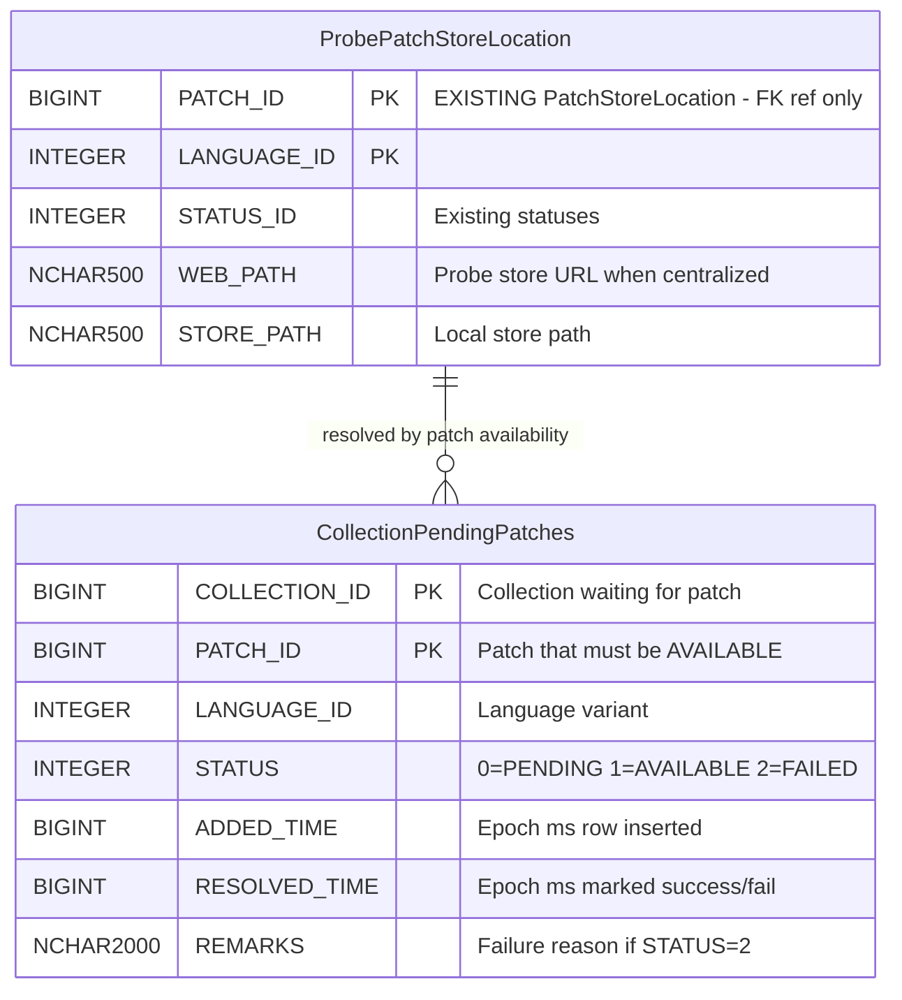

# Centralized Patch Download — Low-Level Design

> **Version:** 3.1 | **Date:** 2026-04-16
> **Product:** ManageEngine Endpoint Central
> **Scope:** REST APIs, DB Schema (ER Diagrams), Meta File Structures
> **Parent Design:** [`system-design.md`](system-design.md) · [`high-level-design.md`](high-level-design.md) · [`implementation-tasks.md`](implementation-tasks.md)
> **PoC Evidence:** [`poc-proven-report.md`](poc-proven-report.md) · [`poc5-proof.md`](poc5-proof.md)

---

## Table of Contents

1. [REST APIs](#1-rest-apis)
   - 1.1 [URL Convention & Auth](#11-url-convention--auth)
   - 1.2 [Settings APIs](#12-settings-apis)
   - 1.3 [Probe → SS APIs (via PushToSummaryProcessor)](#13-probe--ss-apis-via-pushtosummaryprocessor)
   - 1.4 [Patch Store APIs (SS Admin)](#14-patch-store-apis-ss-admin)
   - 1.5 [Dependency Package APIs (SS Admin)](#15-dependency-package-apis-ss-admin)
   - 1.6 [Monitoring & Admin APIs](#16-monitoring--admin-apis)
   - 1.7 [Nginx Auth Servlets](#17-nginx-auth-servlets)
   - 1.8 [SS → Probe Events](#18-ss--probe-events)
2. [DB Schema](#2-db-schema)
   - 2.1 [ER Diagram — SS Tables](#21-er-diagram--ss-tables)
   - 2.2 [ER Diagram — Probe Tables](#22-er-diagram--probe-tables)
   - 2.3 [Table Definitions](#23-table-definitions)
     - 2.3.10 [CollectionPendingPatches (Probe â€" New)](#2310-collectionpendingpatches-probe--new)
     - 2.3.11 [OnDemandPollingScheduler (Probe â€" Not a Table)](#2311-ondemandpollingscheduler-probe--not-a-table)
   - 2.4 [Status Enumerations](#24-status-enumerations)
   - 2.5 [Probe-Side DB Params (Cached from SS)](#25-probe-side-db-params-cached-from-ss)
   - 2.6 [Table Summary — New vs Reused](#26-table-summary--new-vs-reused)
   - 2.7 [Design Decisions Log](#27-design-decisions-log)
3. [Meta File Structures](#3-meta-file-structures)
   - 3.1 [Common Store Directory Layout](#31-common-store-directory-layout)
   - 3.2 [Meta Files Location (client-data)](#32-meta-files-location-client-data)
   - 3.3 [XML Schemas & Samples](#33-xml-schemas--samples)
   - 3.4 [File Naming Conventions](#34-file-naming-conventions)
   - 3.5 [What Lives Where — Summary](#35-what-lives-where--summary)

---

## 1. REST APIs

### 1.1 URL Convention & Auth

**Base path:** All centralized download APIs use `/dcapi/centralizedDownload`. Registered in `SSJerseyControllerSupplier.dcAPISummaryJerseyControllers()` and `security-onpremise-server-ss.xml`.

**Auth patterns:**

| Caller | Auth Mechanism | Headers |
|--------|---------------|---------|
| **SS Admin (browser)** | Session cookie + CSRF | Standard DC session auth |
| **Probe → SS** | API key headers | `SUMMARY_API_KEY`, `PROBE_ID`, `HS_KEY`, `PROBE_NAME`, `SUMMARY_SERVER_REQUEST`, `USER_DOMAIN` |
| **DS/Agent → Probe Nginx** | `auth_request` subrequest | Agent.key / basic auth validated by Probe servlet |
| **Probe → SS Nginx** | `auth_request` subrequest | `SUMMARY_API_KEY`, `PROBE_ID`, `HS_KEY` validated by SS servlet |

**Probe → SS Auth Header Details:**

| Header | Source | Purpose |
|--------|--------|---------|
| `SUMMARY_API_KEY` | `SUMMARYSERVERAPIKEYDETAILS` (Base64-decoded) | Primary auth token |
| `PROBE_ID` | `SUMMARYSERVERAPIKEYDETAILS` | Identifies calling Probe |
| `PROBE_NAME` | `ProbeDetailsUtil.getProbeName()` | Logging |
| `HS_KEY` | `ProbeAuthUtil.getProbeHandShakekey()` | Rotating session key |
| `SUMMARY_SERVER_REQUEST` | `"true"` | Distinguishes inter-server from browser |
| `USER_DOMAIN` | `encrypt(userName + "::" + domainName, summaryApiKey)` | Encrypted user context |

---

### 1.2 Settings APIs

#### GET `/dcapi/centralizedDownload`

Returns current centralized download settings from SS.

**Auth:** SS Admin session

**Response `200 OK`:**

```json
{
    "centralizedDownloadEnabled": false,
    "commonStorePath": "F:\\PatchStore",
    "downloadMissingForced": true,
    "downloadCriteria": 0,
    "patchDistributionMethod": 0,
    "fallbackToVendor": false,
    "cleanupGracePeriodMinutes": 30,
    "onDemandTimeoutMinutes": 60,
    "nginxCacheSizeMB": 5120,
    "lastModifiedTime": 1713168000000,
    "lastModifiedBy": 2
}
```

| Field | Type | Values |
|-------|------|--------|
| `downloadCriteria` | int | `0` = All missing patches, `1` = All approved missing patches |
| `patchDistributionMethod` | int | `0` = Probe copies from network storage, `1` = Machines access directly (UI-only) |

---

#### PUT `/dcapi/centralizedDownload`

Updates settings. When enabling, persists `CENTRALIZED_DOWNLOAD_ENABLED = TRUE` and pushes `CENTRALIZED_DL_SETTINGS_CHANGED` event to all Probes.

**Auth:** SS Admin session

**Request:**

```json
{
    "centralizedDownloadEnabled": true,
    "commonStorePath": "F:\\PatchStore",
    "downloadCriteria": 0,
    "patchDistributionMethod": 0,
    "fallbackToVendor": true,
    "cleanupGracePeriodMinutes": 30,
    "onDemandTimeoutMinutes": 60,
    "nginxCacheSizeMB": 5120
}
```

**Response `200 OK`:**

```json
{
    "status": "success",
    "message": "Settings updated successfully",
    "eventPushed": true
}
```

**Response `400 Bad Request`:** (validation failure)

```json
{
    "status": "error",
    "errorCode": "STORE_PATH_INVALID",
    "message": "Common store path is not writable or does not have sufficient space"
}
```

**Side effects:**
- Persists settings to `CentralizedDownloadSettings` table
- Pushes `CENTRALIZED_DL_SETTINGS_CHANGED` event to all Probes via `SummaryEventDataHandler`
- Probes update cached DB params via `SyMUtil.updateSyMParameter()`

---

#### POST `/dcapi/centralizedDownload/validateStore`

Dry-run validation of a proposed store path — checks writable + sufficient disk space on SS. Does not persist.

**Auth:** SS Admin session

**Request:**

```json
{
    "commonStorePath": "F:\\PatchStore"
}
```

**Response `200 OK`:**

```json
{
    "valid": true,
    "totalSpaceGB": 500,
    "freeSpaceGB": 320,
    "writable": true
}
```

**Response `200 OK`:** (validation failed — not an HTTP error)

```json
{
    "valid": false,
    "reason": "INSUFFICIENT_SPACE",
    "message": "Free space 2 GB is below minimum required 10 GB"
}
```

> **Prerequisite:** Common store access from all Probes is validated separately — admin must ensure all Probes have file-level access before enabling. No runtime Probe validation from this endpoint.

---

### 1.3 Probe → SS APIs (via PushToSummaryProcessor)

> These endpoints are called by Probes via `PushToSummaryProcessor` (push-to-summary queue, DB-backed, async). Auth: Probe API key headers.

#### POST `/dcapi/centralizedDownload/onDemandRequest`

Probe requests priority download of missing patches for a deployment. SS dedup-checks, queues for priority download, tracks per-patch completion.

**Auth:** Probe API key headers

**Request:**

```json
{
    "patchIds": [101, 102, 103],
    "collectionId": 12345,
    "probeId": 1001,
    "requestTime": 1740000000000
}
```

**Response `200 OK`:**

```json
{
    "requestId": 5678,
    "accepted": [101, 103],
    "alreadyAvailable": [102],
    "estimatedTimeMinutes": 5
}
```

| Response Field | Description |
|----------------|-------------|
| `requestId` | Auto-generated ID in `OnDemandDownloadRequest` table |
| `accepted` | Patch IDs queued for priority download (not yet in common store) |
| `alreadyAvailable` | Patch IDs already `STATUS=AVAILABLE` in `PatchStoreLocation` (SS) |
| `estimatedTimeMinutes` | Rough ETA based on queue depth and avg download time |

**SS processing:**
1. Check `PatchStoreLocation` (SS) → split `accepted` vs `alreadyAvailable`
2. Build `DownloadOptions` with `collectionId` → `calculatePriority()` returns `true` → queued ahead of bulk
3. Insert into `OnDemandDownloadRequest` + `OnDemandPatchRequest` (per-patch dedup)
4. After each patch download completes or fails:
   - Update `PatchStoreLocation` (SS) (`STATUS = AVAILABLE` or `FAILED`)
   - On failure: write `.patch-status/{patchId}_{langId}.failed` marker
   - Push `PATCH_STORE_UPDATED` or `ON_DEMAND_DOWNLOAD_FAILED` event to Probe

---

#### POST `/dcapi/centralizedDownload/dependencyPackages`

Probe forwards dependency package metadata (RPM/DEB info) to SS. SS dedup-inserts into `PACKAGEINFO` and triggers `SSDependencyDownloadTask`.

**Auth:** Probe API key headers

**Request:**

```json
{
    "probeId": 1001,
    "packages": [
        {
            "packageId": 1,
            "productId": 300180,
            "packageName": "iputils-ping_20190709-3ubuntu1_amd64.deb",
            "checksum": "ce08339e42c42bd624113b5cbf33110797e0241bdb3e3b65c5fb7bb058bf7be0",
            "checksumType": "sha256",
            "downloadUrl": "http://archive.ubuntu.com/ubuntu/pool/main/i/iputils/iputils-ping_20190709-3ubuntu1_amd64.deb",
            "osFlavor": "ubuntu"
        }
    ]
}
```

**Response `200 OK`:**

```json
{
    "status": "success",
    "inserted": 1,
    "duplicatesSkipped": 0
}
```

**Side effects:** SS dedup-inserts into `PACKAGEINFO`, triggers `SSDependencyDownloadTask` to download packages into `{commonStore}/linux/{flavor}-dependencies/`.

---

#### POST `/dcapi/centralizedDownload/redhatCert`

Probe forwards a RedHat mTLS certificate ZIP (client.pem, client-key.pem, ca.pem) + metadata to SS for Red Hat CDN authentication.

**Auth:** Probe API key headers
**Content-Type:** `multipart/form-data` (via `MultiPartUtilImpl`)

**Request (multipart):**

| Part | Type | Description |
|------|------|-------------|
| `certFile` | Binary (ZIP) | Archive containing `client.pem`, `client-key.pem`, `ca.pem` |
| `edition` | Text | `Server` / `Workstation` / `Desktop` |
| `probeId` | Text | Source Probe ID |
| `certExpiry` | Text | ISO-8601 certificate expiry date |

**Response `200 OK`:**

```json
{
    "status": "success",
    "edition": "Server",
    "keystoreAlias": "patch_keystore_server",
    "message": "RedHat certificate stored successfully"
}
```

**SS processing:**
1. Extract ZIP to SS disk
2. Import certs into PKCS12 keystore via `PatchKeystoreService.saveKeystore()`
3. UPSERT `SSRedhatCertDetails` by `EDITION` (unique constraint)
4. Store keystore password in `PatchKeystoreDetails`

---

#### POST `/dcapi/centralizedDownload/suseKeys`

Probe forwards SUSE registration codes (product keys) to SS. SS stores in `SuseProductKeys` and runs `SuseAuthtokenTask` to fetch auth tokens from `scc.suse.com`.

**Auth:** Probe API key headers

**Request:**

```json
{
    "probeId": 1001,
    "customerId": 5001,
    "keys": [
        {
            "productKey": "XXXX-XXXX-XXXX-XXXX",
            "osEdition": "server",
            "customerId": 5001
        },
        {
            "productKey": "YYYY-YYYY-YYYY-YYYY",
            "osEdition": "desktop",
            "customerId": 5001
        }
    ]
}
```

**Response `200 OK`:**

```json
{
    "status": "success",
    "inserted": 1,
    "updated": 1,
    "deleted": 0
}
```

**Dedup logic:** UPSERT by `(PRODUCT_KEY, CUSTOMER_ID)`. Probe sends full key list — SS removes keys not in the list for that customer.

**Side effects:** After storing keys, SS runs `SuseAuthtokenTask` to fetch auth tokens from `scc.suse.com` → stores in `SuseAuthTokens`. Tokens consumed by `SuseSettingsUtil.appendSUSEToken()` at download time.

---

#### POST `/dcapi/centralizedDownload/upload`

Accepts multipart upload (binary + metadata); stores in common store, updates `PatchStoreLocation` (SS), validates checksum, broadcasts `PATCH_UPLOAD_STATUS` event. Also used by Probe's `ProbeUploadForwarder` to forward admin uploads.

**Auth:** Probe API key headers
**Content-Type:** `multipart/form-data`

**Request (multipart):**

| Part | Type | Description |
|------|------|-------------|
| `file` | Binary | Patch binary file |
| `patchId` | Text | Patch identifier |
| `languageId` | Text | Language variant (`1` = English, `0` = all languages) |
| `fileName` | Text | Target file name in common store |
| `checksum` | Text | Expected SHA256 checksum |
| `probeId` | Text | Source Probe ID |

**Response `200 OK`:**

```json
{
    "status": "success",
    "patchId": 400010,
    "storedAs": "400010-custom-patch.exe",
    "checksumValid": true
}
```

**Response `400 Bad Request`:**

```json
{
    "status": "error",
    "errorCode": "CHECKSUM_MISMATCH",
    "message": "Uploaded file checksum does not match expected value"
}
```

**Side effects:**
- Stores binary in `{commonStore}/{fileName}`
- Updates `PatchStoreLocation` (SS) with `STATUS=AVAILABLE`
- Broadcasts `PATCH_UPLOAD_STATUS` event to all Probes

---

### 1.4 Patch Store APIs (SS Admin)

#### POST `/dcapi/centralizedDownload/patches/redownload`

Re-triggers `SSPatchDownloadService` for selected patch IDs.

**Auth:** SS Admin session

**Request:**

```json
{
    "patchIds": [101, 205, 310]
}
```

**Response `200 OK`:**

```json
{
    "status": "success",
    "requeued": 3,
    "message": "3 patches queued for re-download"
}
```

**Side effects:**
- Resets `PatchStoreLocation.STATUS (SS)` to `QUEUED` for each patch
- Deletes any existing `.patch-status/{patchId}_{langId}.failed` markers
- Queues patches in `ss-patch-download-data` for download

---

#### DELETE `/dcapi/centralizedDownload/patches`

Initiates soft-delete for selected patch IDs. Physical deletion handled by `DeferredCleanupTask` after grace period.

**Auth:** SS Admin session

**Request:**

```json
{
    "patchIds": [101, 205]
}
```

**Response `200 OK`:**

```json
{
    "status": "success",
    "markedForDeletion": 2,
    "gracePeriodMinutes": 30,
    "message": "2 patches marked for deletion. Physical removal after 30 minutes."
}
```

**Side effects:**
- Sets `PatchStoreLocation.STATUS (SS) = PENDING_DELETE` (4)
- Sets `PatchStoreLocation.PENDING_DELETE_AT` to current epoch ms
- `DeferredCleanupTask` physically deletes after `CLEANUP_GRACE_PERIOD_MINUTES`
- After physical deletion: updates `deleted-patches.xml`, broadcasts `PATCH_STORE_UPDATED` event

---

### 1.5 Dependency Package APIs (SS Admin)

#### POST `/dcapi/centralizedDownload/dependency/redownload`

Re-triggers `SSDependencyDownloadTask` for selected package IDs.

**Auth:** SS Admin session

**Request:**

```json
{
    "packageIds": [1, 2, 3]
}
```

**Response `200 OK`:**

```json
{
    "status": "success",
    "requeued": 3
}
```

---

#### DELETE `/dcapi/centralizedDownload/dependency`

Deletes selected dependency packages from the common store.

**Auth:** SS Admin session

**Request:**

```json
{
    "packageIds": [1, 2]
}
```

**Response `200 OK`:**

```json
{
    "status": "success",
    "deleted": 2
}
```

---

### 1.6 Monitoring & Admin APIs

#### GET `/dcapi/centralizedDownload/stats`

Returns common store statistics.

**Auth:** SS Admin session

**Response `200 OK`:**

```json
{
    "totalPatches": 1250,
    "byStatus": {
        "QUEUED": 15,
        "DOWNLOADING": 3,
        "AVAILABLE": 1200,
        "FAILED": 12,
        "PENDING_DELETE": 8,
        "DELETED": 12
    },
    "totalFileSizeBytes": 53687091200,
    "totalFileSizeFormatted": "50.0 GB",
    "diskUsage": {
        "totalSpaceGB": 500,
        "freeSpaceGB": 320,
        "usedByStoreGB": 50
    }
}
```

---

#### GET `/dcapi/centralizedDownload/probeStatus`

Returns per-Probe sync and connectivity status.

**Auth:** SS Admin session

**Response `200 OK`:**

```json
{
    "probes": [
        {
            "probeId": 1001,
            "probeName": "Probe-US-East",
            "lastEventDeliveryTime": 1713168000000,
            "pendingEventCount": 0,
            "online": true,
            "commonStoreAccessible": true
        },
        {
            "probeId": 1002,
            "probeName": "Probe-EU-West",
            "lastEventDeliveryTime": 1713167000000,
            "pendingEventCount": 3,
            "online": true,
            "commonStoreAccessible": true
        }
    ]
}
```

---

#### GET `/dcapi/centralizedDownload/status/{collectionId}`

Returns deployment status including pending patches, their SS download status, and available admin actions.

**Auth:** SS Admin session

**Response `200 OK`:** (when `WAITING_FOR_SS_DOWNLOAD`)

```json
{
    "collectionId": 12345,
    "status": "WAITING_FOR_SS_DOWNLOAD",
    "statusCode": 502,
    "waitingSince": "2026-03-20T10:24:00Z",
    "timeoutAt": "2026-03-20T10:54:00Z",
    "patchesRequired": 3,
    "patchesAvailableOnSS": 1,
    "patchesPendingDownload": 2,
    "pendingPatches": [
        {
            "patchId": 102,
            "fileName": "KB5034441.msu",
            "sizeMB": 1627,
            "ssDownloadStatus": "DOWNLOADING",
            "retryCount": 0
        },
        {
            "patchId": 103,
            "fileName": "KB5034442.msu",
            "sizeMB": 50,
            "ssDownloadStatus": "QUEUED",
            "retryCount": 0
        }
    ],
    "actions": ["RETRY_ON_DEMAND", "FALLBACK_TO_VENDOR", "CANCEL_DEPLOYMENT"]
}
```

**Response `200 OK`:** (when `PARTIALLY_DEPLOYED`)

```json
{
    "collectionId": 12346,
    "status": "PARTIALLY_DEPLOYED",
    "statusCode": 503,
    "deployedPatches": 5,
    "remainingPatches": 2,
    "pendingPatches": [
        {
            "patchId": 205,
            "fileName": "update-205.rpm",
            "sizeMB": 85,
            "ssDownloadStatus": "AVAILABLE",
            "retryCount": 0
        }
    ],
    "actions": ["RETRY_ON_DEMAND", "FALLBACK_TO_VENDOR"]
}
```

---

#### POST `/dcapi/centralizedDownload/fallbackToVendor/{collectionId}`

Forces a stuck collection (status 502/503) to bypass SS and fall back to direct vendor download.

**Auth:** SS Admin session

**Response `200 OK`:**

```json
{
    "status": "success",
    "collectionId": 12345,
    "message": "Collection switched to vendor download fallback"
}
```

**Response `400 Bad Request`:**

```json
{
    "status": "error",
    "errorCode": "INVALID_STATE",
    "message": "Collection 12345 is not in WAITING_FOR_SS_DOWNLOAD or PARTIALLY_DEPLOYED state"
}
```

---

### 1.7 Nginx Auth Servlets

> These are **not** REST APIs — they are mapped as servlets for Nginx `auth_request` subrequests. They return only HTTP status codes (no response body).

#### Probe-side: `GET /common-store-auth`

Nginx `auth_request` handler on Probe's `/store/` location. Validates DS/Agent credentials.

| Aspect | Detail |
|--------|--------|
| **Location** | Probe |
| **Triggered by** | Nginx `auth_request` subrequest when DS/Agent requests `/store/{file}` |
| **Validates** | Agent.key / basic auth credentials from the original request |
| **Returns** | `200` (allow download) or `401` (deny) |
| **Implementation** | Servlet registered in Probe's `web.xml`, not a Jersey resource |

#### SS-side: `GET /common-store-auth`

Nginx `auth_request` handler on SS `/common-store/` location. Validates Probe credentials for fallback requests.

| Aspect | Detail |
|--------|--------|
| **Location** | SS |
| **Triggered by** | Nginx `auth_request` subrequest when Probe requests `/common-store/{file}` |
| **Validates** | `SUMMARY_API_KEY`, `PROBE_ID`, `HS_KEY` headers against `SUMMARYSERVERAPIKEYDETAILS` |
| **Returns** | `200` (allow) or `401` (deny) |
| **Implementation** | `SSStoreAuthValidator` servlet |

---

### 1.8 SS → Probe Events

Push events sent from SS to Probes via `SummaryEventDataHandler`. These use the existing SS→Probe event infrastructure (`SUMMARYEVENTDATA` → per-probe queues → HTTPS POST to Probe).

```
SS: SummaryEventDataHandler.storeEventData(eventCode, isAllProbes, reqJSON)
  → SUMMARYEVENTDATA table (encrypted JSON)
  → Per-probe queues: push-to-probe-{N}
  → PushToProbeProcessor → HTTPS POST to Probe
  → Probe: SummaryEventDataValidator → PatchStoreEventDataProcessor
```

#### Event: `PATCH_STORE_UPDATED`

| Aspect | Detail |
|--------|--------|
| **Direction** | SS → Specific Probe(s) (on-demand) or SS → All Probes (bulk/cleanup) |
| **Trigger** | On-demand download completes for a patch / Bulk batch completes / Deferred cleanup deletes files |
| **Purpose** | Probes check for waiting/partial collections that can now resume |

**Targeted payload (on-demand):**

```json
{
    "eventCode": "PATCH_STORE_UPDATED",
    "type": "ON_DEMAND_COMPLETE",
    "patchIds": [101],
    "collectionId": 12345,
    "probeId": 1001,
    "timestamp": 1740000300000
}
```

**Broadcast payload (bulk download):**

```json
{
    "eventCode": "PATCH_STORE_UPDATED",
    "type": "BULK_DOWNLOAD_COMPLETE",
    "patchIds": [201, 202, 203, 204, 205],
    "timestamp": 1740014400000
}
```

**Broadcast payload (cleanup deletion):**

```json
{
    "eventCode": "PATCH_STORE_UPDATED",
    "type": "PATCHES_DELETED",
    "patchIds": [50, 51],
    "timestamp": 1740014500000
}
```

---

#### Event: `ON_DEMAND_DOWNLOAD_FAILED`

| Aspect | Detail |
|--------|--------|
| **Direction** | SS → Specific Probe(s) |
| **Trigger** | On-demand download fails after 3 retries |
| **Purpose** | Probe falls back to vendor (if enabled) or marks collection as `DOWNLOAD_FAILED` |

**Payload:**

```json
{
    "eventCode": "ON_DEMAND_DOWNLOAD_FAILED",
    "patchIds": [101],
    "collectionId": 12345,
    "probeId": 1001,
    "failureReason": "Checksum mismatch after 3 retries",
    "timestamp": 1740000600000
}
```

---

#### Event: `CENTRALIZED_DL_SETTINGS_CHANGED`

| Aspect | Detail |
|--------|--------|
| **Direction** | SS → All Probes |
| **Trigger** | Admin enables/disables or changes settings |
| **Purpose** | Probes update cached DB params via `SyMUtil.updateSyMParameter()` |

**Payload:**

```json
{
    "eventCode": "CENTRALIZED_DL_SETTINGS_CHANGED",
    "settings": {
        "centralizedDownloadEnabled": true,
        "commonStorePath": "F:\\PatchStore",
        "fallbackToVendor": true,
        "onDemandTimeoutMinutes": 60,
        "nginxCacheSizeMB": 5120,
        "downloadCriteria": 0
    },
    "timestamp": 1740000000000
}
```

---

#### Event: `PATCH_UPLOAD_STATUS`

| Aspect | Detail |
|--------|--------|
| **Direction** | SS → All Probes |
| **Trigger** | Patch uploaded to SS (directly or forwarded from Probe) |
| **Purpose** | Probes update local metadata for patch availability |

**Payload:**

```json
{
    "eventCode": "PATCH_UPLOAD_STATUS",
    "patchId": 400010,
    "languageId": 1,
    "fileName": "400010-custom-patch.exe",
    "status": "AVAILABLE",
    "timestamp": 1740001000000
}
```

---

## 2. DB Schema

> **Reconciliation note:** This schema is the **source of truth** — it reconciles discrepancies between `system-design.md` (conceptual spec) and the original `low-level-design.md` (initial technical spec). Where the two disagree, this document records the decision and rationale.

### 2.1 ER Diagram â€" SS Tables

> **Note:** `ProbeDetails` and `CustomerInfo` are **existing tables** — included here only to show FK relationships. Their full schemas are not redefined; only PK columns used as FK targets are shown.

```mermaid
erDiagram
    %% ── NEW TABLES ────────────────────────────────────────

    CentralizedDownloadSettings {
        BIGINT SETTINGS_ID PK "Always 1 singleton"
        BOOLEAN CENTRALIZED_DOWNLOAD_ENABLED "Default false"
        NCHAR500 COMMON_STORE_PATH "Absolute path on SS disk"
        INTEGER DOWNLOAD_CRITERIA "0=All missing 1=Approved"
        INTEGER PATCH_DISTRIBUTION_METHOD "0=Probe copies 1=Direct"
        BOOLEAN FALLBACK_TO_VENDOR "Default false"
        INTEGER CLEANUP_GRACE_PERIOD_MINUTES "Default 30"
        INTEGER ON_DEMAND_TIMEOUT_MINUTES "Default 60"
        BIGINT NGINX_CACHE_SIZE_MB "Default 5120"
        BIGINT CREATED_TIME "Epoch ms first configured"
        BIGINT LAST_MODIFIED_TIME "Epoch ms"
        BIGINT LAST_MODIFIED_BY "FK to user"
    }

    PatchStoreLocation {
        BIGINT PATCH_ID PK
        INTEGER LANGUAGE_ID "1=English 0=all languages"
        INTEGER STATUS "0-5 lifecycle states"
        NCHAR500 FILE_NAME "Physical file name"
        NCHAR500 WEB_PATH "SS-internal relative URL"
        BIGINT FILE_SIZE "Bytes"
        CHAR128 CHECKSUM_VAL "SHA256 hash"
        CHAR20 CHECKSUM_TYPE "SHA256 or MD5"
        BIGINT CREATED_TIME "Epoch ms row inserted"
        BIGINT DOWNLOAD_TIME "Epoch ms download completed"
        BIGINT LAST_STATUS_CHANGE_TIME "Epoch ms"
        BIGINT PENDING_DELETE_AT "Epoch ms"
        INTEGER RETRY_COUNT "Default 0"
        NCHAR2000 REMARKS "Failure reason"
    }

    OnDemandDownloadRequest {
        BIGINT REQUEST_ID PK "Auto-generated"
        BIGINT PROBE_ID FK "FK to ProbeDetails"
        BIGINT COLLECTION_ID "-1 if non-collection"
        BIGINT REQUEST_TIME "Epoch ms"
        BIGINT REQUEST_DEADLINE "requestTime plus timeout"
        INTEGER STATUS "0-4 lifecycle states"
        BIGINT COMPLETION_TIME "Epoch ms"
        INTEGER TOTAL_PATCHES "Denormalized counter"
        INTEGER COMPLETED_PATCHES "Denormalized counter"
        INTEGER FAILED_PATCHES "Denormalized counter"
    }

    OnDemandPatchRequest {
        BIGINT REQUEST_ID PK "FK to OnDemandDownloadRequest"
        BIGINT PATCH_ID PK
        BIGINT PROBE_ID FK "FK to ProbeDetails"
        BIGINT COLLECTION_ID "Associated collection"
        INTEGER LANGUAGE_ID "Language variant for file resolution"
        INTEGER STATUS "0-4 lifecycle states"
        BIGINT COMPLETION_TIME "Epoch ms"
        BOOLEAN EVENT_PUSHED "Default false"
    }

    SSRedhatCertDetails {
        BIGINT ID PK "Auto-generated"
        NCHAR50 EDITION UK "Server Workstation Desktop"
        BIGINT SOURCE_PROBE_ID FK "FK to ProbeDetails"
        CHAR100 KEYSTORE_ALIAS "PKCS12 alias"
        CHAR50 CLIENT_CERT "client.pem filename"
        CHAR50 CLIENT_KEY "client-key.pem filename"
        CHAR50 CA_CERT "ca.pem filename"
        NCHAR200 ZIP_FILE_NAME "Cert ZIP on disk"
        TIMESTAMP CERT_EXPIRY "Cert expiry date"
        BOOLEAN IS_VALID "Default true"
        BIGINT UPLOAD_TIME "Epoch ms received"
        BIGINT LAST_SYNCED "Epoch ms last sync"
        CHAR100 CHECKSUM "ZIP hash for dedup"
    }

    SuseProductKeys {
        BIGINT KEY_ID PK "Auto-generated"
        BIGINT CUSTOMER_ID FK "FK to CustomerInfo"
        NCHAR100 OS_EDITION "desktop or server"
        SCHAR500 PRODUCT_KEY "Encrypted"
        INTEGER IS_VALID "0=invalid 1=valid"
    }

    SuseAuthTokens {
        BIGINT TOKEN_ID PK "Auto-generated"
        BIGINT CUSTOMER_ID FK "FK to CustomerInfo"
        NCHAR500 REPO_NAME "SUSE repo base URL"
        SCHAR1000 AUTH_TOKEN "Encrypted token"
    }

    PatchKeystoreDetails {
        CHAR100 ALIAS PK "e.g. patch_keystore_server"
        NCHAR500 PATH "Directory on disk"
        SCHAR500 PASSWORD "AES-encrypted"
        CHAR20 TYPE "Always PKCS12"
        BIGINT CUSTOMER_ID
    }

    %% ── EXISTING TABLES (shown for FK reference only) ─────
    %% Full schema defined in existing data-dictionary-ss.xml
    %% Only PK columns shown here

    ProbeDetails {
        BIGINT PROBE_ID PK "EXISTING - FK reference only"
        CHAR250 PROBE_NAME "Probe name"
        CHAR250 PROBE_DESCRIPTION "nullable"
    }

    CustomerInfo {
        BIGINT CUSTOMER_ID PK "EXISTING - FK reference only"
        NCHAR250 CUSTOMER_NAME "NOT NULL"
        NCHAR250 CUSTOMER_EMAIL "nullable"
        NCHAR250 ACCOUNT_HEAD_NAME "default --"
        CHAR50 TIMEZONE "nullable"
        BOOLEAN IS_CUSTOM_LOGO_ENABLE "default false"
        BIGINT ADDED_TIME "default 0"
        BIGINT UPDATED_TIME "default 0"
        BIGINT SCOPE "default 1"
    }

    %% ── RELATIONSHIPS ──────────────────────────────────────

    OnDemandDownloadRequest ||--o{ OnDemandPatchRequest : "has patches"
    ProbeDetails ||--o{ OnDemandDownloadRequest : "sends requests"
    ProbeDetails ||--o{ OnDemandPatchRequest : "tracks per-probe"
    ProbeDetails ||--o{ SSRedhatCertDetails : "forwards certs"
    CustomerInfo ||--o{ SuseProductKeys : "owns keys"
    CustomerInfo ||--o{ SuseAuthTokens : "owns tokens"
```



### 2.2 ER Diagram — Probe Tables



