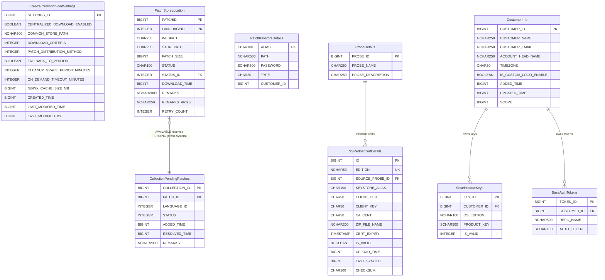
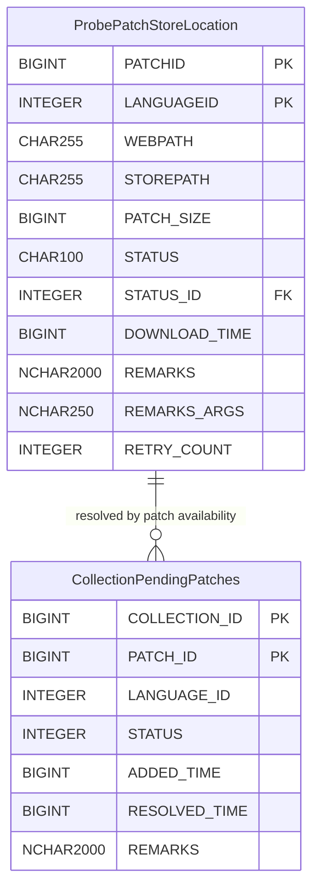

# Centralized Patch Download — Low-Level Design

> **Version:** 3.1 | **Date:** 2026-04-16
> **Product:** ManageEngine Endpoint Central
> **Scope:** REST APIs, DB Schema (ER Diagrams), Meta File Structures
> **Parent Design:** [`system-design.md`](system-design.md) · [`high-level-design.md`](high-level-design.md) · [`implementation-tasks.md`](implementation-tasks.md)
> **PoC Evidence:** [`poc-proven-report.md`](poc-proven-report.md) · [`poc5-proof.md`](poc5-proof.md)

---

## Table of Contents

1. [REST APIs](#1-rest-apis)
   - 1.1 [URL Convention & Auth](#11-url-convention--auth)
   - 1.2 [Settings APIs](#12-settings-apis)
   - 1.3 [Probe → SS APIs (via PushToSummaryProcessor)](#13-probe--ss-apis-via-pushtosummaryprocessor)
   - 1.4 [Patch Store APIs (SS Admin)](#14-patch-store-apis-ss-admin)
   - 1.5 [Dependency Package APIs (SS Admin)](#15-dependency-package-apis-ss-admin)
   - 1.6 [Monitoring & Admin APIs](#16-monitoring--admin-apis)
   - 1.7 [Nginx Auth Servlets](#17-nginx-auth-servlets)
   - 1.8 [SS → Probe Events](#18-ss--probe-events)
2. [DB Schema](#2-db-schema)
   - 2.1 [ER Diagram — SS Tables](#21-er-diagram--ss-tables)
   - 2.2 [ER Diagram — Probe Tables](#22-er-diagram--probe-tables)
   - 2.3 [Table Definitions](#23-table-definitions)
     - 2.3.10 [CollectionPendingPatches (Probe â€" New)](#2310-collectionpendingpatches-probe--new)
     - 2.3.11 [OnDemandPollingScheduler (Probe â€" Not a Table)](#2311-ondemandpollingscheduler-probe--not-a-table)
   - 2.4 [Status Enumerations](#24-status-enumerations)
   - 2.5 [Probe-Side DB Params (Cached from SS)](#25-probe-side-db-params-cached-from-ss)
   - 2.6 [Table Summary — New vs Reused](#26-table-summary--new-vs-reused)
   - 2.7 [Design Decisions Log](#27-design-decisions-log)
3. [Meta File Structures](#3-meta-file-structures)
   - 3.1 [Common Store Directory Layout](#31-common-store-directory-layout)
   - 3.2 [Meta Files Location (client-data)](#32-meta-files-location-client-data)
   - 3.3 [XML Schemas & Samples](#33-xml-schemas--samples)
   - 3.4 [File Naming Conventions](#34-file-naming-conventions)
   - 3.5 [What Lives Where — Summary](#35-what-lives-where--summary)

---

## 1. REST APIs

### 1.1 URL Convention & Auth

**Base path:** All centralized download APIs use `/dcapi/centralizedDownload`. Registered in `SSJerseyControllerSupplier.dcAPISummaryJerseyControllers()` and `security-onpremise-server-ss.xml`.

**Auth patterns:**

| Caller | Auth Mechanism | Headers |
|--------|---------------|---------|
| **SS Admin (browser)** | Session cookie + CSRF | Standard DC session auth |
| **Probe → SS** | API key headers | `SUMMARY_API_KEY`, `PROBE_ID`, `HS_KEY`, `PROBE_NAME`, `SUMMARY_SERVER_REQUEST`, `USER_DOMAIN` |
| **DS/Agent → Probe Nginx** | `auth_request` subrequest | Agent.key / basic auth validated by Probe servlet |
| **Probe → SS Nginx** | `auth_request` subrequest | `SUMMARY_API_KEY`, `PROBE_ID`, `HS_KEY` validated by SS servlet |

**Probe → SS Auth Header Details:**

| Header | Source | Purpose |
|--------|--------|---------|
| `SUMMARY_API_KEY` | `SUMMARYSERVERAPIKEYDETAILS` (Base64-decoded) | Primary auth token |
| `PROBE_ID` | `SUMMARYSERVERAPIKEYDETAILS` | Identifies calling Probe |
| `PROBE_NAME` | `ProbeDetailsUtil.getProbeName()` | Logging |
| `HS_KEY` | `ProbeAuthUtil.getProbeHandShakekey()` | Rotating session key |
| `SUMMARY_SERVER_REQUEST` | `"true"` | Distinguishes inter-server from browser |
| `USER_DOMAIN` | `encrypt(userName + "::" + domainName, summaryApiKey)` | Encrypted user context |

---

### 1.2 Settings APIs

#### GET `/dcapi/centralizedDownload`

Returns current centralized download settings from SS.

**Auth:** SS Admin session

**Response `200 OK`:**

```json
{
    "centralizedDownloadEnabled": false,
    "commonStorePath": "F:\\PatchStore",
    "downloadMissingForced": true,
    "downloadCriteria": 0,
    "patchDistributionMethod": 0,
    "fallbackToVendor": false,
    "cleanupGracePeriodMinutes": 30,
    "onDemandTimeoutMinutes": 60,
    "nginxCacheSizeMB": 5120,
    "lastModifiedTime": 1713168000000,
    "lastModifiedBy": 2
}
```

| Field | Type | Values |
|-------|------|--------|
| `downloadCriteria` | int | `0` = All missing patches, `1` = All approved missing patches |
| `patchDistributionMethod` | int | `0` = Probe copies from network storage, `1` = Machines access directly (UI-only) |

---

#### PUT `/dcapi/centralizedDownload`

Updates settings. When enabling, persists `CENTRALIZED_DOWNLOAD_ENABLED = TRUE` and pushes `CENTRALIZED_DL_SETTINGS_CHANGED` event to all Probes.

**Auth:** SS Admin session

**Request:**

```json
{
    "centralizedDownloadEnabled": true,
    "commonStorePath": "F:\\PatchStore",
    "downloadCriteria": 0,
    "patchDistributionMethod": 0,
    "fallbackToVendor": true,
    "cleanupGracePeriodMinutes": 30,
    "onDemandTimeoutMinutes": 60,
    "nginxCacheSizeMB": 5120
}
```

**Response `200 OK`:**

```json
{
    "status": "success",
    "message": "Settings updated successfully",
    "eventPushed": true
}
```

**Response `400 Bad Request`:** (validation failure)

```json
{
    "status": "error",
    "errorCode": "STORE_PATH_INVALID",
    "message": "Common store path is not writable or does not have sufficient space"
}
```

**Side effects:**
- Persists settings to `CentralizedDownloadSettings` table
- Pushes `CENTRALIZED_DL_SETTINGS_CHANGED` event to all Probes via `SummaryEventDataHandler`
- Probes update cached DB params via `SyMUtil.updateSyMParameter()`

---

#### POST `/dcapi/centralizedDownload/validateStore`

Dry-run validation of a proposed store path — checks writable + sufficient disk space on SS. Does not persist.

**Auth:** SS Admin session

**Request:**

```json
{
    "commonStorePath": "F:\\PatchStore"
}
```

**Response `200 OK`:**

```json
{
    "valid": true,
    "totalSpaceGB": 500,
    "freeSpaceGB": 320,
    "writable": true
}
```

**Response `200 OK`:** (validation failed — not an HTTP error)

```json
{
    "valid": false,
    "reason": "INSUFFICIENT_SPACE",
    "message": "Free space 2 GB is below minimum required 10 GB"
}
```

> **Prerequisite:** Common store access from all Probes is validated separately — admin must ensure all Probes have file-level access before enabling. No runtime Probe validation from this endpoint.

---

### 1.3 Probe → SS APIs (via PushToSummaryProcessor)

> These endpoints are called by Probes via `PushToSummaryProcessor` (push-to-summary queue, DB-backed, async). Auth: Probe API key headers.

#### POST `/dcapi/centralizedDownload/onDemandRequest`

Probe requests priority download of missing patches for a deployment. SS dedup-checks, queues for priority download, tracks per-patch completion.

**Auth:** Probe API key headers

**Request:**

```json
{
    "patchIds": [101, 102, 103],
    "collectionId": 12345,
    "probeId": 1001,
    "requestTime": 1740000000000
}
```

**Response `200 OK`:**

```json
{
    "accepted": [101, 103],
    "alreadyAvailable": [102]
}
```

| Response Field | Description |
|----------------|-------------|
| `accepted` | Patch IDs bumped to priority in the SS download queue (not yet in common store) |
| `alreadyAvailable` | Patch IDs already `STATUS=AVAILABLE` in `PatchStoreLocation` (SS) |
**SS processing:**
1. Check `PatchStoreLocation` (SS) → split `accepted` vs `alreadyAvailable`
2. For `accepted`: build `DownloadOptions` with `collectionId` → `calculatePriority()` returns `true` → bumped ahead of bulk in `SSPatchDownloadService` in-memory queue
3. **No tracking rows written** -- SS does not persist the request to any table
4. After each patch download completes or fails, SS updates `PatchStoreLocation` (SS) (`STATUS = AVAILABLE` or `DLOAD_FAILED`) and writes `.patch-status/{patchId}_{langId}.failed` marker on failure
5. Probe's `OnDemandPollingScheduler` discovers completion/failure autonomously via file-system checks -- no event push required
> **Design note (2026-04-17):** `OnDemandDownloadRequest` and `OnDemandPatchRequest` tables are **eliminated**. Lifecycle tracking was removed when on-demand patch counts were dropped from the UI and the event-push model was replaced by the Probe-side polling scheduler. Status is authoritative in `PatchStoreLocation (SS)` + `.failed` markers. Timeout is enforced on the Probe via `CollectionPendingPatches.ADDED_TIME` + `ON_DEMAND_TIMEOUT_MINUTES`.---

#### POST `/dcapi/centralizedDownload/dependencyPackages`

Probe forwards dependency package metadata (RPM/DEB info) to SS. SS dedup-inserts into `PACKAGEINFO` and triggers `SSDependencyDownloadTask`.

**Auth:** Probe API key headers

**Request:**

```json
{
    "probeId": 1001,
    "packages": [
        {
            "packageId": 1,
            "productId": 300180,
            "packageName": "iputils-ping_20190709-3ubuntu1_amd64.deb",
            "checksum": "ce08339e42c42bd624113b5cbf33110797e0241bdb3e3b65c5fb7bb058bf7be0",
            "checksumType": "sha256",
            "downloadUrl": "http://archive.ubuntu.com/ubuntu/pool/main/i/iputils/iputils-ping_20190709-3ubuntu1_amd64.deb",
            "osFlavor": "ubuntu"
        }
    ]
}
```

**Response `200 OK`:**

```json
{
    "status": "success",
    "inserted": 1,
    "duplicatesSkipped": 0
}
```

**Side effects:** SS dedup-inserts into `PACKAGEINFO`, triggers `SSDependencyDownloadTask` to download packages into `{commonStore}/linux/{flavor}-dependencies/`.

---

#### POST `/dcapi/centralizedDownload/redhatCert`

Probe forwards a RedHat mTLS certificate ZIP (client.pem, client-key.pem, ca.pem) + metadata to SS for Red Hat CDN authentication.

**Auth:** Probe API key headers
**Content-Type:** `multipart/form-data` (via `MultiPartUtilImpl`)

**Request (multipart):**

| Part | Type | Description |
|------|------|-------------|
| `certFile` | Binary (ZIP) | Archive containing `client.pem`, `client-key.pem`, `ca.pem` |
| `edition` | Text | `Server` / `Workstation` / `Desktop` |
| `probeId` | Text | Source Probe ID |
| `certExpiry` | Text | ISO-8601 certificate expiry date |

**Response `200 OK`:**

```json
{
    "status": "success",
    "edition": "Server",
    "keystoreAlias": "patch_keystore_server",
    "message": "RedHat certificate stored successfully"
}
```

**SS processing:**
1. Extract ZIP to SS disk
2. Import certs into PKCS12 keystore via `PatchKeystoreService.saveKeystore()`
3. UPSERT `SSRedhatCertDetails` by `EDITION` (unique constraint)
4. Store keystore password in `PatchKeystoreDetails`

---

#### POST `/dcapi/centralizedDownload/suseKeys`

Probe forwards SUSE registration codes (product keys) to SS. SS stores in `SuseProductKeys` and runs `SuseAuthtokenTask` to fetch auth tokens from `scc.suse.com`.

**Auth:** Probe API key headers

**Request:**

```json
{
    "probeId": 1001,
    "customerId": 5001,
    "keys": [
        {
            "productKey": "XXXX-XXXX-XXXX-XXXX",
            "osEdition": "server",
            "customerId": 5001
        },
        {
            "productKey": "YYYY-YYYY-YYYY-YYYY",
            "osEdition": "desktop",
            "customerId": 5001
        }
    ]
}
```

**Response `200 OK`:**

```json
{
    "status": "success",
    "inserted": 1,
    "updated": 1,
    "deleted": 0
}
```

**Dedup logic:** UPSERT by `(PRODUCT_KEY, CUSTOMER_ID)`. Probe sends full key list — SS removes keys not in the list for that customer.

**Side effects:** After storing keys, SS runs `SuseAuthtokenTask` to fetch auth tokens from `scc.suse.com` → stores in `SuseAuthTokens`. Tokens consumed by `SuseSettingsUtil.appendSUSEToken()` at download time.

---

#### POST `/dcapi/centralizedDownload/upload`

Accepts multipart upload (binary + metadata); stores in common store, updates `PatchStoreLocation` (SS), validates checksum, broadcasts `PATCH_UPLOAD_STATUS` event. Also used by Probe's `ProbeUploadForwarder` to forward admin uploads.

**Auth:** Probe API key headers
**Content-Type:** `multipart/form-data`

**Request (multipart):**

| Part | Type | Description |
|------|------|-------------|
| `file` | Binary | Patch binary file |
| `patchId` | Text | Patch identifier |
| `languageId` | Text | Language variant (`1` = English, `0` = all languages) |
| `fileName` | Text | Target file name in common store |
| `checksum` | Text | Expected SHA256 checksum |
| `probeId` | Text | Source Probe ID |

**Response `200 OK`:**

```json
{
    "status": "success",
    "patchId": 400010,
    "storedAs": "400010-custom-patch.exe",
    "checksumValid": true
}
```

**Response `400 Bad Request`:**

```json
{
    "status": "error",
    "errorCode": "CHECKSUM_MISMATCH",
    "message": "Uploaded file checksum does not match expected value"
}
```

**Side effects:**
- Stores binary in `{commonStore}/{fileName}`
- Updates `PatchStoreLocation` (SS) with `STATUS=AVAILABLE`
- Broadcasts `PATCH_UPLOAD_STATUS` event to all Probes

---

### 1.4 Patch Store APIs (SS Admin)

#### POST `/dcapi/centralizedDownload/patches/redownload`

Re-triggers `SSPatchDownloadService` for selected patch IDs.

**Auth:** SS Admin session

**Request:**

```json
{
    "patchIds": [101, 205, 310]
}
```

**Response `200 OK`:**

```json
{
    "status": "success",
    "requeued": 3,
    "message": "3 patches queued for re-download"
}
```

**Side effects:**
- Resets `PatchStoreLocation.STATUS (SS)` to `QUEUED` for each patch
- Deletes any existing `.patch-status/{patchId}_{langId}.failed` markers
- Queues patches in `ss-patch-download-data` for download

---

#### DELETE `/dcapi/centralizedDownload/patches`

Initiates soft-delete for selected patch IDs. Physical deletion handled by `DeferredCleanupTask` after grace period.

**Auth:** SS Admin session

**Request:**

```json
{
    "patchIds": [101, 205]
}
```

**Response `200 OK`:**

```json
{
    "status": "success",
    "markedForDeletion": 2,
    "gracePeriodMinutes": 30,
    "message": "2 patches marked for deletion. Physical removal after 30 minutes."
}
```

**Side effects:**
- Sets `PatchStoreLocation.STATUS (SS) = PENDING_DELETE` (4)
- Sets `PatchStoreLocation.PENDING_DELETE_AT` to current epoch ms
- `DeferredCleanupTask` physically deletes after `CLEANUP_GRACE_PERIOD_MINUTES`
- After physical deletion: updates `deleted-patches.xml`, broadcasts `PATCH_STORE_UPDATED` event

---

### 1.5 Dependency Package APIs (SS Admin)

#### POST `/dcapi/centralizedDownload/dependency/redownload`

Re-triggers `SSDependencyDownloadTask` for selected package IDs.

**Auth:** SS Admin session

**Request:**

```json
{
    "packageIds": [1, 2, 3]
}
```

**Response `200 OK`:**

```json
{
    "status": "success",
    "requeued": 3
}
```

---

#### DELETE `/dcapi/centralizedDownload/dependency`

Deletes selected dependency packages from the common store.

**Auth:** SS Admin session

**Request:**

```json
{
    "packageIds": [1, 2]
}
```

**Response `200 OK`:**

```json
{
    "status": "success",
    "deleted": 2
}
```

---

### 1.6 Monitoring & Admin APIs

#### GET `/dcapi/centralizedDownload/stats`

Returns common store statistics.

**Auth:** SS Admin session

**Response `200 OK`:**

```json
{
    "totalPatches": 1250,
    "byStatus": {
        "QUEUED": 15,
        "DOWNLOADING": 3,
        "AVAILABLE": 1200,
        "FAILED": 12,
        "PENDING_DELETE": 8,
        "DELETED": 12
    },
    "totalFileSizeBytes": 53687091200,
    "totalFileSizeFormatted": "50.0 GB",
    "diskUsage": {
        "totalSpaceGB": 500,
        "freeSpaceGB": 320,
        "usedByStoreGB": 50
    }
}
```

---

#### GET `/dcapi/centralizedDownload/probeStatus`

Returns per-Probe sync and connectivity status.

**Auth:** SS Admin session

**Response `200 OK`:**

```json
{
    "probes": [
        {
            "probeId": 1001,
            "probeName": "Probe-US-East",
            "lastEventDeliveryTime": 1713168000000,
            "pendingEventCount": 0,
            "online": true,
            "commonStoreAccessible": true
        },
        {
            "probeId": 1002,
            "probeName": "Probe-EU-West",
            "lastEventDeliveryTime": 1713167000000,
            "pendingEventCount": 3,
            "online": true,
            "commonStoreAccessible": true
        }
    ]
}
```

---

#### GET `/dcapi/centralizedDownload/status/{collectionId}`

Returns deployment status including pending patches, their SS download status, and available admin actions.

**Auth:** SS Admin session

**Response `200 OK`:** (when `WAITING_FOR_SS_DOWNLOAD`)

```json
{
    "collectionId": 12345,
    "status": "WAITING_FOR_SS_DOWNLOAD",
    "statusCode": 502,
    "waitingSince": "2026-03-20T10:24:00Z",
    "timeoutAt": "2026-03-20T10:54:00Z",
    "patchesRequired": 3,
    "patchesAvailableOnSS": 1,
    "patchesPendingDownload": 2,
    "pendingPatches": [
        {
            "patchId": 102,
            "fileName": "KB5034441.msu",
            "sizeMB": 1627,
            "ssDownloadStatus": "DOWNLOADING",
            "retryCount": 0
        },
        {
            "patchId": 103,
            "fileName": "KB5034442.msu",
            "sizeMB": 50,
            "ssDownloadStatus": "QUEUED",
            "retryCount": 0
        }
    ],
    "actions": ["RETRY_ON_DEMAND", "FALLBACK_TO_VENDOR", "CANCEL_DEPLOYMENT"]
}
```

**Response `200 OK`:** (when `PARTIALLY_DEPLOYED`)

```json
{
    "collectionId": 12346,
    "status": "PARTIALLY_DEPLOYED",
    "statusCode": 503,
    "deployedPatches": 5,
    "remainingPatches": 2,
    "pendingPatches": [
        {
            "patchId": 205,
            "fileName": "update-205.rpm",
            "sizeMB": 85,
            "ssDownloadStatus": "AVAILABLE",
            "retryCount": 0
        }
    ],
    "actions": ["RETRY_ON_DEMAND", "FALLBACK_TO_VENDOR"]
}
```

---

#### POST `/dcapi/centralizedDownload/fallbackToVendor/{collectionId}`

Forces a stuck collection (status 502/503) to bypass SS and fall back to direct vendor download.

**Auth:** SS Admin session

**Response `200 OK`:**

```json
{
    "status": "success",
    "collectionId": 12345,
    "message": "Collection switched to vendor download fallback"
}
```

**Response `400 Bad Request`:**

```json
{
    "status": "error",
    "errorCode": "INVALID_STATE",
    "message": "Collection 12345 is not in WAITING_FOR_SS_DOWNLOAD or PARTIALLY_DEPLOYED state"
}
```

---

### 1.7 Nginx Auth Servlets

> These are **not** REST APIs — they are mapped as servlets for Nginx `auth_request` subrequests. They return only HTTP status codes (no response body).

#### Probe-side: `GET /common-store-auth`

Nginx `auth_request` handler on Probe's `/store/` location. Validates DS/Agent credentials.

| Aspect | Detail |
|--------|--------|
| **Location** | Probe |
| **Triggered by** | Nginx `auth_request` subrequest when DS/Agent requests `/store/{file}` |
| **Validates** | Agent.key / basic auth credentials from the original request |
| **Returns** | `200` (allow download) or `401` (deny) |
| **Implementation** | Servlet registered in Probe's `web.xml`, not a Jersey resource |

#### SS-side: `GET /common-store-auth`

Nginx `auth_request` handler on SS `/common-store/` location. Validates Probe credentials for fallback requests.

| Aspect | Detail |
|--------|--------|
| **Location** | SS |
| **Triggered by** | Nginx `auth_request` subrequest when Probe requests `/common-store/{file}` |
| **Validates** | `SUMMARY_API_KEY`, `PROBE_ID`, `HS_KEY` headers against `SUMMARYSERVERAPIKEYDETAILS` |
| **Returns** | `200` (allow) or `401` (deny) |
| **Implementation** | `SSStoreAuthValidator` servlet |

---

### 1.8 SS → Probe Events

Push events sent from SS to Probes via `SummaryEventDataHandler`. These use the existing SS→Probe event infrastructure (`SUMMARYEVENTDATA` → per-probe queues → HTTPS POST to Probe).

```
SS: SummaryEventDataHandler.storeEventData(eventCode, isAllProbes, reqJSON)
  → SUMMARYEVENTDATA table (encrypted JSON)
  → Per-probe queues: push-to-probe-{N}
  → PushToProbeProcessor → HTTPS POST to Probe
  → Probe: SummaryEventDataValidator → PatchStoreEventDataProcessor
```

#### Event: `PATCH_STORE_UPDATED`

| Aspect | Detail |
|--------|--------|
| **Direction** | SS → Specific Probe(s) (on-demand) or SS → All Probes (bulk/cleanup) |
| **Trigger** | On-demand download completes for a patch / Bulk batch completes / Deferred cleanup deletes files |
| **Purpose** | Probes check for waiting/partial collections that can now resume |

**Targeted payload (on-demand):**

```json
{
    "eventCode": "PATCH_STORE_UPDATED",
    "type": "ON_DEMAND_COMPLETE",
    "patchIds": [101],
    "collectionId": 12345,
    "probeId": 1001,
    "timestamp": 1740000300000
}
```

**Broadcast payload (bulk download):**

```json
{
    "eventCode": "PATCH_STORE_UPDATED",
    "type": "BULK_DOWNLOAD_COMPLETE",
    "patchIds": [201, 202, 203, 204, 205],
    "timestamp": 1740014400000
}
```

**Broadcast payload (cleanup deletion):**

```json
{
    "eventCode": "PATCH_STORE_UPDATED",
    "type": "PATCHES_DELETED",
    "patchIds": [50, 51],
    "timestamp": 1740014500000
}
```

---

#### Event: `CENTRALIZED_DL_SETTINGS_CHANGED`

| Aspect | Detail |
|--------|--------|
| **Direction** | SS → All Probes |
| **Trigger** | Admin enables/disables or changes settings |
| **Purpose** | Probes update cached DB params via `SyMUtil.updateSyMParameter()` |

**Payload:**

```json
{
    "eventCode": "CENTRALIZED_DL_SETTINGS_CHANGED",
    "settings": {
        "centralizedDownloadEnabled": true,
        "commonStorePath": "F:\\PatchStore",
        "fallbackToVendor": true,
        "onDemandTimeoutMinutes": 60,
        "nginxCacheSizeMB": 5120,
        "downloadCriteria": 0
    },
    "timestamp": 1740000000000
}
```

---

#### Event: `PATCH_UPLOAD_STATUS`

| Aspect | Detail |
|--------|--------|
| **Direction** | SS → All Probes |
| **Trigger** | Patch uploaded to SS (directly or forwarded from Probe) |
| **Purpose** | Probes update local metadata for patch availability |

**Payload:**

```json
{
    "eventCode": "PATCH_UPLOAD_STATUS",
    "patchId": 400010,
    "languageId": 1,
    "fileName": "400010-custom-patch.exe",
    "status": "AVAILABLE",
    "timestamp": 1740001000000
}
```

---

## 2. DB Schema

> **Reconciliation note:** This schema is the **source of truth** — it reconciles discrepancies between `system-design.md` (conceptual spec) and the original `low-level-design.md` (initial technical spec). Where the two disagree, this document records the decision and rationale.

### 2.1 ER Diagram â€" SS Tables

> **Note:** `ProbeDetails` and `CustomerInfo` are **existing tables** — included here only to show FK relationships. Their full schemas are not redefined; only PK columns used as FK targets are shown.



### 2.2 ER Diagram — Probe Tables



> **Note:** The actual table name on Probe is `PatchStoreLocation` — identical naming to the SS table is intentional (same conceptual role: tracks patch binary availability per host). They live in separate databases and are never joined. The diagram uses `ProbePatchStoreLocation` purely to avoid visual ambiguity in tooling that renders both ER diagrams together.

---

### 2.3 Table Definitions

#### 2.3.1 CentralizedDownloadSettings (SS — New, Singleton)

> Singleton row (`SETTINGS_ID = 1`). Stores the entire centralized download configuration. Seeded with defaults on first startup.

| Column | Type | Default | Nullable | Description |
|--------|------|---------|----------|-------------|
| **`SETTINGS_ID`** | BIGINT (PK, auto) | — | NO | Always 1 for singleton |
| `CENTRALIZED_DOWNLOAD_ENABLED` | BOOLEAN | `false` | NO | Master toggle |
| `COMMON_STORE_PATH` | NCHAR(500) | — | YES | Absolute path on SS disk |
| `DOWNLOAD_CRITERIA` | INTEGER | `0` | NO | `0`=All missing, `1`=All approved missing |
| `PATCH_DISTRIBUTION_METHOD` | INTEGER | `0` | NO | UI-only — no backend effect |
| `FALLBACK_TO_VENDOR` | BOOLEAN | `false` | NO | Probe falls back to vendor on timeout |
| `CLEANUP_GRACE_PERIOD_MINUTES` | INTEGER | `30` | NO | Grace period before physical delete |
| `ON_DEMAND_TIMEOUT_MINUTES` | INTEGER | `60` | NO | Max wait before auto-fallback |
| `NGINX_CACHE_SIZE_MB` | BIGINT | `5120` | NO | Probe-side Nginx cache size |
| `CREATED_TIME` | BIGINT | — | NO | Epoch ms first configured |
| `LAST_MODIFIED_TIME` | BIGINT | `-1` | NO | Epoch ms of last change |
| `LAST_MODIFIED_BY` | BIGINT | — | YES | User ID of last admin |

---

#### 2.3.2 PatchStoreLocation (SS — Reused from Probe)

> **Reused table** — same structure as the existing Probe-side `PatchStoreLocation` (defined in `data-dictionary.xml`, `BinaryRepository` schema). Added to `data-dictionary-ss.xml`. Tracks per-patch download lifecycle on SS. Both SS and Probe use the same table name in their respective databases — they are never joined.
>
> **PK:** Composite `(PATCHID, LANGUAGEID)` — matches the existing Probe table exactly.

| Column | Type | Default | Nullable | Description |
|--------|------|---------|----------|-------------|
| **`PATCHID`** | BIGINT (PK) | — | NO | Patch identifier |
| **`LANGUAGEID`** | INTEGER (PK) | `1` | NO | Language variant (1=English, 0=all languages) |
| `WEBPATH` | CHAR(255) | — | NO | SS-internal relative URL |
| `STOREPATH` | CHAR(255) | — | NO | Physical file path on SS disk |
| `PATCH_SIZE` | BIGINT | `0` | NO | Size in bytes |
| `STATUS` | CHAR(100) | — | NO | String status (AVAILABLE, DLOAD_FAILED, etc.) |
| `STATUS_ID` | INTEGER (FK) | `99` | NO | FK → `ConfigStatusDefn.STATUS_ID` |
| `DOWNLOAD_TIME` | BIGINT | `-1` | NO | Epoch ms when downloaded (-1 = not yet) |
| `REMARKS` | NCHAR(2000) | — | YES | Failure reason |
| `REMARKS_ARGS` | NCHAR(250) | — | YES | Format arguments for REMARKS |
| `RETRY_COUNT` | INTEGER | `0` | NO | Download retry attempts |

**Reconciliation note:** system-design.md §7.1 defined this as a new SS-specific table (`SSPATCHSTORELOCATION`) with different column names (`PATCH_ID`, `FILE_NAME`, `CHECKSUM_VAL`, etc.). This LLD supersedes that — the existing `PatchStoreLocation` structure from `data-dictionary.xml` is reused directly. The `STATUS`/`STATUS_ID` pattern is already established on the Probe side and maps to `ConfigStatusDefn`.

**DDL file:** `data-dictionary-ss.xml`

---

#### 2.3.5 SSRedhatCertDetails (SS — New)

> One row per RedHat edition. Stores certs forwarded from Probes for mTLS downloads from `cdn.redhat.com`.

| Column | Type | Default | Nullable | Description |
|--------|------|---------|----------|-------------|
| **`ID`** | BIGINT (PK, auto) | — | NO | Auto-generated |
| `EDITION` | NCHAR(50) (UNIQUE) | — | NO | `Server` / `Workstation` / `Desktop` |
| `SOURCE_PROBE_ID` | BIGINT (FK) | — | NO | → `ProbeDetails.PROBE_ID` |
| `KEYSTORE_ALIAS` | CHAR(100) | — | NO | PKCS12 keystore alias |
| `CLIENT_CERT` | CHAR(50) | — | NO | client.pem filename |
| `CLIENT_KEY` | CHAR(50) | — | NO | client-key.pem filename |
| `CA_CERT` | CHAR(50) | — | NO | ca.pem filename |
| `ZIP_FILE_NAME` | NCHAR(200) | — | NO | Certificate ZIP on disk |
| `CERT_EXPIRY` | TIMESTAMP | — | YES | Certificate expiry date |
| `IS_VALID` | BOOLEAN | `true` | NO | Whether cert is currently usable |
| `UPLOAD_TIME` | BIGINT | — | NO | Epoch ms when received |
| `LAST_SYNCED` | BIGINT | `-1` | NO | Epoch ms last validated |
| `CHECKSUM` | CHAR(100) | — | YES | ZIP hash for dedup |

**FK:** `SOURCE_PROBE_ID` → `ProbeDetails.PROBE_ID` (ON DELETE CASCADE)

---

#### 2.3.6 SuseProductKeys (SS — Reused from Probe)

> Same schema as Probe-side. Added to `data-dictionary-ss.xml`.

| Column | Type | Default | Nullable |
|--------|------|---------|----------|
| **`KEY_ID`** | BIGINT (PK, auto) | — | NO |
| `CUSTOMER_ID` | BIGINT (FK) | — | NO |
| `OS_EDITION` | NCHAR(100) | — | NO |
| `PRODUCT_KEY` | SCHAR(500) | — | NO |
| `IS_VALID` | INTEGER | `0` | NO |

---

#### 2.3.7 SuseAuthTokens (SS — Reused from Probe)

> Same schema as Probe-side. Populated by `SuseAuthtokenTask` on SS.

| Column | Type | Default | Nullable |
|--------|------|---------|----------|
| **`TOKEN_ID`** | BIGINT (PK, auto) | — | NO |
| `CUSTOMER_ID` | BIGINT (FK) | — | NO |
| `REPO_NAME` | NCHAR(500) | — | NO |
| `AUTH_TOKEN` | SCHAR(1000) | — | NO |

---

#### 2.3.8 PatchKeystoreDetails (SS — Reused from Probe)

> Same schema as Probe-side. Stores encrypted keystore password for mTLS downloads.

| Column | Type | Default | Nullable |
|--------|------|---------|----------|
| **`ALIAS`** | CHAR(100) (PK) | — | NO |
| `PATH` | NCHAR(500) | — | NO |
| `PASSWORD` | SCHAR(500) | — | NO |
| `TYPE` | CHAR(20) | — | NO |
| `CUSTOMER_ID` | BIGINT | — | NO |

---

#### 2.3.9 PatchStoreLocation (Probe — Existing, No Schema Changes)

> Existing table defined in `data-dictionary.xml` (`BinaryRepository` schema). No schema changes for centralized download. When centralized download is enabled, `WEBPATH` is populated with the Probe's own `/store/` URL — DS/Agents download from this Probe endpoint, which self-proxies to the common store via Nginx.

| Column | Type | Default | Nullable | Description |
|--------|------|---------|----------|-------------|
| **`PATCHID`** | BIGINT (PK) | — | NO | Patch identifier |
| **`LANGUAGEID`** | INTEGER (PK) | `1` | NO | Language variant |
| `WEBPATH` | CHAR(255) | — | NO | Probe store URL (centralized: `/store/{file}`) |
| `STOREPATH` | CHAR(255) | — | NO | Physical file path on Probe disk |
| `PATCH_SIZE` | BIGINT | `0` | NO | Size in bytes |
| `STATUS` | CHAR(100) | — | NO | String status (AVAILABLE, DLOAD_FAILED, etc.) |
| `STATUS_ID` | INTEGER (FK) | `99` | NO | FK → `ConfigStatusDefn.STATUS_ID` |
| `DOWNLOAD_TIME` | BIGINT | `-1` | NO | Epoch ms when downloaded |
| `REMARKS` | NCHAR(2000) | — | YES | Failure reason |
| `REMARKS_ARGS` | NCHAR(250) | — | YES | Format arguments for REMARKS |
| `RETRY_COUNT` | INTEGER | `0` | NO | Download retry attempts |

**Reconciliation note:** system-design.md §7.2 proposed adding a `SOURCE_TYPE` column. This is not adopted — `WEBPATH` value already distinguishes source (`/store/{file}` = centralized, vendor URL = legacy). No query filters by `SOURCE_TYPE`, and adding a column to a high-traffic existing table carries migration risk.

---

#### 2.3.10 CollectionPendingPatches (Probe — New)

> One row per (collection, patch) still pending SS download on this Probe. DB-backed — survives Probe restart.

| Column | Type | Default | Nullable | Description |
|--------|------|---------|----------|-------------|
| **`COLLECTION_ID`** | BIGINT (PK) | — | NO | Collection blocked waiting for this patch |
| **`PATCH_ID`** | BIGINT (PK) | — | NO | Patch that must be AVAILABLE before deployment continues |
| `LANGUAGE_ID` | INTEGER | `1` | NO | Language variant — for common store path and `.failed` marker resolution |
| `STATUS` | INTEGER | `0` | NO | `0`=PENDING, `1`=AVAILABLE, `2`=FAILED |
| `ADDED_TIME` | BIGINT | — | NO | Epoch ms when row inserted |
| `RESOLVED_TIME` | BIGINT | `-1` | NO | Epoch ms when resolved |
| `REMARKS` | NCHAR(2000) | — | YES | Failure reason if STATUS=2 |

**Indexes:**

| Index | Columns | Purpose |
|-------|---------|---------|
| `IDX_CPP_COLLECTION` | `(COLLECTION_ID, STATUS)` | Per-tick lookup: `WHERE COLLECTION_ID = ? AND STATUS = 0` |
| `IDX_CPP_STATUS` | `(STATUS)` | Startup recovery: rebuild schedulers for all STATUS=0 rows |

**DDL file:** `data-dictionary-onpremise.xml`

---

#### 2.3.11 OnDemandPollingScheduler (Probe — Not a Table)

> **Not a DB table.** Probe-side in-memory scheduler. Started when a collection enters `WAITING_FOR_SS_DOWNLOAD`. Polls common store via `File.exists()` every 5 minutes for each `STATUS=0` row in `CollectionPendingPatches`.

**Per-tick logic:**
```
For each STATUS=0 row WHERE COLLECTION_ID = this.collectionId:

  1. File.exists({commonStorePath}/{fileName})?
     YES → addToPatchStoreLocation(patchId, langId, AVAILABLE)  // bypass-queue
           UPDATE CollectionPendingPatches SET STATUS=1
           firePostDownloadListener(collectionId, patchId)

  2. File.exists({commonStorePath}/.patch-status/{patchId}_{langId}.failed)?
     YES → UPDATE CollectionPendingPatches SET STATUS=2, REMARKS=reason
           if FALLBACK_TO_VENDOR → addToPatchDownloadQueue(patchId, vendorOpts)

  3. Neither → STILL DOWNLOADING (wait for next tick)
```

**Two-layer failure detection (scheduler-driven):**
| Layer | Mechanism | Latency |
|-------|-----------|---------|
| 1 | `.failed` marker found on next poll tick |  min (primary, reliable) |
| 2 | `pollCount >= maxPolls` timeout (derived from `CollectionPendingPatches.ADDED_TIME` + `ON_DEMAND_TIMEOUT_MINUTES`) | 30 min (last resort) |

---

### 2.4 Status Enumerations

#### PatchStoreLocation.STATUS (SS and Probe)

> Uses the existing `STATUS`/`STATUS_ID` pattern from `ConfigStatusDefn`. String values match existing Probe constants.

| STATUS (string) | STATUS_ID | Description |
|-----------------|-----------|-------------|
| `DLOAD_REQUESTED` | — | Queued for download |
| `DLOAD_RUNNING` | — | Download in progress |
| `DLOAD_INPROGRESS` | — | Download in progress (legacy alias) |
| `AVAILABLE` | — | Downloaded and verified — ready for serving |
| `DLOAD_FAILED` | — | Download failed after retries |
| `NOT_AVAILABLE` | — | Marked for deletion or removed |

#### CollectionPendingPatches.STATUS (Probe)

| Value | Name | Description |
|-------|------|-------------|
| `0` | PENDING | Waiting for SS to download |
| `1` | AVAILABLE | Binary found in common store |
| `2` | FAILED | `.failed` marker found |

#### New Collection Statuses (Probe)

> Values in the existing `CollectionStatus` table/enum — new constants only, no new table.

| Status Code | Name | Description |
|-------------|------|-------------|
| `502` | WAITING_FOR_SS_DOWNLOAD | All patches pending SS download |
| `503` | PARTIALLY_DEPLOYED | Some patches deployed; remaining pending SS |

---

### 2.5 Probe-Side DB Params (Cached from SS)

> Cached via `SyMUtil.updateSyMParameter()` when `CENTRALIZED_DL_SETTINGS_CHANGED` event arrives. Live in existing `SyMParameter` table.

| Param Key | Source Column | Type |
|-----------|--------------|------|
| `CentralizedDownloadEnabled` | `CENTRALIZED_DOWNLOAD_ENABLED` | boolean |
| `FallbackToVendor` | `FALLBACK_TO_VENDOR` | boolean |
| `OnDemandTimeoutMinutes` | `ON_DEMAND_TIMEOUT_MINUTES` | int |
| `NginxCacheSizeMB` | `NGINX_CACHE_SIZE_MB` | long |
| `DownloadCriteria` | `DOWNLOAD_CRITERIA` | int |

---

### 2.6 Table Summary — New vs Reused

| Table | Location | Type | DDL File |
|-------|----------|------|----------|
| `CentralizedDownloadSettings` | SS | **New** | `data-dictionary-ss.xml` |
| `PatchStoreLocation` | SS | **Reused from Probe** | Add same `<table>` to `data-dictionary-ss.xml` |
| `SSRedhatCertDetails` | SS | **New** | `data-dictionary-ss.xml` |
| `SuseProductKeys` | SS | **Reused from Probe** | Add same `<table>` to `data-dictionary-ss.xml` |
| `SuseAuthTokens` | SS | **Reused from Probe** | Add same `<table>` to `data-dictionary-ss.xml` |
| `PatchKeystoreDetails` | SS | **Reused from Probe** | Add same `<table>` to `data-dictionary-ss.xml` |
| `CollectionPendingPatches` | Probe | **New** | `data-dictionary-onpremise.xml` |
| `PatchStoreLocation` | Probe | **Existing (no changes)** | — |
| `ProbeDetails` | SS | **Existing (FK reference only)** | — |
| `CustomerInfo` | SS | **Existing (FK reference only)** | — |

---

### 2.7 Design Decisions Log

| # | Discrepancy | system-design.md says | This LLD says | Rationale |
|---|-------------|----------------------|---------------|-----------|
| 1 | **PatchStoreLocation columns (SS)** | New table `SSPATCHSTORELOCATION` with columns `PATCH_ID`, `FILE_NAME`, `CHECKSUM_VAL`, etc. (§7.1) | **Reused existing `PatchStoreLocation` schema** (`PATCHID`, `LANGUAGEID`, `WEBPATH`, `STOREPATH`, `STATUS`, `STATUS_ID`, etc.) | Same table structure as Probe — verified from `data-dictionary.xml`. Reusing avoids a parallel schema and allows the same DAO base class. `STATUS`/`STATUS_ID` pattern maps to existing `ConfigStatusDefn`. |
| 2 | **PatchStoreLocation PK** | Composite `(PATCH_ID, LANGUAGE_ID)` (§7.1) | Composite `(PATCHID, LANGUAGEID)` | Matches actual Probe column names exactly. |
| 3 | **COMMON_STORE_URL column** | Present in settings (§7.1) | Omitted | Per-patch URL in `WEBPATH`. Server base URL from config file. |
| 4 | **DOWNLOAD_MISSING_FORCED** | Present, always `true` (§7.1) | Removed | Dead schema — invariant enforced in code. |
| 5 | **REQUEST_DEADLINE** | Present in `OnDemandDownloadRequest` (§7.1) | **Added** | Timeout handler needs it. Frozen at request time. |
| 6 | **OnDemandPatchRequest.PROBE_ID, COLLECTION_ID** | Present (§7.1) | **Added** | Event push logic needs PROBE_ID without JOIN on hot path. |
| 7 | **OnDemandPatchRequest.LANGUAGEID** | Not specified | **Added** | Needed for `.failed` marker path: `{patchId}_{langId}.failed`. |
| 8 | **PATCHSTORELOCATION.SOURCE_TYPE** | Add column (§7.2) | No change | `WEBPATH` already distinguishes source. Migration risk outweighs informational value. |
| 9 | **CollectionPendingPatches location** | New Probe table (§7.1) | **Restored on Probe** | Earlier drafts incorrectly placed on SS. Lives on Probe's own DB — no `PROBE_ID` needed. |
| 10 | **SSRedhatCertDetails.LAST_SYNCED** | Present (§7.1) | **Added** | Operational monitoring. |
| 11 | **CollectionPatchAvailabilityScheduler (SS side)** | Not in system-design | **Renamed `OnDemandPollingScheduler`; placed on Probe** | Not a DB table. Not on SS. Probe polls common store via `File.exists()`. |
| 12 | **OnDemandDownloadRequest + OnDemandPatchRequest tables** | Present (§7.1) | **Eliminated (2026-04-17)** | On-demand patch counts removed from UI; event-push model replaced by Probe-side polling scheduler. Status is authoritative in `PatchStoreLocation (SS)` + `.failed` markers. Timeout enforced Probe-side via `CollectionPendingPatches.ADDED_TIME`. Dedup via `PatchStoreLocation.STATUS` check. |

---

## 3. Meta File Structures

### 3.1 Common Store Directory Layout

```
{ss_common_storedir}/                              (e.g., F:\PatchStore)
|
|-- .ss-store-sentinel
|-- .probe-{probeId}-ack
|
|-- KB5001234.msu
|-- 400009-mpam-fe-defender-x64.exe
|-- 320015-googlechromestandalone64-134.0.msi
|
|-- office/
|   |-- {patchId}/
|       |-- setup.exe
|       |-- data/
|
|-- linux/
|   |-- redhat-dependencies/
|   |-- ubuntu-dependencies/
|   |-- suse-dependencies/
|   |-- debian-dependencies/
|   |-- redhat/dependency/
|   |   |-- product-dep-101.xml
|   |   |-- ProdDepMetaInfo.xml
|   |-- ubuntu/dependency/
|   |-- suse/dependency/
|   |-- debian/dependency/
|
|-- deleted-patches/
|   |-- windows/
|   |   |-- deleted-patches.xml
|   |-- mac/
|   |   |-- deleted-patches.xml
|   |-- linux/
|       |-- deleted-patches.xml
|       |-- deleted-dep-packages.xml
|
|-- .patch-status/
    |-- 102_1.failed
    |-- 205_3.failed
```

### 3.2 Meta Files Location (client-data)

```
{ServerDir}/webapps/DesktopCentral/client-data/patch-resources/
|
|-- patch-products.zip
|-- windows/download/
|   |-- Product-205.xml
|   |-- Product-1373.xml
|-- mac/download/
|   |-- Product-{id}.xml
|-- linux/
    |-- ubuntu/dependency/
    |   |-- product-dep-300180.xml
    |   |-- proddepmetainfo.xml
    |-- redhat/dependency/
    |-- suse/dependency/
```

### 3.3 XML Schemas & Samples

#### 3.3.1 deleted-patches.xml

```xml
<?xml version="1.0" encoding="utf-8"?>
<DELETEDFROMSTORE>
    <DeletedPatch patchid="102" languageid="1" deletion_time="1773896890671"/>
    <DeletedPatch patchid="205" languageid="3" deletion_time="1773897000000"/>
</DELETEDFROMSTORE>
```

#### 3.3.2 deleted-dep-packages.xml

```xml
<?xml version="1.0" encoding="utf-8"?>
<DELETEDDEPENDENCIESFROMSTORE>
    <DeletedPackage package_id="15" product_id="300180"
      package_name="old-package_1.0_amd64.deb" deletion_time="1773897100000"/>
</DELETEDDEPENDENCIESFROMSTORE>
```

#### 3.3.3 Per-Patch Failure Markers (.failed files)

**Location:** `{commonStore}/.patch-status/{patchId}_{languageId}.failed`  
**Content:** Plain text failure reason.

| Check | Condition | Meaning |
|-------|-----------|---------|
| 1 | `File.exists(commonStorePath + fileName)` = true | **SUCCESS** |
| 2 | `File.exists(commonStorePath + ".patch-status/" + patchId + "_" + langId + ".failed")` = true | **FAILED** |
| 3 | Neither | **STILL DOWNLOADING** |

### 3.4 File Naming Conventions

| File Type | Pattern | Location |
|-----------|---------|----------|
| Regular patch | `{fileName}` | `{commonStore}/` |
| Common URL patch | `{patchId}-{fileName}` | `{commonStore}/` |
| Office Click-to-Run | `{patchId}/` (directory) | `{commonStore}/office/` |
| Linux RPM/DEB dependency | `{packageName}.rpm/.deb` | `{commonStore}/linux/{flavor}-dependencies/` |
| Dependency meta | `product-dep-{productId}.xml` | `{commonStore}/linux/{flavor}/dependency/` |
| Dependency index | `ProdDepMetaInfo.xml` | `{commonStore}/linux/{flavor}/dependency/` |
| Deleted patches meta | `deleted-patches.xml` | `{commonStore}/deleted-patches/{platform}/` |
| Deleted deps meta | `deleted-dep-packages.xml` | `{commonStore}/deleted-patches/linux/` |
| Sentinel file | `.ss-store-sentinel` | `{commonStore}/` |
| Probe ack file | `.probe-{probeId}-ack` | `{commonStore}/` |
| Failure marker | `{patchId}_{languageId}.failed` | `{commonStore}/.patch-status/` |

### 3.5 What Lives Where — Summary

#### In the Common Store (all Probes have file-level access)

| Content | Format | Written By | Read By |
|---------|--------|-----------|---------|
| Patch binaries | Binary | SS `SSPatchDownloadService` | Probe Nginx |
| Linux dependency meta XMLs | XML | SS `SSLinuxProductXMLGenerationTask` | Probe |
| Deleted-patches meta XMLs | XML | SS `DeferredCleanupTask` | Probe |
| Per-patch failure markers | Plain text | SS (on download failure) | Probe polling scheduler |
| Sentinel + ack files | Empty | SS / Probe | SS |

#### NOT in the Common Store (per-Probe, generated locally)

| Content | Why Not Shared |
|---------|----------------|
| `patch-products.zip` | Each Probe generates from local DB — different `PATCHSTORELOCATION` per Probe |
| `Product-{id}.xml` | Contains Probe-specific `WEBPATH` / `EXTERNAL_DOWNLOAD_URL` |
| `globalmetadata.xml` | Per-Probe sync timestamps |

