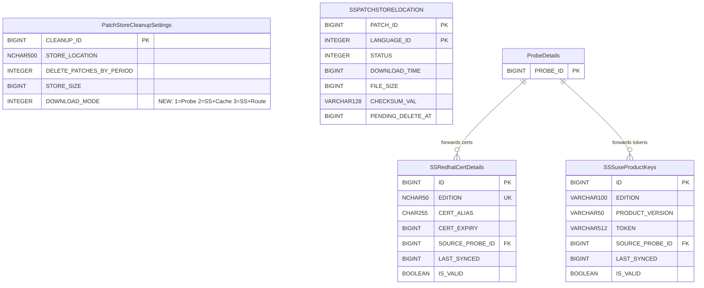
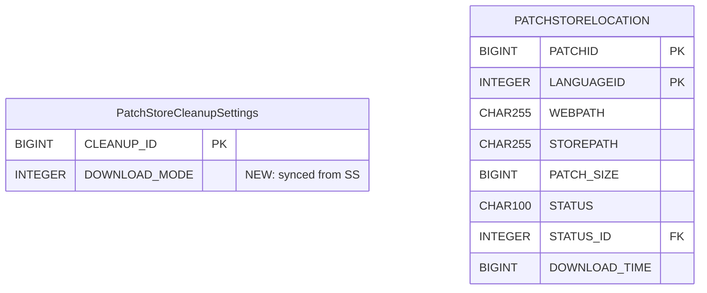

# Centralized Patch Download — Low-Level Design

> **Version:** 4.0 | **Date:** 2026-05-04
> **Product:** ManageEngine Endpoint Central
> **Scope:** DB Schema, REST APIs (payloads & responses), Nginx Config, Meta Files
> **Source of Truth:** [`system-design.md`](system-design.md) · [`download-change-plan.md`](download-change-plan.md) · [`change-plan-uc2-onwards.md`](change-plan-uc2-onwards.md)
> **PoC Evidence:** [`poc-proven-report.md`](poc-proven-report.md) · [`poc5-proof.md`](poc5-proof.md)

---

## Table of Contents

1. [Design Principles](#1-design-principles)
2. [DB Schema](#2-db-schema)
   - 2.1 [ER Diagram — SS Tables](#21-er-diagram--ss-tables)
   - 2.2 [ER Diagram — Probe Tables](#22-er-diagram--probe-tables)
   - 2.3 [Table Definitions](#23-table-definitions)
   - 2.4 [Status Enumerations](#24-status-enumerations)
   - 2.5 [SyMParameter Keys](#25-symparameter-keys)
   - 2.6 [websettings.conf Keys](#26-websettingsconf-keys)
   - 2.7 [Table Summary](#27-table-summary)
3. [REST APIs](#3-rest-apis)
   - 3.1 [URL Convention & Auth](#31-url-convention--auth)
   - 3.2 [Settings APIs (Existing Cleanup Settings — Extended)](#32-settings-apis-existing-cleanup-settings--extended)
   - 3.3 [Store Validation APIs](#33-store-validation-apis)
   - 3.4 [Probe → SS APIs (via PushToSummaryProcessor)](#34-probe--ss-apis-via-pushtosummaryprocessor)
   - 3.5 [Patch Store Management APIs (SS Admin)](#35-patch-store-management-apis-ss-admin)
   - 3.6 [Dependency Package APIs (SS Admin)](#36-dependency-package-apis-ss-admin)
   - 3.7 [Monitoring & Admin APIs](#37-monitoring--admin-apis)
   - 3.8 [Store Path Change API](#38-store-path-change-api)
   - 3.9 [Probe-Side APIs (Called by SS)](#39-probe-side-apis-called-by-ss)
   - 3.10 [Nginx Auth Servlets](#310-nginx-auth-servlets)
4. [Nginx Configuration](#4-nginx-configuration)
   - 4.1 [SS-Side Nginx](#41-ss-side-nginx)
   - 4.2 [Probe-Side Nginx (Self-Proxy Pattern)](#42-probe-side-nginx-self-proxy-pattern)
   - 4.3 [Template Placeholders & Mode Mapping](#43-template-placeholders--mode-mapping)
5. [Meta File Structures](#5-meta-file-structures)
   - 5.1 [Common Store Directory Layout](#51-common-store-directory-layout)
   - 5.2 [Per-Probe client-data Layout](#52-per-probe-client-data-layout)
   - 5.3 [XML Schemas & Samples](#53-xml-schemas--samples)
   - 5.4 [File Naming Conventions](#54-file-naming-conventions)
   - 5.5 [What Lives Where — Summary](#55-what-lives-where--summary)
6. [Settings Propagation Flow](#6-settings-propagation-flow)
7. [Reconciliation with Prior LLD Versions](#7-reconciliation-with-prior-lld-versions)

---

## 1. Design Principles

These principles are non-negotiable constraints from `system-design.md` that drive every schema and API decision below:

| # | Principle | LLD Impact |
|---|-----------|------------|
| 1 | **No push events for centralized download** — pure polling model (§10.3) | No `PATCH_STORE_UPDATED` / `ON_DEMAND_DOWNLOAD_FAILED` events. No event tables. |
| 2 | **No vendor fallback** — SS download failure = deployment failure (§13.3, §14) | No `FALLBACK_TO_VENDOR` column. No fallback API. |
| 3 | **No new collection statuses** — collection stays in "Draft - Download in progress" (§7.3) | No `502` / `503` status codes. |
| 4 | **Pending-patch state is in-memory** in `PatchDownloadListener` maps (§7.1 note) | No `CollectionPendingPatches` table. Startup recovery from collection definition (§9.5). |
| 5 | **No `OnDemandDownloadRequest`/`OnDemandPatchRequest` tables** — SS dedup via `SSPATCHSTORELOCATION.STATUS` (§10.2) | Two tables eliminated. |
| 6 | **3-way download mode** (1=Probe, 2=SS+caching, 3=SS+routing) — not a boolean toggle (§7.1) | `DOWNLOAD_MODE` INTEGER column on existing `PatchStoreCleanupSettings`. |
| 7 | **Settings via existing cleanup settings API** — no dedicated settings table (§7.1, §8.1) | No `CentralizedDownloadSettings` table. Extend `PatchCleanupSettingsController`. |
| 8 | **Settings propagation via customer metadata XML** — not event push (§15.1) | `centralized-download-settings.xml` via `PatchMetaUtil`. |
| 9 | **SS restart required** for mode changes — Nginx config regenerated from templates at startup (§16.1) | No hot-reload for mode switch. |

---

## 2. DB Schema

### 2.1 ER Diagram — SS Tables



### 2.2 ER Diagram — Probe Tables



> **No `CollectionPendingPatches` table.** Per system-design.md §7.1: pending-patch state is tracked in-memory in `PatchDownloadListener.collectionToPatchStatusMap` / `nonCollectionToPatchStatusMap`. On Probe restart, the listener is repopulated from the collection definition (§9.5).

### 2.3 Table Definitions

#### 2.3.1 PatchStoreCleanupSettings — Modified (SS + Probe)

> **Existing singleton table** (`CLEANUP_ID ≠ 0`). One new column added. Full CRUD infrastructure already exists: `PatchCleanupSettingsUtil`, `CleanupSettings` model, `PatchCleanupSettingsService`, `PatchCleanupSettingsController`, `PatchStoreCleanupXmlGenerator`.

| Column | Type | Default | Nullable | New? | Description |
|--------|------|---------|----------|------|-------------|
| `CLEANUP_ID` | BIGINT (PK) | — | NO | Existing | Singleton row identifier |
| `STORE_LOCATION` | NCHAR(500) | — | YES | Existing | Patch store path |
| `DELETE_PATCHES_BY_PERIOD` | INTEGER | `0` | NO | Existing | Cleanup age threshold (months) |
| `STORE_SIZE` | BIGINT | `0` | NO | Existing | Store size limit |
| ... | ... | ... | ... | Existing | (other existing cleanup columns unchanged) |
| **`DOWNLOAD_MODE`** | INTEGER(2) | `1` | NO | **NEW** | `1`=Probe download (legacy), `2`=SS download with Probe caching, `3`=SS download without Probe caching |

**Data dictionary addition** (in `data-dictionary.xml`):

```xml
<column name="DOWNLOAD_MODE">
    <description>Patch download mode: 1=Probe download (legacy),
        2=Summary Server download with Probe caching,
        3=Summary Server download without Probe caching</description>
    <data-type>INTEGER</data-type>
    <max-size>2</max-size>
    <default-value>1</default-value>
    <nullable>false</nullable>
    <unique>false</unique>
</column>
```

**Why not a dedicated table:** `PatchStoreCleanupSettings` is already the single-row config for patch store behavior. Existing CRUD, API endpoints, and XML propagation all extend with one column — zero new infrastructure. The cleanup settings page is the planned UI for the centralized download toggle.

---

#### 2.3.2 SSPATCHSTORELOCATION (SS — New)

> Tracks per-patch download lifecycle on SS. One row per (patch, language).

| Column | Type | Default | Nullable | Description |
|--------|------|---------|----------|-------------|
| **`PATCH_ID`** | BIGINT (PK) | — | NO | Patch identifier |
| **`LANGUAGE_ID`** | INTEGER (PK) | — | NO | Language variant (`0`=all languages, `1`=English, etc.) |
| `STATUS` | INTEGER | `0` | NO | `0`=QUEUED, `1`=DOWNLOADING, `2`=AVAILABLE, `3`=FAILED, `4`=PENDING_DELETE, `5`=DELETED |
| `DOWNLOAD_TIME` | BIGINT | `-1` | NO | Epoch ms when downloaded (`-1` = not yet) |
| `FILE_SIZE` | BIGINT | `0` | NO | Size in bytes |
| `CHECKSUM_VAL` | VARCHAR(128) | `""` | NO | SHA256 hash (empty = not yet computed) |
| `PENDING_DELETE_AT` | BIGINT | `-1` | NO | Epoch ms when PENDING_DELETE was set (`-1` = not pending) |

**Indexes:**

| Index | Columns | Purpose |
|-------|---------|---------|
| PK | `(PATCH_ID, LANGUAGE_ID)` | Composite primary key |
| `IDX_SSPSL_STATUS` | `(STATUS)` | Bulk queries: all QUEUED patches, all FAILED patches, etc. |
| `IDX_SSPSL_PENDING_DELETE` | `(STATUS, PENDING_DELETE_AT)` | `DeferredCleanupTask`: find PENDING_DELETE past grace period |

**DDL file:** `data-dictionary-ss.xml`

---

#### 2.3.3 SSRedhatCertDetails (SS — New)

> One row per RedHat edition. Stores certs forwarded from Probes for mTLS against `cdn.redhat.com`.

| Column | Type | Default | Nullable | Description |
|--------|------|---------|----------|-------------|
| **`ID`** | BIGINT (PK, auto) | — | NO | Auto-generated |
| `EDITION` | VARCHAR(50) (UNIQUE) | — | NO | `Server` / `Workstation` / `Desktop` |
| `CERT_ALIAS` | VARCHAR(255) | `""` | NO | Keystore alias |
| `CERT_EXPIRY` | BIGINT | `-1` | YES | Expiry timestamp (`-1` = not set) |
| `SOURCE_PROBE_ID` | BIGINT (FK) | `-1` | NO | Audit: which Probe forwarded (`-1` = unknown) |
| `LAST_SYNCED` | BIGINT | `-1` | NO | Last sync time (`-1` = never) |
| `IS_VALID` | BOOLEAN | `true` | NO | Whether cert is currently valid |

**FK:** `SOURCE_PROBE_ID` → `ProbeDetails.PROBE_ID`
**Unique constraint:** `EDITION`

**DDL file:** `data-dictionary-ss.xml`

---

#### 2.3.4 SSSuseProductKeys (SS — New)

> Stores SUSE registration tokens forwarded from Probes. One row per (edition, product version).

| Column | Type | Default | Nullable | Description |
|--------|------|---------|----------|-------------|
| **`ID`** | BIGINT (PK, auto) | — | NO | Auto-generated |
| `EDITION` | VARCHAR(100) | — | NO | SUSE product edition |
| `PRODUCT_VERSION` | VARCHAR(50) | — | NO | SUSE product version |
| `TOKEN` | VARCHAR(512) | `""` | NO | SCC registration token |
| `SOURCE_PROBE_ID` | BIGINT (FK) | `-1` | NO | Audit: which Probe forwarded |
| `LAST_SYNCED` | BIGINT | `-1` | NO | Last sync timestamp |
| `IS_VALID` | BOOLEAN | `true` | NO | Whether token is valid |

**FK:** `SOURCE_PROBE_ID` → `ProbeDetails.PROBE_ID`
**Unique constraint:** `(EDITION, PRODUCT_VERSION)`

**DDL file:** `data-dictionary-ss.xml`

---

#### 2.3.5 PATCHSTORELOCATION (Probe — Existing, No Schema Changes)

> Existing table — unchanged. When centralized download is enabled, populated by the deployment gate (§9.2), polling scheduler (§9.4), and missing-patch scheduler (§17.2) via **direct UPSERT** (bypassing download queue).

| Column | Type | Notes for Centralized Download |
|--------|------|-------------------------------|
| `PATCHID` | BIGINT (PK) | Same as legacy |
| `LANGUAGEID` | INTEGER (PK) | Same as legacy |
| `WEBPATH` | CHAR(255) | Set to `https://{probe}:{port}/store/{fileName}` — DS/Agents download from Probe Nginx |
| `STATUS` | CHAR(100) | `AVAILABLE` when file confirmed in common store |
| `STATUS_ID` | INTEGER | `PATCH_DLOAD_AVAILABLE` constant |
| `DOWNLOAD_TIME` | BIGINT | Time when file was discovered in common store |

**No `SOURCE_TYPE` column added.** Per system-design.md §7.2: `WEBPATH` value already distinguishes source (`/store/{file}` = centralized, vendor URL = legacy). No query filters by source type.

---

### 2.4 Status Enumerations

#### SSPATCHSTORELOCATION.STATUS (SS)

| Value | Name | Description |
|-------|------|-------------|
| `0` | `QUEUED` | Queued for download from vendor |
| `1` | `DOWNLOADING` | Download in progress |
| `2` | `AVAILABLE` | Downloaded, checksum validated, ready for serving |
| `3` | `FAILED` | Download failed after retries. `.failed` marker written. |
| `4` | `PENDING_DELETE` | Soft-deleted. Physical removal after grace period. |
| `5` | `DELETED` | Physically deleted from common store. |

#### Collection Status — No New Values

> **No new collection statuses.** Per system-design.md §7.3: collection stays in existing "Draft - Download in progress" while patches are pending from SS. The listener's `performPostDownloadCompletion` fires automatically when no patch is `INITIATED`/`INPROGRESS`.

#### Download Mode Values

| Value | Name | Nginx Behavior | Description |
|-------|------|---------------|-------------|
| `1` | `probe` | Standard `alias $store` | Legacy — each Probe downloads from vendor independently |
| `2` | `summary-caching` | Self-proxy + `proxy_cache patch_cache` | SS downloads centrally; Probe Nginx caches locally |
| `3` | `summary-routing` | Self-proxy + `proxy_cache off` | SS downloads centrally; Probe acts as pass-through |

---

### 2.5 SyMParameter Keys

> Stored in existing `SyMParameter` table (key-value store). Written by SS admin via cleanup settings API; pulled by Probes on startup + post-DB-sync.

| Key | Example Value | Written By | Read By |
|-----|---------------|-----------|---------|
| `common_store_dir` | `\\\\SS_HOST\\PatchStore` | SS admin (cleanup settings API) | `CentralizedDownloadUtil.getCommonStorePath()`, Nginx template `%common.store.path%` |
| `probe_cache_max_size` | `50g` | SS admin (cleanup settings API) | Nginx template `%probe.cache.max.size%` |
| `on_demand_timeout_minutes` | `30` | Default; admin-configurable | `OnDemandTimeoutTask` |
| `cleanup_grace_period_minutes` | `30` | Default; admin-configurable | `DeferredCleanupTask` |

---

### 2.6 websettings.conf Keys

> Written by `WebServerUtil.addOrUpdateProperty()`. Read by Nginx template resolution at startup.

| Key | Default (mode=1) | Mode 2 (caching) | Mode 3 (routing) | Purpose |
|-----|-------------------|-------------------|-------------------|---------|
| `centralized.download.enabled` | `#` | (empty) | (empty) | Prefix for centralized Nginx lines |
| `centralized.download.disabled` | (empty) | `#` | `#` | Prefix for standard `/store/` alias lines |
| `centralized.cache.enabled` | `#` | (empty) | `#` | Prefix for `proxy_cache patch_cache` line |
| `centralized.cache.disabled` | `#` | `#` | (empty) | Prefix for `proxy_cache off` line |
| `centralized.cache.max.size` | N/A | `50` (GB) | N/A | `max_size` for `proxy_cache_path` |
| `centralized.patch.repo.path` | N/A | `F:/PatchStore` | `F:/PatchStore` | Common store path for Nginx `alias` |

---

### 2.7 Table Summary

| Table | Location | Type | DDL File |
|-------|----------|------|----------|
| `PatchStoreCleanupSettings` | SS + Probe | **Modified** (add `DOWNLOAD_MODE`) | `data-dictionary.xml` |
| `SSPATCHSTORELOCATION` | SS | **New** | `data-dictionary-ss.xml` |
| `SSRedhatCertDetails` | SS | **New** | `data-dictionary-ss.xml` |
| `SSSuseProductKeys` | SS | **New** | `data-dictionary-ss.xml` |
| `PATCHSTORELOCATION` | Probe | **Existing (no changes)** | — |
| `SuseProductKeys` | SS | **Reused from Probe** (for `SuseAuthtokenTask`) | `data-dictionary-ss.xml` |
| `SuseAuthTokens` | SS | **Reused from Probe** (populated by `SuseAuthtokenTask`) | `data-dictionary-ss.xml` |
| `PatchKeystoreDetails` | SS | **Reused from Probe** (PKCS12 keystore) | `data-dictionary-ss.xml` |

**Tables explicitly NOT created:**

| Table | Why Not |
|-------|---------|
| `CentralizedDownloadSettings` | `DOWNLOAD_MODE` on existing `PatchStoreCleanupSettings` + SyMParameter keys |
| `OnDemandDownloadRequest` | SS dedup via `SSPATCHSTORELOCATION.STATUS` check (§10.2). No tracking rows. |
| `OnDemandPatchRequest` | Same — eliminated. |
| `CollectionPendingPatches` (Probe) | Pending state in-memory in `PatchDownloadListener` maps. Rebuilt on restart from collection definition (§9.5). |

---

## 3. REST APIs

### 3.1 URL Convention & Auth

**Base path:** All centralized download APIs use `/dcapi/centralizedDownload` **except** settings, which use the existing cleanup settings path.

**Auth patterns:**

| Caller | Auth Mechanism | Headers |
|--------|---------------|---------|
| **SS Admin (browser)** | Session cookie + CSRF | Standard DC session auth |
| **Probe → SS** (PushToSummaryProcessor) | API key headers | `SUMMARY_API_KEY`, `PROBE_ID`, `HS_KEY`, `PROBE_NAME`, `SUMMARY_SERVER_REQUEST`, `USER_DOMAIN` |
| **SS → Probe** (REST call) | SS auth headers | `SUMMARY_API_KEY`, `PROBE_ID` |
| **DS/Agent → Probe Nginx** | `auth_request` subrequest | Agent.key / basic auth |
| **Probe → SS Nginx** | `auth_request` subrequest | `SUMMARY_API_KEY`, `PROBE_ID`, `HS_KEY` |

**API Summary:**

| # | Method | Endpoint | Caller | Use Case |
|---|--------|----------|--------|----------|
| 1 | `GET` | `PATCH_DB/SETTINGS/cleanupSettings` | SS Admin | Fetch settings (extended with `downloadMode`, `commonStoreDir`, `probeCacheMaxSize`) |
| 2 | `PUT` | `PATCH_DB/SETTINGS/cleanupSettings` | SS Admin | Update settings (triggers customer metadata XML generation) |
| 3 | `POST` | `/dcapi/centralizedDownload/validateStore` | SS Admin | Validate store path (writable, space) |
| 4 | `POST` | `/dcapi/centralizedDownload/validateProbeAccess` | SS Admin | Validate all Probes can access common store (sentinel check) |
| 5 | `POST` | `/dcapi/centralizedDownload/onDemandRequest` | Probe → SS | Request priority download of missing patches |
| 6 | `POST` | `/dcapi/centralizedDownload/reportCorrupted` | Probe → SS | Report checksum-invalid patch in common store |
| 7 | `POST` | `/dcapi/centralizedDownload/dependencyPackages` | Probe → SS | Forward Linux dependency package metadata |
| 8 | `POST` | `/dcapi/centralizedDownload/redhatCert` | Probe → SS | Forward RedHat mTLS certificate |
| 9 | `POST` | `/dcapi/centralizedDownload/suseKeys` | Probe → SS | Forward SUSE registration codes |
| 10 | `POST` | `/dcapi/centralizedDownload/upload` | Probe → SS / SS Admin | Upload patch binary to common store |
| 11 | `POST` | `/dcapi/centralizedDownload/patches/redownload` | SS Admin | Re-trigger download for failed patches |
| 12 | `DELETE` | `/dcapi/centralizedDownload/patches` | SS Admin | Soft-delete patches (grace period before physical removal) |
| 13 | `POST` | `/dcapi/centralizedDownload/dependency/redownload` | SS Admin | Re-trigger download for failed dependency packages |
| 14 | `DELETE` | `/dcapi/centralizedDownload/dependency` | SS Admin | Delete dependency packages from common store |
| 15 | `GET` | `/dcapi/centralizedDownload/stats` | SS Admin | Common store statistics |
| 16 | `GET` | `/dcapi/centralizedDownload/probeStatus` | SS Admin | Per-Probe sync/access status |
| 17 | `POST` | `/dcapi/centralizedDownload/retryOnDemand/{collectionId}` | SS Admin | Re-send on-demand request for stuck collection |
| 18 | `POST` | `/dcapi/centralizedDownload/cancelDeployment/{collectionId}` | SS Admin | Cancel stuck collection |
| 19 | `PUT` | `/dcapi/centralizedDownload/changePath` | SS Admin | Change common store path (validate → migrate → switch) |
| 20 | `GET` | `/dcapi/centralizedDownload/settings` | Probe → SS | Probe pulls centralized settings on startup/sync |
| 21 | `GET` | `/api/v1/probe/centralizedDownload/validateStoreAccess` | SS → Probe | SS asks Probe to verify common store access |

---

### 3.2 Settings APIs (Existing Cleanup Settings — Extended)

> Settings are managed through the **existing** `PatchCleanupSettingsController`, not a separate endpoint. The `CleanupSettings` model is extended with `downloadMode`, `commonStoreDir`, and `probeCacheMaxSize` fields.

#### GET `PATCH_DB/SETTINGS/cleanupSettings`

Returns current settings. Extended response includes centralized download fields.

**Auth:** SS Admin session

**Response `200 OK`:**

```json
{
    "cleanupId": 1,
    "storeLocation": "F:\\PatchStore\\LocalStore",
    "deleteSupersededPatches": true,
    "deletePatchesByPeriod": 6,
    "storeSize": 107374182400,
    "notifySpaceExceedsGB": 30,
    "notifyDownloadFailureHours": 4,
    "downloadMode": 1,
    "commonStoreDir": "",
    "probeCacheMaxSize": "50g"
}
```

| Field | Type | Values | Description |
|-------|------|--------|-------------|
| `downloadMode` | int | `1` / `2` / `3` | 1=Probe download, 2=SS+caching, 3=SS+routing |
| `commonStoreDir` | string | Network path | Common store path (empty when mode=1) |
| `probeCacheMaxSize` | string | e.g. `"50g"` | Probe Nginx cache size (only relevant for mode=2) |

---

#### PUT `PATCH_DB/SETTINGS/cleanupSettings`

Updates settings. When `downloadMode` changes, writes `DOWNLOAD_MODE` column + SyMParameters + generates customer metadata XML for Probe propagation.

**Auth:** SS Admin session

**Request:**

```json
{
    "cleanupId": 1,
    "storeLocation": "F:\\PatchStore\\LocalStore",
    "deleteSupersededPatches": true,
    "deletePatchesByPeriod": 6,
    "storeSize": 107374182400,
    "notifySpaceExceedsGB": 30,
    "notifyDownloadFailureHours": 4,
    "downloadMode": 2,
    "commonStoreDir": "\\\\NAS\\PatchStore",
    "probeCacheMaxSize": "50g"
}
```

**Response `200 OK`:**

```json
{
    "status": "success",
    "message": "Settings updated. Server restart required for mode change to take effect.",
    "restartRequired": true
}
```

**Response `400 Bad Request`:**

```json
{
    "status": "error",
    "errorCode": "STORE_PATH_REQUIRED",
    "message": "Common store path is required when download mode is 2 or 3"
}
```

**Validation rules:**
- `downloadMode` must be `1`, `2`, or `3`
- When `downloadMode >= 2`: `commonStoreDir` must be non-empty
- When `downloadMode == 2`: `probeCacheMaxSize` must be a valid Nginx size string (e.g. `"50g"`)

**Side effects on save:**
1. Persist `DOWNLOAD_MODE` to `PatchStoreCleanupSettings` via `PatchCleanupSettingsUtil`
2. Persist `common_store_dir` and `probe_cache_max_size` to SyMParameter via `SyMUtil.updateSyMParameter()`
3. Update `websettings.conf` via `WebServerUtil.addOrUpdateProperty()` (all 6 keys from §2.6)
4. Generate `centralized-download-settings.xml` via `PatchMetaUtil.addOrUpdateCustomerMeta()` → `DCMetaDataUtil.generateCustomerMetaDataForAllManagedCustomers()`
5. Generate `PatchStoreCleanupXmlGenerator.generateXML()` → propagates to DS via MasterRepository
6. **⚠️ SS restart required** for Nginx config to regenerate from templates

---

### 3.3 Store Validation APIs

#### POST `/dcapi/centralizedDownload/validateStore`

Dry-run validation of a proposed store path — checks writable + sufficient disk space on SS. Does not persist.

**Auth:** SS Admin session

**Request:**

```json
{
    "commonStorePath": "\\\\NAS\\PatchStore"
}
```

**Response `200 OK`:**

```json
{
    "valid": true,
    "totalSpaceGB": 500,
    "freeSpaceGB": 320,
    "writable": true
}
```

**Response `200 OK` (validation failed — not an HTTP error):**

```json
{
    "valid": false,
    "reason": "NOT_WRITABLE",
    "message": "Path exists but is not writable by the service account"
}
```

---

#### POST `/dcapi/centralizedDownload/validateProbeAccess`

Validates all online Probes can access the common store path. SS writes a sentinel file, then calls each Probe's validation endpoint.

**Auth:** SS Admin session

**Request:**

```json
{
    "commonStorePath": "\\\\NAS\\PatchStore"
}
```

**Response `200 OK`:**

```json
{
    "overallStatus": "FAILED",
    "totalProbes": 5,
    "responded": 4,
    "timedOut": 1,
    "results": [
        {
            "probeId": 1001,
            "probeName": "Probe-US",
            "status": "SUCCESS",
            "freeSpaceGB": 150
        },
        {
            "probeId": 1002,
            "probeName": "Probe-EU",
            "status": "SUCCESS",
            "freeSpaceGB": 200
        },
        {
            "probeId": 1003,
            "probeName": "Probe-APAC",
            "status": "FAILED",
            "error": "Directory not found: \\\\NAS\\PatchStore"
        },
        {
            "probeId": 1004,
            "probeName": "Probe-JP",
            "status": "SUCCESS",
            "freeSpaceGB": 95
        },
        {
            "probeId": 1005,
            "probeName": "Probe-BR",
            "status": "TIMED_OUT"
        }
    ]
}
```

**SS-side processing:**
1. Write sentinel: `{commonStorePath}/.ss-store-sentinel` with `{ "ssId": "...", "timestamp": ..., "nonce": "abc123" }`
2. For each online Probe: `GET /api/v1/probe/centralizedDownload/validateStoreAccess?commonStorePath=...&sentinelNonce=abc123` (2 min timeout)
3. Collect results, return aggregate

---

### 3.4 Probe → SS APIs (via PushToSummaryProcessor)

> These endpoints are called by Probes via `PushToSummaryProcessor` (push-to-summary queue, DB-backed, async, single-threaded). Auth: Probe API key headers. Probes **do not inspect HTTP responses** — all result discovery is via polling the common store.

#### POST `/dcapi/centralizedDownload/onDemandRequest`

Probe requests priority download of missing patches for a deployment.

**Auth:** Probe API key headers

**Request:**

```json
{
    "patchIds": [101, 102, 103],
    "collectionId": 12345,
    "probeId": 1001,
    "requestTime": 1740000000000
}
```

**Response `200 OK`:**

```json
{
    "accepted": [101, 103],
    "alreadyAvailable": [102],
    "estimatedTimeMinutes": 5
}
```

| Field | Description |
|-------|-------------|
| `accepted` | Patches queued for priority download (not yet in common store) |
| `alreadyAvailable` | Patches already `STATUS=AVAILABLE` in `SSPATCHSTORELOCATION` |
| `estimatedTimeMinutes` | Rough ETA based on queue depth |

**SS processing:**
1. Check `SSPATCHSTORELOCATION` → split `accepted` vs `alreadyAvailable`
2. For accepted where `STATUS = FAILED`: clear `.failed` marker, reset to `QUEUED`
3. Skip if `STATUS IN (QUEUED, DOWNLOADING)` — already being handled
4. Queue accepted patches with **highest priority** (front of download queue)
5. **No tracking rows** — dedup via `SSPATCHSTORELOCATION.STATUS`
6. **No push event** — Probe discovers result via 5-min polling scheduler

---

#### POST `/dcapi/centralizedDownload/reportCorrupted`

Probe reports that a patch file in the common store has an invalid checksum.

**Auth:** Probe API key headers

**Request:**

```json
{
    "patchId": 205,
    "collectionId": 12345,
    "probeId": 1001,
    "corruptedLanguageIds": [1, 3],
    "requestTime": 1740000000000
}
```

**Response `200 OK`:**

```json
{
    "status": "success",
    "message": "Corrupted files will be deleted and re-queued for download"
}
```

**SS processing:**
1. Delete corrupted file(s) from common store
2. Delete any `.failed` markers for the affected language IDs
3. Reset `SSPATCHSTORELOCATION.STATUS = QUEUED`
4. Re-queue download from vendor with highest priority
5. Probe's polling scheduler continues monitoring

---

#### POST `/dcapi/centralizedDownload/dependencyPackages`

Probe forwards Linux dependency package metadata to SS.

**Auth:** Probe API key headers

**Request:**

```json
{
    "probeId": 1001,
    "packages": [
        {
            "packageId": 1,
            "productId": 300180,
            "packageName": "iputils-ping_20190709-3ubuntu1_amd64.deb",
            "checksum": "ce08339e42c42bd624113b5cbf33110797e0241bdb3e3b65c5fb7bb058bf7be0",
            "checksumType": "sha256",
            "downloadUrl": "http://archive.ubuntu.com/ubuntu/pool/main/i/iputils/iputils-ping_20190709-3ubuntu1_amd64.deb",
            "osFlavor": "ubuntu"
        }
    ]
}
```

**Response `200 OK`:**

```json
{
    "status": "success",
    "inserted": 1,
    "duplicatesSkipped": 0
}
```

**SS processing:**
1. Dedup-insert into SS-side `PACKAGEINFO` on `(package_name, product_id, checksum)`
2. Trigger `SSDependencyDownloadTask` for affected flavor (async, immediate)
3. Scheduled fallback: task runs every 10 min regardless

---

#### POST `/dcapi/centralizedDownload/redhatCert`

Probe forwards a RedHat mTLS certificate for SS-side CDN authentication.

**Auth:** Probe API key headers
**Content-Type:** `multipart/form-data` (via `MultiPartUtilImpl`)

**Request (multipart):**

| Part | Type | Description |
|------|------|-------------|
| `certFile` | Binary (ZIP) | Archive containing `client.pem`, `client-key.pem`, `ca.pem` |
| `edition` | Text | `Server` / `Workstation` / `Desktop` |
| `probeId` | Text | Source Probe ID |
| `certExpiry` | Text | Epoch ms of certificate expiry |

**Response `200 OK`:**

```json
{
    "status": "success",
    "edition": "Server",
    "keystoreAlias": "patch_keystore_server",
    "message": "RedHat certificate stored successfully"
}
```

**SS processing:**
1. Check existing cert for this edition: if current cert has later expiry → skip
2. Extract ZIP → import PEMs into PKCS12 keystore via `PatchKeystoreService`
3. UPSERT `SSRedhatCertDetails` by `EDITION`
4. Store keystore password in `PatchKeystoreDetails`

---

#### POST `/dcapi/centralizedDownload/suseKeys`

Probe forwards SUSE registration codes to SS.

**Auth:** Probe API key headers

**Request:**

```json
{
    "probeId": 1001,
    "customerId": 5001,
    "keys": [
        {
            "productKey": "XXXX-XXXX-XXXX-XXXX",
            "osEdition": "server",
            "productVersion": "15.4"
        }
    ]
}
```

**Response `200 OK`:**

```json
{
    "status": "success",
    "inserted": 1,
    "updated": 0
}
```

**SS processing:**
1. UPSERT `SSSuseProductKeys` on `(EDITION, PRODUCT_VERSION)`
2. Run `SuseAuthtokenTask` to fetch auth tokens from `scc.suse.com`
3. Tokens stored in `SuseAuthTokens`, consumed by `SuseSettingsUtil.appendSUSEToken()` at download time

---

#### POST `/dcapi/centralizedDownload/upload`

Accepts multipart upload; stores binary in common store. Used by both SS admin directly and Probe's `ProbeUploadForwarder`.

**Auth:** Probe API key headers or SS Admin session
**Content-Type:** `multipart/form-data`

**Request (multipart):**

| Part | Type | Description |
|------|------|-------------|
| `file` | Binary | Patch binary file |
| `patchId` | Text | Patch identifier |
| `languageId` | Text | Language variant (`1`=English, `0`=all) |
| `fileName` | Text | Target file name in common store |
| `checksum` | Text | Expected SHA256 checksum |
| `probeId` | Text | Source Probe ID (or `"SS"` for direct upload) |

**Response `200 OK`:**

```json
{
    "status": "success",
    "patchId": 400010,
    "storedAs": "400010-custom-patch.exe",
    "checksumValid": true
}
```

**Response `400 Bad Request`:**

```json
{
    "status": "error",
    "errorCode": "CHECKSUM_MISMATCH",
    "message": "Uploaded file checksum does not match expected value"
}
```

**SS processing:**
1. Store binary in `{commonStore}/{fileName}`
2. Validate checksum (SHA256)
3. Update `SSPATCHSTORELOCATION` with `STATUS=AVAILABLE`
4. **No push event** — other Probes discover via 30-min missing-patch scheduler (§17.2)
5. Uploading Probe gets result synchronously via REST response

---

### 3.5 Patch Store Management APIs (SS Admin)

#### POST `/dcapi/centralizedDownload/patches/redownload`

Re-triggers download for selected patches.

**Auth:** SS Admin session

**Request:**

```json
{
    "patchIds": [101, 205, 310]
}
```

**Response `200 OK`:**

```json
{
    "status": "success",
    "requeued": 3,
    "message": "3 patches queued for re-download"
}
```

**Side effects:**
1. Reset `SSPATCHSTORELOCATION.STATUS = QUEUED` for each patch
2. Delete any `.failed` markers: `{commonStore}/.patch-status/{patchId}_{langId}.failed`
3. Queue patches in `ss-patch-download-data`

---

#### DELETE `/dcapi/centralizedDownload/patches`

Soft-delete patches. Physical removal after grace period by `DeferredCleanupTask`.

**Auth:** SS Admin session

**Request:**

```json
{
    "patchIds": [101, 205]
}
```

**Response `200 OK`:**

```json
{
    "status": "success",
    "markedForDeletion": 2,
    "gracePeriodMinutes": 30,
    "message": "2 patches marked for deletion. Physical removal after 30 minutes."
}
```

**Side effects:**
1. Set `SSPATCHSTORELOCATION.STATUS = PENDING_DELETE` (4)
2. Set `PENDING_DELETE_AT = System.currentTimeMillis()`
3. `DeferredCleanupTask` physically deletes after `cleanup_grace_period_minutes`
4. After physical deletion: regenerate `deleted-patches.xml` in common store (§5.3)

---

### 3.6 Dependency Package APIs (SS Admin)

#### POST `/dcapi/centralizedDownload/dependency/redownload`

Re-triggers download for selected dependency packages.

**Auth:** SS Admin session

**Request:**

```json
{
    "packageIds": [1, 2, 3]
}
```

**Response `200 OK`:**

```json
{
    "status": "success",
    "requeued": 3
}
```

---

#### DELETE `/dcapi/centralizedDownload/dependency`

Delete dependency packages from common store.

**Auth:** SS Admin session

**Request:**

```json
{
    "packageIds": [1, 2]
}
```

**Response `200 OK`:**

```json
{
    "status": "success",
    "deleted": 2
}
```

---

### 3.7 Monitoring & Admin APIs

#### GET `/dcapi/centralizedDownload/stats`

Returns common store statistics.

**Auth:** SS Admin session

**Response `200 OK`:**

```json
{
    "totalPatches": 1250,
    "byStatus": {
        "QUEUED": 15,
        "DOWNLOADING": 3,
        "AVAILABLE": 1200,
        "FAILED": 12,
        "PENDING_DELETE": 8,
        "DELETED": 12
    },
    "totalFileSizeBytes": 53687091200,
    "totalFileSizeFormatted": "50.0 GB",
    "diskUsage": {
        "totalSpaceGB": 500,
        "freeSpaceGB": 320,
        "usedByStoreGB": 50
    }
}
```

---

#### GET `/dcapi/centralizedDownload/probeStatus`

Returns per-Probe connectivity and common store access status.

**Auth:** SS Admin session

**Response `200 OK`:**

```json
{
    "probes": [
        {
            "probeId": 1001,
            "probeName": "Probe-US-East",
            "online": true,
            "commonStoreAccessible": true,
            "lastSettingsSyncTime": 1713168000000
        },
        {
            "probeId": 1002,
            "probeName": "Probe-EU-West",
            "online": true,
            "commonStoreAccessible": false,
            "lastSettingsSyncTime": 1713167000000
        }
    ]
}
```

---

#### POST `/dcapi/centralizedDownload/retryOnDemand/{collectionId}`

Re-sends an on-demand request for a stuck collection. Useful when all patches timed out.

**Auth:** SS Admin session

**Response `200 OK`:**

```json
{
    "status": "success",
    "collectionId": 12345,
    "message": "On-demand request re-sent for collection 12345"
}
```

---

#### POST `/dcapi/centralizedDownload/cancelDeployment/{collectionId}`

Cancels a stuck collection.

**Auth:** SS Admin session

**Response `200 OK`:**

```json
{
    "status": "success",
    "collectionId": 12345,
    "message": "Deployment cancelled for collection 12345"
}
```

---

### 3.8 Store Path Change API

#### PUT `/dcapi/centralizedDownload/changePath`

Changes the common store path while centralized download remains enabled.

**Auth:** SS Admin session

**Request:**

```json
{
    "newCommonStorePath": "\\\\NAS2\\PatchStore",
    "migrateFiles": true
}
```

**Response `200 OK` (validation passed, migration started):**

```json
{
    "status": "success",
    "phase": "MIGRATION_STARTED",
    "message": "Validation passed. File migration in progress. SS restart required after completion.",
    "filesToMigrate": 1200,
    "estimatedSizeGB": 50
}
```

**Response `200 OK` (validation failed):**

```json
{
    "status": "error",
    "phase": "VALIDATION_FAILED",
    "probeResults": [
        { "probeId": 1003, "status": "FAILED", "error": "Directory not found" }
    ],
    "message": "Probe access validation failed. Fix network shares before retrying."
}
```

**Response `200 OK` (migrateFiles=false):**

```json
{
    "status": "success",
    "phase": "SWITCH_COMPLETE",
    "message": "Path changed. All SSPATCHSTORELOCATION entries reset to QUEUED. SS restart required. Full re-download will begin after restart.",
    "patchesReset": 1200
}
```

**Processing phases:** See system-design.md §16.4.2 for Phase A (Validate) → Phase B (Migrate) → Phase C (Atomic Switch).

---

### 3.9 Probe-Side APIs (Called by SS)

#### GET `/dcapi/centralizedDownload/settings`

Probe pulls centralized download settings from SS at startup and after DB sync.

**Auth:** Probe API key headers

**Response `200 OK`:**

```json
{
    "downloadMode": 2,
    "commonStoreDir": "\\\\NAS\\PatchStore",
    "probeCacheMaxSize": "50g"
}
```

**Probe-side processing:**
1. Write `DOWNLOAD_MODE` to local `PatchStoreCleanupSettings`
2. Write `common_store_dir` and `probe_cache_max_size` to local SyMParameter
3. If `DOWNLOAD_MODE` changed: trigger Nginx config regeneration + reload

---

#### GET `/api/v1/probe/centralizedDownload/validateStoreAccess`

SS calls this endpoint on each Probe to verify common store accessibility during enable-time validation.

**Auth:** SS auth headers

**Query params:**

| Param | Description |
|-------|-------------|
| `commonStorePath` | Path to validate |
| `sentinelNonce` | Nonce from sentinel file to verify correct store |

**Response `200 OK`:**

```json
{
    "probeId": 1001,
    "status": "SUCCESS",
    "pathResolved": "\\\\NAS\\PatchStore",
    "freeSpaceGB": 150
}
```

**Response `200 OK` (failed):**

```json
{
    "probeId": 1001,
    "status": "FAILED",
    "error": "Sentinel file not found — path may not point to SS store"
}
```

**Probe-side processing:**
1. Check: directory exists?
2. Check: can list files? (read permission)
3. Read `.ss-store-sentinel` → parse JSON → verify nonce matches
4. Return result with free space info

---

### 3.10 Nginx Auth Servlets

> **Not REST APIs** — mapped as servlets for Nginx `auth_request` subrequests. Return HTTP status codes only (no body).

#### Probe-side: `GET /common-store-auth`

| Aspect | Detail |
|--------|--------|
| **Location** | Probe Nginx → `auth_request` subrequest for `/store/` |
| **Validates** | DS/Agent credentials (Agent.key / basic auth) |
| **Returns** | `200` (allow) or `401` (deny) |
| **Implementation** | Servlet in Probe's `web.xml` |

#### SS-side: `GET /common-store-auth`

| Aspect | Detail |
|--------|--------|
| **Location** | SS Nginx → `auth_request` subrequest for `/common-store/` |
| **Validates** | `SUMMARY_API_KEY`, `PROBE_ID`, `HS_KEY` against `SUMMARYSERVERAPIKEYDETAILS` |
| **Returns** | `200` (allow) or `401` (deny) |
| **Implementation** | `SSStoreAuthValidator` servlet |

---

## 4. Nginx Configuration

### 4.1 SS-Side Nginx

SS Nginx serves the common store as static files with `open_file_cache` (not `proxy_cache`). DS/Agents do **not** download from SS directly — they use Probe `/store/`. SS `/common-store/` is for Probe→SS fallback only.

```nginx
# ── File descriptor cache ──
open_file_cache          max=2000 inactive=24h;
open_file_cache_valid    1h;
open_file_cache_min_uses 1;
open_file_cache_errors   on;

location /common-store/ {
    alias %ss.common.store.loc%/;

    sendfile           on;
    tcp_nopush         on;
    tcp_nodelay        on;
    output_buffers     4 256k;

    add_header Cache-Control "public, max-age=2592000, immutable" always;
    etag on;

    limit_rate_after   50m;
    limit_rate         100m;
    gzip off;

    auth_request /common-store-auth;
    add_header Content-Disposition "attachment" always;

    limit_conn common_store_conn 10;
    limit_conn common_store_total 200;
    limit_conn_status 503;
}
```

### 4.2 Probe-Side Nginx (Self-Proxy Pattern)

The Probe uses a self-proxy pattern: an internal server (127.0.0.1:9090) reads from the common store (network share) via `alias`, and the external `/store/` location `proxy_pass`es to it with optional `proxy_cache`.

#### Block 1: `http {}` context — `nginx-pre-product.conf.template`

```nginx
# ── Cache zone (always defined when centralized enabled, harmless when unused) ──
%centralized.download.enabled%proxy_cache_path "%centralized.patch.repo.path%/../../NginxCache/patch-store-cache"
%centralized.download.enabled%    levels=1:2
%centralized.download.enabled%    keys_zone=patch_cache:10m
%centralized.download.enabled%    max_size=%centralized.cache.max.size%g
%centralized.download.enabled%    inactive=30d
%centralized.download.enabled%    use_temp_path=off;

# ── Internal server: reads from common store (network share) ──
%centralized.download.enabled%server {
%centralized.download.enabled%    listen       127.0.0.1:9090;
%centralized.download.enabled%    server_name  localhost;
%centralized.download.enabled%
%centralized.download.enabled%    location /internal-patch-store/ {
%centralized.download.enabled%        alias "%centralized.patch.repo.path%/";
%centralized.download.enabled%        sendfile           on;
%centralized.download.enabled%        tcp_nopush         on;
%centralized.download.enabled%        tcp_nodelay        on;
%centralized.download.enabled%        open_file_cache          max=2000 inactive=24h;
%centralized.download.enabled%        open_file_cache_valid    1h;
%centralized.download.enabled%        open_file_cache_min_uses 1;
%centralized.download.enabled%        open_file_cache_errors   on;
%centralized.download.enabled%        allow 127.0.0.1;
%centralized.download.enabled%        deny  all;
%centralized.download.enabled%    }
%centralized.download.enabled%}

# ── Map: human-readable X-Cache-Status header ──
%centralized.download.enabled%map $upstream_cache_status $cache_status_display {
%centralized.download.enabled%    ""       "DISABLED";
%centralized.download.enabled%    default  $upstream_cache_status;
%centralized.download.enabled%}
```

#### Block 2: Modified `/store/` location — `nginx-static-agent.conf.template`

```nginx
location /store/{
    %nginx.dev.mode%set $loc_match "/store/";
    #location_start_PatchStore
    #location_end_PatchStore

    %disable.http.basic.auth%auth_basic "Private Property";
    auth_basic_user_file ../../conf/Tomcat/Agent.key;
    if ( $ssl_client_verify ~ ^(?!(%client.cert.auth.level%)) ){return 403 "CLIENT CERT AUTH ERROR";}

    # ── Standard mode (mode=1): serve from local store ──
    %centralized.download.disabled%gzip off;
    %centralized.download.disabled%alias $store;
    %centralized.download.disabled%autoindex %nginx.autoindex.value%;
    %centralized.download.disabled%allow all;

    # ── Centralized mode (mode=2 or 3): self-proxy through cache ──
    %centralized.download.enabled%proxy_pass         http://127.0.0.1:9090/internal-patch-store/;
    %centralized.download.enabled%%centralized.cache.enabled%proxy_cache        patch_cache;
    %centralized.download.enabled%%centralized.cache.disabled%proxy_cache        off;
    %centralized.download.enabled%proxy_cache_valid  200 30d;
    %centralized.download.enabled%proxy_cache_valid  404 1m;
    %centralized.download.enabled%proxy_cache_key    $uri;
    %centralized.download.enabled%proxy_cache_lock          on;
    %centralized.download.enabled%proxy_cache_lock_timeout  300s;
    %centralized.download.enabled%add_header X-Cache-Status $cache_status_display always;
    %centralized.download.enabled%add_header Cache-Control "public, max-age=2592000, immutable" always;
    %centralized.download.enabled%add_header Content-Disposition "attachment" always;
    %centralized.download.enabled%proxy_buffering           on;
    %centralized.download.enabled%proxy_max_temp_file_size  0;
    %centralized.download.enabled%proxy_connect_timeout     10s;
    %centralized.download.enabled%proxy_read_timeout        600s;
    %centralized.download.enabled%proxy_send_timeout        600s;
    %centralized.download.enabled%gzip off;
}
```

### 4.3 Template Placeholders & Mode Mapping

| Placeholder | Mode 1 (Probe) | Mode 2 (SS+Caching) | Mode 3 (SS+Routing) |
|-------------|----------------|----------------------|---------------------|
| `%centralized.download.enabled%` | `#` (commented) | (empty, active) | (empty, active) |
| `%centralized.download.disabled%` | (empty, active) | `#` (commented) | `#` (commented) |
| `%centralized.cache.enabled%` | `#` | (empty, active) | `#` |
| `%centralized.cache.disabled%` | `#` | `#` | (empty, active) |
| `%centralized.cache.max.size%` | N/A | `50` (from SyMParam) | N/A |
| `%centralized.patch.repo.path%` | N/A | `F:/PatchStore` | `F:/PatchStore` |

**Resolution:** Java writes these to `websettings.conf` → `NginxServerUtils.generateNginxConfFiles()` reads templates → `StartupUtil.findAndReplaceStrings()` substitutes placeholders → final `.conf` files generated at SS/Probe startup.

| X-Cache-Status | Meaning |
|----------------|---------|
| `MISS` | Fetched from common store (network share), now cached on Probe disk |
| `HIT` | Served from local Probe cache |
| `DISABLED` | Caching off — every request reads from network share |

---

## 5. Meta File Structures

### 5.1 Common Store Directory Layout

```
{ss_common_storedir}/                              (e.g., \\NAS\PatchStore)
│
├── .ss-store-sentinel                             ← Sentinel for Probe access validation
│
├── KB5001234.msu                                  ← Regular Windows patch (binary)
├── 400009-mpam-fe-defender-x64.exe                ← Common URL patch (binary)
├── SharedPatch.exe                                ← Common URL patch (binary)
│
├── office/
│   └── {patchId}/                                 ← Office Click-to-Run patches
│       ├── setup.exe
│       └── data/
│
├── linux/
│   ├── redhat-dependencies/
│   │   └── package.rpm                            ← Red Hat RPM (binary)
│   ├── ubuntu-dependencies/
│   │   └── package.deb                            ← Ubuntu DEB (binary)
│   ├── suse-dependencies/
│   │   └── package.rpm                            ← SUSE RPM (binary)
│   ├── debian-dependencies/
│   │   └── package.deb                            ← Debian DEB (binary)
│   ├── redhat/dependency/                         ← Linux dep meta XMLs
│   │   ├── product-dep-101.xml
│   │   ├── product-dep-102.xml
│   │   └── ProdDepMetaInfo.xml
│   ├── ubuntu/dependency/
│   │   ├── product-dep-201.xml
│   │   └── ProdDepMetaInfo.xml
│   ├── suse/dependency/
│   │   └── ...
│   └── debian/dependency/
│       └── ...
│
├── deleted-patches/                               ← Delete meta XMLs
│   ├── windows/
│   │   └── deleted-patches.xml
│   ├── mac/
│   │   └── deleted-patches.xml
│   └── linux/
│       ├── deleted-patches.xml
│       └── deleted-dep-packages.xml
│
└── .patch-status/                                 ← Per-patch failure markers (hidden)
    ├── 102_1.failed                               ← patchId 102, langId 1
    └── 205_3.failed                               ← patchId 205, langId 3
```

### 5.2 Per-Probe client-data Layout

```
{ServerDir}/webapps/DesktopCentral/client-data/patch-resources/
│
├── patch-products.zip                             ← Probe-generated (NOT from common store)
├── windows/download/
│   ├── Product-205.xml
│   └── Product-1373.xml
├── mac/download/
│   └── Product-{id}.xml
└── linux/
    ├── ubuntu/dependency/
    │   ├── product-dep-300180.xml
    │   └── proddepmetainfo.xml
    ├── redhat/dependency/
    ├── suse/dependency/
    └── debian/dependency/
```

### 5.3 XML Schemas & Samples

#### 5.3.1 deleted-patches.xml

```xml
<?xml version="1.0" encoding="utf-8"?>
<DELETEDFROMSTORE>
    <DeletedPatch patchid="102" languageid="1" deletion_time="1773896890671"/>
    <DeletedPatch patchid="205" languageid="3" deletion_time="1773897000000"/>
</DELETEDFROMSTORE>
```

Written by: SS `DeferredCleanupTask` (after physical delete)
Read by: Probe missing-patch scheduler → removes stale `PATCHSTORELOCATION` entries

#### 5.3.2 deleted-dep-packages.xml

```xml
<?xml version="1.0" encoding="utf-8"?>
<DELETEDDEPENDENCIESFROMSTORE>
    <DeletedPackage package_id="15" product_id="300180"
      package_name="old-package_1.0_amd64.deb" deletion_time="1773897100000"/>
</DELETEDDEPENDENCIESFROMSTORE>
```

#### 5.3.3 Per-Patch Failure Markers (.failed files)

**Location:** `{commonStore}/.patch-status/{patchId}_{languageId}.failed`
**Content:** Plain text failure reason string.
**Example content:** `Checksum mismatch after 3 retries`

**Three-outcome check per patch per poll tick:**

| Check Order | Condition | Outcome |
|-------------|-----------|---------|
| 1 | `File.exists(commonStorePath + fileName)` = true | **SUCCESS** — patch available |
| 2 | `File.exists(commonStorePath + ".patch-status/" + patchId + "_" + langId + ".failed")` = true | **FAILED** — read reason, handle |
| 3 | Neither exists | **STILL DOWNLOADING** — wait for next tick |

**Lifecycle:**

| Phase | Who | Action |
|-------|-----|--------|
| Create | SS (on download failure) | Write `{patchId}_{langId}.failed` with reason |
| Read | Probe polling scheduler (every 5 min) | `File.exists()` check |
| Delete | SS (on re-queue or successful re-download) | Remove stale marker |
| Cleanup | SS `DeferredCleanupTask` | Delete markers older than `2 × on_demand_timeout_minutes` |

#### 5.3.4 Sentinel File (.ss-store-sentinel)

**Location:** `{commonStore}/.ss-store-sentinel`

```json
{
    "ssId": "ss-production-01",
    "timestamp": 1740000000000,
    "nonce": "abc123def456"
}
```

Written by SS during enable-time validation. Read by each Probe to verify correct store access.

### 5.4 File Naming Conventions

| File Type | Pattern | Location |
|-----------|---------|----------|
| Regular patch | `{fileName}` (e.g., `KB5001234.msu`) | `{commonStore}/` |
| Common URL patch | `{patchId}-{fileName}` | `{commonStore}/` |
| Office Click-to-Run | `{patchId}/` (directory) | `{commonStore}/office/` |
| Linux RPM/DEB dep | `{packageName}.rpm/.deb` | `{commonStore}/linux/{flavor}-dependencies/` |
| Dependency meta | `product-dep-{productId}.xml` | `{commonStore}/linux/{flavor}/dependency/` |
| Dependency index | `ProdDepMetaInfo.xml` | `{commonStore}/linux/{flavor}/dependency/` |
| Deleted patches meta | `deleted-patches.xml` | `{commonStore}/deleted-patches/{platform}/` |
| Deleted deps meta | `deleted-dep-packages.xml` | `{commonStore}/deleted-patches/linux/` |
| Sentinel file | `.ss-store-sentinel` | `{commonStore}/` |
| Failure marker | `{patchId}_{languageId}.failed` | `{commonStore}/.patch-status/` |

### 5.5 What Lives Where — Summary

#### In the Common Store (all Probes have file-level access)

| Content | Format | Written By | Read By |
|---------|--------|-----------|---------|
| Patch binaries (all types) | Binary | SS `SSPatchDownloadService` | Probe Nginx (via self-proxy) |
| Linux dependency meta XMLs | XML | SS `SSLinuxProductXMLGenerationTask` | Probe (file-level read) |
| Deleted-patches meta XMLs | XML | SS `DeferredCleanupTask` | Probe missing-patch scheduler |
| Per-patch failure markers | Plain text | SS (on download failure) | Probe polling scheduler |
| Sentinel file | JSON | SS (on enable validation) | Probe (access validation) |

#### NOT in Common Store (per-Probe, generated locally)

| Content | Why Not Shared |
|---------|----------------|
| `patch-products.zip` | Each Probe generates from local DB — different `PATCHSTORELOCATION` per Probe |
| `Product-{id}.xml` | Contains Probe-specific `WEBPATH` / `EXTERNAL_DOWNLOAD_URL` |
| `globalmetadata.xml` | Per-Probe sync timestamps |

---

## 6. Settings Propagation Flow

Settings are **pulled** by Probe from SS — no push events.

```
Admin saves settings on SS
  ↓
  ├── 1. PatchStoreCleanupSettings.DOWNLOAD_MODE → DB
  ├── 2. SyMParameter: common_store_dir, probe_cache_max_size → DB
  ├── 3. websettings.conf → updated (6 keys)
  ├── 4. PatchMetaUtil.addOrUpdateCustomerMeta("centralized-download-settings")
  │      → DCMetaDataUtil.generateCustomerMetaDataForAllManagedCustomers()
  │      → centralized-download-settings.xml generated
  └── 5. PatchStoreCleanupXmlGenerator.generateXML()
         → patch-store-cleanup-settings.xml → MasterRepository (DS propagation)

Probe picks up on next metadata sync cycle (or startup):
  ↓
  ├── Read centralized-download-settings.xml (via customer metadata pull)
  │   OR
  ├── GET /dcapi/centralizedDownload/settings (direct REST pull at startup)
  ↓
  ├── Write DOWNLOAD_MODE to local PatchStoreCleanupSettings
  ├── Write common_store_dir, probe_cache_max_size to local SyMParameter
  └── If DOWNLOAD_MODE changed: trigger Nginx config regeneration + reload
```

**Key constraint:** Enable/disable takes effect on next Probe restart or DB sync cycle. No push events.

---

## 7. Reconciliation with Prior LLD Versions

| # | Change | LLD v2 (low-level-design-v2.md) | This LLD v3 | Rationale |
|---|--------|--------------------------------|-------------|-----------|
| 1 | **Settings table** | `CentralizedDownloadSettings` (new singleton) | **Eliminated.** `DOWNLOAD_MODE` column on existing `PatchStoreCleanupSettings` + SyMParameter keys. | system-design.md §7.1: existing table has full CRUD + XML propagation. No new infra. |
| 2 | **Settings API** | Dedicated `/dcapi/centralizedDownload` GET/PUT | **Extended existing** `PATCH_DB/SETTINGS/cleanupSettings` | system-design.md §8.1 |
| 3 | **Download mode** | Boolean `centralizedDownloadEnabled` + separate cache toggle | **3-way integer** `DOWNLOAD_MODE` (1/2/3) | system-design.md §7.1: caching decision inseparable from download mode. |
| 4 | **Vendor fallback** | `FALLBACK_TO_VENDOR` column + `/fallbackToVendor/{collectionId}` API | **Eliminated.** No vendor fallback. | system-design.md §13.3, §14: SS failure = deployment failure. No fallback. |
| 5 | **Collection statuses** | `502` (WAITING_FOR_SS_DOWNLOAD), `503` (PARTIALLY_DEPLOYED) | **No new statuses.** "Draft - Download in progress" throughout. | system-design.md §7.3 |
| 6 | **CollectionPendingPatches** | New Probe table | **Eliminated.** In-memory `PatchDownloadListener` maps. | system-design.md §7.1 note: startup recovery from collection definition. |
| 7 | **OnDemandDownloadRequest / OnDemandPatchRequest** | Two SS tables | **Eliminated.** Dedup via `SSPATCHSTORELOCATION.STATUS`. | system-design.md §10.2: no tracking rows needed. |
| 8 | **Push events** | `PATCH_STORE_UPDATED`, `ON_DEMAND_DOWNLOAD_FAILED`, `CENTRALIZED_DL_SETTINGS_CHANGED`, `PATCH_UPLOAD_STATUS` | **All eliminated.** Pure polling model. | system-design.md §10.3: no push events for centralized download. |
| 9 | **Settings propagation** | Event push (`CENTRALIZED_DL_SETTINGS_CHANGED`) | **Customer metadata XML** (same pattern as `PatchDBSettings`) | system-design.md §15.1 |
| 10 | **SSPATCHSTORELOCATION** | Reused Probe `PatchStoreLocation` schema (same column names) | **Dedicated SS table** with clean column names (`PATCH_ID`, `LANGUAGE_ID`, `CHECKSUM_VAL`, etc.) | system-design.md §7.1: purpose-built for SS. Different lifecycle (includes `PENDING_DELETE_AT`). |
| 11 | **Probe PatchStoreLocation schema** | No changes (correct) | **No changes** (confirmed) | system-design.md §7.2: `WEBPATH` already distinguishes source. |
| 12 | **Corrupted patch API** | Not in v2 | **Added** `POST /dcapi/centralizedDownload/reportCorrupted` | system-design.md §10.5 UC-1.8: Probe must notify SS of checksum mismatch. |
| 13 | **Probe access validation API** | Not in v2 | **Added** `POST /dcapi/centralizedDownload/validateProbeAccess` | system-design.md §16.2: sentinel-based validation before enable. |
| 14 | **Store path change API** | Not in v2 | **Added** `PUT /dcapi/centralizedDownload/changePath` | system-design.md §16.4: validate → migrate → switch. |
| 15 | **Probe settings pull API** | Not in v2 | **Added** `GET /dcapi/centralizedDownload/settings` | system-design.md §7.4: Probe pulls on startup + post-DB-sync. |

