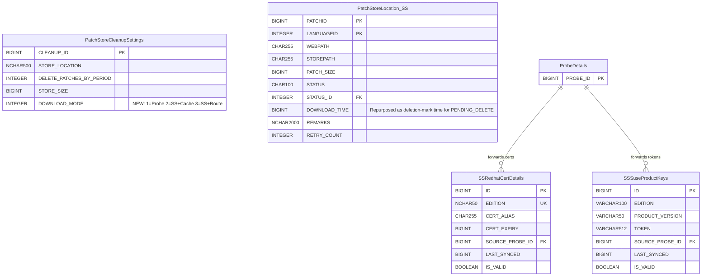
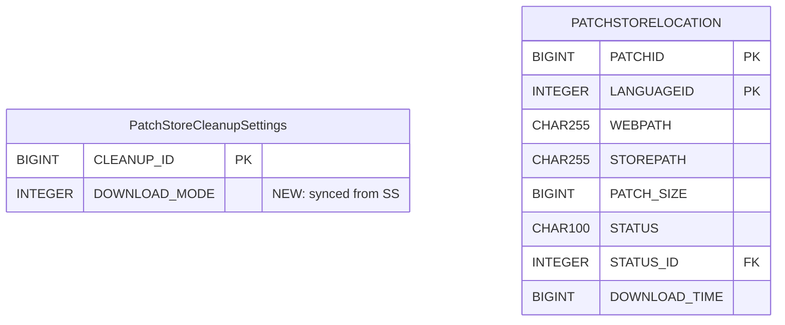

# Centralized Patch Download — Low-Level Design

> **Version:** 4.0 | **Date:** 2026-05-04
> **Product:** ManageEngine Endpoint Central
> **Scope:** DB Schema, REST APIs (payloads & responses), Nginx Config, Meta Files
> **Source of Truth:** [`system-design.md`](system-design.md) · [`download-change-plan.md`](download-change-plan.md) · [`change-plan-uc2-onwards.md`](change-plan-uc2-onwards.md)
> **PoC Evidence:** [`poc-proven-report.md`](poc-proven-report.md) · [`poc5-proof.md`](poc5-proof.md)

---

## Table of Contents

1. [Design Principles](#1-design-principles)
2. [DB Schema](#2-db-schema)
   - 2.1 [ER Diagram — SS Tables](#21-er-diagram--ss-tables)
   - 2.2 [ER Diagram — Probe Tables](#22-er-diagram--probe-tables)
   - 2.3 [Table Definitions](#23-table-definitions)
   - 2.4 [Status Enumerations](#24-status-enumerations)
   - 2.5 [SyMParameter Keys](#25-symparameter-keys)
   - 2.6 [websettings.conf Keys](#26-websettingsconf-keys)
   - 2.7 [Table Summary](#27-table-summary)
3. [REST APIs](#3-rest-apis)
   - 3.1 [URL Convention & Auth](#31-url-convention--auth)
   - 3.2 [Settings APIs (Existing Cleanup Settings — Extended)](#32-settings-apis-existing-cleanup-settings--extended)
   - 3.3 [Store Validation APIs](#33-store-validation-apis)
   - 3.4 [Probe → SS APIs (via PushToSummaryProcessor)](#34-probe--ss-apis-via-pushtosummaryprocessor)
   - 3.5 [Patch Store Management APIs (SS Admin)](#35-patch-store-management-apis-ss-admin)
   - 3.6 [Dependency Package APIs (SS Admin)](#36-dependency-package-apis-ss-admin)
   - 3.7 [Monitoring & Admin APIs](#37-monitoring--admin-apis)
   - 3.8 [Store Path Change API](#38-store-path-change-api)
   - 3.9 [Probe-Side APIs (Called by SS)](#39-probe-side-apis-called-by-ss)
   - 3.10 [Nginx Auth Servlets](#310-nginx-auth-servlets)
4. [Nginx Configuration](#4-nginx-configuration)
   - 4.1 [SS-Side Nginx](#41-ss-side-nginx)
   - 4.2 [Probe-Side Nginx (Self-Proxy Pattern)](#42-probe-side-nginx-self-proxy-pattern)
   - 4.3 [Template Placeholders & Mode Mapping](#43-template-placeholders--mode-mapping)
5. [Meta File Structures](#5-meta-file-structures)
   - 5.1 [Common Store Directory Layout](#51-common-store-directory-layout)
   - 5.2 [Per-Probe client-data Layout](#52-per-probe-client-data-layout)
   - 5.3 [XML Schemas & Samples](#53-xml-schemas--samples)
   - 5.4 [File Naming Conventions](#54-file-naming-conventions)
   - 5.5 [What Lives Where — Summary](#55-what-lives-where--summary)
6. [Settings Propagation Flow](#6-settings-propagation-flow)
7. [Reconciliation with Prior LLD Versions](#7-reconciliation-with-prior-lld-versions)

---

## 1. Design Principles

These principles are non-negotiable constraints from `system-design.md` that drive every schema and API decision below:

| # | Principle | LLD Impact |
|---|-----------|------------|
| 1 | **No push events for centralized download** — pure polling model (§10.3) | No `PATCH_STORE_UPDATED` / `ON_DEMAND_DOWNLOAD_FAILED` events. No event tables. |
| 2 | **No vendor fallback** — SS download failure = deployment failure (§13.3, §14) | No `FALLBACK_TO_VENDOR` column. No fallback API. |
| 3 | **No new collection statuses** — collection stays in "Draft - Download in progress" (§7.3) | No `502` / `503` status codes. |
| 4 | **Pending-patch state is in-memory** in `PatchDownloadListener` maps (§7.1 note) | No `CollectionPendingPatches` table. Startup recovery from collection definition (§9.5). |
| 5 | **No `OnDemandDownloadRequest`/`OnDemandPatchRequest` tables** — SS dedup via `PatchStoreLocation.STATUS_ID` on SS (§10.2) | Two tables eliminated. |
| 6 | **3-way download mode** (1=Probe, 2=SS+caching, 3=SS+routing) — not a boolean toggle (§7.1) | `DOWNLOAD_MODE` INTEGER column on existing `PatchStoreCleanupSettings`. |
| 7 | **Settings via existing cleanup settings API** — no dedicated settings table (§7.1, §8.1) | No `CentralizedDownloadSettings` table. Extend `PatchCleanupSettingsController`. |
| 8 | **Settings propagation via customer metadata XML** — not event push (§15.1) | `centralized-download-settings.xml` via `PatchMetaUtil`. |
| 9 | **SS restart required** for mode changes — Nginx config regenerated from templates at startup (§16.1) | No hot-reload for mode switch. |

---

## 2. DB Schema

### 2.1 ER Diagram — SS Tables



### 2.2 ER Diagram — Probe Tables



> **No `CollectionPendingPatches` table.** Per system-design.md §7.1: pending-patch state is tracked in-memory in `PatchDownloadListener.collectionToPatchStatusMap` / `nonCollectionToPatchStatusMap`. On Probe restart, the listener is repopulated from the collection definition (§9.5).

### 2.3 Table Definitions

#### 2.3.1 PatchStoreCleanupSettings — Modified (SS + Probe)

> **Existing singleton table** (`CLEANUP_ID ≠ 0`). One new column added. Full CRUD infrastructure already exists: `PatchCleanupSettingsUtil`, `CleanupSettings` model, `PatchCleanupSettingsService`, `PatchCleanupSettingsController`, `PatchStoreCleanupXmlGenerator`.

| Column | Type | Default | Nullable | New? | Description |
|--------|------|---------|----------|------|-------------|
| `CLEANUP_ID` | BIGINT (PK) | — | NO | Existing | Singleton row identifier |
| `STORE_LOCATION` | NCHAR(500) | — | YES | Existing | Patch store path |
| `DELETE_PATCHES_BY_PERIOD` | INTEGER | `0` | NO | Existing | Cleanup age threshold (months) |
| `STORE_SIZE` | BIGINT | `0` | NO | Existing | Store size limit |
| ... | ... | ... | ... | Existing | (other existing cleanup columns unchanged) |
| **`DOWNLOAD_MODE`** | INTEGER(2) | `1` | NO | **NEW** | `1`=Probe download (legacy), `2`=SS download with Probe caching, `3`=SS download without Probe caching |

**Data dictionary addition** (in `data-dictionary.xml`):

```xml
<column name="DOWNLOAD_MODE">
    <description>Patch download mode: 1=Probe download (legacy),
        2=Summary Server download with Probe caching,
        3=Summary Server download without Probe caching</description>
    <data-type>INTEGER</data-type>
    <max-size>2</max-size>
    <default-value>1</default-value>
    <nullable>false</nullable>
    <unique>false</unique>
</column>
```

**Why not a dedicated table:** `PatchStoreCleanupSettings` is already the single-row config for patch store behavior. Existing CRUD, API endpoints, and XML propagation all extend with one column — zero new infrastructure. The cleanup settings page is the planned UI for the centralized download toggle.

---

#### 2.3.2 PatchStoreLocation (SS — Reused from Probe, No Schema Changes)

> **Reused table** — same structure as the existing Probe-side `PatchStoreLocation` (defined in `data-dictionary.xml`, `BinaryRepository` schema). Added to `data-dictionary-ss.xml` with zero modifications. Tracks per-patch download lifecycle on SS. Both SS and Probe use the same table name in their respective databases — they are never joined.
>
> **Why reuse (not a new table):**
> - Same conceptual role: "which patches do I have, what's their status, where are they on disk?"
> - Same PK: composite `(PATCHID, LANGUAGEID)`
> - Same DAO/Util reuse: `PatchStoreLocationUtil`, `PatchStoreLocationHandler`, and all existing query patterns work directly
> - The download pipeline (`PatchDownloadManager`) that SS reuses (system-design.md §2.2) writes to `PatchStoreLocation` natively — no adapter needed
> - Checksum is already stored separately in `BINARYCHECKSUMVALUES` table via `BinaryChecksumUtil.addOrUpdateBinaryCheckSumValues()` — no inline `CHECKSUM_VAL` needed
> - `PENDING_DELETE_AT` column is unnecessary — when status flips to `PENDING_DELETE`, `DOWNLOAD_TIME` is overwritten with the current timestamp (original download time is irrelevant for a patch being deleted). `DeferredCleanupTask` queries: `WHERE STATUS_ID = PENDING_DELETE AND DOWNLOAD_TIME < (now - grace_period)`

| Column | Type | Default | Nullable | Description |
|--------|------|---------|----------|-------------|
| **`PATCHID`** | BIGINT (PK) | — | NO | Patch identifier |
| **`LANGUAGEID`** | INTEGER (PK) | `1` | NO | Language variant (`0`=all languages, `1`=English, etc.) |
| `WEBPATH` | CHAR(255) | — | NO | SS-internal relative URL (e.g., `/common-store/{fileName}`) |
| `STOREPATH` | CHAR(255) | — | NO | Physical file path on SS disk |
| `PATCH_SIZE` | BIGINT | `0` | NO | Size in bytes |
| `STATUS` | CHAR(100) | — | NO | String status (`AVAILABLE`, `DLOAD_FAILED`, etc.) |
| `STATUS_ID` | INTEGER (FK) | `99` | NO | FK → `ConfigStatusDefn.STATUS_ID` |
| `DOWNLOAD_TIME` | BIGINT | `-1` | NO | Epoch ms when downloaded. **Repurposed** as deletion-mark time when `STATUS_ID = PENDING_DELETE`. |
| `REMARKS` | NCHAR(2000) | — | YES | Failure reason (e.g., "Checksum mismatch after 3 retries") |
| `REMARKS_ARGS` | NCHAR(250) | — | YES | Format arguments for REMARKS |
| `RETRY_COUNT` | INTEGER | `0` | NO | Download retry attempts |

**Indexes:**

| Index | Columns | Purpose |
|-------|---------|---------|
| PK | `(PATCHID, LANGUAGEID)` | Composite primary key |
| `IDX_PSL_STATUS` | `(STATUS_ID)` | Bulk queries: all QUEUED, all FAILED, etc. |
| `IDX_PSL_PENDING_DELETE` | `(STATUS_ID, DOWNLOAD_TIME)` | `DeferredCleanupTask`: `WHERE STATUS_ID = PENDING_DELETE AND DOWNLOAD_TIME < (now - grace)` |

**Soft-delete grace period — no extra column needed:**

```java
// DeferredCleanupTask (SS, runs every 15 min):
// When marking PENDING_DELETE:
psl.setStatusId(PENDING_DELETE);
psl.setDownloadTime(System.currentTimeMillis());  // repurpose as deletion-mark time
PatchStoreLocationUtil.update(psl);

// When checking grace period:
long cutoff = System.currentTimeMillis() - (CLEANUP_GRACE_PERIOD_MINUTES * 60_000L);
// SELECT * FROM PatchStoreLocation WHERE STATUS_ID = PENDING_DELETE AND DOWNLOAD_TIME < cutoff
```

**DDL file:** `data-dictionary-ss.xml` (copy from existing `data-dictionary.xml` — no modifications)

---

#### 2.3.3 SSRedhatCertDetails (SS — New)

> One row per RedHat edition. Stores certs forwarded from Probes for mTLS against `cdn.redhat.com`.

| Column | Type | Default | Nullable | Description |
|--------|------|---------|----------|-------------|
| **`ID`** | BIGINT (PK, auto) | — | NO | Auto-generated |
| `EDITION` | VARCHAR(50) (UNIQUE) | — | NO | `Server` / `Workstation` / `Desktop` |
| `CERT_ALIAS` | VARCHAR(255) | `""` | NO | Keystore alias |
| `CERT_EXPIRY` | BIGINT | `-1` | YES | Expiry timestamp (`-1` = not set) |
| `SOURCE_PROBE_ID` | BIGINT (FK) | `-1` | NO | Audit: which Probe forwarded (`-1` = unknown) |
| `LAST_SYNCED` | BIGINT | `-1` | NO | Last sync time (`-1` = never) |
| `IS_VALID` | BOOLEAN | `true` | NO | Whether cert is currently valid |

**FK:** `SOURCE_PROBE_ID` → `ProbeDetails.PROBE_ID`
**Unique constraint:** `EDITION`

**DDL file:** `data-dictionary-ss.xml`

---

#### 2.3.4 SSSuseProductKeys (SS — New)

> Stores SUSE registration tokens forwarded from Probes. One row per (edition, product version).

| Column | Type | Default | Nullable | Description |
|--------|------|---------|----------|-------------|
| **`ID`** | BIGINT (PK, auto) | — | NO | Auto-generated |
| `EDITION` | VARCHAR(100) | — | NO | SUSE product edition |
| `PRODUCT_VERSION` | VARCHAR(50) | — | NO | SUSE product version |
| `TOKEN` | VARCHAR(512) | `""` | NO | SCC registration token |
| `SOURCE_PROBE_ID` | BIGINT (FK) | `-1` | NO | Audit: which Probe forwarded |
| `LAST_SYNCED` | BIGINT | `-1` | NO | Last sync timestamp |
| `IS_VALID` | BOOLEAN | `true` | NO | Whether token is valid |

**FK:** `SOURCE_PROBE_ID` → `ProbeDetails.PROBE_ID`
**Unique constraint:** `(EDITION, PRODUCT_VERSION)`

**DDL file:** `data-dictionary-ss.xml`

---

#### 2.3.5 PATCHSTORELOCATION (Probe — Existing, No Schema Changes)

> Existing table — unchanged. When centralized download is enabled, populated by the deployment gate (§9.2), polling scheduler (§9.4), and missing-patch scheduler (§17.2) via **direct UPSERT** (bypassing download queue).

| Column | Type | Notes for Centralized Download |
|--------|------|-------------------------------|
| `PATCHID` | BIGINT (PK) | Same as legacy |
| `LANGUAGEID` | INTEGER (PK) | Same as legacy |
| `WEBPATH` | CHAR(255) | Set to `https://{probe}:{port}/store/{fileName}` — DS/Agents download from Probe Nginx |
| `STATUS` | CHAR(100) | `AVAILABLE` when file confirmed in common store |
| `STATUS_ID` | INTEGER | `PATCH_DLOAD_AVAILABLE` constant |
| `DOWNLOAD_TIME` | BIGINT | Time when file was discovered in common store |

**No `SOURCE_TYPE` column added.** Per system-design.md §7.2: `WEBPATH` value already distinguishes source (`/store/{file}` = centralized, vendor URL = legacy). No query filters by source type.

---

### 2.4 Status Enumerations

#### PatchStoreLocation STATUS/STATUS_ID (SS — same pattern as Probe)

> Uses the existing `STATUS`/`STATUS_ID` pattern from `ConfigStatusDefn`. String values match existing Probe constants. Two new statuses added to `ConfigStatusDefn` for soft-delete lifecycle.

| STATUS (string) | STATUS_ID | Existing? | Description |
|-----------------|-----------|-----------|-------------|
| `DLOAD_REQUESTED` | (existing) | ✅ | Queued for download from vendor |
| `DLOAD_RUNNING` | (existing) | ✅ | Download in progress |
| `AVAILABLE` | (existing) | ✅ | Downloaded, checksum validated, ready for serving |
| `DLOAD_FAILED` | (existing) | ✅ | Download failed after retries. `.failed` marker written. |
| `PENDING_DELETE` | (new) | ❌ | Soft-deleted. `DOWNLOAD_TIME` overwritten with deletion-mark time. Physical removal after grace period. |
| `DELETED` | (new) | ❌ | Physically deleted from common store. |

#### Collection Status — No New Values

> **No new collection statuses.** Per system-design.md §7.3: collection stays in existing "Draft - Download in progress" while patches are pending from SS. The listener's `performPostDownloadCompletion` fires automatically when no patch is `INITIATED`/`INPROGRESS`.

#### Download Mode Values

| Value | Name | Nginx Behavior | Description |
|-------|------|---------------|-------------|
| `1` | `probe` | Standard `alias $store` | Legacy — each Probe downloads from vendor independently |
| `2` | `summary-caching` | Self-proxy + `proxy_cache patch_cache` | SS downloads centrally; Probe Nginx caches locally |
| `3` | `summary-routing` | Self-proxy + `proxy_cache off` | SS downloads centrally; Probe acts as pass-through |

---

### 2.5 SyMParameter Keys

> Stored in existing `SyMParameter` table (key-value store). Written by SS admin via cleanup settings API; pulled by Probes on startup + post-DB-sync.

| Key | Example Value | Written By | Read By |
|-----|---------------|-----------|---------|
| `common_store_dir` | `\\\\SS_HOST\\PatchStore` | SS admin (cleanup settings API) | `CentralizedDownloadUtil.getCommonStorePath()`, Nginx template `%common.store.path%` |
| `probe_cache_max_size` | `50g` | SS admin (cleanup settings API) | Nginx template `%probe.cache.max.size%` |
| `on_demand_timeout_minutes` | `30` | Default; admin-configurable | `OnDemandTimeoutTask` |
| `cleanup_grace_period_minutes` | `30` | Default; admin-configurable | `DeferredCleanupTask` |

---

### 2.6 websettings.conf Keys

> Written by `WebServerUtil.addOrUpdateProperty()`. Read by Nginx template resolution at startup.

| Key | Default (mode=1) | Mode 2 (caching) | Mode 3 (routing) | Purpose |
|-----|-------------------|-------------------|-------------------|---------|
| `centralized.download.enabled` | `#` | (empty) | (empty) | Prefix for centralized Nginx lines |
| `centralized.download.disabled` | (empty) | `#` | `#` | Prefix for standard `/store/` alias lines |
| `centralized.cache.enabled` | `#` | (empty) | `#` | Prefix for `proxy_cache patch_cache` line |
| `centralized.cache.disabled` | `#` | `#` | (empty) | Prefix for `proxy_cache off` line |
| `centralized.cache.max.size` | N/A | `50` (GB) | N/A | `max_size` for `proxy_cache_path` |
| `centralized.patch.repo.path` | N/A | `F:/PatchStore` | `F:/PatchStore` | Common store path for Nginx `alias` |

---

### 2.7 Table Summary

| Table | Location | Type | DDL File |
|-------|----------|------|----------|
| `PatchStoreCleanupSettings` | SS + Probe | **Modified** (add `DOWNLOAD_MODE`) | `data-dictionary.xml` |
| `PatchStoreLocation` | SS | **Reused from Probe (no schema changes)** — `DOWNLOAD_TIME` repurposed for soft-delete grace period | `data-dictionary-ss.xml` |
| `SSRedhatCertDetails` | SS | **New** | `data-dictionary-ss.xml` |
| `SSSuseProductKeys` | SS | **New** | `data-dictionary-ss.xml` |
| `PATCHSTORELOCATION` | Probe | **Existing (no changes)** | — |
| `SuseProductKeys` | SS | **Reused from Probe** (for `SuseAuthtokenTask`) | `data-dictionary-ss.xml` |
| `SuseAuthTokens` | SS | **Reused from Probe** (populated by `SuseAuthtokenTask`) | `data-dictionary-ss.xml` |
| `PatchKeystoreDetails` | SS | **Reused from Probe** (PKCS12 keystore) | `data-dictionary-ss.xml` |

**Tables explicitly NOT created:**

| Table | Why Not |
|-------|---------|
| `PatchStoreLocation (SS)` | Reuse existing `PatchStoreLocation` — same schema, same DAO, same `ConfigStatusDefn` pattern. Checksum in `BINARYCHECKSUMVALUES`. Soft-delete grace via repurposed `DOWNLOAD_TIME`. |
| `CentralizedDownloadSettings` | `DOWNLOAD_MODE` on existing `PatchStoreCleanupSettings` + SyMParameter keys |
| `OnDemandDownloadRequest` | SS dedup via `PatchStoreLocation.STATUS_ID` check (§10.2). No tracking rows. |
| `OnDemandPatchRequest` | Same — eliminated. |
| `CollectionPendingPatches` (Probe) | Pending state in-memory in `PatchDownloadListener` maps. Rebuilt on restart from collection definition (§9.5). |

---

## 3. REST APIs

### 3.1 URL Convention & Auth

**Base path:** All centralized download APIs use `/dcapi/centralizedDownload` **except** settings, which use the existing cleanup settings path.

**Auth patterns:**

| Caller | Auth Mechanism | Headers |
|--------|---------------|---------|
| **SS Admin (browser)** | Session cookie + CSRF | Standard DC session auth |
| **Probe → SS** (PushToSummaryProcessor) | API key headers | `SUMMARY_API_KEY`, `PROBE_ID`, `HS_KEY`, `PROBE_NAME`, `SUMMARY_SERVER_REQUEST`, `USER_DOMAIN` |
| **SS → Probe** (REST call) | SS auth headers | `SUMMARY_API_KEY`, `PROBE_ID` |
| **DS/Agent → Probe Nginx** | `auth_request` subrequest | Agent.key / basic auth |
| **Probe → SS Nginx** | `auth_request` subrequest | `SUMMARY_API_KEY`, `PROBE_ID`, `HS_KEY` |

**API Summary:**

| # | Method | Endpoint | Caller | Use Case |
|---|--------|----------|--------|----------|
| 1 | `GET` | `PATCH_DB/SETTINGS/cleanupSettings` | SS Admin | Fetch settings (extended with `downloadMode`, `commonStoreDir`, `probeCacheMaxSize`) |
| 2 | `PUT` | `PATCH_DB/SETTINGS/cleanupSettings` | SS Admin | Update settings (triggers customer metadata XML generation) |
| 3 | `POST` | `/dcapi/centralizedDownload/validateStore` | SS Admin | Validate store path (writable, space) |
| 4 | `POST` | `/dcapi/centralizedDownload/validateProbeAccess` | SS Admin | Validate all Probes can access common store (sentinel check) |
| 5 | `POST` | `/dcapi/centralizedDownload/onDemandRequest` | Probe → SS | Request priority download of missing patches |
| 6 | `POST` | `/dcapi/centralizedDownload/reportCorrupted` | Probe → SS | Report checksum-invalid patch in common store |
| 7 | `POST` | `/dcapi/centralizedDownload/dependencyPackages` | Probe → SS | Forward Linux dependency package metadata |
| 8 | `POST` | `/dcapi/centralizedDownload/redhatCert` | Probe → SS | Forward RedHat mTLS certificate |
| 9 | `POST` | `/dcapi/centralizedDownload/suseKeys` | Probe → SS | Forward SUSE registration codes |
| 10 | `POST` | `/dcapi/centralizedDownload/upload` | Probe → SS / SS Admin | Upload patch binary to common store |
| 11 | `POST` | `/dcapi/centralizedDownload/patches/redownload` | SS Admin | Re-trigger download for failed patches |
| 12 | `DELETE` | `/dcapi/centralizedDownload/patches` | SS Admin | Soft-delete patches (grace period before physical removal) |
| 13 | `POST` | `/dcapi/centralizedDownload/dependency/redownload` | SS Admin | Re-trigger download for failed dependency packages |
| 14 | `DELETE` | `/dcapi/centralizedDownload/dependency` | SS Admin | Delete dependency packages from common store |
| 15 | `GET` | `/dcapi/centralizedDownload/stats` | SS Admin | Common store statistics |
| 16 | `GET` | `/dcapi/centralizedDownload/probeStatus` | SS Admin | Per-Probe sync/access status |
| 17 | `POST` | `/dcapi/centralizedDownload/retryOnDemand/{collectionId}` | SS Admin | Re-send on-demand request for stuck collection |
| 18 | `POST` | `/dcapi/centralizedDownload/cancelDeployment/{collectionId}` | SS Admin | Cancel stuck collection |
| 19 | `PUT` | `/dcapi/centralizedDownload/changePath` | SS Admin | Change common store path (validate → migrate → switch) |
| 20 | `GET` | `/dcapi/centralizedDownload/settings` | Probe → SS | Probe pulls centralized settings on startup/sync |
| 21 | `GET` | `/api/v1/probe/centralizedDownload/validateStoreAccess` | SS → Probe | SS asks Probe to verify common store access |

---

### 3.2 Settings APIs (Existing Cleanup Settings — Extended)

> Settings are managed through the **existing** `PatchCleanupSettingsController`, not a separate endpoint. The `CleanupSettings` model is extended with `downloadMode`, `commonStoreDir`, and `probeCacheMaxSize` fields.

#### GET `PATCH_DB/SETTINGS/cleanupSettings`

Returns current settings. Extended response includes centralized download fields.

**Auth:** SS Admin session

**Response `200 OK`:**

```json
{
    "cleanupId": 1,
    "storeLocation": "F:\\PatchStore\\LocalStore",
    "deleteSupersededPatches": true,
    "deletePatchesByPeriod": 6,
    "storeSize": 107374182400,
    "notifySpaceExceedsGB": 30,
    "notifyDownloadFailureHours": 4,
    "downloadMode": 1,
    "commonStoreDir": "",
    "probeCacheMaxSize": "50g"
}
```

| Field | Type | Values | Description |
|-------|------|--------|-------------|
| `downloadMode` | int | `1` / `2` / `3` | 1=Probe download, 2=SS+caching, 3=SS+routing |
| `commonStoreDir` | string | Network path | Common store path (empty when mode=1) |
| `probeCacheMaxSize` | string | e.g. `"50g"` | Probe Nginx cache size (only relevant for mode=2) |

---

#### PUT `PATCH_DB/SETTINGS/cleanupSettings`

Updates settings. When `downloadMode` changes, writes `DOWNLOAD_MODE` column + SyMParameters + generates customer metadata XML for Probe propagation.

**Auth:** SS Admin session

**Request:**

```json
{
    "cleanupId": 1,
    "storeLocation": "F:\\PatchStore\\LocalStore",
    "deleteSupersededPatches": true,
    "deletePatchesByPeriod": 6,
    "storeSize": 107374182400,
    "notifySpaceExceedsGB": 30,
    "notifyDownloadFailureHours": 4,
    "downloadMode": 2,
    "commonStoreDir": "\\\\NAS\\PatchStore",
    "probeCacheMaxSize": "50g"
}
```

**Response `200 OK`:**

```json
{
    "status": "success",
    "message": "Settings updated. Server restart required for mode change to take effect.",
    "restartRequired": true
}
```

**Response `400 Bad Request`:**

```json
{
    "status": "error",
    "errorCode": "STORE_PATH_REQUIRED",
    "message": "Common store path is required when download mode is 2 or 3"
}
```

**Validation rules:**
- `downloadMode` must be `1`, `2`, or `3`
- When `downloadMode >= 2`: `commonStoreDir` must be non-empty
- When `downloadMode == 2`: `probeCacheMaxSize` must be a valid Nginx size string (e.g. `"50g"`)

**Side effects on save:**
1. Persist `DOWNLOAD_MODE` to `PatchStoreCleanupSettings` via `PatchCleanupSettingsUtil`
2. Persist `common_store_dir` and `probe_cache_max_size` to SyMParameter via `SyMUtil.updateSyMParameter()`
3. Update `websettings.conf` via `WebServerUtil.addOrUpdateProperty()` (all 6 keys from §2.6)
4. Generate `centralized-download-settings.xml` via `PatchMetaUtil.addOrUpdateCustomerMeta()` → `DCMetaDataUtil.generateCustomerMetaDataForAllManagedCustomers()`
5. Generate `PatchStoreCleanupXmlGenerator.generateXML()` → propagates to DS via MasterRepository
6. **⚠️ SS restart required** for Nginx config to regenerate from templates

---

### 3.3 Store Validation APIs

#### POST `/dcapi/centralizedDownload/validateStore`

Dry-run validation of a proposed store path — checks writable + sufficient disk space on SS. Does not persist.

**Auth:** SS Admin session

**Request:**

```json
{
    "commonStorePath": "\\\\NAS\\PatchStore"
}
```

**Response `200 OK`:**

```json
{
    "valid": true,
    "totalSpaceGB": 500,
    "freeSpaceGB": 320,
    "writable": true
}
```

**Response `200 OK` (validation failed — not an HTTP error):**

```json
{
    "valid": false,
    "reason": "NOT_WRITABLE",
    "message": "Path exists but is not writable by the service account"
}
```

---

#### POST `/dcapi/centralizedDownload/validateProbeAccess`

Validates all online Probes can access the common store path. SS writes a sentinel file, then calls each Probe's validation endpoint.

**Auth:** SS Admin session

**Request:**

```json
{
    "commonStorePath": "\\\\NAS\\PatchStore"
}
```

**Response `200 OK`:**

```json
{
    "overallStatus": "FAILED",
    "totalProbes": 5,
    "responded": 4,
    "timedOut": 1,
    "results": [
        {
            "probeId": 1001,
            "probeName": "Probe-US",
            "status": "SUCCESS",
            "freeSpaceGB": 150
        },
        {
            "probeId": 1002,
            "probeName": "Probe-EU",
            "status": "SUCCESS",
            "freeSpaceGB": 200
        },
        {
            "probeId": 1003,
            "probeName": "Probe-APAC",
            "status": "FAILED",
            "error": "Directory not found: \\\\NAS\\PatchStore"
        },
        {
            "probeId": 1004,
            "probeName": "Probe-JP",
            "status": "SUCCESS",
            "freeSpaceGB": 95
        },
        {
            "probeId": 1005,
            "probeName": "Probe-BR",
            "status": "TIMED_OUT"
        }
    ]
}
```

**SS-side processing:**
1. Write sentinel: `{commonStorePath}/.ss-store-sentinel` with `{ "ssId": "...", "timestamp": ..., "nonce": "abc123" }`
2. For each online Probe: `GET /api/v1/probe/centralizedDownload/validateStoreAccess?commonStorePath=...&sentinelNonce=abc123` (2 min timeout)
3. Collect results, return aggregate

---

### 3.4 Probe → SS APIs (via PushToSummaryProcessor)

> These endpoints are called by Probes via `PushToSummaryProcessor` (push-to-summary queue, DB-backed, async, single-threaded). Auth: Probe API key headers. Probes **do not inspect HTTP responses** — all result discovery is via polling the common store.

#### POST `/dcapi/centralizedDownload/onDemandRequest`

Probe requests priority download of missing patches for a deployment.

**Auth:** Probe API key headers

**Request:**

```json
{
    "patchIds": [101, 102, 103],
    "collectionId": 12345,
    "probeId": 1001,
    "requestTime": 1740000000000
}
```

**Response `200 OK`:**

```json
{
    "accepted": [101, 103],
    "alreadyAvailable": [102],
    "estimatedTimeMinutes": 5
}
```

| Field | Description |
|-------|-------------|
| `accepted` | Patches queued for priority download (not yet in common store) |
| `alreadyAvailable` | Patches already `STATUS=AVAILABLE` in `PatchStoreLocation (SS)` |
| `estimatedTimeMinutes` | Rough ETA based on queue depth |

**SS processing:**
1. Check `PatchStoreLocation (SS)` → split `accepted` vs `alreadyAvailable`
2. For accepted where `STATUS = FAILED`: clear `.failed` marker, reset to `QUEUED`
3. Skip if `STATUS IN (QUEUED, DOWNLOADING)` — already being handled
4. Queue accepted patches with **highest priority** (front of download queue)
5. **No tracking rows** — dedup via SS `PatchStoreLocation.STATUS_ID`
6. **No push event** — Probe discovers result via 5-min polling scheduler

---

#### POST `/dcapi/centralizedDownload/reportCorrupted`

Probe reports that a patch file in the common store has an invalid checksum.

**Auth:** Probe API key headers

**Request:**

```json
{
    "patchId": 205,
    "collectionId": 12345,
    "probeId": 1001,
    "corruptedLanguageIds": [1, 3],
    "requestTime": 1740000000000
}
```

**Response `200 OK`:**

```json
{
    "status": "success",
    "message": "Corrupted files will be deleted and re-queued for download"
}
```

**SS processing:**
1. Delete corrupted file(s) from common store
2. Delete any `.failed` markers for the affected language IDs
3. Reset SS `PatchStoreLocation.STATUS_ID` to `DLOAD_REQUESTED`
4. Re-queue download from vendor with highest priority
5. Probe's polling scheduler continues monitoring

---

#### POST `/dcapi/centralizedDownload/dependencyPackages`

Probe forwards Linux dependency package metadata to SS.

**Auth:** Probe API key headers

**Request:**

```json
{
    "probeId": 1001,
    "packages": [
        {
            "packageId": 1,
            "productId": 300180,
            "packageName": "iputils-ping_20190709-3ubuntu1_amd64.deb",
            "checksum": "ce08339e42c42bd624113b5cbf33110797e0241bdb3e3b65c5fb7bb058bf7be0",
            "checksumType": "sha256",
            "downloadUrl": "http://archive.ubuntu.com/ubuntu/pool/main/i/iputils/iputils-ping_20190709-3ubuntu1_amd64.deb",
            "osFlavor": "ubuntu"
        }
    ]
}
```

**Response `200 OK`:**

```json
{
    "status": "success",
    "inserted": 1,
    "duplicatesSkipped": 0
}
```

**SS processing:**
1. Dedup-insert into SS-side `PACKAGEINFO` on `(package_name, product_id, checksum)`
2. Trigger `SSDependencyDownloadTask` for affected flavor (async, immediate)
3. Scheduled fallback: task runs every 10 min regardless

---

#### POST `/dcapi/centralizedDownload/redhatCert`

Probe forwards a RedHat mTLS certificate for SS-side CDN authentication.

**Auth:** Probe API key headers
**Content-Type:** `multipart/form-data` (via `MultiPartUtilImpl`)

**Request (multipart):**

| Part | Type | Description |
|------|------|-------------|
| `certFile` | Binary (ZIP) | Archive containing `client.pem`, `client-key.pem`, `ca.pem` |
| `edition` | Text | `Server` / `Workstation` / `Desktop` |
| `probeId` | Text | Source Probe ID |
| `certExpiry` | Text | Epoch ms of certificate expiry |

**Response `200 OK`:**

```json
{
    "status": "success",
    "edition": "Server",
    "keystoreAlias": "patch_keystore_server",
    "message": "RedHat certificate stored successfully"
}
```

**SS processing:**
1. Check existing cert for this edition: if current cert has later expiry → skip
2. Extract ZIP → import PEMs into PKCS12 keystore via `PatchKeystoreService`
3. UPSERT `SSRedhatCertDetails` by `EDITION`
4. Store keystore password in `PatchKeystoreDetails`

---

#### POST `/dcapi/centralizedDownload/suseKeys`

Probe forwards SUSE registration codes to SS.

**Auth:** Probe API key headers

**Request:**

```json
{
    "probeId": 1001,
    "customerId": 5001,
    "keys": [
        {
            "productKey": "XXXX-XXXX-XXXX-XXXX",
            "osEdition": "server",
            "productVersion": "15.4"
        }
    ]
}
```

**Response `200 OK`:**

```json
{
    "status": "success",
    "inserted": 1,
    "updated": 0
}
```

**SS processing:**
1. UPSERT `SSSuseProductKeys` on `(EDITION, PRODUCT_VERSION)`
2. Run `SuseAuthtokenTask` to fetch auth tokens from `scc.suse.com`
3. Tokens stored in `SuseAuthTokens`, consumed by `SuseSettingsUtil.appendSUSEToken()` at download time

---

#### POST `/dcapi/centralizedDownload/upload`

Accepts multipart upload; stores binary in common store. Used by both SS admin directly and Probe's `ProbeUploadForwarder`.

**Auth:** Probe API key headers or SS Admin session
**Content-Type:** `multipart/form-data`

**Request (multipart):**

| Part | Type | Description |
|------|------|-------------|
| `file` | Binary | Patch binary file |
| `patchId` | Text | Patch identifier |
| `languageId` | Text | Language variant (`1`=English, `0`=all) |
| `fileName` | Text | Target file in
