# Centralized Patch Download — Use Case Flow Diagrams

> **Source:** [`system-design.md`](system-design.md), [`download-change-plan.md`](download-change-plan.md), [`change-plan-uc2-onwards.md`](change-plan-uc2-onwards.md)

---

## UC-1.1: Deployment-Triggered Download — Patch Not in Common Store

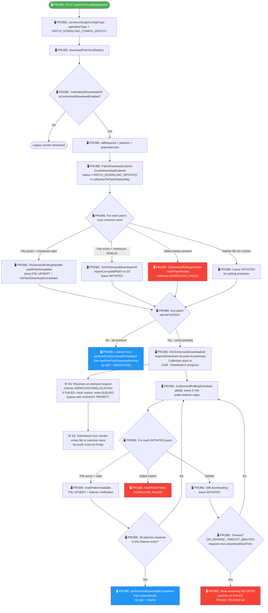
```mermaid
%%{init: {'flowchart': {'wrappingWidth': 350, 'nodeSpacing': 30, 'rankSpacing': 50}} }%%
flowchart TD
    A(["🖥️ PROBE: POST /patch/manualdeployment"]) --> B["🖥️ PROBE: constructSingleConfigProps<br/>operationType = PATCH_DOWNLOAD_CONFIG_DEPLOY"]
    B --> C["🖥️ PROBE: downloadPatchAndDeploy"]
    C --> D{"🖥️ PROBE: CentralizedDownloadUtil<br/>.isCentralizedDownloadEnabled?"}
    D -->|No| LEGACY(["Legacy vendor download"])
    D -->|Yes| E["🖥️ PROBE: allRequired = patches + dependencies"]
    E --> F["🖥️ PROBE: PatchDownloadListener<br/>.invokeDownloadListener<br/>status = PATCH_DOWNLOAD_INITIATED<br/>in collectionToPatchStatusMap"]
    F --> G{"🖥️ PROBE: For each patch:<br/>scan common store"}
    G -->|"File exists + checksum valid"| H["🖥️ PROBE: OnDemandPollingHandler<br/>.markPatchAvailable<br/>direct PSL UPSERT + onPatchDownloadCompleted"]
    G -->|"File exists + checksum INVALID"| I["🖥️ PROBE: SSOnDemandDownloadUtil<br/>.reportCorruptedPatch to SS<br/>leave INITIATED"]
    G -->|".failed marker present"| J["🖥️ PROBE: OnDemandPollingHandler<br/>.markPatchFailed<br/>collection DOWNLOAD_FAILED"]
    G -->|"Neither file nor marker"| K["🖥️ PROBE: Leave INITIATED<br/>for polling scheduler"]
    H --> L{"🖥️ PROBE: Any patch<br/>still INITIATED?"}
    I --> L
    J --> L
    K --> L
    L -->|"No - all resolved"| M["🖥️ PROBE: Listener fires<br/>performPostDownloadCompletion<br/>then performPostDownloadActivity<br/>zip gen + deployConfig"]
    L -->|"Yes - some pending"| N["🖥️ PROBE: SSOnDemandDownloadUtil<br/>.requestDownload via push-to-summary<br/>Collection stays in<br/>Draft - Download in progress"]
    N --> O["🌐 SS: Receives on-demand request<br/>Checks SSPATCHSTORELOCATION<br/>If FAILED: clear marker, reset QUEUED<br/>Queue with HIGHEST PRIORITY"]
    O --> P["🌐 SS: Downloads from vendor<br/>writes file to common store<br/>No push event to Probe"]
    N --> Q["🖥️ PROBE: OnDemandPollingScheduler<br/>global, every 5 min<br/>walks listener maps"]
    Q --> R{"🖥️ PROBE: For each INITIATED patch"}
    R -->|"File exists + valid"| S["🖥️ PROBE: markPatchAvailable<br/>PSL UPSERT + listener notification"]
    R -->|".failed marker"| T["🖥️ PROBE: markPatchFailed<br/>DOWNLOAD_FAILED"]
    R -->|Neither| U["🖥️ PROBE: Still downloading<br/>leave INITIATED"]
    S --> V{"🖥️ PROBE: All patches resolved<br/>in this listener entry?"}
    V -->|Yes| W["🖥️ PROBE: performPostDownloadCompletion<br/>fires automatically<br/>zip gen + deploy"]
    V -->|No| Q
    U --> X{"🖥️ PROBE: Timeout?<br/>ON_DEMAND_TIMEOUT_MINUTES<br/>elapsed since downloadStartTime"}
    X -->|No| Q
    X -->|Yes| Y["🖥️ PROBE: Mark remaining INITIATED<br/>patches as FAILED<br/>Reason: SS timed out"]

    style A fill:#4CAF50,color:#fff
    style M fill:#2196F3,color:#fff
    style W fill:#2196F3,color:#fff
    style T fill:#f44336,color:#fff
    style Y fill:#f44336,color:#fff
    style J fill:#f44336,color:#fff
```

---

## UC-1.2: Agent-Requested Patch Download

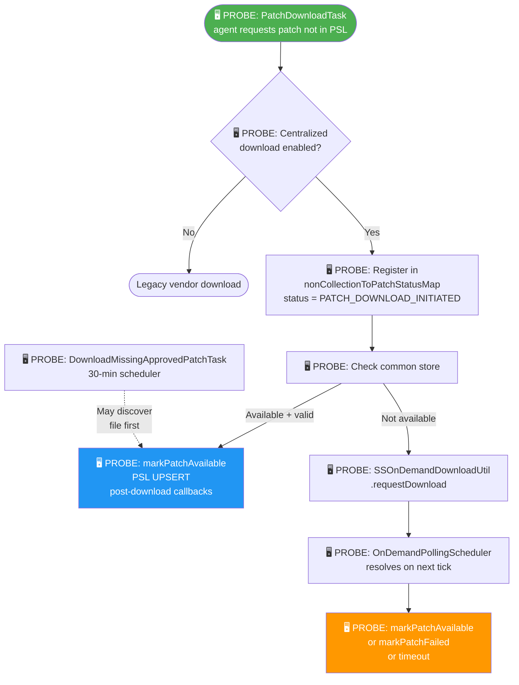
```mermaid
%%{init: {'flowchart': {'wrappingWidth': 350, 'nodeSpacing': 30, 'rankSpacing': 50}} }%%
flowchart TD
    A(["🖥️ PROBE: PatchDownloadTask<br/>agent requests patch not in PSL"]) --> B{"🖥️ PROBE: Centralized<br/>download enabled?"}
    B -->|No| Z(["Legacy vendor download"])
    B -->|Yes| C["🖥️ PROBE: Register in<br/>nonCollectionToPatchStatusMap<br/>status = PATCH_DOWNLOAD_INITIATED"]
    C --> D["🖥️ PROBE: Check common store"]
    D -->|Available + valid| E["🖥️ PROBE: markPatchAvailable<br/>PSL UPSERT<br/>post-download callbacks"]
    D -->|Not available| F["🖥️ PROBE: SSOnDemandDownloadUtil<br/>.requestDownload"]
    F --> G["🖥️ PROBE: OnDemandPollingScheduler<br/>resolves on next tick"]
    G --> H["🖥️ PROBE: markPatchAvailable<br/>or markPatchFailed<br/>or timeout"]

    I["🖥️ PROBE: DownloadMissingApprovedPatchTask<br/>30-min scheduler"] -.->|May discover<br/>file first| E

    style A fill:#4CAF50,color:#fff
    style E fill:#2196F3,color:#fff
    style H fill:#FF9800,color:#fff
```

---

## UC-1.3: Missing Patch Scheduler — Background Discovery

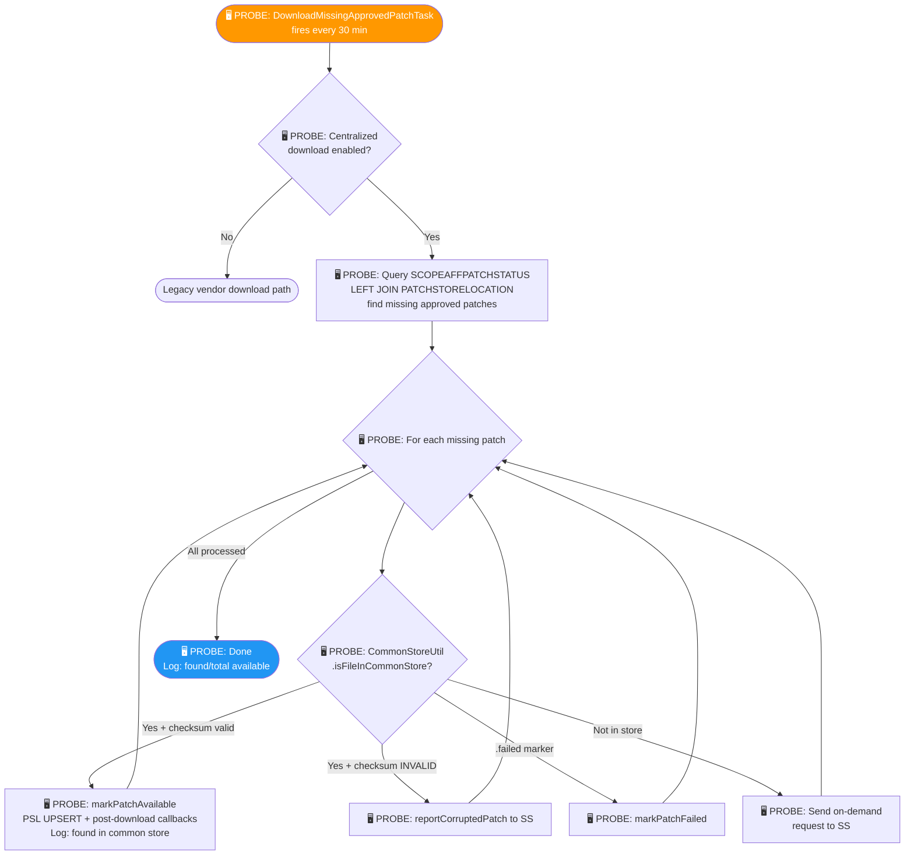
```mermaid
%%{init: {'flowchart': {'wrappingWidth': 350, 'nodeSpacing': 30, 'rankSpacing': 50}} }%%
flowchart TD
    A(["🖥️ PROBE: DownloadMissingApprovedPatchTask<br/>fires every 30 min"]) --> B{"🖥️ PROBE: Centralized<br/>download enabled?"}
    B -->|No| Z(["Legacy vendor download path"])
    B -->|Yes| C["🖥️ PROBE: Query SCOPEAFFPATCHSTATUS<br/>LEFT JOIN PATCHSTORELOCATION<br/>find missing approved patches"]
    C --> D{"🖥️ PROBE: For each missing patch"}
    D --> E{"🖥️ PROBE: CommonStoreUtil<br/>.isFileInCommonStore?"}
    E -->|"Yes + checksum valid"| F["🖥️ PROBE: markPatchAvailable<br/>PSL UPSERT + post-download callbacks<br/>Log: found in common store"]
    E -->|"Yes + checksum INVALID"| G["🖥️ PROBE: reportCorruptedPatch to SS"]
    E -->|".failed marker"| H["🖥️ PROBE: markPatchFailed"]
    E -->|"Not in store"| I["🖥️ PROBE: Send on-demand<br/>request to SS"]
    F --> D
    G --> D
    H --> D
    I --> D
    D -->|All processed| J(["🖥️ PROBE: Done<br/>Log: found/total available"])

    style A fill:#FF9800,color:#fff
    style J fill:#2196F3,color:#fff
```

---

## UC-1.4: Redownload Triggered for Patch

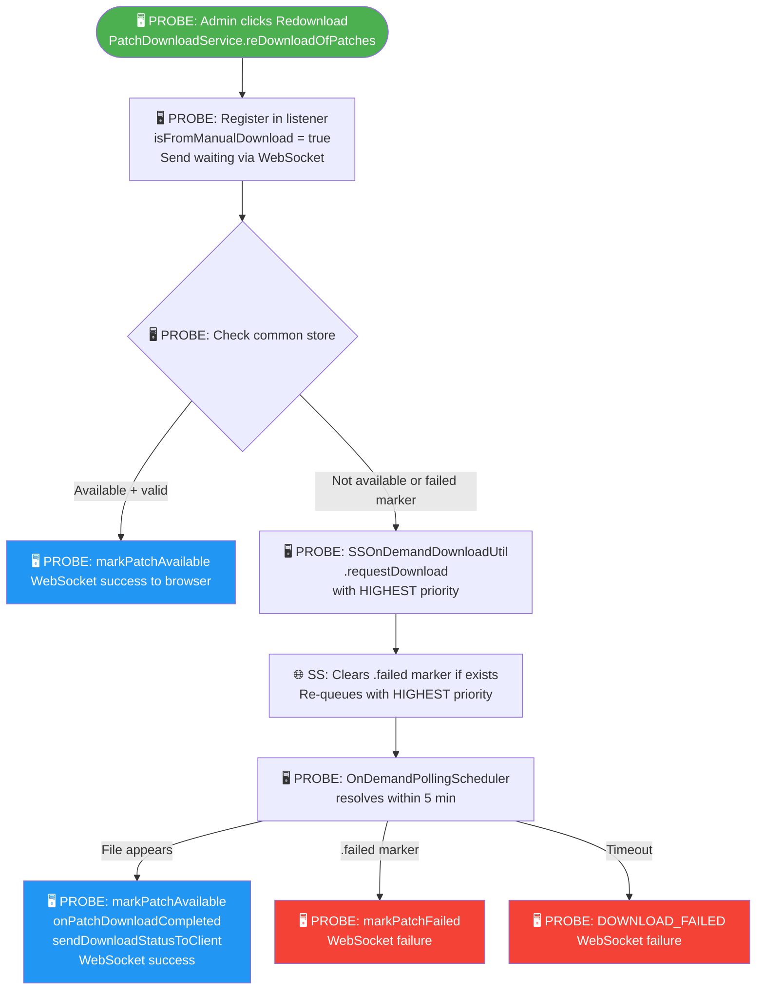
```mermaid
%%{init: {'flowchart': {'wrappingWidth': 350, 'nodeSpacing': 30, 'rankSpacing': 50}} }%%
flowchart TD
    A(["🖥️ PROBE: Admin clicks Redownload<br/>PatchDownloadService.reDownloadOfPatches"]) --> B["🖥️ PROBE: Register in listener<br/>isFromManualDownload = true<br/>Send waiting via WebSocket"]
    B --> C{"🖥️ PROBE: Check common store"}
    C -->|Available + valid| D["🖥️ PROBE: markPatchAvailable<br/>WebSocket success to browser"]
    C -->|Not available or failed marker| E["🖥️ PROBE: SSOnDemandDownloadUtil<br/>.requestDownload<br/>with HIGHEST priority"]
    E --> F["🌐 SS: Clears .failed marker if exists<br/>Re-queues with HIGHEST priority"]
    F --> G["🖥️ PROBE: OnDemandPollingScheduler<br/>resolves within 5 min"]
    G -->|File appears| H["🖥️ PROBE: markPatchAvailable<br/>onPatchDownloadCompleted<br/>sendDownloadStatusToClient<br/>WebSocket success"]
    G -->|.failed marker| I["🖥️ PROBE: markPatchFailed<br/>WebSocket failure"]
    G -->|Timeout| J["🖥️ PROBE: DOWNLOAD_FAILED<br/>WebSocket failure"]

    style A fill:#4CAF50,color:#fff
    style D fill:#2196F3,color:#fff
    style H fill:#2196F3,color:#fff
    style I fill:#f44336,color:#fff
    style J fill:#f44336,color:#fff
```

---

## UC-1.5: Download Failure on SS

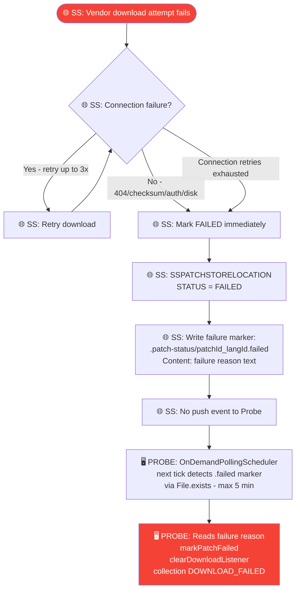
```mermaid
%%{init: {'flowchart': {'wrappingWidth': 350, 'nodeSpacing': 30, 'rankSpacing': 50}} }%%
flowchart TD
    A(["🌐 SS: Vendor download attempt fails"]) --> B{"🌐 SS: Connection failure?"}
    B -->|"Yes - retry up to 3x"| C["🌐 SS: Retry download"]
    C --> B
    B -->|"No - 404/checksum/auth/disk"| D["🌐 SS: Mark FAILED immediately"]
    B -->|"Connection retries exhausted"| D
    D --> E["🌐 SS: SSPATCHSTORELOCATION<br/>STATUS = FAILED"]
    E --> F["🌐 SS: Write failure marker:<br/>.patch-status/patchId_langId.failed<br/>Content: failure reason text"]
    F --> G["🌐 SS: No push event to Probe"]
    G --> H["🖥️ PROBE: OnDemandPollingScheduler<br/>next tick detects .failed marker<br/>via File.exists - max 5 min"]
    H --> I["🖥️ PROBE: Reads failure reason<br/>markPatchFailed<br/>clearDownloadListener<br/>collection DOWNLOAD_FAILED"]

    style A fill:#f44336,color:#fff
    style I fill:#f44336,color:#fff
```

---

## UC-1.6: Failure Marker Already Exists for Requested Patch

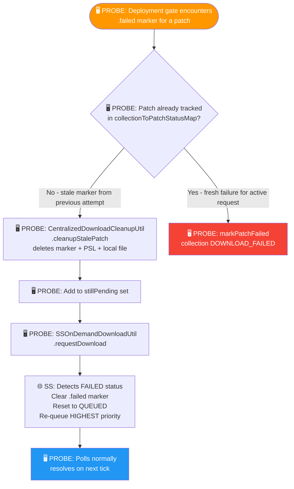
```mermaid
%%{init: {'flowchart': {'wrappingWidth': 350, 'nodeSpacing': 30, 'rankSpacing': 50}} }%%
flowchart TD
    A(["🖥️ PROBE: Deployment gate encounters<br/>.failed marker for a patch"]) --> B{"🖥️ PROBE: Patch already tracked<br/>in collectionToPatchStatusMap?"}
    B -->|"No - stale marker from previous attempt"| C["🖥️ PROBE: CentralizedDownloadCleanupUtil<br/>.cleanupStalePatch<br/>deletes marker + PSL + local file"]
    C --> D["🖥️ PROBE: Add to stillPending set"]
    D --> E["🖥️ PROBE: SSOnDemandDownloadUtil<br/>.requestDownload"]
    E --> F["🌐 SS: Detects FAILED status<br/>Clear .failed marker<br/>Reset to QUEUED<br/>Re-queue HIGHEST priority"]
    F --> G["🖥️ PROBE: Polls normally<br/>resolves on next tick"]
    B -->|"Yes - fresh failure for active request"| H["🖥️ PROBE: markPatchFailed<br/>collection DOWNLOAD_FAILED"]

    style A fill:#FF9800,color:#fff
    style G fill:#2196F3,color:#fff
    style H fill:#f44336,color:#fff
```

---

## UC-1.7: Patch Already Available — Checksum Valid

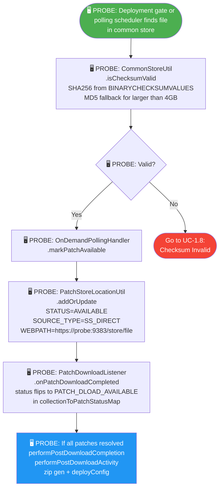
```mermaid
%%{init: {'flowchart': {'wrappingWidth': 350, 'nodeSpacing': 30, 'rankSpacing': 50}} }%%
flowchart TD
    A(["🖥️ PROBE: Deployment gate or<br/>polling scheduler finds file<br/>in common store"]) --> B["🖥️ PROBE: CommonStoreUtil<br/>.isChecksumValid<br/>SHA256 from BINARYCHECKSUMVALUES<br/>MD5 fallback for larger than 4GB"]
    B --> C{"🖥️ PROBE: Valid?"}
    C -->|Yes| D["🖥️ PROBE: OnDemandPollingHandler<br/>.markPatchAvailable"]
    D --> E["🖥️ PROBE: PatchStoreLocationUtil<br/>.addOrUpdate<br/>STATUS=AVAILABLE<br/>SOURCE_TYPE=SS_DIRECT<br/>WEBPATH=https://probe:9383/store/file"]
    E --> F["🖥️ PROBE: PatchDownloadListener<br/>.onPatchDownloadCompleted<br/>status flips to PATCH_DLOAD_AVAILABLE<br/>in collectionToPatchStatusMap"]
    F --> G["🖥️ PROBE: If all patches resolved<br/>performPostDownloadCompletion<br/>performPostDownloadActivity<br/>zip gen + deployConfig"]
    C -->|No| H(["Go to UC-1.8:<br/>Checksum Invalid"])

    style A fill:#4CAF50,color:#fff
    style G fill:#2196F3,color:#fff
    style H fill:#f44336,color:#fff
```

---

## UC-1.8: Patch Available but Checksum Invalid

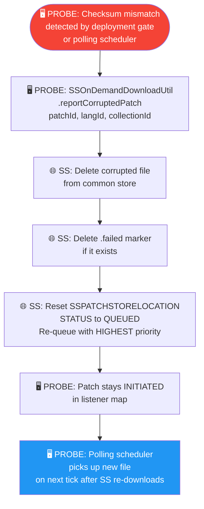
```mermaid
%%{init: {'flowchart': {'wrappingWidth': 350, 'nodeSpacing': 30, 'rankSpacing': 50}} }%%
flowchart TD
    A(["🖥️ PROBE: Checksum mismatch<br/>detected by deployment gate<br/>or polling scheduler"]) --> B["🖥️ PROBE: SSOnDemandDownloadUtil<br/>.reportCorruptedPatch<br/>patchId, langId, collectionId"]
    B --> C["🌐 SS: Delete corrupted file<br/>from common store"]
    C --> D["🌐 SS: Delete .failed marker<br/>if it exists"]
    D --> E["🌐 SS: Reset SSPATCHSTORELOCATION<br/>STATUS to QUEUED<br/>Re-queue with HIGHEST priority"]
    E --> F["🖥️ PROBE: Patch stays INITIATED<br/>in listener map"]
    F --> G["🖥️ PROBE: Polling scheduler<br/>picks up new file<br/>on next tick after SS re-downloads"]

    style A fill:#f44336,color:#fff
    style G fill:#2196F3,color:#fff
```

---

## UC-1.9: Download Timeout

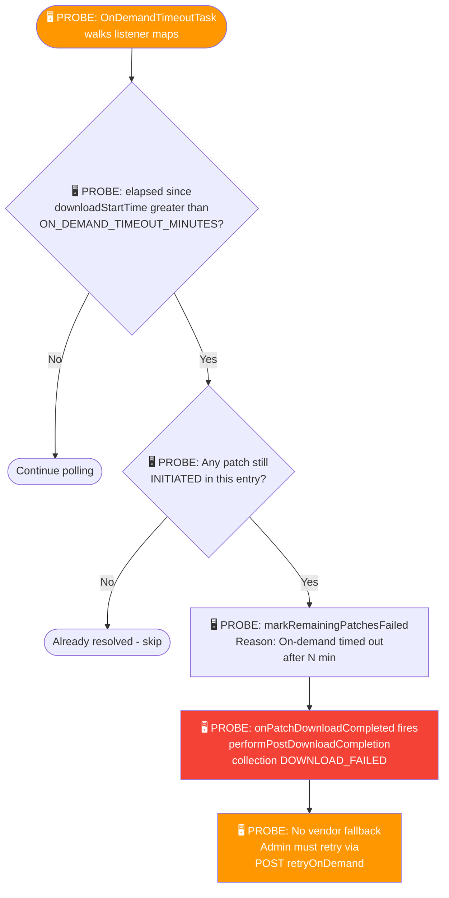
```mermaid
%%{init: {'flowchart': {'wrappingWidth': 350, 'nodeSpacing': 30, 'rankSpacing': 50}} }%%
flowchart TD
    A(["🖥️ PROBE: OnDemandTimeoutTask<br/>walks listener maps"]) --> B{"🖥️ PROBE: elapsed since<br/>downloadStartTime greater than<br/>ON_DEMAND_TIMEOUT_MINUTES?"}
    B -->|No| C(["Continue polling"])
    B -->|Yes| D{"🖥️ PROBE: Any patch still<br/>INITIATED in this entry?"}
    D -->|No| E(["Already resolved - skip"])
    D -->|Yes| F["🖥️ PROBE: markRemainingPatchesFailed<br/>Reason: On-demand timed out<br/>after N min"]
    F --> G["🖥️ PROBE: onPatchDownloadCompleted fires<br/>performPostDownloadCompletion<br/>collection DOWNLOAD_FAILED"]
    G --> H["🖥️ PROBE: No vendor fallback<br/>Admin must retry via<br/>POST retryOnDemand"]

    style A fill:#FF9800,color:#fff
    style G fill:#f44336,color:#fff
    style H fill:#FF9800,color:#fff
```

---

## UC-2: Download Status Visibility on Probe

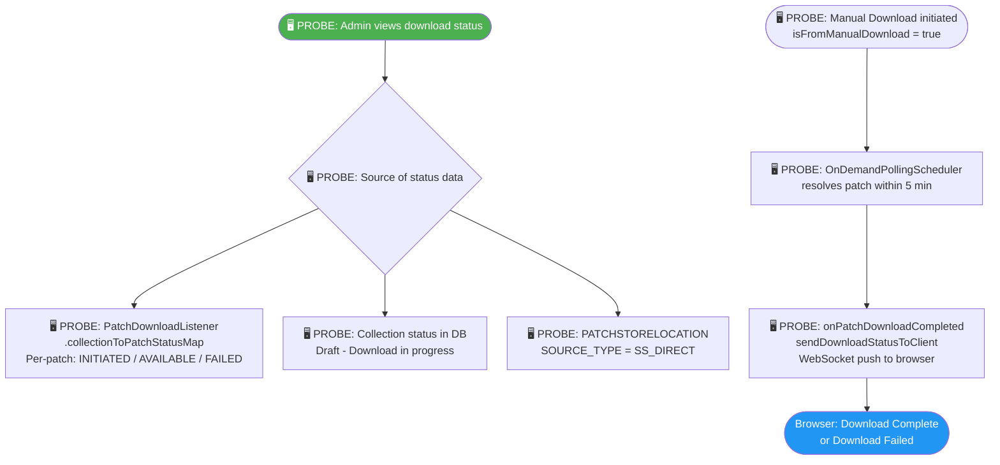
```mermaid
%%{init: {'flowchart': {'wrappingWidth': 350, 'nodeSpacing': 30, 'rankSpacing': 50}} }%%
flowchart TD
    A(["🖥️ PROBE: Admin views download status"]) --> B{"🖥️ PROBE: Source of status data"}
    B --> C["🖥️ PROBE: PatchDownloadListener<br/>.collectionToPatchStatusMap<br/>Per-patch: INITIATED / AVAILABLE / FAILED"]
    B --> D["🖥️ PROBE: Collection status in DB<br/>Draft - Download in progress"]
    B --> E["🖥️ PROBE: PATCHSTORELOCATION<br/>SOURCE_TYPE = SS_DIRECT"]

    F(["🖥️ PROBE: Manual Download initiated<br/>isFromManualDownload = true"]) --> G["🖥️ PROBE: OnDemandPollingScheduler<br/>resolves patch within 5 min"]
    G --> H["🖥️ PROBE: onPatchDownloadCompleted<br/>sendDownloadStatusToClient<br/>WebSocket push to browser"]
    H --> I(["Browser: Download Complete<br/>or Download Failed"])

    style A fill:#4CAF50,color:#fff
    style I fill:#2196F3,color:#fff
```

---

## UC-3: RedHat Certificate Forwarding

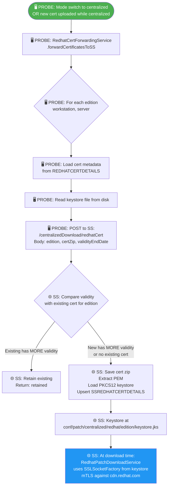
```mermaid
%%{init: {'flowchart': {'wrappingWidth': 350, 'nodeSpacing': 30, 'rankSpacing': 50}} }%%
flowchart TD
    A(["🖥️ PROBE: Mode switch to centralized<br/>OR new cert uploaded while centralized"]) --> B["🖥️ PROBE: RedhatCertForwardingService<br/>.forwardCertificatesToSS"]
    B --> C{"🖥️ PROBE: For each edition<br/>workstation, server"}
    C --> D["🖥️ PROBE: Load cert metadata<br/>from REDHATCERTDETAILS"]
    D --> E["🖥️ PROBE: Read keystore file from disk"]
    E --> F["🖥️ PROBE: POST to SS:<br/>/centralizedDownload/redhatCert<br/>Body: edition, certZip, validityEndDate"]
    F --> G{"🌐 SS: Compare validity<br/>with existing cert for edition"}
    G -->|"Existing has MORE validity"| H["🌐 SS: Retain existing<br/>Return: retained"]
    G -->|"New has MORE validity<br/>or no existing cert"| I["🌐 SS: Save cert zip<br/>Extract PEM<br/>Load PKCS12 keystore<br/>Upsert SSREDHATCERTDETAILS"]
    I --> J["🌐 SS: Keystore at<br/>conf/patch/centralized/redhat/edition/keystore.jks"]
    J --> K["🌐 SS: At download time:<br/>RedhatPatchDownloadService<br/>uses SSLSocketFactory from keystore<br/>mTLS against cdn.redhat.com"]

    style A fill:#4CAF50,color:#fff
    style K fill:#2196F3,color:#fff
```

---

## UC-4: SUSE Token Forwarding

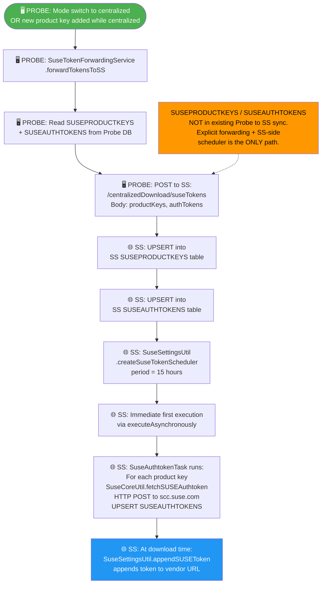
```mermaid
%%{init: {'flowchart': {'wrappingWidth': 350, 'nodeSpacing': 30, 'rankSpacing': 50}} }%%
flowchart TD
    A(["🖥️ PROBE: Mode switch to centralized<br/>OR new product key added while centralized"]) --> B["🖥️ PROBE: SuseTokenForwardingService<br/>.forwardTokensToSS"]
    B --> C["🖥️ PROBE: Read SUSEPRODUCTKEYS<br/>+ SUSEAUTHTOKENS from Probe DB"]
    C --> D["🖥️ PROBE: POST to SS:<br/>/centralizedDownload/suseTokens<br/>Body: productKeys, authTokens"]
    D --> E["🌐 SS: UPSERT into<br/>SS SUSEPRODUCTKEYS table"]
    E --> F["🌐 SS: UPSERT into<br/>SS SUSEAUTHTOKENS table"]
    F --> G["🌐 SS: SuseSettingsUtil<br/>.createSuseTokenScheduler<br/>period = 15 hours"]
    G --> H["🌐 SS: Immediate first execution<br/>via executeAsynchronously"]
    H --> I["🌐 SS: SuseAuthtokenTask runs:<br/>For each product key<br/>SuseCoreUtil.fetchSUSEAuthtoken<br/>HTTP POST to scc.suse.com<br/>UPSERT SUSEAUTHTOKENS"]
    I --> J["🌐 SS: At download time:<br/>SuseSettingsUtil.appendSUSEToken<br/>appends token to vendor URL"]

    K["SUSEPRODUCTKEYS / SUSEAUTHTOKENS<br/>NOT in existing Probe to SS sync.<br/>Explicit forwarding + SS-side<br/>scheduler is the ONLY path."] -.-> D

    style A fill:#4CAF50,color:#fff
    style J fill:#2196F3,color:#fff
    style K fill:#FF9800,color:#000
```

---

## UC-5.1: Enable Centralized Download

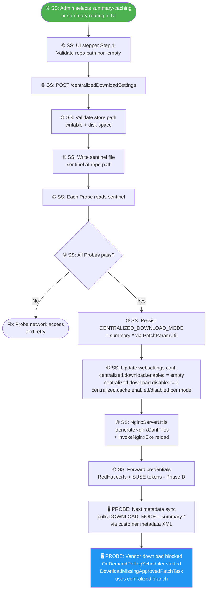
```mermaid
%%{init: {'flowchart': {'wrappingWidth': 350, 'nodeSpacing': 30, 'rankSpacing': 50}} }%%
flowchart TD
    A(["🌐 SS: Admin selects summary-caching<br/>or summary-routing in UI"]) --> B["🌐 SS: UI stepper Step 1:<br/>Validate repo path non-empty"]
    B --> C["🌐 SS: POST /centralizedDownloadSettings"]
    C --> D["🌐 SS: Validate store path<br/>writable + disk space"]
    D --> E["🌐 SS: Write sentinel file<br/>.sentinel at repo path"]
    E --> F["🌐 SS: Each Probe reads sentinel"]
    F --> G{"🌐 SS: All Probes pass?"}
    G -->|No| H(["Fix Probe network access<br/>and retry"])
    G -->|Yes| I["🌐 SS: Persist CENTRALIZED_DOWNLOAD_MODE<br/>= summary-* via PatchParamUtil"]
    I --> J["🌐 SS: Update websettings.conf:<br/>centralized.download.enabled = empty<br/>centralized.download.disabled = #<br/>centralized.cache.enabled/disabled per mode"]
    J --> K["🌐 SS: NginxServerUtils<br/>.generateNginxConfFiles<br/>+ invokeNginxExe reload"]
    K --> L["🌐 SS: Forward credentials<br/>RedHat certs + SUSE tokens - Phase D"]
    L --> M["🖥️ PROBE: Next metadata sync<br/>pulls DOWNLOAD_MODE = summary-*<br/>via customer metadata XML"]
    M --> N["🖥️ PROBE: Vendor download blocked<br/>OnDemandPollingScheduler started<br/>DownloadMissingApprovedPatchTask<br/>uses centralized branch"]

    style A fill:#4CAF50,color:#fff
    style N fill:#2196F3,color:#fff
```

---

## UC-5.2: Disable Centralized Download

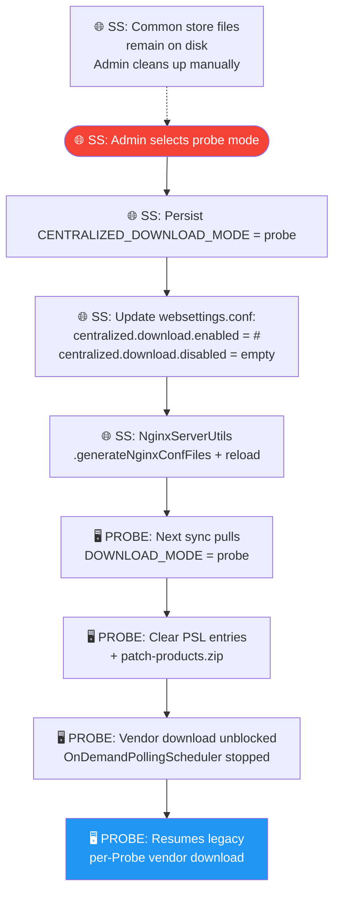
```mermaid
%%{init: {'flowchart': {'wrappingWidth': 350, 'nodeSpacing': 30, 'rankSpacing': 50}} }%%
flowchart TD
    A(["🌐 SS: Admin selects probe mode"]) --> B["🌐 SS: Persist CENTRALIZED_DOWNLOAD_MODE = probe"]
    B --> C["🌐 SS: Update websettings.conf:<br/>centralized.download.enabled = #<br/>centralized.download.disabled = empty"]
    C --> D["🌐 SS: NginxServerUtils<br/>.generateNginxConfFiles + reload"]
    D --> E["🖥️ PROBE: Next sync pulls<br/>DOWNLOAD_MODE = probe"]
    E --> F["🖥️ PROBE: Clear PSL entries<br/>+ patch-products.zip"]
    F --> G["🖥️ PROBE: Vendor download unblocked<br/>OnDemandPollingScheduler stopped"]
    G --> H["🖥️ PROBE: Resumes legacy<br/>per-Probe vendor download"]

    I["🌐 SS: Common store files<br/>remain on disk<br/>Admin cleans up manually"] -.-> A

    style A fill:#f44336,color:#fff
    style H fill:#2196F3,color:#fff
```

---

## UC-6: Probe-Side Nginx Caching

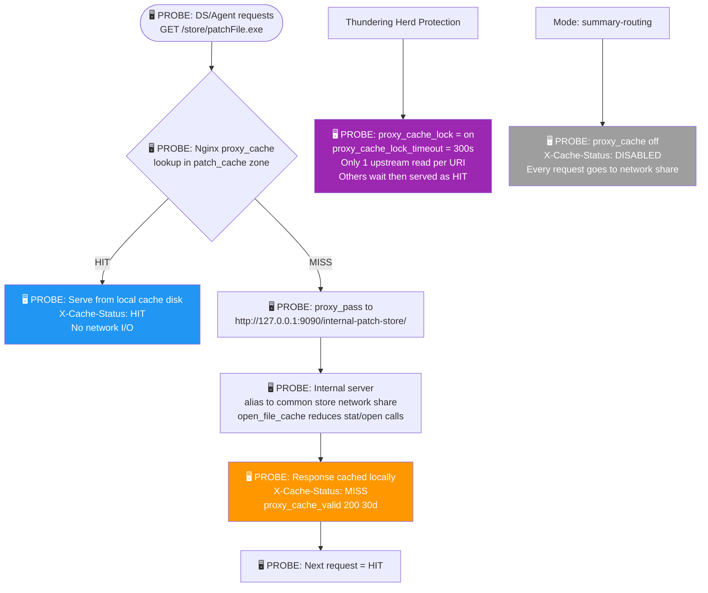
```mermaid
%%{init: {'flowchart': {'wrappingWidth': 350, 'nodeSpacing': 30, 'rankSpacing': 50}} }%%
flowchart TD
    A(["🖥️ PROBE: DS/Agent requests<br/>GET /store/patchFile.exe"]) --> B{"🖥️ PROBE: Nginx proxy_cache<br/>lookup in patch_cache zone"}
    B -->|"HIT"| C["🖥️ PROBE: Serve from local cache disk<br/>X-Cache-Status: HIT<br/>No network I/O"]
    B -->|"MISS"| D["🖥️ PROBE: proxy_pass to<br/>http://127.0.0.1:9090/internal-patch-store/"]
    D --> E["🖥️ PROBE: Internal server<br/>alias to common store network share<br/>open_file_cache reduces stat/open calls"]
    E --> F["🖥️ PROBE: Response cached locally<br/>X-Cache-Status: MISS<br/>proxy_cache_valid 200 30d"]
    F --> G["🖥️ PROBE: Next request = HIT"]

    H["Thundering Herd Protection"] --> I["🖥️ PROBE: proxy_cache_lock = on<br/>proxy_cache_lock_timeout = 300s<br/>Only 1 upstream read per URI<br/>Others wait then served as HIT"]

    J["Mode: summary-routing"] --> K["🖥️ PROBE: proxy_cache off<br/>X-Cache-Status: DISABLED<br/>Every request goes to network share"]

    style C fill:#2196F3,color:#fff
    style F fill:#FF9800,color:#fff
    style I fill:#9C27B0,color:#fff
    style K fill:#9E9E9E,color:#fff
```

---

## UC-7.1: Patch Upload from Summary Server

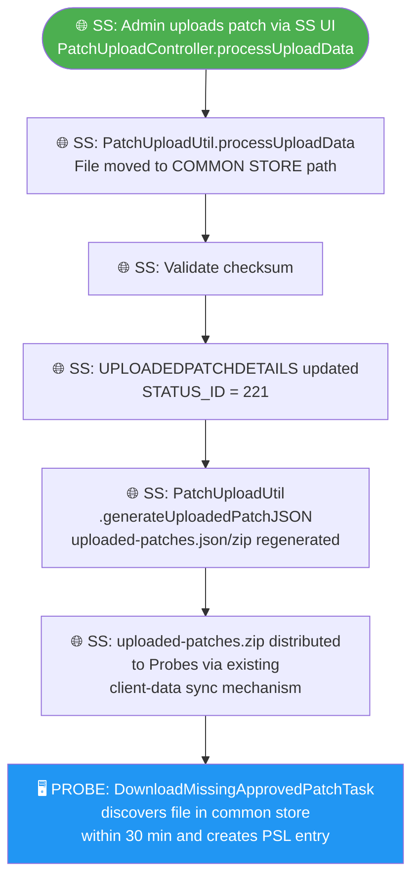
```mermaid
%%{init: {'flowchart': {'wrappingWidth': 350, 'nodeSpacing': 30, 'rankSpacing': 50}} }%%
flowchart TD
    A(["🌐 SS: Admin uploads patch via SS UI<br/>PatchUploadController.processUploadData"]) --> B["🌐 SS: PatchUploadUtil.processUploadData<br/>File moved to COMMON STORE path"]
    B --> C["🌐 SS: Validate checksum"]
    C --> D["🌐 SS: UPLOADEDPATCHDETAILS updated<br/>STATUS_ID = 221"]
    D --> E["🌐 SS: PatchUploadUtil<br/>.generateUploadedPatchJSON<br/>uploaded-patches.json/zip regenerated"]
    E --> F["🌐 SS: uploaded-patches.zip distributed<br/>to Probes via existing<br/>client-data sync mechanism"]
    F --> G["🖥️ PROBE: DownloadMissingApprovedPatchTask<br/>discovers file in common store<br/>within 30 min and creates PSL entry"]

    style A fill:#4CAF50,color:#fff
    style G fill:#2196F3,color:#fff
```

---

## UC-7.2: Patch Upload from Probe

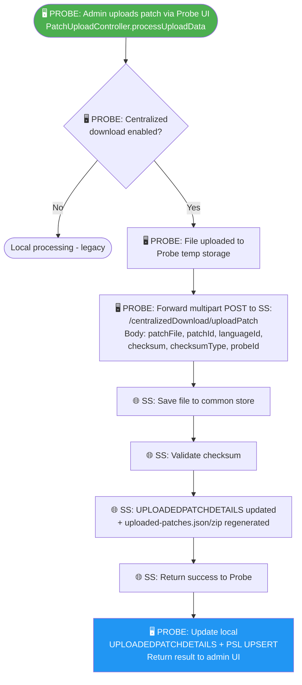
```mermaid
%%{init: {'flowchart': {'wrappingWidth': 350, 'nodeSpacing': 30, 'rankSpacing': 50}} }%%
flowchart TD
    A(["🖥️ PROBE: Admin uploads patch via Probe UI<br/>PatchUploadController.processUploadData"]) --> B{"🖥️ PROBE: Centralized<br/>download enabled?"}
    B -->|No| Z(["Local processing - legacy"])
    B -->|Yes| C["🖥️ PROBE: File uploaded to<br/>Probe temp storage"]
    C --> D["🖥️ PROBE: Forward multipart POST to SS:<br/>/centralizedDownload/uploadPatch<br/>Body: patchFile, patchId, languageId,<br/>checksum, checksumType, probeId"]
    D --> E["🌐 SS: Save file to common store"]
    E --> F["🌐 SS: Validate checksum"]
    F --> G["🌐 SS: UPLOADEDPATCHDETAILS updated<br/>+ uploaded-patches.json/zip regenerated"]
    G --> H["🌐 SS: Return success to Probe"]
    H --> I["🖥️ PROBE: Update local<br/>UPLOADEDPATCHDETAILS + PSL UPSERT<br/>Return result to admin UI"]

    style A fill:#4CAF50,color:#fff
    style I fill:#2196F3,color:#fff
```

---

## UC-8: Linux Dependency Package Forwarding

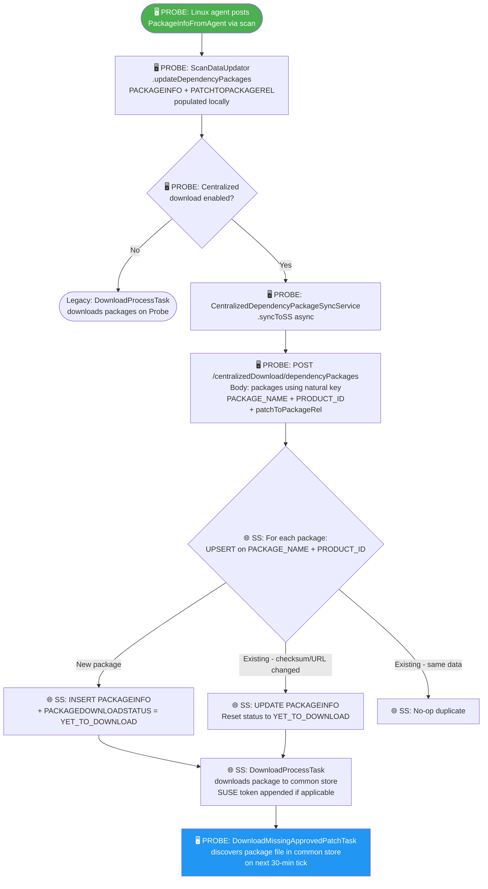
```mermaid
%%{init: {'flowchart': {'wrappingWidth': 350, 'nodeSpacing': 30, 'rankSpacing': 50}} }%%
flowchart TD
    A(["🖥️ PROBE: Linux agent posts<br/>PackageInfoFromAgent via scan"]) --> B["🖥️ PROBE: ScanDataUpdator<br/>.updateDependencyPackages<br/>PACKAGEINFO + PATCHTOPACKAGEREL<br/>populated locally"]
    B --> C{"🖥️ PROBE: Centralized<br/>download enabled?"}
    C -->|No| Z(["Legacy: DownloadProcessTask<br/>downloads packages on Probe"])
    C -->|Yes| D["🖥️ PROBE: CentralizedDependencyPackageSyncService<br/>.syncToSS async"]
    D --> E["🖥️ PROBE: POST /centralizedDownload/dependencyPackages<br/>Body: packages using natural key<br/>PACKAGE_NAME + PRODUCT_ID<br/>+ patchToPackageRel"]
    E --> F{"🌐 SS: For each package:<br/>UPSERT on PACKAGE_NAME + PRODUCT_ID"}
    F -->|"New package"| G["🌐 SS: INSERT PACKAGEINFO<br/>+ PACKAGEDOWNLOADSTATUS = YET_TO_DOWNLOAD"]
    F -->|"Existing - checksum/URL changed"| H["🌐 SS: UPDATE PACKAGEINFO<br/>Reset status to YET_TO_DOWNLOAD"]
    F -->|"Existing - same data"| I["🌐 SS: No-op duplicate"]
    G --> J["🌐 SS: DownloadProcessTask<br/>downloads package to common store<br/>SUSE token appended if applicable"]
    H --> J
    J --> K["🖥️ PROBE: DownloadMissingApprovedPatchTask<br/>discovers package file in common store<br/>on next 30-min tick"]

    style A fill:#4CAF50,color:#fff
    style K fill:#2196F3,color:#fff
```

---

## UC-9 and UC-18: Common Store Path Change

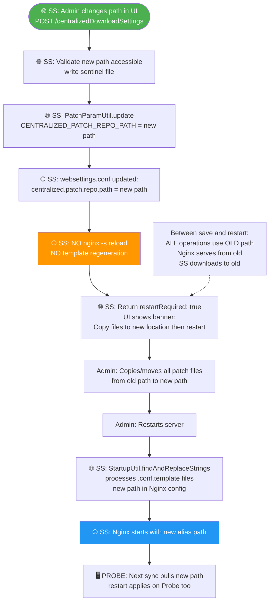
```mermaid
%%{init: {'flowchart': {'wrappingWidth': 350, 'nodeSpacing': 30, 'rankSpacing': 50}} }%%
flowchart TD
    A(["🌐 SS: Admin changes path in UI<br/>POST /centralizedDownloadSettings"]) --> B["🌐 SS: Validate new path accessible<br/>write sentinel file"]
    B --> C["🌐 SS: PatchParamUtil.update<br/>CENTRALIZED_PATCH_REPO_PATH = new path"]
    C --> D["🌐 SS: websettings.conf updated:<br/>centralized.patch.repo.path = new path"]
    D --> E["🌐 SS: NO nginx -s reload<br/>NO template regeneration"]
    E --> F["🌐 SS: Return restartRequired: true<br/>UI shows banner:<br/>Copy files to new location then restart"]
    F --> G["Admin: Copies/moves all patch files<br/>from old path to new path"]
    G --> H["Admin: Restarts server"]
    H --> I["🌐 SS: StartupUtil.findAndReplaceStrings<br/>processes .conf.template files<br/>new path in Nginx config"]
    I --> J["🌐 SS: Nginx starts with new alias path"]
    J --> K["🖥️ PROBE: Next sync pulls new path<br/>restart applies on Probe too"]

    L["Between save and restart:<br/>ALL operations use OLD path<br/>Nginx serves from old<br/>SS downloads to old"] -.-> F

    style A fill:#4CAF50,color:#fff
    style E fill:#FF9800,color:#fff
    style J fill:#2196F3,color:#fff
```

---

## UC-10: Probe Cache Size Reduced

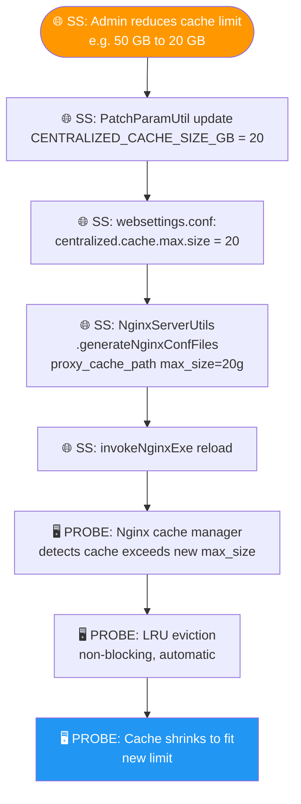
```mermaid
%%{init: {'flowchart': {'wrappingWidth': 350, 'nodeSpacing': 30, 'rankSpacing': 50}} }%%
flowchart TD
    A(["🌐 SS: Admin reduces cache limit<br/>e.g. 50 GB to 20 GB"]) --> B["🌐 SS: PatchParamUtil update<br/>CENTRALIZED_CACHE_SIZE_GB = 20"]
    B --> C["🌐 SS: websettings.conf:<br/>centralized.cache.max.size = 20"]
    C --> D["🌐 SS: NginxServerUtils<br/>.generateNginxConfFiles<br/>proxy_cache_path max_size=20g"]
    D --> E["🌐 SS: invokeNginxExe reload"]
    E --> F["🖥️ PROBE: Nginx cache manager<br/>detects cache exceeds new max_size"]
    F --> G["🖥️ PROBE: LRU eviction<br/>non-blocking, automatic"]
    G --> H["🖥️ PROBE: Cache shrinks to fit<br/>new limit"]

    style A fill:#FF9800,color:#fff
    style H fill:#2196F3,color:#fff
```

---

## UC-11: Probe Cache Size Increased

```mermaid
%%{init: {'flowchart': {'wrappingWidth': 350, 'nodeSpacing': 30, 'rankSpacing': 50}} }%%
flowchart TD
    A(["🌐 SS: Admin increases cache limit<br/>e.g. 20 GB to 100 GB"]) --> B["Same flow as UC-10:<br/>Update, regen, reload"]
    B --> C["🖥️ PROBE: Nginx sees more headroom<br/>No eviction triggered<br/>More files can be cached"]

    style A fill:#4CAF50,color:#fff
    style C fill:#2196F3,color:#fff
```

---

## UC-12: Cache Disabled

```mermaid
%%{init: {'flowchart': {'wrappingWidth': 350, 'nodeSpacing': 30, 'rankSpacing': 50}} }%%
flowchart TD
    A(["🌐 SS: Admin switches to<br/>summary-routing"]) --> B["🌐 SS: websettings.conf:<br/>centralized.cache.enabled = #<br/>centralized.cache.disabled = empty"]
    B --> C["🌐 SS: Template produces:<br/>proxy_cache off"]
    C --> D["🌐 SS: nginx -s reload"]
    D --> E["🖥️ PROBE: X-Cache-Status: DISABLED<br/>Every request goes to proxy<br/>then to common store"]
    E --> F["🖥️ PROBE: Existing cached files<br/>remain on disk<br/>Expire via inactive=30d<br/>or max_size pressure"]

    style A fill:#f44336,color:#fff
    style E fill:#9E9E9E,color:#fff
```

---

## UC-13: Patch Cleanup in Centralized Mode

```mermaid
%%{init: {'flowchart': {'wrappingWidth': 350, 'nodeSpacing': 30, 'rankSpacing': 50}} }%%
flowchart TD
    A(["🌐 SS: CleanupUtil.patchStoreCleanup<br/>scheduled task fires"]) --> B{"🌐 SS: Centralized<br/>download enabled?"}
    B -->|No| Z(["Existing probe-local cleanup"])
    B -->|Yes| C["🌐 SS: CentralizedCleanupUtil<br/>.centralizedPatchStoreCleanup"]
    C --> D["🌐 SS: Read settings:<br/>CENTRALIZED_REMOVE_SUPERSEDED<br/>CENTRALIZED_REMOVE_OLDER_MONTHS"]
    D --> E["🌐 SS: Query candidate patches<br/>Superseded + old installed"]
    E --> F{"🌐 SS: For each candidate:<br/>UC-15 isSafeToDelete check"}
    F -->|"Safe: no probe needs it"| G["🌐 SS: deletePatchBinary<br/>from common store<br/>markPatchAsDeletedFromStore"]
    F -->|"Unsafe: probe still needs it"| H["🌐 SS: Skip - log at FINE level"]
    G --> I["🖥️ PROBE: 30-min scheduler detects<br/>file gone from common store<br/>If patch still in scope<br/>sends on-demand and SS re-downloads"]

    J["🖥️ PROBE: Probe-side cleanup<br/>DISABLED when centralized active<br/>CleanupUtil returns immediately"] -.-> B

    style A fill:#FF9800,color:#fff
    style G fill:#f44336,color:#fff
    style J fill:#9E9E9E,color:#fff
```

---

## UC-14: Missing Patch Scheduler in Probe

```mermaid
%%{init: {'flowchart': {'wrappingWidth': 350, 'nodeSpacing': 30, 'rankSpacing': 50}} }%%
flowchart TD
    A(["🖥️ PROBE: DownloadMissingApprovedPatchTask<br/>existing 30-min scheduler"]) --> B{"🖥️ PROBE: Centralized<br/>download enabled?"}
    B -->|No| Z(["Legacy vendor download path"])
    B -->|Yes| C["🖥️ PROBE: Scan common store<br/>for all missing approved patches<br/>Query: SCOPEAFFPATCHSTATUS<br/>LEFT JOIN PATCHSTORELOCATION"]
    C --> D["🖥️ PROBE: For each missing patch:<br/>CommonStoreUtil.isFileInCommonStore"]
    D -->|File exists + valid| E["🖥️ PROBE: markPatchAvailable<br/>PatchStoreLocationUtil.addOrUpdate<br/>SOURCE_TYPE = SS_DIRECT<br/>WEBPATH = https://probe:9383/store/file"]
    D -->|Not in store| F["🖥️ PROBE: Send on-demand to SS"]

    G["Complements OnDemandPollingScheduler:<br/>30-min = full DB scan, all missing<br/>5-min = only active requests in listener"] -.-> A

    style A fill:#FF9800,color:#fff
    style E fill:#2196F3,color:#fff
```

---

## UC-15: Patch Deletion — Multi-Probe Safety

```mermaid
%%{init: {'flowchart': {'wrappingWidth': 350, 'nodeSpacing': 30, 'rankSpacing': 50}} }%%
flowchart TD
    A(["🌐 SS: Cleanup or Admin<br/>requests patch deletion"]) --> B["🌐 SS: CentralizedCleanupUtil<br/>.isSafeToDelete patchId"]
    B --> C["🌐 SS: Query SCOPEAFFPATCHSTATUS<br/>WHERE PATCH_ID = ?<br/>AND STATUS_ID NOT IN<br/>INSTALLED, NOT_APPLICABLE<br/>RANGE 0,1"]
    C --> D{"🌐 SS: Result empty?"}
    D -->|"Yes - no probe needs it"| E["🌐 SS: Safe to delete<br/>Delete from common store"]
    D -->|"No - at least 1 probe<br/>has non-installed status"| F["🌐 SS: Skip deletion<br/>Log: still accessed by probes"]

    G(["🌐 SS: Admin manual delete<br/>from UI"]) --> H["🌐 SS: Same safety check"]
    H --> I{"🌐 SS: Safe?"}
    I -->|Yes| J["🌐 SS: Delete"]
    I -->|No| K["🌐 SS: Warning:<br/>Patch needed by X probes<br/>Force delete?"]
    K -->|Admin confirms| L["🌐 SS: Force delete<br/>Probes will re-trigger<br/>on-demand if needed"]

    style A fill:#FF9800,color:#fff
    style E fill:#4CAF50,color:#fff
    style F fill:#9E9E9E,color:#fff
    style K fill:#f44336,color:#fff
```

---

## UC-16: Centralized to Probe Download

```mermaid
%%{init: {'flowchart': {'wrappingWidth': 350, 'nodeSpacing': 30, 'rankSpacing': 50}} }%%
flowchart TD
    A(["🌐 SS: Admin selects probe mode<br/>Confirmation dialog shown"]) --> B["🌐 SS: Persist DOWNLOAD_MODE = probe"]
    B --> C["🌐 SS: websettings.conf keys:<br/>centralized.download.enabled = #<br/>centralized.download.disabled = empty"]
    C --> D["🌐 SS: Regenerate Nginx config<br/>standard alias $store restored<br/>nginx -s reload"]
    D --> E["🖥️ PROBE: Next sync pulls<br/>DOWNLOAD_MODE = probe"]
    E --> F["🖥️ PROBE: Clear PSL entries<br/>with SOURCE_TYPE = SS_DIRECT<br/>+ delete patch-products.zip"]
    F --> G["🖥️ PROBE: Vendor download unblocked<br/>OnDemandPollingScheduler stopped"]
    G --> H["🖥️ PROBE: Probe settings<br/>become editable in UI"]
    H --> I["🖥️ PROBE: Resumes legacy<br/>per-Probe vendor download"]

    J["🌐 SS: Patch files remain<br/>in common store<br/>Admin cleans manually"] -.-> B

    style A fill:#f44336,color:#fff
    style I fill:#2196F3,color:#fff
```

---

## UC-17: Probe to Centralized Download

```mermaid
%%{init: {'flowchart': {'wrappingWidth': 350, 'nodeSpacing': 30, 'rankSpacing': 50}} }%%
flowchart TD
    A(["🌐 SS: Admin selects summary-*<br/>Confirmation dialog + warning shown"]) --> B["🌐 SS: Validate store path<br/>+ sentinel check on all Probes"]
    B --> C["🌐 SS: Persist DOWNLOAD_MODE = summary-*"]
    C --> D["🌐 SS: websettings.conf keys set<br/>for centralized mode"]
    D --> E["🌐 SS: Regenerate Nginx config<br/>self-proxy pattern<br/>nginx -s reload"]
    E --> F["🌐 SS: Forward credentials to SS<br/>RedHat certs + SUSE tokens"]
    F --> G["🖥️ PROBE: Next sync pulls<br/>DOWNLOAD_MODE = summary-*"]
    G --> H["🖥️ PROBE: Clear PSL entries<br/>+ patch-products.zip"]
    H --> I["🖥️ PROBE: Vendor download blocked<br/>OnDemandPollingScheduler started"]
    I --> J["🖥️ PROBE: Probe UI locked read-only<br/>Banner: Centrally managed by SS"]
    J --> K["🖥️ PROBE: Schedule fixed 24/7<br/>Criteria: All missing patches"]

    style A fill:#4CAF50,color:#fff
    style K fill:#2196F3,color:#fff
```

---

## SS Restart During Active Download

```mermaid
%%{init: {'flowchart': {'wrappingWidth': 350, 'nodeSpacing': 30, 'rankSpacing': 50}} }%%
flowchart TD
    A(["🌐 SS: Server restarts"]) --> B["🌐 SS: ss-patch-download-data queue<br/>is DB-backed - survives restart"]
    B --> C["🌐 SS: Resumes vendor downloads<br/>from queue on startup"]
    C --> D["🖥️ PROBE: Polling unaffected<br/>continues every 5 min<br/>checking common store"]
    D --> E{"🌐 SS: Finishes download<br/>before Probe timeout?"}
    E -->|Yes| F["🖥️ PROBE: Next poll discovers file<br/>markPatchAvailable"]
    E -->|No| G["🖥️ PROBE: Timeout fires<br/>DOWNLOAD_FAILED<br/>Admin retries later"]

    style A fill:#FF9800,color:#fff
    style F fill:#2196F3,color:#fff
    style G fill:#f44336,color:#fff
```

---

## Probe Restart During Active Download

```mermaid
%%{init: {'flowchart': {'wrappingWidth': 350, 'nodeSpacing': 30, 'rankSpacing': 50}} }%%
flowchart TD
    A(["🖥️ PROBE: Server restarts"]) --> B["🖥️ PROBE: collectionToPatchStatusMap<br/>lost - in-memory only"]
    B --> C["🖥️ PROBE: Startup recovery:<br/>Query collections in<br/>Draft - Download in progress"]
    C --> D["🖥️ PROBE: For each such collection:<br/>Derive patch list from InstallPatchConfig<br/>+ expand dependencies"]
    D --> E["🖥️ PROBE: Re-run deployment gate:<br/>invokeDownloadListener re-registers<br/>patches as INITIATED"]
    E --> F{"🖥️ PROBE: Common store scan"}
    F -->|All patches available| G["🖥️ PROBE: All marked AVAILABLE<br/>performPostDownloadCompletion<br/>deploy proceeds immediately"]
    F -->|Some still missing| H["🖥️ PROBE: Fresh on-demand request<br/>to SS for missing patches<br/>Polling scheduler picks up"]

    style A fill:#FF9800,color:#fff
    style G fill:#2196F3,color:#fff
    style H fill:#FF9800,color:#fff
```

---

## Common Store Temporarily Inaccessible

```mermaid
%%{init: {'flowchart': {'wrappingWidth': 350, 'nodeSpacing': 30, 'rankSpacing': 50}} }%%
flowchart TD
    A(["🖥️ PROBE: Network share/mount<br/>becomes inaccessible"]) --> B["🖥️ PROBE: File.exists returns false<br/>or throws IOException"]
    B --> C["🖥️ PROBE: Polling scheduler:<br/>Neither file nor .failed marker readable<br/>Treated as still downloading"]
    C --> D["🖥️ PROBE: Continue polling<br/>every 5 min"]
    D --> E{"Share recovers<br/>before timeout?"}
    E -->|Yes| F["🖥️ PROBE: Next poll discovers<br/>files normally - markPatchAvailable"]
    E -->|No| G["🖥️ PROBE: Timeout fires<br/>DOWNLOAD_FAILED<br/>Admin fixes share, retries"]

    H["🖥️ PROBE: Nginx proxy_cache<br/>if HIT: cached files still served<br/>DS/Agent downloads unaffected<br/>for previously-cached patches"] -.-> A

    I["🌐 SS: Unaffected<br/>SS downloads to common store<br/>independently"] -.-> A

    style A fill:#f44336,color:#fff
    style F fill:#2196F3,color:#fff
    style G fill:#f44336,color:#fff
    style H fill:#9C27B0,color:#fff
```

---

## Master Overview — All Use Cases by Phase

```mermaid
%%{init: {'flowchart': {'wrappingWidth': 350, 'nodeSpacing': 30, 'rankSpacing': 50}} }%%
flowchart LR
    subgraph PhaseA["Phase A: Mode Toggle"]
        UC5["UC-5: Enable/Disable 🌐 SS"]
        UC16["UC-16: Centralized to Probe 🌐 SS"]
        UC17["UC-17: Probe to Centralized 🌐 SS"]
    end

    subgraph PhaseB["Phase B: Nginx Caching"]
        UC6["UC-6: Cache Serving 🖥️ PROBE"]
        UC10["UC-10: Size Reduced 🖥️ PROBE"]
        UC11["UC-11: Size Increased 🖥️ PROBE"]
        UC12["UC-12: Cache Disabled 🖥️ PROBE"]
    end

    subgraph PhaseC["Phase C: Status and Monitoring"]
        UC2["UC-2: Download Status 🖥️ PROBE"]
        UC14["UC-14: Missing Patch Scheduler 🖥️ PROBE"]
    end

    subgraph PhaseD["Phase D: Credentials"]
        UC3["UC-3: RedHat Cert 🖥️ PROBE to 🌐 SS"]
        UC4["UC-4: SUSE Token 🖥️ PROBE to 🌐 SS"]
    end

    subgraph PhaseE["Phase E: Upload and Sync"]
        UC7["UC-7: Patch Upload 🖥️ PROBE to 🌐 SS"]
        UC8["UC-8: Dependency Packages 🖥️ PROBE to 🌐 SS"]
    end

    subgraph PhaseF["Phase F: Maintenance"]
        UC9["UC-9: Path Change 🌐 SS"]
        UC13["UC-13: Cleanup 🌐 SS"]
        UC15["UC-15: Safe Deletion 🌐 SS"]
        UC18["UC-18: Path Change Same Mode 🌐 SS"]
    end

    subgraph UC1["UC-1: Patch Download"]
        UC1_1["1.1 Deployment Trigger 🖥️ PROBE"]
        UC1_2["1.2 Agent Request 🖥️ PROBE"]
        UC1_3["1.3 Missing Patch Scheduler 🖥️ PROBE"]
        UC1_4["1.4 Redownload 🖥️ PROBE"]
        UC1_5["1.5 SS Failure 🌐 SS"]
        UC1_6["1.6 Stale Failure Marker 🖥️ PROBE"]
        UC1_7["1.7 Already Available 🖥️ PROBE"]
        UC1_8["1.8 Checksum Invalid 🖥️ PROBE"]
        UC1_9["1.9 Timeout 🖥️ PROBE"]
    end

    PhaseA --> UC1
    PhaseA --> PhaseB
    PhaseD --> UC1
    PhaseE --> UC1
    UC1 --> PhaseC
    UC1 --> PhaseB
    PhaseF --> UC1
```

