# Centralized Patch Download — Use Case Flow Diagrams

---

## UC-1.1: Deployment-Triggered Download — Patch Not in Common Store

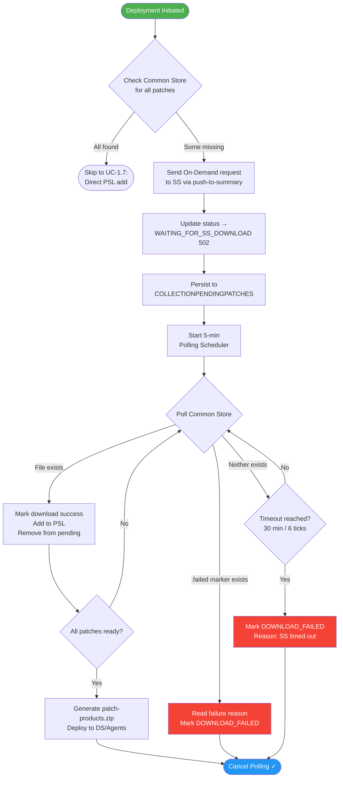

---

## UC-1.2: Agent-Requested Patch Download

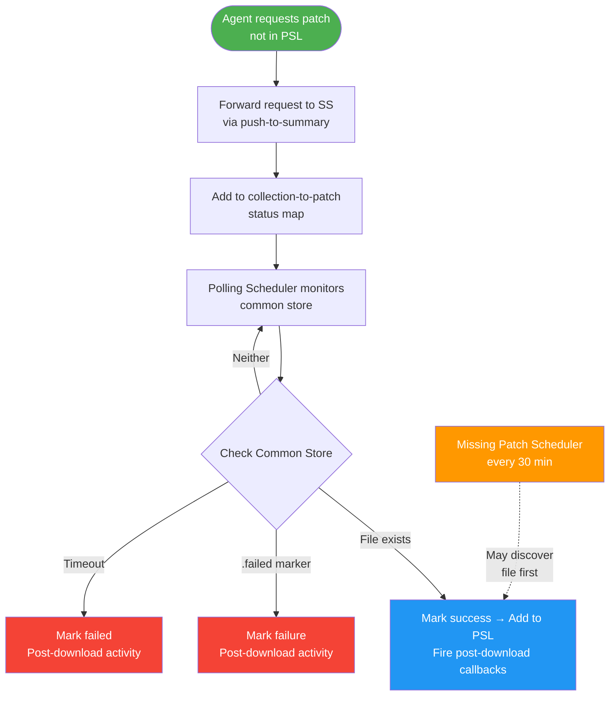

---

## UC-1.3: Missing Patch Scheduler — Background Discovery

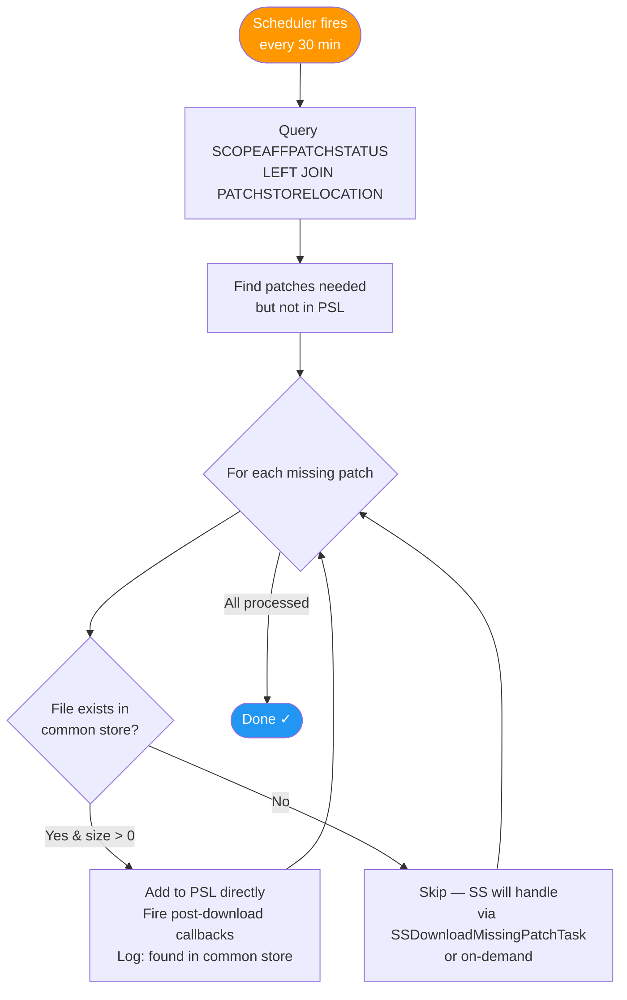

> **Note:** This scheduler is a passive scanner — it never sends download requests to SS.

---

## UC-1.4: Redownload Triggered for Patch

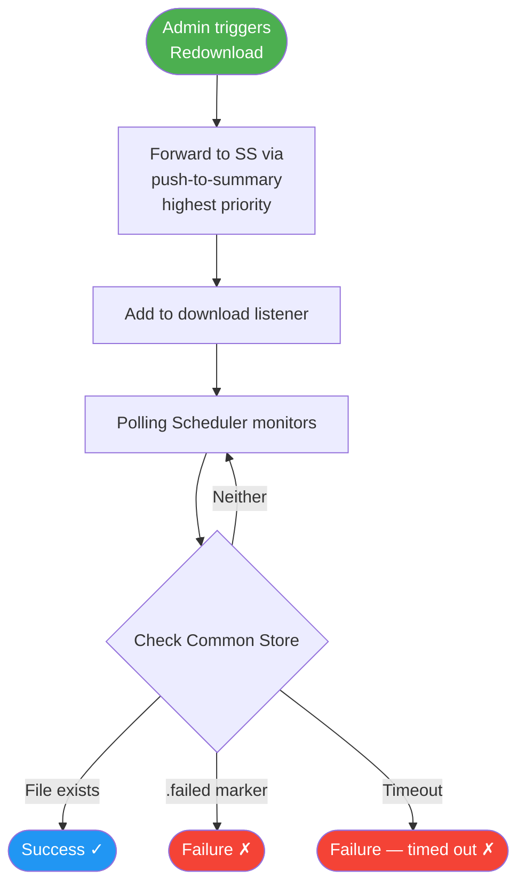

---

## UC-1.5: Download Failure on SS

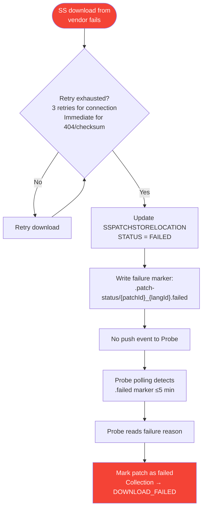

---

## UC-1.6: Failure Marker Already Exists

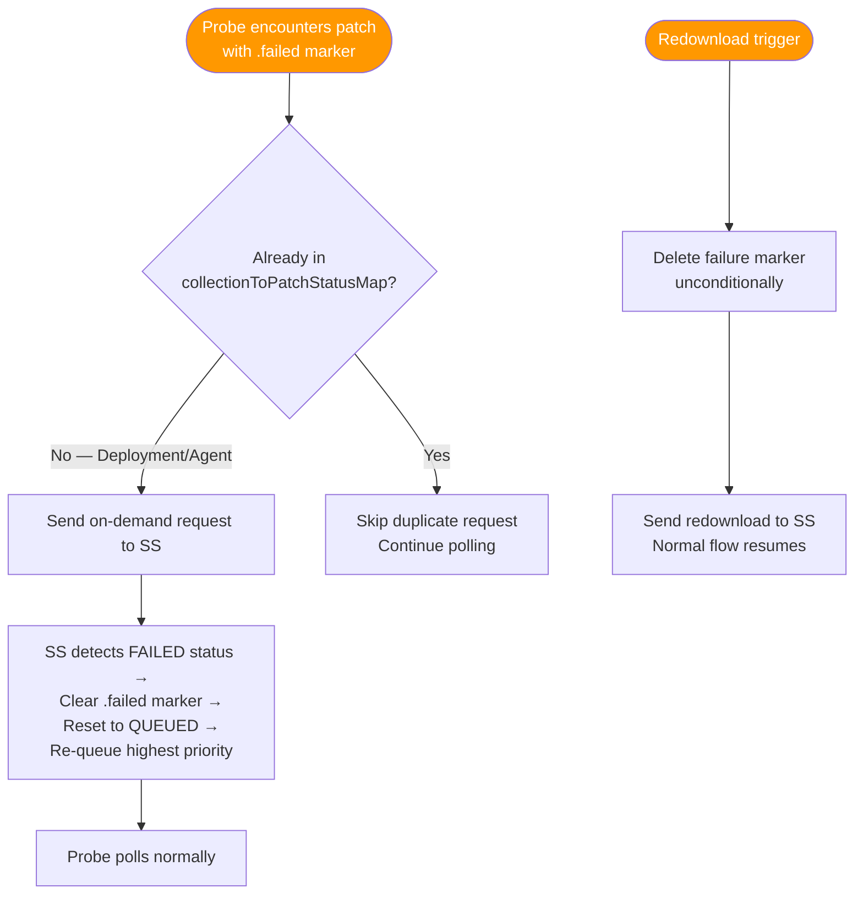

---

## UC-1.7: Patch Already Available — Checksum Valid

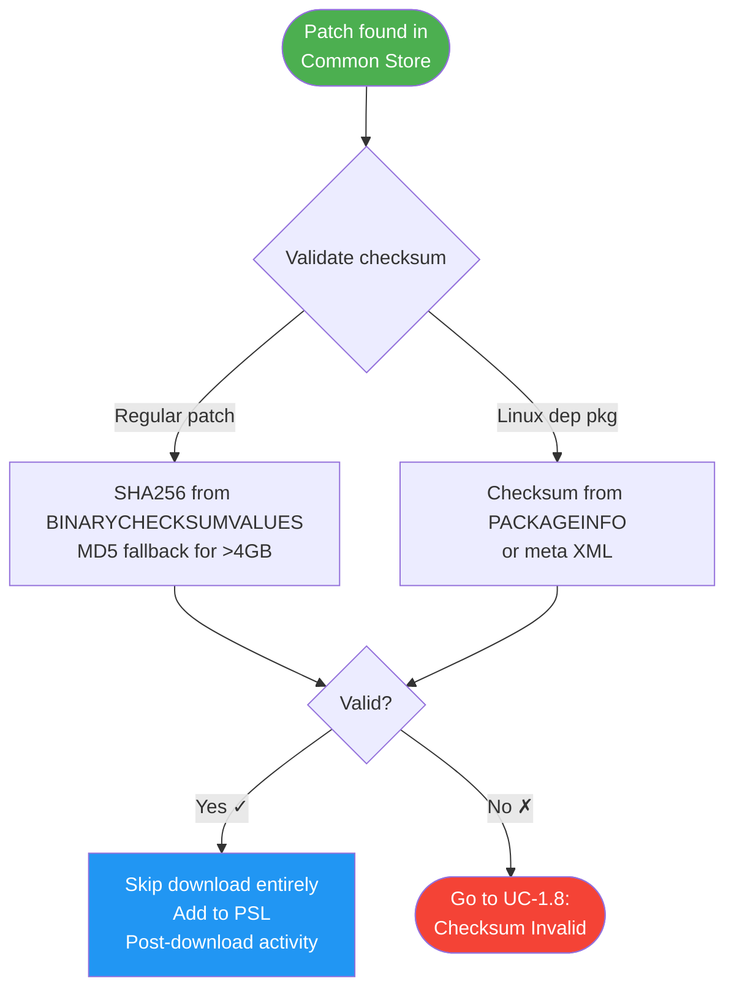

---

## UC-1.8: Patch Available but Checksum Invalid

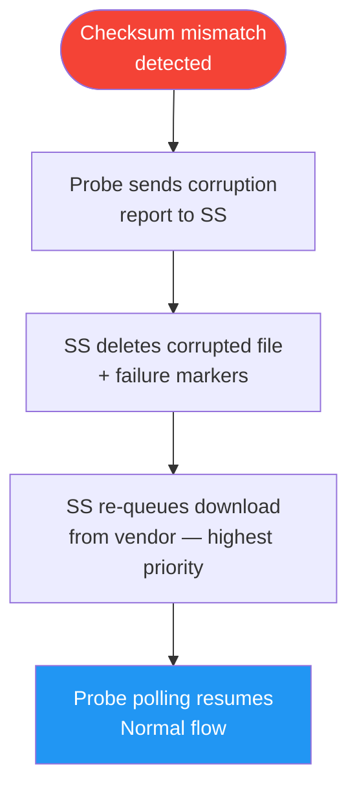

---

## UC-1.9: Download Timeout

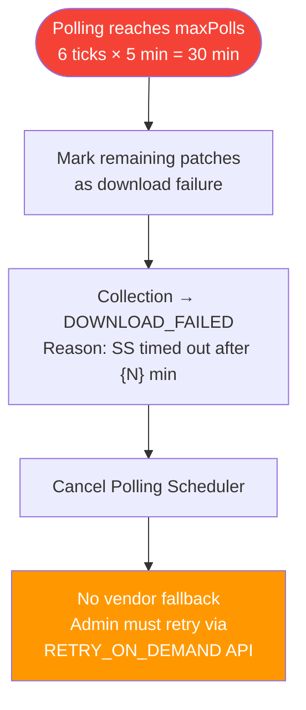

---

## UC-2: Download Status Visibility on Probe

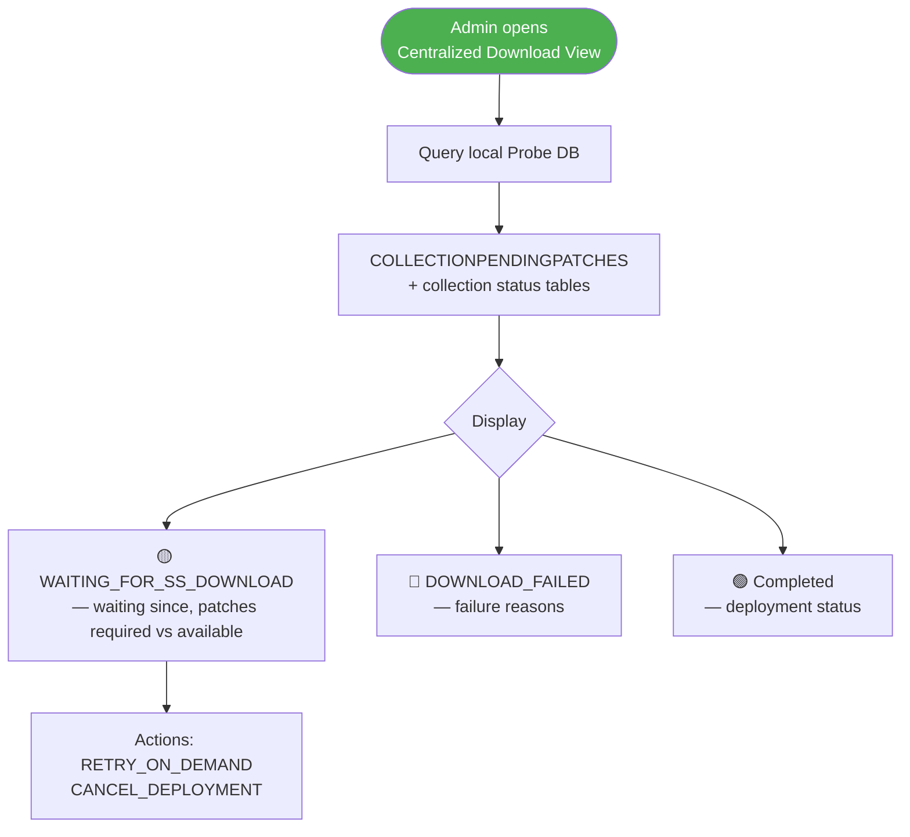

> No real-time query to SS — all state derived from local Probe DB via polling.

---

## UC-3: RedHat Certificate Forwarding

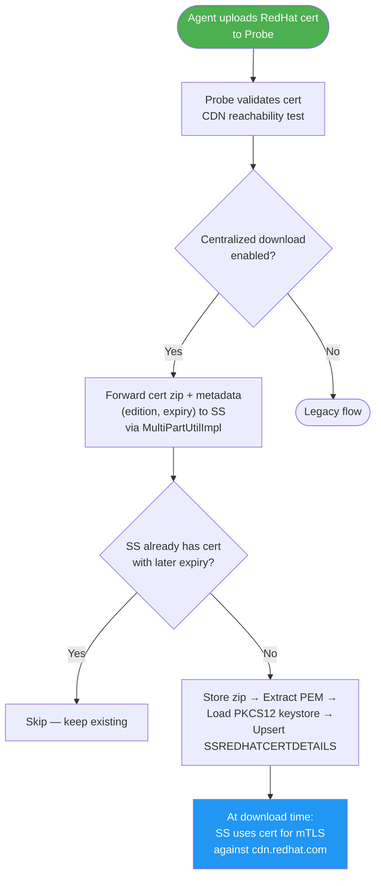

---

## UC-4: SUSE Token Forwarding

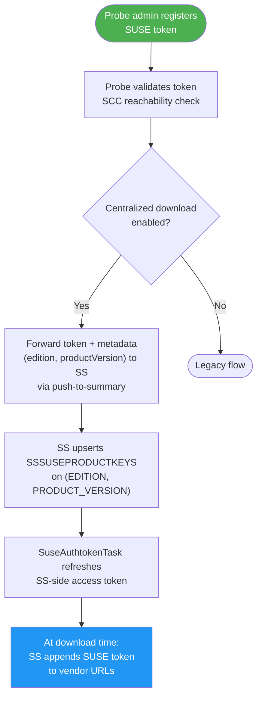

---

## UC-5.1: Enable Centralized Download


---

## UC-5.2: Disable Centralized Download

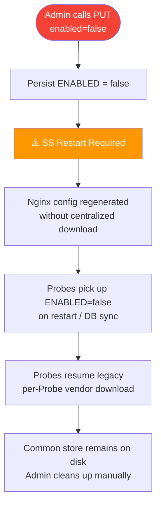

---

## UC-6: Probe-Side Nginx Caching — DS/Agent Binary Serving

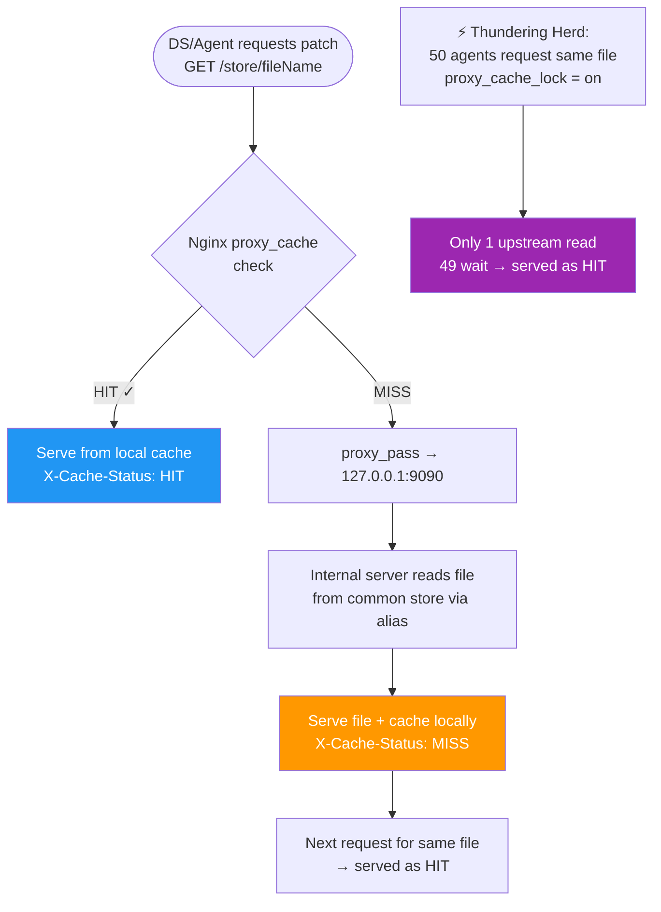

---

## UC-7.1: Patch Upload from Summary Server

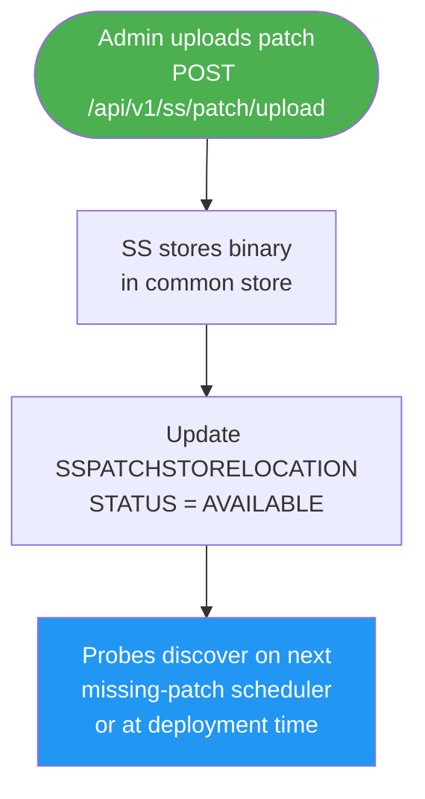

---

## UC-7.2: Patch Upload from Probe Server

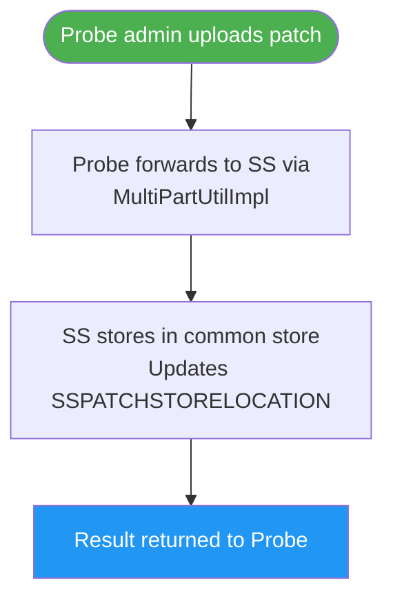

---

## UC-8: Linux Dependency Package Forwarding

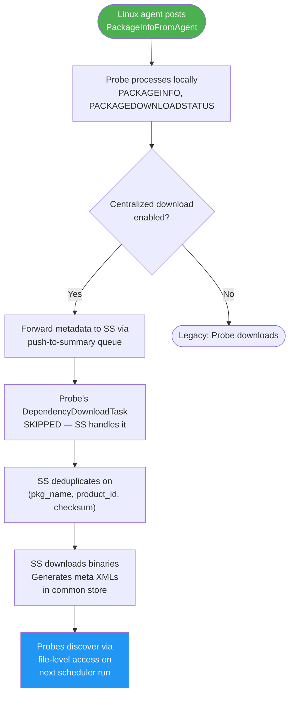

---

## UC-9: Common Store Path Change

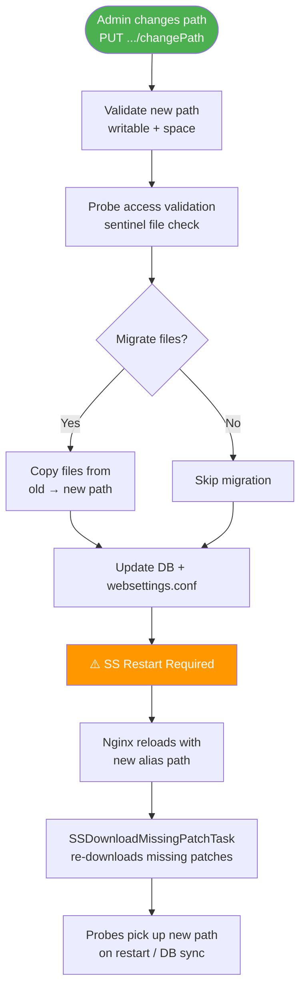

---

## UC-10: Probe Cache Size Reduced

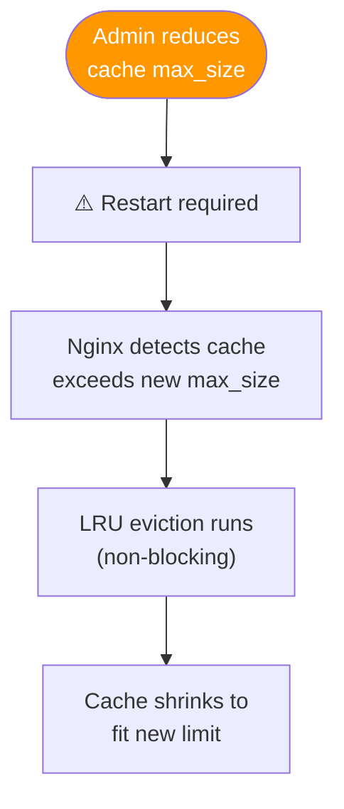

---

## UC-11: Probe Cache Size Increased

```mermaid
flowchart TD
    A([Admin increases<br/>cache max_size]) --> B["⚠️ Restart required"]
    B --> C[More disk budget available<br/>No files deleted]
    C --> D[More files can be cached<br/>before eviction triggers]

    style A fill:#4CAF50,color:#fff
```

---

## UC-12: Cache Disabled (ON → OFF)

```mermaid
flowchart TD
    A([Admin disables<br/>Probe cache]) --> B["⚠️ Restart required"]
    B --> C["Nginx: proxy_cache off"]
    C --> D[All new requests →<br/>common store via network share]
    D --> E["Old cached files remain on disk<br/>Cleaned up by: inactive expiry,<br/>max_size, or manual delete"]

    style A fill:#f44336,color:#fff
```

---

## UC-13: Patch Cleanup

```mermaid
flowchart TD
    A([CleanupUtil identifies<br/>patch for cleanup]) --> B["Mark PENDING_DELETE<br/>PENDING_DELETE_AT = now()"]
    B --> C["⏳ File NOT deleted yet"]
    C --> D["DeferredCleanupTask<br/>(every 15 min)"]
    D --> E{"Grace period elapsed?<br/>(30 min default)"}
    E -->|No| D
    E -->|Yes| F[Physically delete file<br/>STATUS → DELETED]
    F --> G[Regenerate deleted-patches.xml<br/>in common store]
    G --> H[Clean up old .failed markers<br/>older than 2× timeout]

    I["Probe-side cleanup:<br/>DISABLED when centralized<br/>download is enabled"] -.-> J["SS owns entire<br/>binary lifecycle"]

    style A fill:#FF9800,color:#fff
    style F fill:#f44336,color:#fff
    style I fill:#9E9E9E,color:#fff
```

---

## UC-15: New Probe Joins After Enable

```mermaid
flowchart TD
    A([New Probe installed<br/>connects to SS]) --> B[DB sync picks up<br/>ENABLED=true + store path]
    B --> C[Admin configures network<br/>share / mount on Probe]
    C --> D[Admin runs<br/>validateProbeAccess from SS]
    D --> E["⚠️ Probe restart"]
    E --> F[Nginx config generated<br/>with centralized download]
    F --> G[Missing-patch scheduler<br/>begins scanning common store]

    style A fill:#4CAF50,color:#fff
    style G fill:#2196F3,color:#fff
```

---

## UC-16: SS Restart During Active Download

```mermaid
flowchart TD
    A([SS restarts]) --> B["DB-backed queue survives<br/>(ss-patch-download-data)"]
    B --> C[SS resumes downloads<br/>from vendor on startup]
    C --> D[Probe polling unaffected<br/>continues every 5 min]
    D --> E{SS finishes<br/>before Probe timeout?}
    E -->|Yes| F[Probe discovers file<br/>on next poll tick ✓]
    E -->|No| G[Probe → DOWNLOAD_FAILED<br/>Admin retries]

    style A fill:#FF9800,color:#fff
    style F fill:#2196F3,color:#fff
    style G fill:#f44336,color:#fff
```

---

## UC-17: Probe Restart During Active Download

```mermaid
flowchart TD
    A([Probe restarts]) --> B["COLLECTIONPENDINGPATCHES<br/>survives (DB-backed)"]
    B --> C[Startup recovery scans<br/>WAITING_FOR_SS_DOWNLOAD collections]
    C --> D{All patches available<br/>in common store?}
    D -->|Yes| E[Resume deployment<br/>Add to PSL → Generate zip → Deploy]
    D -->|No| F[Re-send on-demand to SS<br/>Restart polling scheduler]

    style A fill:#FF9800,color:#fff
    style E fill:#2196F3,color:#fff
```

---

## UC-18: Common Store Temporarily Inaccessible

```mermaid
flowchart TD
    A(["Network share / mount<br/>becomes inaccessible"]) --> B["File.exists() returns false<br/>or throws IOException"]
    B --> C[Neither file nor marker readable<br/>Treated as 'still downloading']
    C --> D[Continue polling]
    D --> E{Share recovers<br/>before timeout?}
    E -->|Yes| F[Next poll discovers<br/>files normally ✓]
    E -->|No| G[Collection → DOWNLOAD_FAILED<br/>Admin retries after fixing share]

    H["If proxy_cache ON:<br/>Previously cached files<br/>still served as HIT"] -.-> I["DS/Agent downloads<br/>unaffected for cached patches"]

    style A fill:#f44336,color:#fff
    style F fill:#2196F3,color:#fff
    style G fill:#f44336,color:#fff
    style H fill:#9C27B0,color:#fff
```

---

## Master Overview — All Use Cases

```mermaid
flowchart LR
    subgraph Setup["⚙️ Setup & Config"]
        UC5_1[UC-5.1: Enable]
        UC5_2[UC-5.2: Disable]
        UC9[UC-9: Change Store Path]
        UC14[UC-14: Re-Enable]
        UC15[UC-15: New Probe Joins]
    end

    subgraph Credentials["🔑 Credential Forwarding"]
        UC3[UC-3: RedHat Cert]
        UC4[UC-4: SUSE Token]
    end

    subgraph ProbeDownload["📥 Probe-Side Download (UC-1)"]
        UC1_1[UC-1.1: Deployment Trigger]
        UC1_2[UC-1.2: Agent Request]
        UC1_3[UC-1.3: Missing Patch Scheduler]
        UC1_4[UC-1.4: Redownload]
        UC1_5[UC-1.5: SS Failure]
        UC1_6[UC-1.6: Existing Failure Marker]
        UC1_7[UC-1.7: Already Available]
        UC1_8[UC-1.8: Checksum Invalid]
        UC1_9[UC-1.9: Timeout]
    end

    subgraph Serving["🚀 Serving & Caching"]
        UC6[UC-6: Nginx Cache Serving]
        UC10[UC-10: Cache Size Reduced]
        UC11[UC-11: Cache Size Increased]
        UC12[UC-12: Cache Disabled]
    end

    subgraph Upload["📤 Upload & Forwarding"]
        UC7_1[UC-7.1: Upload from SS]
        UC7_2[UC-7.2: Upload from Probe]
        UC8[UC-8: Linux Dep Forwarding]
    end

    subgraph Ops["🔧 Operations"]
        UC2[UC-2: Status Visibility]
        UC13[UC-13: Patch Cleanup]
        UC16[UC-16: SS Restart]
        UC17[UC-17: Probe Restart]
        UC18[UC-18: Store Inaccessible]
    end

    Setup --> ProbeDownload
    Credentials --> ProbeDownload
    ProbeDownload --> Serving
    Upload --> ProbeDownload
```

