# Centralized Patch Download — Use Case Flow Diagrams

---

## UC-1.1: Deployment-Triggered Download — Patch Not in Common Store

```mermaid
flowchart TD
    A(["🖥️ PROBE: Deployment Initiated"]) --> B{"🖥️ PROBE: Check Common Store<br/>for all patches"}
    B -->|All found| Z1(["Skip to UC-1.7:<br/>Direct PSL add"])
    B -->|Some missing| C["🖥️ PROBE: Send On-Demand request<br/>to SS via push-to-summary"]
    C --> D["🖥️ PROBE: Update status →<br/>WAITING_FOR_SS_DOWNLOAD 502"]
    D --> E["🖥️ PROBE: Persist to<br/>COLLECTIONPENDINGPATCHES"]
    E --> F["🖥️ PROBE: Start 5-min<br/>Polling Scheduler"]
    F --> G{"🖥️ PROBE: Poll Common Store"}
    G -->|File exists| H["🖥️ PROBE: Mark download success<br/>Add to PSL<br/>Remove from pending"]
    G -->|.failed marker exists| I["🖥️ PROBE: Read failure reason<br/>Mark DOWNLOAD_FAILED"]
    G -->|Neither exists| J{"🖥️ PROBE: Timeout reached?<br/>30 min / 6 ticks"}
    J -->|No| G
    J -->|Yes| K["🖥️ PROBE: Mark DOWNLOAD_FAILED<br/>Reason: SS timed out"]
    H --> L{"🖥️ PROBE: All patches ready?"}
    L -->|No| G
    L -->|Yes| M["🖥️ PROBE: Generate patch-products.zip<br/>Deploy to DS/Agents]
    M --> N(["🖥️ PROBE: Cancel Polling ✓"])
    I --> N
    K --> N

    style A fill:#4CAF50,color:#fff
    style N fill:#2196F3,color:#fff
    style I fill:#f44336,color:#fff
    style K fill:#f44336,color:#fff
```

---

## UC-1.2: Agent-Requested Patch Download

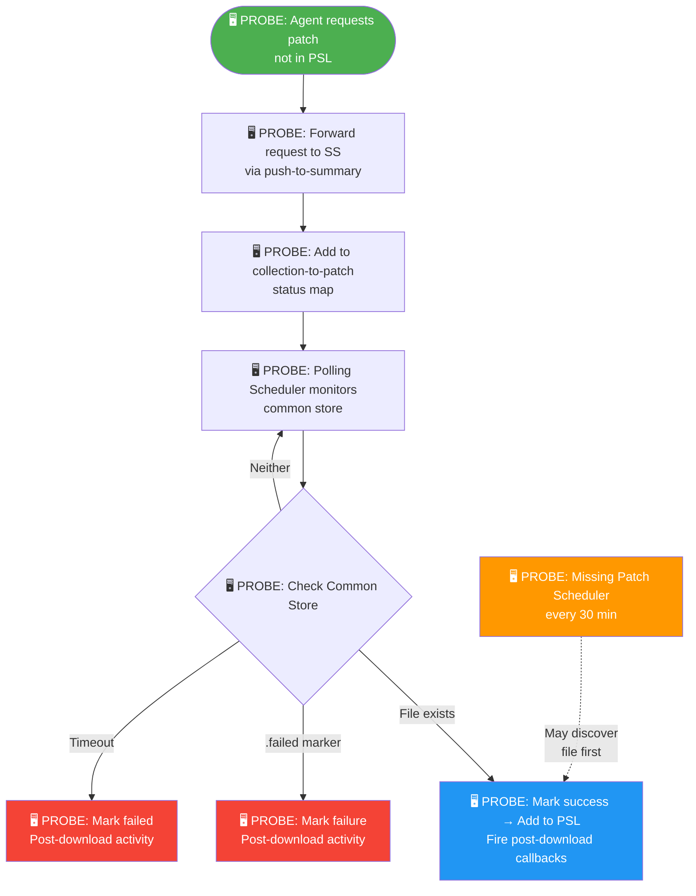

---

## UC-1.3: Missing Patch Scheduler — Background Discovery

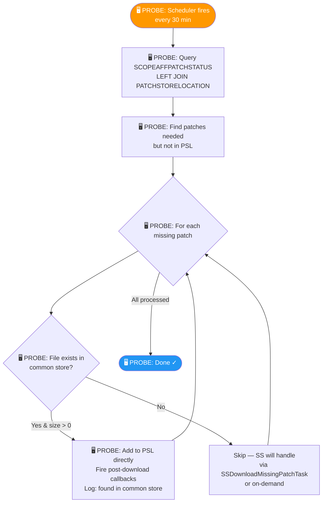

> **Note:** This scheduler is a passive scanner — it never sends download requests to SS.

---

## UC-1.4: Redownload Triggered for Patch

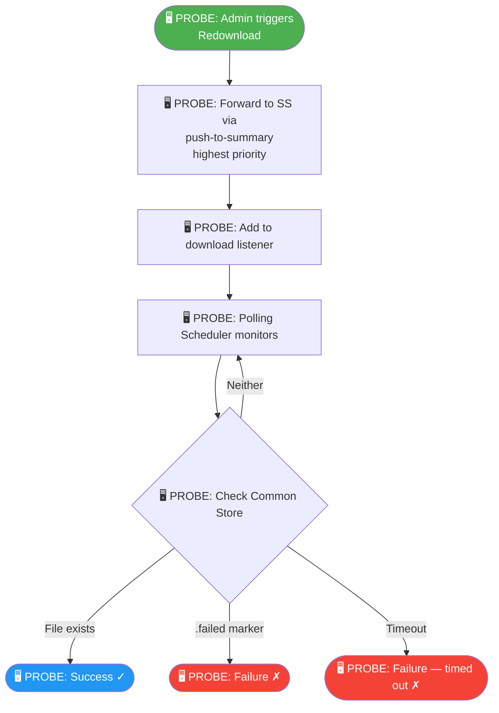

---

## UC-1.5: Download Failure on SS

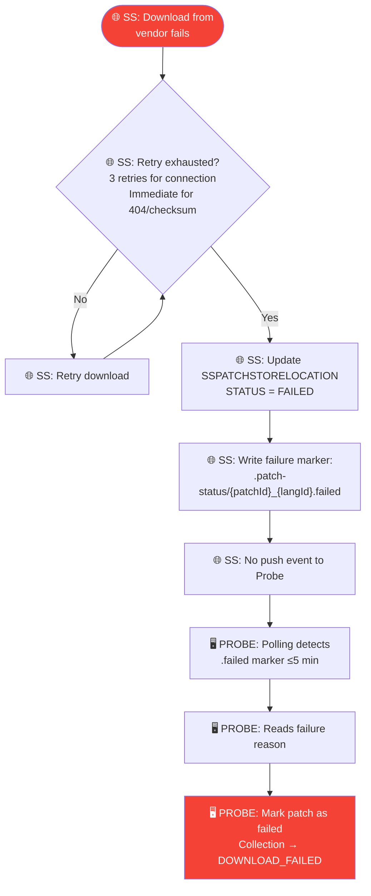

---

## UC-1.6: Failure Marker Already Exists

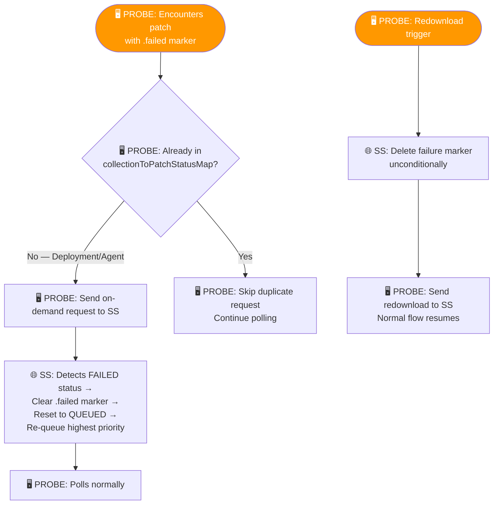

---

## UC-1.7: Patch Already Available — Checksum Valid

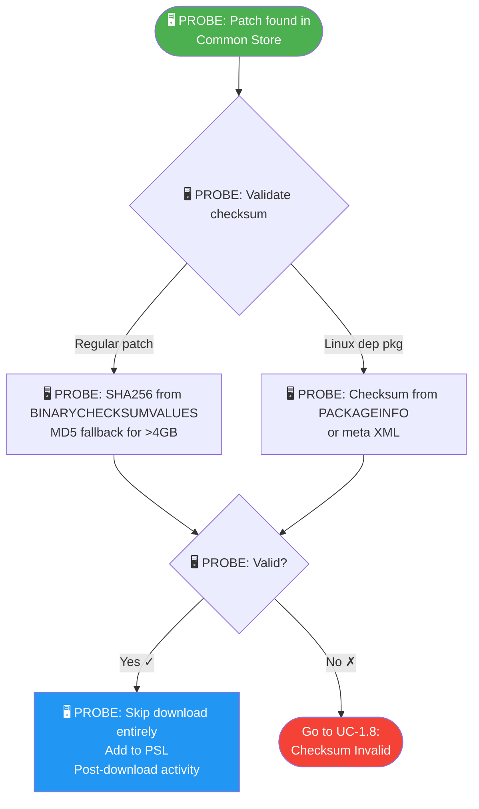

---

## UC-1.8: Patch Available but Checksum Invalid

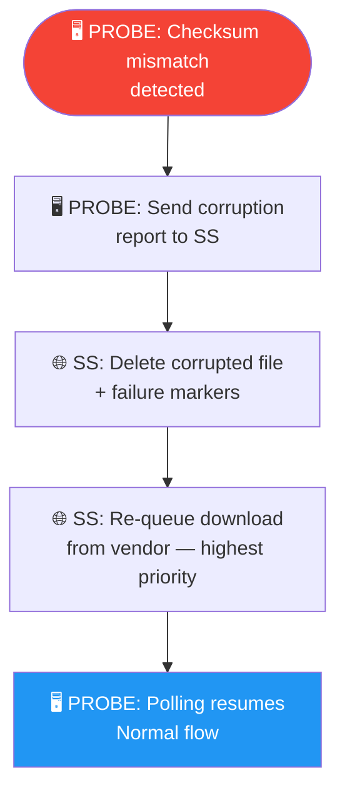

---

## UC-1.9: Download Timeout

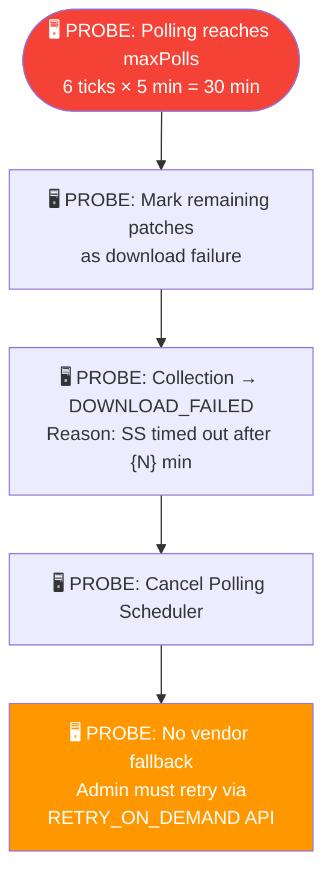

---

## UC-2: Download Status Visibility on Probe

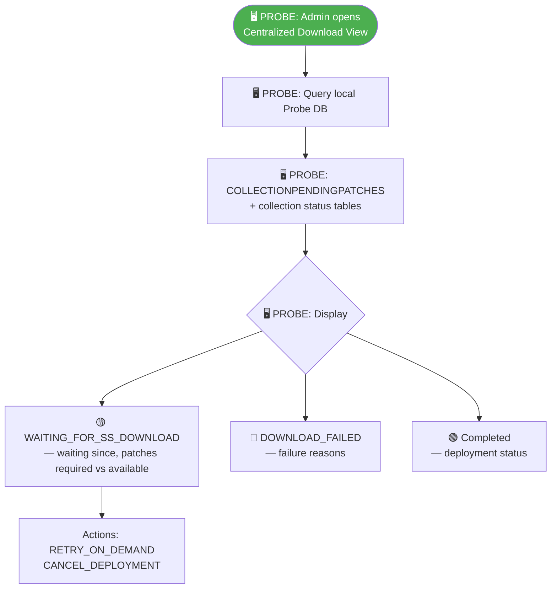

> No real-time query to SS — all state derived from local Probe DB via polling.

---

## UC-3: RedHat Certificate Forwarding

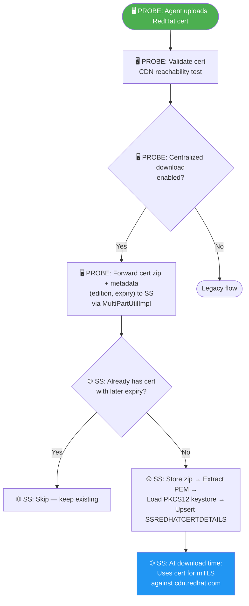

---

## UC-4: SUSE Token Forwarding

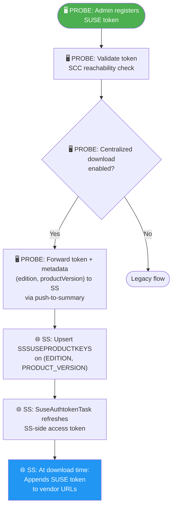

---

## UC-5.1: Enable Centralized Download

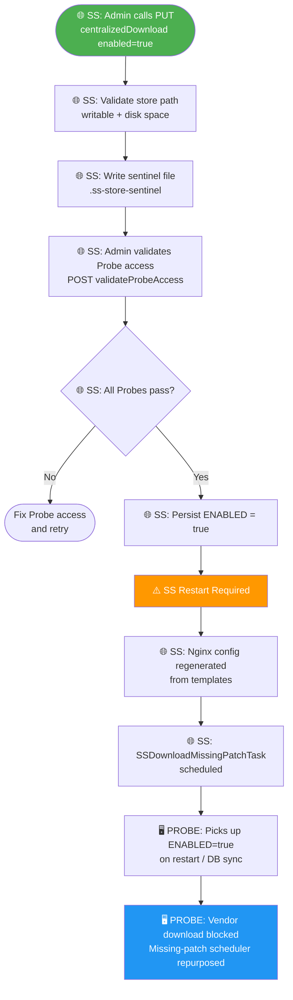

---

## UC-5.2: Disable Centralized Download

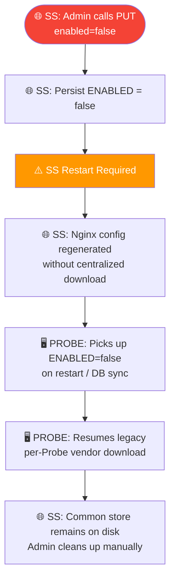

---

## UC-6: Probe-Side Nginx Caching — DS/Agent Binary Serving

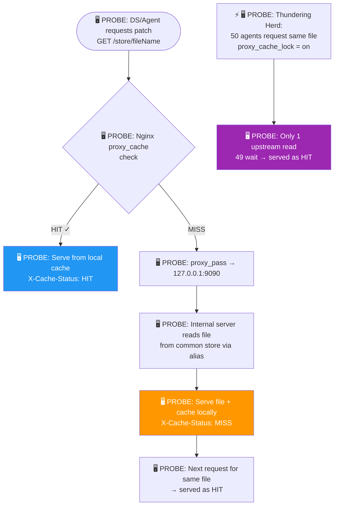

---

## UC-7.1: Patch Upload from Summary Server

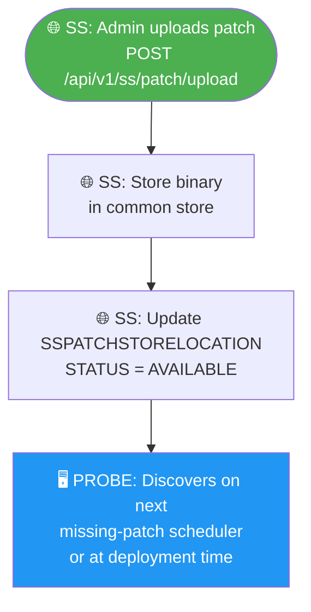

---

## UC-7.2: Patch Upload from Probe Server

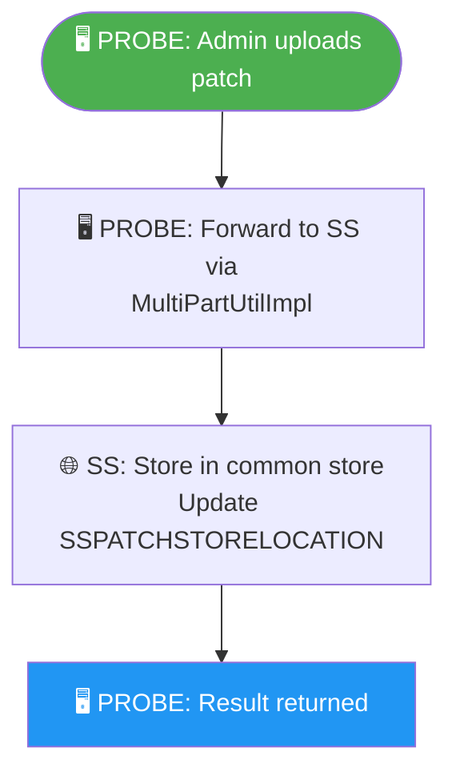

---

## UC-8: Linux Dependency Package Forwarding

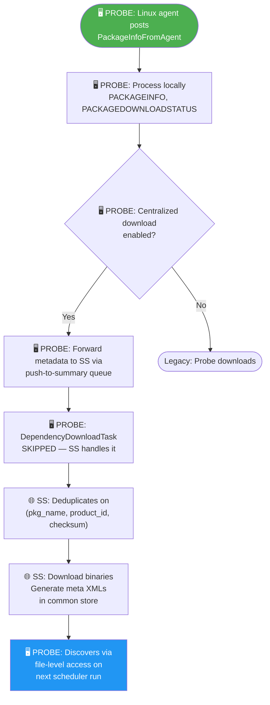

---

## UC-9: Common Store Path Change

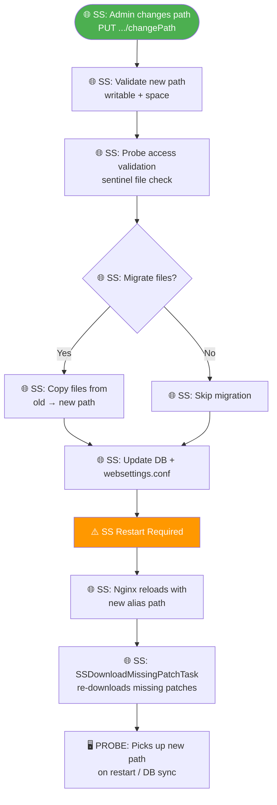

---

## UC-10: Probe Cache Size Reduced

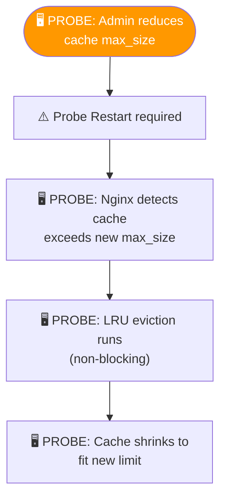

---

## UC-11: Probe Cache Size Increased

```mermaid
flowchart TD
    A(["🖥️ PROBE: Admin increases<br/>cache max_size"]) --> B["⚠️ Probe Restart required"]
    B --> C["🖥️ PROBE: More disk budget available<br/>No files deleted"]
    C --> D["🖥️ PROBE: More files can be cached<br/>before eviction triggers"]

    style A fill:#4CAF50,color:#fff
```

---

## UC-12: Cache Disabled (ON → OFF)

```mermaid
flowchart TD
    A(["🖥️ PROBE: Admin disables<br/>Probe cache"]) --> B["⚠️ Probe Restart required"]
    B --> C["🖥️ PROBE: Nginx: proxy_cache off"]
    C --> D["🖥️ PROBE: All new requests →<br/>common store via network share"]
    D --> E["🖥️ PROBE: Old cached files remain on disk<br/>Cleaned up by: inactive expiry,<br/>max_size, or manual delete"]

    style A fill:#f44336,color:#fff
```

---

## UC-13: Patch Cleanup

```mermaid
flowchart TD
    A(["🌐 SS: CleanupUtil identifies<br/>patch for cleanup"]) --> B["🌐 SS: Mark PENDING_DELETE<br/>PENDING_DELETE_AT = now()"]
    B --> C["⏳ 🌐 SS: File NOT deleted yet"]
    C --> D["🌐 SS: DeferredCleanupTask<br/>(every 15 min)"]
    D --> E{"🌐 SS: Grace period elapsed?<br/>(30 min default)"}
    E -->|No| D
    E -->|Yes| F["🌐 SS: Physically delete file<br/>STATUS → DELETED"]
    F --> G["🌐 SS: Regenerate deleted-patches.xml<br/>in common store"]
    G --> H["🌐 SS: Clean up old .failed markers<br/>older than 2× timeout"]

    I["🖥️ PROBE: Probe-side cleanup:<br/>DISABLED when centralized<br/>download is enabled"] -.-> J["🌐 SS owns entire<br/>binary lifecycle"]

    style A fill:#FF9800,color:#fff
    style F fill:#f44336,color:#fff
    style I fill:#9E9E9E,color:#fff
```

---

## UC-14: Re-Enable After Disable

```mermaid
flowchart TD
    A(["🌐 SS: Admin re-enables<br/>centralized download"]) --> B["🌐 SS: Same flow as UC-5.1"]
    B --> C["🌐 SS: SSDownloadMissingPatchTask<br/>rescans & re-downloads"]
    C --> D["🖥️ PROBE: Resumes centralized mode<br/>on restart / DB sync"]

    style A fill:#4CAF50,color:#fff
    style D fill:#2196F3,color:#fff
```

---

## UC-15: New Probe Joins After Enable

```mermaid
flowchart TD
    A(["🖥️ PROBE: New Probe installed<br/>connects to SS"]) --> B["🖥️ PROBE: DB sync picks up<br/>ENABLED=true + store path"]
    B --> C["🖥️ PROBE: Admin configures network<br/>share / mount on Probe"]
    C --> D["🌐 SS: Admin runs<br/>validateProbeAccess"]
    D --> E["⚠️ Probe restart"]
    E --> F["🖥️ PROBE: Nginx config generated<br/>with centralized download"]
    F --> G["🖥️ PROBE: Missing-patch scheduler<br/>begins scanning common store"]

    style A fill:#4CAF50,color:#fff
    style G fill:#2196F3,color:#fff
```

---

## UC-16: SS Restart During Active Download

```mermaid
flowchart TD
    A(["🌐 SS: Restarts"]) --> B["🌐 SS: DB-backed queue survives<br/>(ss-patch-download-data)"]
    B --> C["🌐 SS: Resumes downloads<br/>from vendor on startup"]
    C --> D["🖥️ PROBE: Polling unaffected<br/>continues every 5 min"]
    D --> E{"🌐 SS: Finishes<br/>before Probe timeout?"}
    E -->|Yes| F["🖥️ PROBE: Discovers file<br/>on next poll tick ✓"]
    E -->|No| G["🖥️ PROBE: → DOWNLOAD_FAILED<br/>Admin retries"]

    style A fill:#FF9800,color:#fff
    style F fill:#2196F3,color:#fff
    style G fill:#f44336,color:#fff
```

---

## UC-17: Probe Restart During Active Download

```mermaid
flowchart TD
    A(["🖥️ PROBE: Restarts"]) --> B["🖥️ PROBE: COLLECTIONPENDINGPATCHES<br/>survives (DB-backed)"]
    B --> C["🖥️ PROBE: Startup recovery scans<br/>WAITING_FOR_SS_DOWNLOAD collections"]
    C --> D{"🖥️ PROBE: All patches available<br/>in common store?"}
    D -->|Yes| E["🖥️ PROBE: Resume deployment<br/>Add to PSL → Generate zip → Deploy"]
    D -->|No| F["🖥️ PROBE: Re-send on-demand to SS<br/>Restart polling scheduler"]

    style A fill:#FF9800,color:#fff
    style E fill:#2196F3,color:#fff
```

---

## UC-18: Common Store Temporarily Inaccessible

```mermaid
flowchart TD
    A(["🖥️ PROBE: Network share / mount<br/>becomes inaccessible"]) --> B["🖥️ PROBE: File.exists() returns false<br/>or throws IOException"]
    B --> C["🖥️ PROBE: Neither file nor marker readable<br/>Treated as 'still downloading'"]
    C --> D["🖥️ PROBE: Continue polling"]
    D --> E{"Share recovers<br/>before timeout?"}
    E -->|Yes| F["🖥️ PROBE: Next poll discovers<br/>files normally ✓"]
    E -->|No| G["🖥️ PROBE: Collection → DOWNLOAD_FAILED<br/>Admin retries after fixing share"]

    H["🖥️ PROBE: If proxy_cache ON:<br/>Previously cached files<br/>still served as HIT"] -.-> I["🖥️ PROBE: DS/Agent downloads<br/>unaffected for cached patches"]

    style A fill:#f44336,color:#fff
    style F fill:#2196F3,color:#fff
    style G fill:#f44336,color:#fff
    style H fill:#9C27B0,color:#fff
```

---

## Master Overview — All Use Cases

```mermaid
flowchart LR
    subgraph Setup["⚙️ Setup & Config (🌐 SS)"]
        UC5_1[UC-5.1: Enable]
        UC5_2[UC-5.2: Disable]
        UC9[UC-9: Change Store Path]
        UC14[UC-14: Re-Enable]
        UC15[UC-15: New Probe Joins]
    end

    subgraph Credentials["🔑 Credential Forwarding (🖥️ PROBE → 🌐 SS)"]
        UC3[UC-3: RedHat Cert]
        UC4[UC-4: SUSE Token]
    end

    subgraph ProbeDownload["📥 Probe-Side Download (🖥️ PROBE polls common store)"]
        UC1_1[UC-1.1: Deployment Trigger]
        UC1_2[UC-1.2: Agent Request]
        UC1_3[UC-1.3: Missing Patch Scheduler]
        UC1_4[UC-1.4: Redownload]
        UC1_5[UC-1.5: SS Failure]
        UC1_6[UC-1.6: Existing Failure Marker]
        UC1_7[UC-1.7: Already Available]
        UC1_8[UC-1.8: Checksum Invalid]
        UC1_9[UC-1.9: Timeout]
    end

    subgraph Serving["🚀 Serving & Caching (🖥️ PROBE Nginx)"]
        UC6[UC-6: Nginx Cache Serving]
        UC10[UC-10: Cache Size Reduced]
        UC11[UC-11: Cache Size Increased]
        UC12[UC-12: Cache Disabled]
    end

    subgraph Upload["📤 Upload & Forwarding (🖥️ PROBE → 🌐 SS)"]
        UC7_1[UC-7.1: Upload from SS]
        UC7_2[UC-7.2: Upload from Probe]
        UC8[UC-8: Linux Dep Forwarding]
    end

    subgraph Ops["🔧 Operations"]
        UC2["UC-2: Status Visibility (🖥️ PROBE)"]
        UC13["UC-13: Patch Cleanup (🌐 SS)"]
        UC16["UC-16: SS Restart (🌐 SS)"]
        UC17["UC-17: Probe Restart (🖥️ PROBE)"]
        UC18["UC-18: Store Inaccessible (🖥️ PROBE)"]
    end

    Setup --> ProbeDownload
    Credentials --> ProbeDownload
    ProbeDownload --> Serving
    Upload --> ProbeDownload
```
